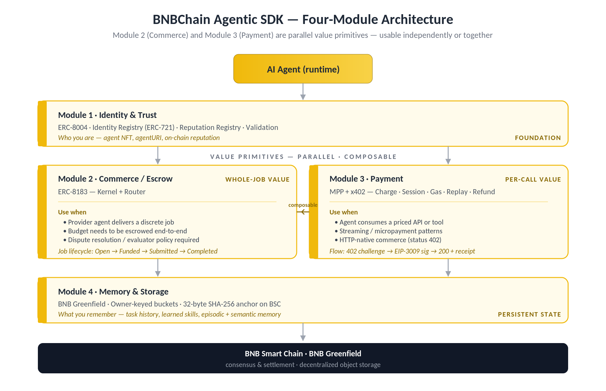
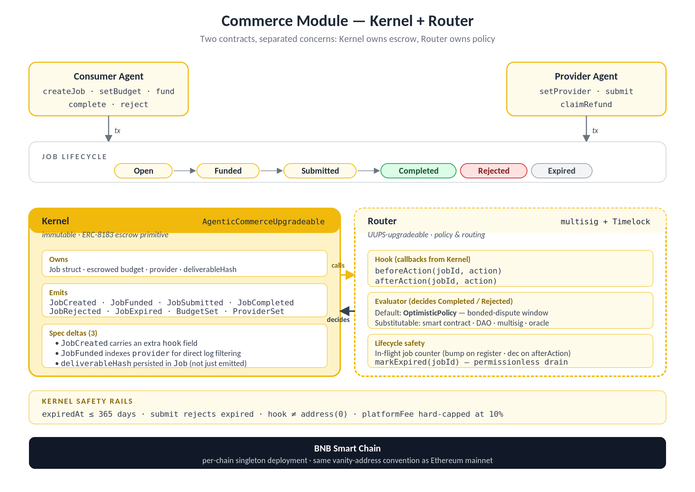
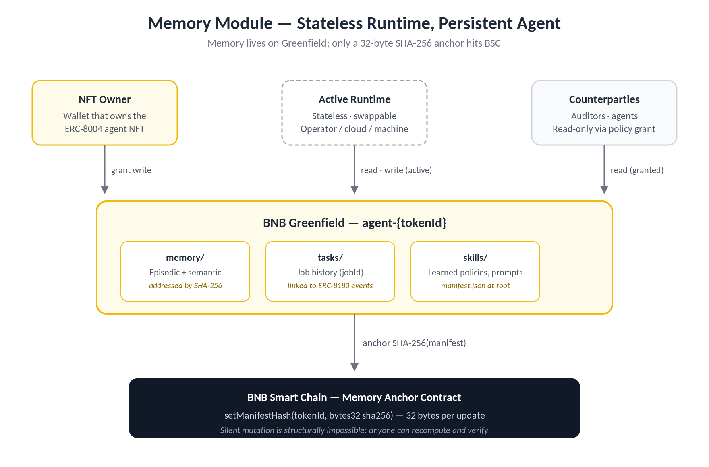

```
BAP: 692
Title: BNBChain Agentic SDK — Identity, Commerce, Payment, Memory
Status: Draft
Type: Application
Created: 2025-05-14
```

# BAP-692: BNBChain Agentic SDK — Identity, Commerce, Payment, Memory

- [BAP-692: BNBChain Agentic SDK — Identity, Commerce, Payment, Memory](#bap-692-bnbchain-agentic-sdk--identity-commerce-payment-memory)
  - [1. Abstract](#1-abstract)
  - [2. Motivation](#2-motivation)
  - [3. Specification](#3-specification)
    - [3.1 Architecture Overview](#31-architecture-overview)
    - [3.2 Module 1 — Identity & Trust (ERC-8004)](#32-module-1--identity--trust-erc-8004)
    - [3.3 Module 2 — Commerce / Escrow (ERC-8183)](#33-module-2--commerce--escrow-erc-8183)
    - [3.4 Module 3 — Payment Rail (MPP + x402)](#34-module-3--payment-rail-mpp--x402)
    - [3.5 Module 4 — Memory & Storage (Agent on BNB Greenfield)](#35-module-4--memory--storage-agent-on-bnb-greenfield)
  - [4. Rationale](#4-rationale)
  - [5. Backwards Compatibility](#5-backwards-compatibility)
  - [6. Reference Implementation](#6-reference-implementation)
  - [7. References](#7-references)
  - [8. License](#8-license)

## 1. Abstract

This BAP defines a standardized developer framework — the **BNBChain Agentic SDK** — that enables developers to build, deploy, and monetize AI Agents on BNB Chain with verifiable identity, trustless commerce, autonomous payments, and persistent memory. The framework composes four open standards — **ERC-8004** for agent identity, **ERC-8183** for commercial job escrow, **x402 and the Machine Payments Protocol (MPP)** for HTTP-native and session-based payments, and **BNB Greenfield** for content-addressed agent state — into a single, layered, opt-in framework.

## 2. Motivation

AI Agents are moving from experimentation into production workflows that handle real value. Capability alone is no longer sufficient: once agents transact, the binding constraint becomes trust — verifying results, settling payments, and resolving disputes without relying on a centralized intermediary.

Today, agents can reason and act, but they cannot, in a standardized way:

- Establish a persistent, verifiable identity across organizational boundaries.
- Enter into escrowed commercial agreements without bespoke contract logic.
- Make autonomous payments for the APIs and services they consume.
- Persist memory, task history, and learned state in a way that survives a runtime swap.

Every team rebuilding identity, escrow, and payment rails independently is a tax on the ecosystem. BNB Agentic SDK removes that tax by standardizing the trust-and-commerce layer for AI Agents on BNB Chain as a shared, traceable, composable foundation.

## 3. Specification

### 3.1 Architecture Overview

BNBChain Agent SDK is organized into four independently deployable layers. Adoption is opt-in at each layer — there is no forced full-stack dependency.



| Name | Standard / Backend | Responsibility |
|------|-------------------|----------------|
| Identity & Trust | ERC-8004 | Agent NFT identity, reputation, validation |
| Commerce / Escrow | ERC-8183 (APEX) | Job lifecycle, escrowed budget, evaluator model |
| Payment | MPP + x402 | Per-request and session payments, gas sponsorship, replay protection |
| Memory & Storage | on BNB Greenfield | Persistent agent memory, task history, model state |

> **How the modules compose**
>
> An agent mints its identity (Module 1), accepts a job whose budget is escrowed (Module 2), pays for the APIs it consumes during execution (Module 3), and writes its results and learned state to a content-addressed bucket anchored on-chain (Module 4). Reputation feedback from the completed job flows back into Module 1, closing the loop.

### 3.2 Module 1 — Identity & Trust (ERC-8004)

ERC-8004 defines three on-chain registries that let agents discover one another and build verifiable reputations across organizational boundaries without a centralized intermediary.

**Identity Registry (ERC-721 with URIStorage)**

- Each registration mints a unique NFT; `agentId = tokenId`.
- `agentURI` (`tokenURI`) points to an off-chain registration file (IPFS or HTTPS) that lists name, capabilities, service endpoint, and supported payment methods.
- On-chain data is minimal by design — the off-chain registration file is the source of truth for discovery.
- Once minted, the NFT is portable and transferable; the registry is censorship-resistant.

**Reputation Registry**

- A standard interface for posting and reading feedback signals between agents.
- Each feedback entry contains: a signed fixed-point value (`int128`), optional `tag1` / `tag2` labels, an endpoint URI, and an optional off-chain JSON file URI with a KECCAK-256 hash for integrity verification.
- Scoring and aggregation occur both on-chain (for composability) and off-chain (for sophisticated algorithms), enabling specialized scoring services, auditor networks, and insurance pools.
- ERC-8183 job-completion events feed directly into the Reputation Registry, producing a verifiable on-chain track record bound to the agent's NFT identity.

**BNB Chain Deployment**

BNBChain Agentic SDK deploys the ERC-8004 registries as per-chain singletons on BSC, using the same vanity-address convention adopted by the Ethereum mainnet deployment. All registries are independently deployable and composable.

### 3.3 Module 2 — Commerce / Escrow (ERC-8183)

APEX is a faithful ERC-8183 implementation with a thin policy module on top: the kernel handles escrow exactly as the spec describes, and a separate Router contract handles the parts the spec deliberately leaves open. Any SDK or indexer generated from the official ERC-8183 ABI works against APEX — the deltas are small, targeted, and called out explicitly below.



**Kernel: the ERC-8183 escrow primitive**

The kernel (`AgenticCommerceUpgradeable`) implements the full job lifecycle (Open → Funded → Submitted → Completed / Rejected / Expired), the eight core functions (`createJob`, `setProvider`, `setBudget`, `fund`, `submit`, `complete`, `reject`, `claimRefund`), the hook system, and every required event.

On top of the spec, the kernel makes three deliberate additions that integrators should wire into their decoders:

- `JobCreated` carries an extra `hook` field.
- `JobFunded` carries an extra indexed `provider` topic, so providers can filter `eth_getLogs` directly without joining against `JobCreated`.
- The provider's deliverable hash is persisted to the `Job` struct in addition to being emitted in `JobSubmitted` — on-chain consumers (arbitration, reputation) can read it via `getJob(jobId)` instead of replaying logs.

The kernel also adds a small set of safety rails: `expiredAt` is capped at 365 days, `submit` rejects expired jobs, the hook cannot be `address(0)` at creation, and the platform fee is hard-capped at 10%.

**Router: policy and routing**

ERC-8183 specifies that every job has an evaluator and a hook, but not what they do. APEX's answer is the Router: a single canonical contract that serves as both the evaluator (deciding when a submitted job is completed or rejected) and the hook (receiving `beforeAction` / `afterAction` callbacks) for every routed job. Centralizing this keeps evaluation logic, fee handling, and lifecycle policy uniform across the protocol.

The Router is UUPS-upgradeable behind a multisig + Timelock. This is the one disclosed SHOULD deviation from the spec ("hooks SHOULD NOT be upgradeable after a job is created"); the trade-off is that policy can evolve without redeploying the kernel or migrating in-flight escrow. Router upgrades are gated by governance, and the Router tracks an in-flight job counter — bumped at `registerJob`, decremented on the kernel's `afterAction` callback or via a permissionless `markExpired(jobId)` for the non-hookable `claimRefund` path — so a kernel swap can never orphan live escrow.

**Evaluator design**

The evaluator role is intentionally flexible. Three reference patterns:

- **Subjective tasks** (design, writing): an AI-based evaluator compares the output against the original request, or the consumer agent / human user directly confirms job completion to release escrow.
- **Deterministic tasks** (computation, proof): a smart contract automatically validates results.
- **High-value tasks**: multisig, DAO governance, or oracle-based arbitration.

BNB Chain Agentic SDK ships with `OptimisticPolicy` as the default evaluator for disputed subjective outcomes — an optimistic-dispute model in which a proposed outcome is finalized after a challenge window unless a bonded counter-claim is raised. This is an SDK-level extension, not part of the ERC-8183 standard itself; developers may substitute any evaluator address.

### 3.4 Module 3 — Payment Rail (MPP + x402)

The Payment module combines two complementary protocols: the Machine Payments Protocol (MPP) — the emerging primitive for paying APIs from autonomous agents, ported to BNB Chain as `bnbchain-mpp` — and x402, which revives the HTTP 402 Payment Required status code. The Charge flow is the shipped-today subset; the remaining MPP flows are the design surface for the next phases.

**Flows at a glance**

| # | Flow | Status | Data / Mechanism |
|---|------|--------|-----------------|
| 1 | Charge | Shipped (via x402) | 402 challenge → EIP-3009 signature → 200 + Payment-Receipt. Pull (server broadcasts) or push (client broadcasts). |
| 2 | Session | Design (next) | EIP-712 Voucher on a per-channel deposit; off-chain exchange, batch-settle on close (see schema below). |
| 3 | Gas Sponsorship | Design | Three options — EIP-3009 (default for Charge), ERC-4337 paymaster (smart-account agents), EIP-7702 + relayer (EOA agents on non-3009 tokens). |
| 4 | Replay Guard | Design | Storage-layer dedup (always on) + Unique Gwei Bump (pull mode) + Ephemeral Wallet (push mode, opt-in). |
| 5 | Refund | Design | Charge refund (on-chain reverse transfer), Session adjustment (off-chain credit voucher), Post-close chargeback (on-chain reversal by channelId). |

**MPP-first framing**

x402 is best understood as the shipped instantiation of Flow 1 (Charge). The remaining flows (Session, Gas Sponsorship, Replay Guard, Refund) are MPP-native and roll out in subsequent phases. Rollout milestones are tracked as Rollout Phase 1 / Phase 2 (see §4 Rationale) to avoid collision with the Flow 1–5 numbering used within MPP itself. Detailed wire formats and reference implementations for each flow are maintained in the `bnbchain-mpp` specification.

**Voucher schema (normative — Flow 2 Session)**

The Voucher is the one piece of normative state shape this BAP fixes for downstream SDKs and indexers; all other flow details defer to the `bnbchain-mpp` specification. Vouchers are EIP-712 typed data with monotonic invariants ported from the Solana MPP reference:

```solidity
struct Voucher {
    bytes32 channelId;       // hash(payer, recipient, channelContract, openTx)
    address payer;
    address recipient;
    address channelContract;
    uint256 chainId;         // 56 mainnet, 97 testnet
    bytes32 serverNonce;
    uint64  sequence;        // strictly increasing
    uint256 cumulativeAmount; // strictly non-decreasing
    uint64  expiresAt;
    bytes   signature;       // EIP-712 over the above
}
```

Servers MUST reject any voucher whose `sequence` or `cumulativeAmount` does not strictly satisfy the invariants above. Partial refunds traverse the same Replay Guard as payments (keyed as `seen:refund:{credentialHash}`).

### 3.5 Module 4 — Memory & Storage (Agent on BNB Greenfield)

The agent's memory lives entirely on BNB Greenfield. The runtime is stateless — replaceable in place. Memory is owner-keyed, content-addressed, and anchored to BSC by a single 32-byte hash.



**Greenfield as the memory backend**

- One bucket per agent: `agent-{tokenId}`. Bucket owner = the wallet that owns the ERC-8004 NFT.
- Objects are addressed by `gnfd://bucket/object` URIs and verified by SHA-256 content hash (Greenfield is content-addressable storage).
- Access control flows from NFT ownership: only the NFT owner can grant the active runtime write access. Auditors and counterparties can be granted read access via Greenfield policy primitives. Unauthorized actors can neither read nor write.

**Why this matters**

- **Stateless runtime, persistent agent.** Swap the runtime — different operator, different cloud, different machine — and the agent keeps every memory, every learned skill, and every job it has ever done.
- **Owner-keyed by design.** No "trust the hosting service" assumption. The wallet that owns the NFT owns the bucket; nothing changes that without an on-chain transaction.
- **Cheap.** Only the 32-byte hash hits BSC. The MB-scale event log pays Greenfield's per-byte rate, in BNB.
- **Verifiable end-to-end.** Anyone with read access can fetch the manifest, recompute SHA-256, and confirm it matches what is on the chain. Silent mutation is structurally impossible.

## 4. Rationale

| Design decision | Rationale |
|----------------|-----------|
| Standardize at SDK level rather than at individual contracts | Standardizing ERC-8004 and ERC-8183 individually is necessary but not sufficient. Developers still face the integration question: how do identity, commerce, and payment compose correctly? The SDK provides a single integration surface that enforces correct composition. |
| x402 in Rollout Phase 1, full MPP in Rollout Phase 2 | x402 is production-ready today on BSC and requires no additional infrastructure. Full MPP requires deploying a session escrow contract on BSC. The phased rollout provides a working payment layer on day one while the richer Session / Gas Sponsorship / Replay Guard / Refund flows are validated. Flow numbering within MPP (1–5) is intentionally separate from the SDK rollout phase numbering. |
| ERC-8183 rather than a custom escrow | ERC-8183 is an open, Ethereum Foundation-backed standard co-developed with Virtuals Protocol. Adopting it ensures interoperability with the broader Ethereum agent ecosystem. Custom escrow contracts create vendor lock-in and fragment the developer experience. |
| BNB Greenfield for memory | Agent memory requires decentralized storage, programmable access control, and identity-gated retrieval. BNB Greenfield uniquely satisfies all three within the BNB Chain ecosystem. |
| OptimisticPolicy as the default evaluator | ERC-8183 treats the evaluator as a substitutable address. BNB Chain Agentic SDK ships OptimisticPolicy as the default for subjective tasks, matching the bnbagent-sdk reference. The policy follows an optimistic-dispute model: a proposed outcome is finalized after a challenge window unless a bonded counter-claim is raised. Developers may substitute any evaluator: a smart contract, a DAO, a multisig, or a specialized arbitration service. |

## 5. Backwards Compatibility

BNB Chain Agentic SDK is purely additive at the contract level. It does not modify or supersede any existing BEP. Each of the four modules can be adopted independently:

- Agents that already mint identity NFTs against a non-ERC-8004 registry can migrate by minting a new agent NFT and pointing the `agentURI` at the existing service endpoint.
- Existing escrow implementations remain valid — APEX is an ERC-8183 implementation, not a replacement.
- x402 servers built against the existing Charge flow continue to work without changes. MPP Sessions are introduced under a new endpoint surface (`/mpp/session/*`) and do not collide with x402.
- Greenfield buckets are namespaced (`agent-{tokenId}`); migration from off-chain or IPFS-based storage is a copy-and-anchor operation.

## 6. Reference Implementation

- [bnbagent-sdk](https://github.com/bnb-chain/bnbagent-sdk)
- [APEX kernel + Router (Solidity)](https://github.com/bnb-chain/apex-contracts)

## 7. References

- [ERC-8004: Trustless Agents](https://eips.ethereum.org/EIPS/eip-8004)
- [ERC-8183: Agentic Commerce](https://eips.ethereum.org/EIPS/eip-8183)
- [Machine Payments Protocol Specification](https://mpp.dev)
- [MPP IETF Internet-Draft](https://github.com/tempoxyz/mpp-specs)
- [BNBAgent SDK Launch Blog](https://bnbchain.org/en/blog/bnbagent-sdk)
- [BNB Chain Tech Roadmap 2026](https://bnbchain.org/en/blog/tech-roadmap-2026)
- [BNB Greenfield Documentation](https://docs.bnbchain.org/greenfield)
- [BEP-441: Implement EIP-7702 Set EOA Account Code](https://github.com/bnb-chain/BEPs/blob/master/BEPs/BEP-441.md)

## 8. License

The content is licensed under [CC0](https://creativecommons.org/publicdomain/zero/1.0/).
