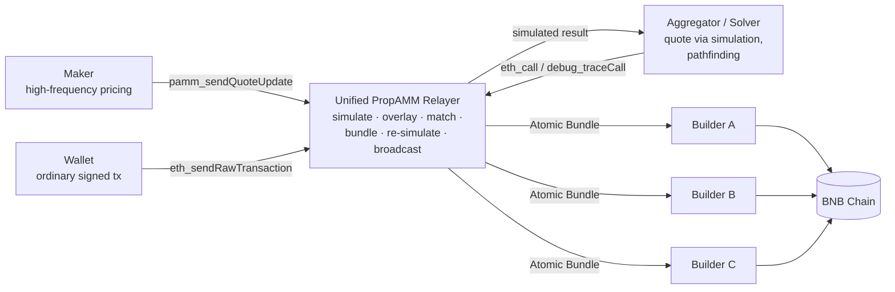
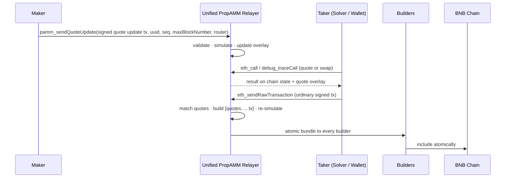

```
BAP: 710
Title: Unified PropAMM Relayer
Status: Draft
Type: Application
Created: 2026-09-03
Description: A builder-neutral execution layer for proprietary AMMs (PropAMMs) on BNB Chain, with a unified on-chain PropAMM standard. Makers stream quotes to one Relayer; takers keep using standard EVM JSON-RPC; the Relayer bundles matched quotes with taker transactions and broadcasts to every builder.
```

# BAP-710: Unified PropAMM Relayer

- [BAP-710: Unified PropAMM Relayer]
  - [1. Summary](#1-summary)
  - [2. Abstract](#2-abstract)
  - [3. Motivation](#3-motivation)
    - [3.1 PropAMM Needs a Shared Execution Layer](#31-propamm-needs-a-shared-execution-layer)
    - [3.2 Who Carries the Complexity Today](#32-who-carries-the-complexity-today)
    - [3.3 Why One Oracle and One Pool Interface](#33-why-one-oracle-and-one-pool-interface)
  - [4. Specification](#4-specification)
    - [4.1 Roles and Architecture](#41-roles-and-architecture)
    - [4.2 PropAMM Oracle: Priority Update Registry](#42-propamm-oracle-priority-update-registry)
    - [4.3 PropAMM Pool Interface](#43-propamm-pool-interface)
    - [4.4 Relayer Endpoint and Authentication](#44-relayer-endpoint-and-authentication)
    - [4.5 Taker API](#45-taker-api)
    - [4.6 Maker API](#46-maker-api)
    - [4.7 Maker Protection](#47-maker-protection)
    - [4.8 Analytics and Monitoring](#48-analytics-and-monitoring)
    - [4.9 Open Protocol Scope](#49-open-protocol-scope)
  - [5. Rationale](#5-rationale)
    - [5.1 Design Decisions](#51-design-decisions)
    - [5.2 Alternative Approaches Considered](#52-alternative-approaches-considered)
    - [5.3 Comparison with Existing PropAMM Deployments](#53-comparison-with-existing-propamm-deployments)
  - [6. Backwards Compatibility](#6-backwards-compatibility)
  - [7. Test Cases](#7-test-cases)
  - [8. Security Considerations](#8-security-considerations)
  - [9. License](#9-license)

## 1. Summary

This BNB Chain Application Proposal (BAP) introduces the **Unified PropAMM Relayer**, a builder-neutral professional liquidity execution layer for BNB Chain, together with the unified on-chain **PropAMM Standard** it executes against. Makers update quotes at high frequency through a single Relayer API. Wallets, aggregators and solvers keep using standard EVM JSON-RPC (`eth_call`, `debug_traceCall`, `eth_sendRawTransaction`). The Relayer simulates, matches, bundles and broadcasts atomic bundles to all connected builders.

> **Maker sends quotes. Taker sends transactions. Relayer builds bundles.**

## 2. Abstract

A proprietary AMM (PropAMM) is a market-maker operated pool whose pricing is driven by off-chain quotes rather than by an on-chain curve alone. PropAMMs deliver tighter spreads and better fills than passive AMMs, but every existing deployment pushes the execution complexity onto one participant: makers on Solana run chain-specific landing infrastructure, makers on Base pay to publish every quote update on-chain, and takers on Titan consume a builder-specific state override stream and construct bundles themselves.

BAP-710 defines three layers for BNB Chain:

- **PropAMM Standard (on-chain)**: a **Priority Update Registry** (the PropAMM Oracle) holding maker-published, signed, fixed-layout pricing state with on-chain expiry, and an **IPropAMM Pool Interface** exposing `isActive`, `getPairs`, `quote` and `swap` to every taker in one consistent way.
- **Unified PropAMM Relayer (off-chain, builder-neutral)**: a Geth-compatible RPC endpoint that overlays the aggregated state of all valid maker quotes on chain state for simulation, identifies the quotes each signed taker transaction depends on, assembles `[quote update txs…, taker tx]` into an atomic bundle, re-simulates it and fans it out to every builder.
- **Builders**: remain generic atomic-bundle execution backends with no PropAMM-specific code.

Key properties:

- **Standard-RPC taker integration**: change the RPC endpoint, not the transaction model.
- **Just-in-time execution**: quote updates stay off-chain until a taker transaction uses them, then land atomically with it.
- **One maker integration**: a single `pamm_sendQuoteUpdate` stream reaches all authorized taker flow and all builders.
- **Predictable state updates**: a fixed registry layout lets relayers and builders determine the state effect and gas cost of a quote update without executing maker logic.
- **Maker protection**: taker whitelists, freshness protection and price protection reduce adverse selection.

## 3. Motivation

### 3.1 PropAMM Needs a Shared Execution Layer

Professional market makers already price on-chain assets at sub-second frequency. To bring that pricing on-chain they need a cheap way to publish quotes, a guarantee that a taker executes against the quote it was shown, and a reliable path to block inclusion. On BNB Chain today each maker would solve all three independently, for every builder, and each taker would integrate each maker's contract and update format separately.

The BNB Chain builder ecosystem already provides the one primitive this problem needs: **ordered atomic bundle execution**. What is missing is a shared, builder-neutral layer that turns maker quotes and ordinary taker transactions into such bundles.

### 3.2 Who Carries the Complexity Today

| Deployment | Who carries the complexity | What they must do |
|---|---|---|
| **Solana PropAMM** | Maker | Track leaders and scheduler state, estimate priority fees, handle account contention, optimize landing, and maintain a private execution pipeline that every other maker duplicates. |
| **Base PropAMM** | Maker (cost) and Taker (risk) | Continuously publish quote updates on-chain even when no taker uses them, paying gas and consuming blockspace. The state seen at simulation may differ from the state available at execution. |
| **Titan PropAMM** | Taker | Subscribe to a builder-specific State Override stream, identify the required maker quote updates, construct bundles and submit them through a single builder's pipeline. |

The Unified PropAMM Relayer gives takers a plain EVM RPC surface, keeps quotes off-chain until they are used, and moves all bundle, builder and quote-distribution work into shared infrastructure that no single maker or taker has to build.

### 3.3 Why One Oracle and One Pool Interface

If each PropAMM contract defined its own quote update transaction, the Relayer would have to support arbitrary state-update logic, greatly increasing the cost of parsing, simulation, validation and ordering. A single Priority Update Registry with a fixed update structure provides:

**Technical benefits**
1. **Predictable state changes**: the effect of a quote update is known without fully simulating an arbitrary transaction.
2. **Predictable execution cost**: a fixed update path makes gas easy to estimate and bundles easy to schedule.
3. **Fewer update conflicts**: contracts do not execute arbitrary logic while updating quotes, reducing interference and improving composability.
4. **Bounded abuse surface**: priority updates are limited to pricing state and cannot perform unexpected operations.

**Ecosystem benefits**
1. **Lower maker onboarding cost**: makers from other EVM chains get one interface and one contract spec.
2. **Simpler taker integration**: wallets, aggregators and solvers reach every maker's liquidity through one pool interface.
3. **Wider technical influence**: an open standard and reference implementation, can become the common PropAMM infrastructure spec for the EVM ecosystem.

Makers keep full freedom over pricing strategy and inventory logic inside their pool; only the update path and the taker-facing interface are standardized.

## 4. Specification

The key words "MUST", "MUST NOT", "SHOULD" and "MAY" are to be interpreted as described in RFC 2119.

### 4.1 Roles and Architecture



- **Maker**: provides high-frequency real-time pricing.
- **Wallet**: submits ordinary signed transactions that may include PropAMM pools.
- **Aggregator / Solver**: discovers prices through the pool's `quote`/`swap` simulation and adds PropAMM pools to its pathfinding algorithm.
- **Relayer**: simulates maker quote updates; identifies the quotes each taker transaction depends on; assembles matched quote updates and taker transactions into executable bundles; re-simulates; broadcasts to multiple builders, absorbing each builder's differences in authentication, endpoint, payment, replacement, submission method and status API.
- **Builder**: executes the atomic bundle.

Terms used below: a **target** is a PropAMM pool contract owning one or more **lanes** (independent pricing states) in the registry; a **quote update transaction** is a maker-signed transaction that writes lanes; a **quote stream** (`uuid`) is a sequence of quote update transactions where a newer `seq` replaces the older one; the **overlay** is the aggregated state diff of all currently valid quotes; an **atomic bundle** is `[quote update txs…, taker tx]`, included by a builder in full or not at all.



### 4.2 PropAMM Oracle: Priority Update Registry

The Priority Update Registry is an on-chain state registry that receives Priority Updates published by makers for specific PropAMM contracts. Each target manages its own authorized updaters and can maintain several mutually independent pricing states through different `laneIndex` values.

- **Updater Authorization**: each target independently manages which addresses may update its state.
- **Independent Lanes**: a target keeps multiple independent states through different `laneIndex` values.
- **Expiry Enforcement**: every update carries an inclusive `maxBlockNumber`; the registry rejects writes that are already past it and reverts reads after it.
- **Signed Updates**: ECDSA and ERC-1271 signatures are supported, so any relayer can submit an update on the maker's behalf.
- **Batch Updates**: updates from several makers or for several targets are merged into one transaction to reduce on-chain cost.
- **Conditional Inclusion**: only Priority Updates actually read by a taker transaction in the current block are put on-chain (a Relayer behavior enabled by the fixed layout).

In the PropAMM setting a Priority Update usually carries the latest pricing parameters of one trading pair. When executing `quote` or `swap`, the pool reads its own lane through `getState`, and the registry enforces expiry on the pool's behalf. The unified, fixed state layout lets a builder determine an update's state impact and gas cost ahead of time without executing maker logic, and therefore safely replace, order and insert updates on demand.

#### 4.2.1 Interface

```solidity
// SPDX-License-Identifier: MIT
pragma solidity ^0.8.28;

/// @title IPrioUpdateRegistry
/// @notice On-chain registry holding maker-published priority state for PropAMM targets.
interface IPrioUpdateRegistry {
    error NotAuthorized();        // caller or signer is not an updater for `target`
    error EmptySlots();           // `slots` has length zero
    error TooManySlots();         // `slots` has more than 255 entries
    error Slot0Exceeds27Bytes();  // `slots[0]` must fit in 27 bytes
    error StaleUpdate();          // block.number > maxBlockNumber, on read or write

    event UpdaterAdded(address indexed target, address indexed updater);
    event UpdaterRemoved(address indexed target, address indexed updater);

    /// @notice A signed state update relayed via `batchUpdateStateWithSignature`.
    /// @dev `signer` is NOT part of the EIP-712 hash. If `signer == target` the signature is
    ///      verified against `target` via ERC-1271; otherwise it must ECDSA-recover to `signer`,
    ///      and `signer` must be an authorized updater for `target`.
    struct SignedUpdate {
        address   target;
        address   signer;
        uint256   laneIndex;
        uint32    maxBlockNumber;
        uint256[] slots;
        bytes     signature;
    }

    // ---- Updater management (msg.sender is the target) ----
    function addUpdater(address updater) external;
    function removeUpdater(address updater) external;
    function isUpdater(address target, address updater) external view returns (bool);

    // ---- Writes ----
    /// @notice Writes `slots` to `target`'s lane. msg.sender MUST be an authorized updater.
    function updateState(
        address target,
        uint256 laneIndex,
        uint32 maxBlockNumber,
        uint256[] calldata slots
    ) external;

    /// @notice Applies a batch of signed updates. Anyone may relay the batch; the whole
    ///         call reverts on the first invalid signature or invalid input.
    function batchUpdateStateWithSignature(SignedUpdate[] calldata updates) external;

    // ---- Reads ----
    /// @notice Returns msg.sender's lane. Reverts with `StaleUpdate` once
    ///         block.number > maxBlockNumber; an unwritten lane always reverts.
    function getState(uint256 laneIndex)
        external view returns (uint32 maxBlockNumber, uint256[] memory slots);

    // ---- EIP-712 ----
    function UPDATE_TYPEHASH() external view returns (bytes32);
    function DOMAIN_SEPARATOR() external view returns (bytes32);
}
```

#### 4.2.2 Semantics

- **Storage layout**: a lane's base slot is `keccak256(abi.encode(target, laneIndex))`. Slot 0 packs `maxBlockNumber` (top 4 bytes), the slot count (next byte) and `slots[0]` (low 27 bytes); `slots[1..]` are stored verbatim in the following storage slots. `slots.length` MUST be in `[1, 255]` and `slots[0]` MUST fit in 27 bytes.
- **Expiry**: `maxBlockNumber` is inclusive. A write with `block.number > maxBlockNumber` reverts; a read after expiry reverts with `StaleUpdate`.
- **Signatures**: EIP-712 domain `("PrioUpdateRegistry", "1")`; type hash `UpdateState(address target,uint256 laneIndex,uint32 maxBlockNumber,uint256[] slots)`.
- **No arbitrary execution**: the registry never calls into `target` except for the ERC-1271 static call when `signer == target`. Gas per update is bounded and predictable.
- **Replay**: signatures are not single-use. A valid `SignedUpdate` can be re-relayed until its `maxBlockNumber` passes; a replay writes the same state and cannot corrupt it. There is no per-lane ordering, so a later update with a smaller `maxBlockNumber` overwrites rather than rolls back. `removeUpdater` immediately invalidates further replays from that signer.

A pool reads its lane inside `quote` and `swap`:

```solidity
(uint32 maxBlock, uint256[] memory slots) = registry.getState(laneIndex);
// decode `slots` into pricing parameters; reverts with StaleUpdate once the quote expires
```

### 4.3 PropAMM Pool Interface

Every PropAMM pool integrated with the Relayer MUST implement this interface, so wallets, aggregators and solvers can discover pairs, query quotes and execute swaps in one consistent way without per-maker adapters.

```solidity
// SPDX-License-Identifier: MIT
pragma solidity ^0.8.35;

/// @title IPropAMM
/// @notice Standard interface for PropAMM pools.
interface IPropAMM {
    event Swapped(
        address indexed sender,
        address indexed tokenIn,
        address indexed tokenOut,
        uint256 amountIn,
        uint256 amountOut,
        address recipient
    );

    struct TokenPair {
        address token0;
        address token1;
    }

    /// @notice Returns whether the pair is currently available for trading.
    function isActive(
        address tokenIn,
        address tokenOut
    ) external view returns (bool);

    /// @notice Returns all supported token pairs.
    /// @dev Each pair must appear once, with token0 < token1.
    function getPairs() external view returns (TokenPair[] memory);

    /// @notice Returns the expected output amount for an exact-input swap.
    function quote(
        address tokenIn,
        address tokenOut,
        uint256 amountIn
    ) external returns (uint256 amountOut);

    /// @notice Executes an exact-input swap.
    /// @dev amountIn must be transferred to the pool before this call.
    function swap(
        address tokenIn,
        address tokenOut,
        uint256 amountIn,
        uint256 minAmountOut,
        address recipient,
        uint256 deadline
    ) external returns (uint256 amountOut);
}
```

- `isActive`: whether the given token pair is currently tradable.
- `getPairs`: all token pairs supported by the pool.
- `quote`: expected output for a given exact input.
- `swap`: execute an exact-input swap and send `tokenOut` to `recipient`.

`swap` uses a **push-payment** model: the router transfers `amountIn` of `tokenIn` to the pool before calling `swap`; the pool then completes the trade and sends `tokenOut`. The pool MUST revert if `amountOut < minAmountOut` or `block.timestamp > deadline`. `quote` MUST return the `amountOut` that `swap` would produce for the same inputs in the same state; callers obtain it through `eth_call`.

### 4.4 Relayer Endpoint and Authentication

The Relayer is built on a BNB Chain full node and exposes HTTPS and WebSocket endpoints, deployed in multiple regions (United States, Europe, Japan) behind load balancing.

- HTTPS: `https://propamm.bnbchain.org`
- WebSocket: `wss://propamm.bnbchain.org`

**Maker authentication.** The Relayer authenticates makers by API key. After obtaining a key, a maker MAY submit quote update transactions.

**Taker authorization.** A maker MAY configure a whitelist of takers allowed to trade against its quotes. The Relayer MUST only match a maker's quotes with transactions from authorized takers, and SHOULD apply the same filter at simulation time so a taker never sees a quote it cannot execute against.

### 4.5 Taker API

The Relayer exposes a Geth-compatible standard EVM RPC interface. For wallets, aggregators and solvers, PropAMM liquidity is used exactly like ordinary on-chain liquidity: no bundle API and no builder API.

- `eth_call`: query and simulate execution results.
- `debug_traceCall`: obtain a detailed simulation trace.
- `eth_sendRawTransaction`: submit a signed taker transaction.

Only these methods and the Maker API method `pamm_sendQuoteUpdate` (4.6) are served; all other JSON-RPC methods are disabled. Wallets and solvers keep using their existing BSC RPC endpoint for chain reads such as `eth_chainId`, `eth_blockNumber` and `eth_getTransactionCount`.

#### 4.5.1 Transaction Simulation

When a taker calls `eth_call` or `debug_traceCall`, the Relayer overlays the aggregated state of all valid quote updates on the current chain state, simulates against that combined state, and returns a standard EVM RPC result.

```text
simulated state = chain state at head + overlay(all eligible quotes)
```

Calls that do not touch a PropAMM pool produce exactly the result a normal node would. The taker therefore obtains quotes and simulation results for PropAMM routes in the same way it queries any other EVM liquidity.

#### 4.5.2 Transaction Submission

If the simulated result meets the taker's conditions, the taker signs an ordinary transaction and submits it via `eth_sendRawTransaction` to the same endpoint. The Relayer MUST then:

1. Identify the maker quotes the transaction actually depends on.
2. Check each quote's validity block, freshness and authorization.
3. Combine the matched quote update transactions with the taker transaction into an atomic bundle.
4. Re-simulate the complete bundle from chain state.
5. Distribute the bundle to all connected builders, and replace it if a matched quote is superseded.

The process is transparent to the taker, who never handles bundle construction, builder API integration, multi-builder fan-out, builder tips, bundle replacement, or matching quotes to its transaction. Unmatched quotes never leave the Relayer, so quote updates cost gas only when they produce a fill.

#### 4.5.3 Wallet Integration

A wallet simulates and submits through the Relayer without changing its transaction construction or signing flow.

- **Simulation**: the wallet MAY simulate every transaction through the Relayer. Transactions without PropAMM pools get a standard EVM simulation; transactions with PropAMM pools get the overlaid simulation.
- **Submission**: the wallet sends the signed transaction to its existing BSC RPC endpoint and, in parallel, to the Relayer. Transactions with PropAMM pools are bundled and distributed to builders; others MAY be forwarded through the standard BSC path.

> **Change the RPC endpoint, not the transaction model.**

#### 4.5.4 Solver and Aggregator Integration

An aggregator or solver adds `IPropAMM` support to its existing pool adapter and treats PropAMM as one more liquidity source for pathfinding and liquidity split.

- **Quote discovery**: simulate `quote` or `swap` at several trade sizes, then compare PropAMM quotes with AMM, RFQ and other sources to compute the optimal path and split, for example 40% PropAMM Pool A, 25% PropAMM Pool B, 35% AMM Pool. With the standardized interface, integrating a PropAMM pool is comparable to integrating a Uniswap or PancakeSwap pool.
- **Transaction construction**: generate calldata against `IPropAMM.swap`, transferring `amountIn` to the pool first.
- **Wallet compatibility**: the solver MUST only return PropAMM routes to wallets declared PropAMM-compatible, whose signed transactions also reach the Relayer. A PropAMM-dependent transaction submitted only through a public BSC RPC would fail for lack of the corresponding quote update.

### 4.6 Maker API

A maker integrates with the Relayer once and thereby reaches all connected builders and all authorized taker flow.

```json
{
  "jsonrpc": "2.0",
  "id": 1,
  "method": "pamm_sendQuoteUpdate",
  "params": [{
    "tx": "0x02f8...",
    "uuid": "8c5f4c1e-7c3a-4d1b-9e0f-2a6b1c9d4e55",
    "seq": 1837291,
    "maxBlockNumber": 52000001,
    "router": "0x1234...abcd",
    "makerId": 42
  }]
}
```

| Field | Type | Description |
|---|---|---|
| `tx` | bytes | Signed quote update transaction (raw RLP). MUST call the Priority Update Registry and MUST only write lanes the maker is authorized for. |
| `uuid` | UUID | Quote stream identifier. A newer `seq` in the same stream replaces the previous quote. |
| `seq` | uint64 | Monotonically increasing sequence number within the stream. |
| `maxBlockNumber` | uint64 | Last block in which the quote is valid for inclusion. |
| `router` | address | Router contract authorized to consume this quote. |
| `makerId` | uint64 | PropAMM maker UID assigned with the API key. |

The Relayer records the receive time of each quote for freshness protection. The response reports `accepted` or `rejected` with a reason (`stale_sequence`, `expired`, `simulation_failed`, `unauthorized_update`, `price_protection`).

By default a quote update is held inside the Relayer and only leaves it as part of an atomic bundle once a matching taker transaction arrives. The maker does not integrate multiple builders, predict the next block's builder, maintain per-builder PropAMM APIs, source taker flow, implement fan-out and failover, or pay gas for quote updates that never fill.

### 4.7 Maker Protection

**Freshness Protection.** A common maker risk is adverse selection: when the market moves quickly, a taker may execute against a quote that no longer reflects the latest market state. The Relayer records the arrival time of every taker transaction and every quote update, and only matches a quote that is sufficiently fresh relative to the taker transaction's arrival, according to the maker's configured window.

**Price Protection.** A maker MAY configure a maximum deviation threshold against a reference fair price. When a quote deviates from the reference by more than the threshold, the Relayer filters the corresponding quote update transaction so that an outdated quote cannot be filled.

### 4.8 Analytics and Monitoring

The Relayer provides a unified analytics dashboard covering the full lifecycle of quotes, taker transactions, matching and bundle execution. Each execution receives a trace ID linking Quote Received → Validated and Simulated → Taker Transaction Received → Quote Matched → Bundle Constructed and Simulated → Distributed to Builders → Included or Expired, so any unfilled quote or unlanded bundle can be localized to a stage.

- **Maker**: quote volume and freshness, validation and match rates, fill volume and fee revenue, quotes filtered by expiry, price protection or authorization.
- **Taker**: simulation, matching and execution success rates, quoted vs executed amount, price improvement, slippage, submission-to-inclusion latency.
- **Builder**: bundles received, simulated and included, inclusion share, latency, revert rate, builder revenue.
- **Execution quality**: Quote-to-Match, Match-to-Bundle, Bundle-to-Inclusion and End-to-End Fill rates, Simulation-to-Execution Consistency.

Data is available through a public aggregated dashboard, permissioned dashboards per participant, Prometheus-compatible metrics and an analytics API. The system MUST NOT expose makers' real-time quotes, private pricing strategies or takers' unfilled transactions; detailed data is isolated by identity, public data is aggregated or delayed, and sensitive access is governed by API keys and role-based access control with audit logs.

### 4.9 Open Protocol Scope

Builders already provide ordered atomic bundle execution, so no builder-side PropAMM protocol is needed. The standardization boundary is **Maker ↔ Relayer ↔ Taker**. This BAP fixes the on-chain standard (4.2, 4.3) and the Relayer API surface (4.4 to 4.6). The following are proposed as follow-up components of the open protocol:

1. Maker authentication and session keys
2. RPC simulation behavior
3. Transaction correlation semantics
4. Pricing freshness semantics
5. Price protection semantics
6. Execution receipts
7. Relayer conformance tests and reference SDKs
8. Multi-Relayer interoperability

## 5. Rationale

### 5.1 Design Decisions

- **Taker surface identical to a node.** Every approach that asks takers to learn a new object (bundle, state override, pricing identifier) slows adoption. Serving standard JSON-RPC with an internal overlay means a wallet changes one URL and a solver adds one pool adapter.
- **One registry with a fixed layout.** A fixed layout is what makes a quote's effect knowable from a single simulation, bounds gas, and lets builders reorder and replace updates safely. Maker-specific pricing logic still lives in the maker's pool, which reads the lane.
- **Just-in-time inclusion.** Holding quotes off-chain until a taker uses them removes the gas cost of unused updates and closes the simulation-to-execution gap by executing quote and taker transaction atomically.
- **Builder neutrality.** Treating builders as interchangeable atomic-bundle backends avoids single-builder dependence and requires zero PropAMM code in builders.
- **Auditability.** Trace IDs and per-participant analytics make execution quality measurable and auditable.

### 5.2 Alternative Approaches Considered

- **Builder-side PropAMM protocol.** Rejected: builders already expose the needed primitive; PropAMM logic in builders would fragment the standard per builder.
- **Per-maker custom quote update transactions.** Rejected: arbitrary update logic requires full simulation of every quote, unbounded gas and a larger abuse surface (3.3).
- **Continuous on-chain quote publication.** Rejected: it wastes gas on unused quotes and leaves a window where simulation state differs from execution state.
- **Taker-side bundle construction.** Rejected: it pushes override handling, quote selection and bundle submission into every wallet and solver, tied to a single builder.
- **Maker-side execution infrastructure.** Rejected: each maker would duplicate landing infrastructure instead of focusing on pricing and risk.
- **Explicit pricing identifier in the taker transaction.** Rejected: it changes the transaction model for wallets and breaks when solvers rebuild calldata; the Relayer correlates quotes without taker cooperation.

### 5.3 Comparison with Existing PropAMM Deployments

| Dimension | Solana | Base | Titan | Unified PropAMM Relayer |
|---|---|---|---|---|
| Taker price discovery | Chain-specific | `eth_call` | Builder-specific State Override stream | `eth_call` / `debug_traceCall` |
| Taker submission | Chain-specific | `eth_sendRawTransaction` | Bundle-oriented | `eth_sendRawTransaction` |
| Bundle composition | Maker | None (sequencer state) | Taker / solver | Relayer |
| Builder routing | Maker | Sequencer | Single builder | Relayer, all builders |
| Quote publication cost | Maker gas | Maker gas for every update | Only when used | Only when used |
| Maker integration | Per-chain infra | Per-sequencer | Per-builder | Once, per Relayer |
| Builder PropAMM code | N/A | N/A | Required | Not required |
| Freshness protection | Maker-side | None | Builder-side | Relayer-side plus on-chain expiry |

Summary: **standard EVM RPC for takers + just-in-time PropAMM execution + multi-builder execution abstraction.**

## 6. Backwards Compatibility

- **Takers**: the Relayer speaks standard Geth-compatible JSON-RPC and introduces no new transaction type, signing flow or RPC method for takers. Transactions that do not touch PropAMM pools behave exactly as on a normal node.
- **Builders**: bundles are ordinary atomic bundles delivered through each builder's existing API. No builder-side change is required.
- **Existing PropAMM contracts**: contracts that do not implement `IPropAMM` or do not read pricing from the registry are not eligible for Relayer matching; they can be integrated through a thin wrapper pool or by upgrading.
- **Wallets without PropAMM support**: PropAMM routes are only returned to wallets that submit to the Relayer, so existing wallets are never handed a transaction that would fail on public RPC.

## 7. Test Cases

### 7.1 Priority Update Registry

```solidity
// Only authorized updaters may write a target's lane
function testUnauthorizedUpdaterRejected() public {
    vm.prank(maker);
    vm.expectRevert(IPrioUpdateRegistry.NotAuthorized.selector);
    registry.updateState(pool, LANE_0, uint32(block.number + 10), slots);
}

function testAuthorizedUpdateAndRead() public {
    vm.prank(pool);
    registry.addUpdater(maker);
    vm.prank(maker);
    registry.updateState(pool, LANE_0, uint32(block.number + 10), slots);

    vm.prank(pool);
    (uint32 maxBlock, uint256[] memory got) = registry.getState(LANE_0);
    assertEq(maxBlock, block.number + 10);
    assertEq(got[0], slots[0]);
}

// Reads revert once the lane expires
function testExpiredLaneReverts() public {
    vm.prank(pool);
    registry.addUpdater(maker);
    vm.prank(maker);
    registry.updateState(pool, LANE_0, uint32(block.number), slots);

    vm.roll(block.number + 1);
    vm.prank(pool);
    vm.expectRevert(IPrioUpdateRegistry.StaleUpdate.selector);
    registry.getState(LANE_0);
}

// Anyone may relay a signed update from an authorized updater
function testSignedBatchUpdate() public {
    vm.prank(pool);
    registry.addUpdater(maker);

    IPrioUpdateRegistry.SignedUpdate[] memory ups = new IPrioUpdateRegistry.SignedUpdate[](1);
    ups[0] = signUpdate(makerKey, pool, LANE_0, uint32(block.number + 10), slots);
    vm.prank(relayer);
    registry.batchUpdateStateWithSignature(ups);

    vm.prank(pool);
    (, uint256[] memory got) = registry.getState(LANE_0);
    assertEq(got[0], slots[0]);
}
```

### 7.2 PropAMM Pool Interface

```solidity
// quote and swap agree for the same state
function testQuoteMatchesSwap() public {
    uint256 expected = pool.quote(USDT, WBNB, 1_000e18);
    pushIn(USDT, 1_000e18);                                   // push payment
    uint256 out = pool.swap(USDT, WBNB, 1_000e18, expected, user, block.timestamp + 60);
    assertEq(out, expected);
}

// swap enforces minAmountOut and deadline
function testSwapSlippageAndDeadline() public {
    pushIn(USDT, 1_000e18);
    vm.expectRevert("PropAMM: insufficient output");
    pool.swap(USDT, WBNB, 1_000e18, type(uint256).max, user, block.timestamp + 60);

    pushIn(USDT, 1_000e18);
    vm.expectRevert("PropAMM: expired");
    pool.swap(USDT, WBNB, 1_000e18, 0, user, block.timestamp - 1);
}

// swap reverts when the registry lane has expired
function testSwapRevertsOnStaleQuote() public {
    vm.roll(laneMaxBlock + 1);
    pushIn(USDT, 1_000e18);
    vm.expectRevert(IPrioUpdateRegistry.StaleUpdate.selector);
    pool.swap(USDT, WBNB, 1_000e18, 0, user, block.timestamp + 60);
}
```

### 7.3 Relayer Behavior

| # | Scenario | Expected result |
|---|---|---|
| R1 | `pamm_sendQuoteUpdate` with `seq` ≤ current `seq` on the same `uuid` | Rejected with `stale_sequence`. |
| R2 | Quote with `maxBlockNumber` < head, or whose `tx` writes a lane the maker is not authorized for | Rejected with `expired` / `unauthorized_update`. |
| R3 | `eth_call` of `quote()` through the Relayer vs a plain node | Relayer returns the price implied by the latest valid quote; the plain node reverts. |
| R4 | `eth_call` that touches no PropAMM pool | Identical to a plain node result. |
| R5 | `eth_sendRawTransaction` of a swap using maker A's pool | Bundle contains A's quote update and the taker transaction, and nothing else; delivered to every builder. |
| R6 | A newer quote on the same stream arrives after matching | Bundle at every builder replaced with the newer quote update. |
| R7 | Taker not on maker A's whitelist | A's quotes excluded from both simulation and matching. |
| R8 | Quote older than the maker's freshness window, or beyond the price protection threshold | Quote ineligible; taker re-simulated without it. |
| R9 | Bundle re-simulation from chain state fails | Bundle not broadcast; failure recorded under the trace ID. |
| R10 | Bundle included by builder A and dropped by B and C | Exactly one inclusion; the taker nonce prevents duplicate execution. |

## 8. Security Considerations

### 8.1 Registry and Pool Contracts
- **Authorization**: only target-authorized updaters can write a lane; only the target can change its updater set.
- **Expiry**: `getState` reverts after `maxBlockNumber`, so a taker transaction cannot execute against an expired quote even if a stale update is included.
- **No arbitrary execution**: the registry never calls into targets except the ERC-1271 static call; gas per update is bounded and predictable, and a quote update cannot smuggle other state changes into a block.
- **Replay**: signed updates are replayable until `maxBlockNumber` and there is no per-lane ordering (4.2.2). Makers SHOULD use short validity windows and rely on Relayer-side `seq` ordering; `removeUpdater` stops further replays.
- **Push payment**: pools MUST measure received `amountIn` by balance difference or otherwise guard against unpaid swaps, and SHOULD use reentrancy guards around `swap`. `minAmountOut` and `deadline` protect takers against execution drift.

### 8.2 Relayer Trust
- **Ordering and censorship**: the Relayer fans out to all builders and does not select one; multi-Relayer interoperability (4.9) is the long-term mitigation against a single operator controlling flow.
- **Confidentiality**: unfilled quotes and unmatched taker transactions are never published; analytics are isolated per identity and audited.
- **Availability**: multi-region deployment, horizontal scaling of simulation and per-key rate limits mitigate denial of service.

### 8.3 Maker and Taker Risks
- **Adverse selection**: freshness protection, price protection and on-chain expiry bound the age of any executed quote.
- **Unauthorized flow**: taker whitelists are enforced at simulation and matching time; API keys are revocable and the registry updater set can be rotated.
- **Public-RPC failure**: a PropAMM-dependent transaction sent only to a public RPC reverts for lack of the quote update; solvers MUST gate PropAMM routes on wallet capability (4.5.4). The failure mode is a revert, not a loss of funds.
- **Duplicate inclusion**: the taker's nonce ensures at most one bundle lands across builders.

### 8.4 Builder Considerations
- **Atomicity**: builders MUST include a bundle entirely or not at all; a quote update included without its taker transaction wastes maker gas but cannot move funds.
- **Predictable state impact**: the fixed registry layout lets builders verify that a quote update only touches registry lanes.

## 9. License

The content is licensed under [CC0](https://creativecommons.org/publicdomain/zero/1.0/).
