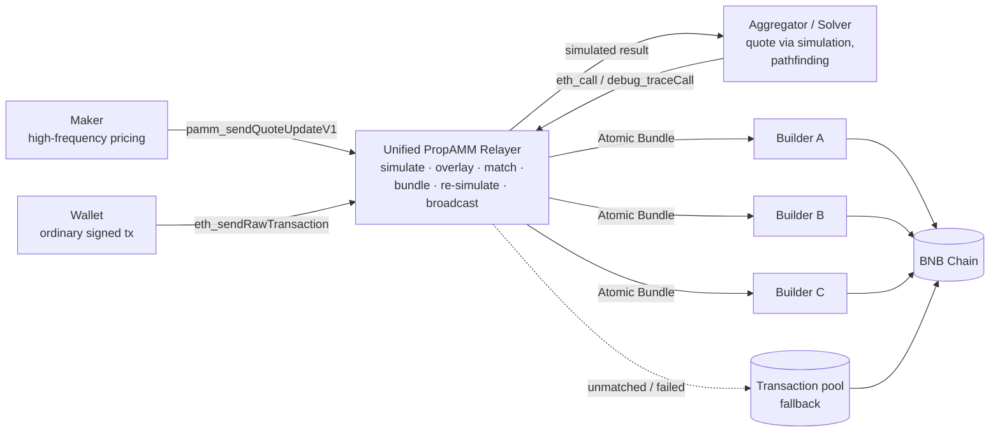
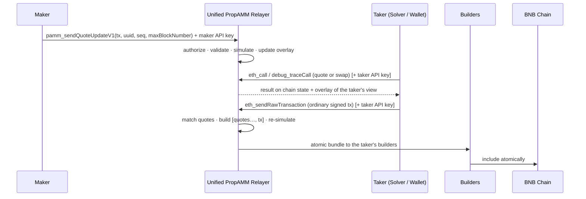

```
BAP: 710
Title: Unified PropAMM Relayer
Status: Draft
Type: Application
Created: 2026-09-03
Description: A builder-neutral execution layer for proprietary AMMs (PropAMMs) on BNB Chain, with a unified on-chain PropAMM standard. Makers stream quotes to one Relayer; takers keep using standard EVM JSON-RPC; the Relayer bundles matched quotes with taker transactions and broadcasts to builders.
```

# BAP-710: Unified PropAMM Relayer

- [BAP-710: Unified PropAMM Relayer]
  - [1. Summary](#1-summary)
  - [2. Abstract](#2-abstract)
  - [3. Motivation](#3-motivation)
    - [3.1 PropAMM Needs a Shared Execution Layer](#31-propamm-needs-a-shared-execution-layer)
    - [3.2 Who Carries the Complexity Today](#32-who-carries-the-complexity-today)
    - [3.3 Why One Oracle and One Pool Interface](#33-why-one-oracle-and-one-pool-interface)
  - [4. Specification](#4-specification)
    - [4.1 Roles and Architecture](#41-roles-and-architecture)
    - [4.2 PropAMM Oracle: Priority Update Registry](#42-propamm-oracle-priority-update-registry)
    - [4.3 PropAMM Pool Interface](#43-propamm-pool-interface)
    - [4.4 Relayer Endpoint and Authentication](#44-relayer-endpoint-and-authentication)
    - [4.5 Taker API](#45-taker-api)
    - [4.6 Maker API](#46-maker-api)
    - [4.7 Maker Protection](#47-maker-protection)
    - [4.8 Analytics and Monitoring](#48-analytics-and-monitoring)
    - [4.9 Open Protocol Scope](#49-open-protocol-scope)
  - [5. Rationale](#5-rationale)
    - [5.1 Design Decisions](#51-design-decisions)
    - [5.2 Alternative Approaches Considered](#52-alternative-approaches-considered)
    - [5.3 Comparison with Existing PropAMM Deployments](#53-comparison-with-existing-propamm-deployments)
  - [6. Backwards Compatibility](#6-backwards-compatibility)
  - [7. Test Cases](#7-test-cases)
  - [8. Security Considerations](#8-security-considerations)
  - [9. License](#9-license)

## 1. Summary

This BNB Chain Application Proposal (BAP) introduces the **Unified PropAMM Relayer**, a builder-neutral professional liquidity execution layer for BNB Chain, together with the unified on-chain **PropAMM Standard** it executes against. Makers update quotes at high frequency through a single Relayer API. Wallets, aggregators and solvers keep using standard EVM JSON-RPC (`eth_call`, `debug_traceCall`, `eth_sendRawTransaction`). The Relayer matches taker transactions with the quotes they depend on, builds atomic bundles and broadcasts them to the connected builders; any transaction it cannot bundle continues through the ordinary transaction pool.

> **Maker sends quotes. Taker sends transactions. Relayer builds bundles.**

## 2. Abstract

A proprietary AMM (PropAMM) is a market-maker-operated pool whose pricing is driven by off-chain quotes rather than by an on-chain curve alone. PropAMMs deliver tighter spreads and better fills than passive AMMs, but every existing deployment pushes the execution complexity onto one participant: makers on Solana run chain-specific landing infrastructure, makers on Base pay to publish every quote update on-chain, and takers on Titan consume a builder-specific state override stream and construct bundles themselves.

BAP-710 defines three layers for BNB Chain:

- **PropAMM Standard (on-chain)**: a **Priority Update Registry** (the PropAMM Oracle) and an **IPropAMM Pool Interface**. The registry holds maker-published pricing state in fixed-layout, per-target lanes with a strictly increasing per-lane sequence number; updates are written directly by authorized updaters, or relayed by anyone as maker-signed (ECDSA or ERC-1271) payloads. The registry enforces no expiry: the Relayer and builders drop an update once its deadline passes, and a pool can check freshness when it reads its lane. The pool interface exposes `isActive`, `getPairs`, `quote` and `swap` to every taker in one consistent way.
- **Unified PropAMM Relayer (off-chain, builder-neutral)**: a Geth-compatible RPC endpoint. It simulates each caller's requests on chain state plus the valid maker quotes that caller is authorized to see, identifies the quotes each signed taker transaction depends on, assembles `[quote update txs…, taker tx]` into an atomic bundle, re-simulates it and fans it out to builders.
- **Builders**: remain generic atomic-bundle execution backends with no PropAMM-specific code.

Key properties:

- **Standard-RPC taker integration**: change the RPC endpoint, not the transaction model.
- **Just-in-time execution**: quote updates stay off-chain until a taker transaction uses them, then land atomically with it.
- **One maker integration**: a single `pamm_sendQuoteUpdateV1` stream reaches all authorized taker flow and all builders.
- **Predictable state updates**: a fixed registry layout lets relayers and builders determine the state effect and gas cost of a quote update without executing maker logic.
- **Fallback safety**: every transaction the Relayer cannot bundle continues through the ordinary transaction pool, so the Relayer never behaves worse than a plain node.
- **Maker protection**: taker visibility control, quote deadlines, a quote-age bound and optional pool-side expiry reduce adverse selection; price protection is a planned extension (4.7).

## 3. Motivation

### 3.1 PropAMM Needs a Shared Execution Layer

Professional market makers already price on-chain assets at sub-second frequency. To bring that pricing on-chain they need a cheap way to publish quotes, a guarantee that a taker executes against the quote it was shown, and a reliable path to block inclusion. On BNB Chain today each maker would solve all three independently, for every builder, and each taker would integrate each maker's contract and update format separately.

The BNB Chain builder ecosystem already provides the one primitive this problem needs: **ordered atomic bundle execution**. What is missing is a shared, builder-neutral layer that turns maker quotes and ordinary taker transactions into such bundles.

### 3.2 Who Carries the Complexity Today

| Deployment | Who carries the complexity | What they must do |
|---|---|---|
| **Solana PropAMM** | Maker | Track leaders and scheduler state, estimate priority fees, handle account contention, optimize landing, and maintain a private execution pipeline that every other maker duplicates. |
| **Base PropAMM** | Maker (cost) and Taker (risk) | Continuously publish quote updates on-chain even when no taker uses them, paying gas and consuming blockspace. The state seen at simulation may differ from the state available at execution. |
| **Titan PropAMM** | Taker | Subscribe to a builder-specific State Override stream, identify the required maker quote updates, construct bundles and submit them through a single builder's pipeline. |

The Unified PropAMM Relayer gives takers a plain EVM RPC surface, keeps quotes off-chain until they are used, and moves all bundle, builder and quote-distribution work into shared infrastructure that no single maker or taker has to build.

### 3.3 Why One Oracle and One Pool Interface

If each PropAMM contract defined its own quote update transaction, the Relayer would have to support arbitrary state-update logic, greatly increasing the cost of parsing, simulation, validation and ordering. A single Priority Update Registry with a fixed update structure provides:

**Technical benefits**
1. **Predictable state changes**: the effect of a quote update is a write to the target's own lane, known without fully simulating arbitrary maker logic.
2. **Predictable execution cost**: on the direct updater path gas depends only on the number of slots written; on decoder lanes a per-element gas cap bounds the decoder (4.2.2).
3. **Fewer update conflicts**: contracts do not execute arbitrary logic while updating quotes, reducing interference and improving composability.
4. **Bounded abuse surface**: priority updates can only write registry lane storage and cannot perform unexpected operations.

**Ecosystem benefits**
1. **Lower maker onboarding cost**: makers from other EVM chains get one interface and one contract spec.
2. **Simpler taker integration**: wallets, aggregators and solvers reach every maker's liquidity through one pool interface.
3. **Wider technical influence**: an open standard and reference implementation can become the common PropAMM infrastructure spec for the EVM ecosystem.

Makers keep full freedom over pricing strategy, lane layout, validity rules and inventory logic inside their pool; only the update path and the taker-facing interface are standardized.

## 4. Specification

The key words "MUST", "MUST NOT", "SHOULD", "SHOULD NOT", "RECOMMENDED", "NOT RECOMMENDED" and "MAY" are to be interpreted as described in RFC 2119.

### 4.1 Roles and Architecture


```mermaid
flowchart LR
    M[Maker<br/>high-frequency pricing]
    W[Wallet<br/>ordinary signed tx]
    S[Aggregator / Solver<br/>quote via simulation,<br/>pathfinding]
    R[Unified PropAMM Relayer<br/>simulate · overlay · match ·<br/>bundle · re-simulate · broadcast]
    P[(Transaction pool<br/>fallback)]
    BA[Builder A]
    BB[Builder B]
    BC[Builder C]
    C[(BNB Chain)]

    M -->|pamm_sendQuoteUpdateV1| R
    S -->|eth_call / debug_traceCall| R
    R -->|simulated result| S
    W -->|eth_sendRawTransaction| R
    R -->|Atomic Bundle| BA
    R -->|Atomic Bundle| BB
    R -->|Atomic Bundle| BC
    R -.->|unmatched / failed| P
    BA --> C
    BB --> C
    BC --> C
    P --> C
```

- **Maker**: provides high-frequency real-time pricing.
- **Wallet**: submits ordinary signed transactions that may include PropAMM pools.
- **Aggregator / Solver**: discovers prices through the pool's `quote`/`swap` simulation (or the Relayer's price ladder, 4.5.1) and adds PropAMM pools to its pathfinding algorithm.
- **Relayer**: simulates maker quote updates; identifies the quotes each taker transaction depends on; assembles matched quote updates and taker transactions into executable bundles; re-simulates; broadcasts to builders, absorbing each builder's differences in endpoint, authentication and submission format; forwards everything it does not bundle to the ordinary transaction pool.
- **Builder**: executes the atomic bundle.

Terms used below: a **target** is a PropAMM pool contract owning one or more **lanes** (independent pricing states) in the registry; a **quote update transaction** is a transaction that writes lanes, sent from the maker's updater key or carrying a maker-signed payload; a **quote stream** (`uuid`) is a sequence of quote update transactions where a newer `seq` replaces the older one; a **view** is the set of makers whose quotes a given caller is authorized to see (4.4); the **overlay** is the aggregated state diff of all currently valid quotes in a view; an **atomic bundle** is `[quote update txs…, taker tx]`, included by a builder in full or not at all.


```mermaid
sequenceDiagram
    participant M as Maker
    participant R as Unified PropAMM Relayer
    participant T as Taker (Solver / Wallet)
    participant B as Builders
    participant C as BNB Chain

    M->>R: pamm_sendQuoteUpdateV1(tx, uuid, seq, maxBlockNumber) + maker API key
    R->>R: authorize · validate · simulate · update overlay
    T->>R: eth_call / debug_traceCall (quote or swap) [+ taker API key]
    R-->>T: result on chain state + overlay of the taker's view
    T->>R: eth_sendRawTransaction (ordinary signed tx) [+ taker API key]
    R->>R: match quotes · build [quotes…, tx] · re-simulate
    R->>B: atomic bundle to the taker's builders
    B->>C: include atomically
```

### 4.2 PropAMM Oracle: Priority Update Registry

The Priority Update Registry is an on-chain state registry that stores Priority Updates published by makers for specific PropAMM contracts (targets). The registry stores raw words; it does not interpret prices or validity metadata. Each target manages its own write authorization and can maintain several mutually independent pricing states through different `laneIndex` values.

- **Updater Authorization**: each target independently manages which addresses may write its lanes on the direct path.
- **Independent Lanes**: a target keeps multiple independent states through different `laneIndex` values; a lane holds up to 255 words.
- **Ordered Direct Updates**: every direct write carries a 48-bit `seq` that the registry stores in the top 48 bits of slot 0 and requires to strictly increase, so an older or replayed update can never overwrite a newer one, whoever submits it.
- **Decoder Lanes**: a target MAY permanently bind a decoder contract to a lane. Anyone may then relay an opaque payload for that lane; the decoder (called with `STATICCALL`) validates it and returns the words to store. Authorization, replay protection and freshness on such a lane are the decoder's job, so new authorization schemes need no registry change.
- **Signed Updates**: ECDSA and ERC-1271 signatures are supported through the reference `SignedSeqDecoder` (4.2.3). A maker signs an EIP-712 update off-chain and any relayer can submit it on the maker's behalf, alone or batched with other makers' updates. The decoder applies the same strictly increasing `seq` and slot-0 layout as the direct path, so a replayed or older payload is rejected and pools read both kinds of lane identically.
- **Batch Updates**: updates for several makers or targets can be merged into one transaction to reduce on-chain cost; an invalid element is skipped rather than reverting the batch.
- **Expiry Outside the Registry**: the registry checks nothing against the block header. Expiry is handled by the two parties that can act on it: the Relayer and builders receive a deadline with every update and drop the update once it passes (4.6), and a target that wants on-chain enforcement encodes a timestamp or block number in its own lane layout and validates it when reading.
- **Conditional Inclusion**: only Priority Updates actually read by a taker transaction in the current block are put on-chain (a Relayer behavior enabled by the fixed layout).

In the PropAMM setting a Priority Update usually carries the latest pricing parameters of one trading pair. When executing `quote` or `swap`, the pool reads its own lane through `getState` and applies its own freshness rule. The fixed lane layout lets a relayer or builder determine an update's state impact ahead of time and therefore safely order and insert updates on demand.

#### 4.2.1 Interface

```solidity
// SPDX-License-Identifier: MIT
pragma solidity ^0.8.28;

/// @title IPrioUpdateDecoder
/// @notice Validates an opaque payload for a decoder-managed lane and returns the words to store.
/// @dev Called with STATICCALL. MUST return the canonical ABI encoding of exactly one uint256[]
///      with 1 to 255 entries; revert to reject the update.
interface IPrioUpdateDecoder {
    function validateAndUnpack(address target, uint256 laneIndex, bytes calldata aux)
        external view returns (uint256[] memory slots);
}

/// @title IPrioUpdateRegistry
/// @notice On-chain registry holding maker-published priority state for PropAMM targets.
interface IPrioUpdateRegistry {
    error NotAuthorized();            // msg.sender is not an updater for `target`
    error EmptySlots();               // `slots` has length zero
    error TooManySlots();             // more than 255 slots
    error SlotIndexOutOfRange();      // read outside the 255-slot lane region
    error SeqBitsNotClear();          // top 48 bits of `slots[0]` are not zero
    error StaleSeq();                 // `seq` not strictly above the lane's stored seq
    error DecoderBoundLane();         // direct path / resetLane used on a decoder lane
    error DecoderNotSet();            // decoder path used on a lane without a decoder
    error DecoderAlreadySet();        // a lane's decoder is permanent
    error ZeroDecoder();
    error DecoderHasNoCode();
    error DecoderReturnedNoSlots();
    error DecoderReturnedMalformed();
    error NotLaneReader();            // getSlotOf caller is neither target nor lane decoder

    event UpdaterAdded(address indexed target, address indexed updater);
    event UpdaterRemoved(address indexed target, address indexed updater);
    event DecoderSet(address indexed target, uint256 indexed laneIndex, address indexed decoder);
    event LaneReset(address indexed target, uint256 indexed laneIndex);

    /// @notice One element of a direct batch write.
    struct Update {
        address   target;
        uint256   laneIndex;
        uint256[] slots;
        uint48    seq;
    }

    /// @notice One element of a decoder batch write. `gasLimit` caps the decoder (0 = all available).
    struct DecoderUpdate {
        address target;
        uint256 laneIndex;
        bytes   aux;
        uint256 gasLimit;
    }

    // ---- Slot-0 layout on updater-managed lanes ----
    function SEQ_SHIFT() external view returns (uint256);        // 208
    function MAX_SEQ() external view returns (uint256);          // 2^48 - 1
    function SLOT0_DATA_MASK() external view returns (uint256);  // 2^208 - 1

    // ---- Target administration (msg.sender is the target) ----
    function addUpdater(address updater) external;
    function removeUpdater(address updater) external;
    function isUpdater(address target, address updater) external view returns (bool);
    function setDecoder(uint256 laneIndex, address decoder) external;
    function laneDecoder(address target, uint256 laneIndex) external view returns (address);
    function resetLane(uint256 laneIndex) external;

    // ---- Writes: direct updater path ----
    function updateState(address target, uint256 laneIndex, uint256[] calldata slots, uint48 seq) external;
    function updateStateBatch(Update[] calldata updates) external returns (bool[] memory applied);

    // ---- Writes: decoder path (anyone may relay) ----
    function updateStateWithDecoder(address target, uint256 laneIndex, bytes calldata aux) external;
    function updateStateWithDecoderBatch(DecoderUpdate[] calldata updates)
        external returns (bool[] memory applied);

    // ---- Reads (scoped to msg.sender unless noted) ----
    function getState(uint256 laneIndex, uint256 count) external view returns (uint256[] memory slots);
    function getSlot(uint256 laneIndex, uint256 slotIndex) external view returns (uint256 value);
    function getSlots(uint256 laneIndex, uint256 slotIndex, uint256 slotCount)
        external view returns (uint256[] memory slots);
    /// @notice Callable by `target` or by the decoder bound to the lane.
    function getSlotOf(address target, uint256 laneIndex, uint256 slotIndex)
        external view returns (uint256 value);
}
```

#### 4.2.2 Semantics

- **Storage layout**: a lane's base slot is `keccak256(abi.encode(LANE_NAMESPACE, target, laneIndex))` with `LANE_NAMESPACE = keccak256("PrioUpdateRegistryV2.lane.v1")`; word `i` of the lane is stored at `base + i` for `0 <= i < 255`. The registry stores no lane length: a shorter write replaces only the supplied prefix, and readers supply the count they expect.
- **Direct path**: `updateState` requires `msg.sender` to be an updater for `target`, the lane to have no decoder, `slots.length` in `[1, 255]`, the top 48 bits of `slots[0]` clear, and `seq` strictly greater than the seq stored in the top 48 bits of slot 0 (a fresh lane stores 0, so the first write needs `seq >= 1`). Words are stored verbatim, with `seq` OR-ed into the top 48 bits of slot 0. Readers mask slot 0 with `SLOT0_DATA_MASK` and read the seq as `slot0 >> SEQ_SHIFT`. `updateStateBatch` applies the same checks per element and skips a failing element instead of reverting.
- **Decoder path**: `setDecoder` permanently binds a decoder to the caller's lane, clears its slot 0 and disables the direct path for it. `updateStateWithDecoder` may be relayed by anyone; the decoder is responsible for authorization, freshness and replay protection, and may read the lane through `getSlotOf`. The batch variant skips an element whose decoder reverts, runs out of its `gasLimit`, returns malformed data or a slot count outside `[1, 255]`; relayers batching across makers SHOULD set `gasLimit` so one decoder cannot starve the rest of the batch.
- **Expiry**: the registry performs no freshness validation on writes or reads, and reading an unwritten lane returns zero rather than reverting. Nothing on-chain can make a signed transaction un-includable, so a write-time check would only turn a late inclusion into a revert the sender still pays for. Instead, the Relayer and builders drop an update once the deadline submitted with it passes, and a pool SHOULD encode a timestamp or block number in its lane and revert `quote` and `swap` once that has expired. A pool that omits the check relies on the Relayer's deadline alone.
- **Lane reset**: `resetLane` lets a target clear slot 0 (and its seq) of a direct-path lane, for example after a seq was pushed to `MAX_SEQ` by mistake. A reset reopens every earlier direct update of that lane that has not landed yet, so before resetting, the maker SHOULD make sure the Relayer and builders have dropped those updates, or rotate the updater.
- **No arbitrary execution**: the only external interaction of the registry is the `STATICCALL` to a decoder the target chose. Gas on the direct path is bounded by the slot count.

For example, a pool that packs an inclusive `maxBlockNumber` above the price in slot 0 reads its lane inside `quote` and `swap` as follows:

```solidity
uint256 data = registry.getState(laneIndex, 1)[0] & SLOT0_DATA_MASK; // drop the registry's seq bits
if (data == 0) revert NoPrice();
if (block.number > data >> 160) revert StaleUpdate();                // pool-enforced expiry
uint256 price = data & ((1 << 160) - 1);
```

A timestamp age check works the same way, as does checking the seq itself when the maker uses millisecond timestamps as its seq.

#### 4.2.3 Signed Updates: Reference Decoder

`SignedSeqDecoder` is the reference decoder for relayed, maker-signed updates. It moves signature verification out of the registry: the registry never sees a signature, and a target that does not need relayed updates never pays for it. One decoder deployment serves any number of targets, and it is built for exactly one registry.

```solidity
// SPDX-License-Identifier: MIT
pragma solidity ^0.8.28;

/// @title ISignedSeqDecoder
/// @notice Reference IPrioUpdateDecoder for relayed, maker-signed updates.
interface ISignedSeqDecoder is IPrioUpdateDecoder {
    /// @notice The payload: `aux = abi.encode(SignedUpdate)`.
    struct SignedUpdate {
        address   target;
        uint256   laneIndex;
        uint256[] slots;        // slots[0] MUST leave its top 48 bits clear
        uint256   seq;          // 48-bit, strictly increasing per lane
        uint256   maxBlock;     // last block the update may be written in; 0 = unchecked
        uint256   maxTimestamp; // last block timestamp the update may be written at; 0 = unchecked
        bytes     signature;    // EIP-712 signature by signerOf(target)
    }

    error NotRegistry();      // caller is not the registry this decoder was deployed for
    error NoSigner();         // the target has no registered signer
    error BadSignature();     // not a valid ECDSA / ERC-1271 signature by the target's signer
    error Expired();          // past maxBlock or maxTimestamp
    error BadSeq();           // empty slots, seq of 0 or above 2^48 - 1, seq bits set in slots[0], or seq not newer
    error PayloadMismatch();  // payload target / laneIndex differ from the registry call

    event SignerSet(address indexed target, address indexed signer);

    function registry() external view returns (address);

    /// @notice Registers the key that signs updates for msg.sender's lanes; zero disables the target.
    function setSigner(address signer) external;
    function signerOf(address target) external view returns (address);

    // ---- EIP-712 ----
    function UPDATE_TYPEHASH() external view returns (bytes32);
    function DOMAIN_SEPARATOR() external view returns (bytes32);
    /// @notice The digest the maker signs.
    function digest(SignedUpdate memory u) external view returns (bytes32);
}
```

**Setup.** A target opts a lane into signed updates with two calls from the target itself: `registry.setDecoder(laneIndex, decoder)` binds the decoder to the lane (permanently, clearing slot 0 so the lane's seq restarts at 0), and `decoder.setSigner(signer)` registers the key that signs for all of the target's lanes. The signer is either an EOA (ECDSA) or a contract that implements ERC-1271 `isValidSignature`, such as a multisig, an MPC custody wallet or a session-key manager. An EOA that has delegated code under EIP-7702 counts as a contract and MUST answer ERC-1271.

**Signature.** The maker signs EIP-712 typed data, so standard wallet and custody tooling can produce it:

- domain: name `"SignedSeqDecoder"`, version `"1"`, the chain id, and the decoder as `verifyingContract`;
- type: `SignedUpdate(address target,uint256 laneIndex,uint256[] slots,uint256 seq,uint256 maxBlock,uint256 maxTimestamp)`, with `slots` hashed as `keccak256(abi.encodePacked(slots))`.

The signature therefore binds the update to one chain, one decoder, one target and one lane, and the decoder only accepts calls from the registry it was deployed for. A payload cannot be replayed on another chain, through another decoder, or validated against one registry's sequence and written into another.

**Validation.** When the registry calls `validateAndUnpack(target, laneIndex, aux)`, the decoder, in order:

1. requires the caller to be its registry (`NotRegistry`);
2. decodes `aux` as a `SignedUpdate` and requires its `target` and `laneIndex` to equal the call's (`PayloadMismatch`);
3. requires a registered signer for `target` (`NoSigner`) and a valid signature by it over `digest(u)`: ECDSA recovery when the signer has no code, ERC-1271 when it has code (`BadSignature`);
4. requires `block.number <= maxBlock` and `block.timestamp <= maxTimestamp`, where a zero bound is unchecked (`Expired`);
5. requires non-empty `slots`, `1 <= seq <= 2^48 - 1`, the top 48 bits of `slots[0]` clear, and `seq` strictly greater than the seq stored in the lane's slot 0, which it reads through `registry.getSlotOf` (`BadSeq`);
6. returns `slots` with `seq` packed into the top 48 bits of slot 0, the layout the direct path stores.

The decoder runs under `STATICCALL` and keeps no state besides the signer registry; all sequencing state lives in the lane. `maxBlock` and `maxTimestamp` are the signed payload's own deadline, checked when the payload is written and never stored; a pool that wants freshness on read still checks its own lane data (4.2.2).

**Relaying.** Anyone can submit a payload with `updateStateWithDecoder(target, laneIndex, abi.encode(u))`, or many makers' payloads in one `updateStateWithDecoderBatch`. A single call reverts with the decoder's error unchanged. In a batch the element is skipped and reported in `applied`, so one maker's stale, replayed or badly signed payload never blocks the others. Relayers SHOULD set a per-element `gasLimit` and MUST check `applied` in simulation rather than rely on gas estimation, because a batch that applied nothing still succeeds.

**Rotation and revocation.** `setSigner(newKey)` takes effect immediately: every payload signed by the old key that has not landed fails `BadSignature` from then on. `setSigner(address(0))` disables relayed updates for the target. A lane's decoder binding itself is permanent.

**Cost.** A relayed element costs roughly 26k gas, about 35–40% more than verifying the signature inside the registry would (roughly 19k). That is the price of the `STATICCALL` hop and the lane read. A maker that submits from its own updater key uses the direct path and pays neither.

### 4.3 PropAMM Pool Interface

Every PropAMM pool integrated with the Relayer MUST implement this interface, so wallets, aggregators and solvers can discover pairs, query quotes and execute swaps in one consistent way without per-maker adapters.

```solidity
// SPDX-License-Identifier: MIT
pragma solidity ^0.8.28;

/// @title IPropAMM
/// @notice Standard interface for PropAMM pools.
interface IPropAMM {
    event Swapped(
        address indexed sender,
        address indexed tokenIn,
        address indexed tokenOut,
        uint256 amountIn,
        uint256 amountOut,
        address recipient
    );

    struct TokenPair {
        address token0;
        address token1;
    }

    /// @notice Returns true if a swap of `tokenIn` for `tokenOut` would succeed in the current block.
    function isActive(address tokenIn, address tokenOut) external view returns (bool active);

    /// @notice Returns all supported token pairs, active and inactive.
    /// @dev Each pair MUST appear exactly once, with token0 < token1. Advisory, for off-chain discovery.
    function getPairs() external view returns (TokenPair[] memory pairs);

    /// @notice Returns the `tokenOut` amount an exact-input swap would deliver.
    /// @dev MUST revert if the pool is inactive for the pair. MUST NOT require a `tokenIn`
    ///      balance or allowance from the caller.
    function quote(address tokenIn, address tokenOut, uint256 amountIn)
        external returns (uint256 amountOut);

    /// @notice Executes an exact-input swap and delivers `tokenOut` to `recipient`.
    /// @dev Push payment: `amountIn` of `tokenIn` MUST already have been transferred to the pool.
    ///      MUST revert if it cannot deliver at least `minAmountOut`.
    /// @param maxBlockNumber Last block in which the swap is valid (inclusive). A pool MAY skip
    ///        this check when its caller (for example a router) already enforces it.
    function swap(
        address tokenIn,
        address tokenOut,
        uint256 amountIn,
        uint256 minAmountOut,
        address recipient,
        uint256 maxBlockNumber
    ) external returns (uint256 amountOut);
}
```

- `isActive`: whether the given token pair is tradable right now; a cheap `view` fast-path before a full `quote`.
- `getPairs`: all token pairs supported by the pool, each once with `token0 < token1`.
- `quote`: expected output for a given exact input; reverts when the pair is inactive or the pool's quote has expired.
- `swap`: execute an exact-input swap and send `tokenOut` to `recipient`.

`swap` uses a **push-payment** model: the router transfers `amountIn` of `tokenIn` to the pool before calling `swap`; the pool then completes the trade and sends `tokenOut`, measuring the delivered amount as a balance delta. The pool MUST revert if `amountOut < minAmountOut`, and SHOULD revert if `block.number > maxBlockNumber` when it is called without a router that checks it. `quote` MUST return the `amountOut` that `swap` would produce for the same inputs in the same state; callers obtain it through `eth_call`. A pool designed to be called directly by takers MAY instead pull `amountIn` with `transferFrom`, keeping the same signatures, but then cannot sit behind a push-payment router.

### 4.4 Relayer Endpoint and Authentication

The Relayer is built on a BNB Chain full node and exposes HTTPS and WebSocket endpoints, deployed in multiple regions (United States, Europe, Japan) behind load balancing.

- HTTPS: `https://propamm.bnbchain.org`
- WebSocket: `wss://propamm.bnbchain.org`

**Accounts and API keys.** The Relayer operator runs an account console where any wallet can apply for the maker or taker role, subject to administrator approval. Every approved account issues its own API keys, each bound to exactly one role. A caller presents its key in the `x-api-key` HTTP header (on WebSocket, in the handshake). The Relayer:

- MUST resolve keys locally, from a periodically refreshed snapshot of approved accounts, their relationships and the SHA-256 digest of every active key; it MUST NOT contact the console on a request path;
- MUST NOT log, store, forward or return a plaintext key; long-lived subscriptions keep only the digest and re-resolve it on every frame;
- applies key revocation and rotation at the next snapshot refresh, including on live WebSocket connections.

**Maker authentication.** The quote ingress (4.6) requires a valid **maker** key. A request without a key, with an unknown or revoked key, or with a key of another role is rejected. Each maker registers its pool address in the console; every quote is attributed to the maker account the key resolves to and to that pool. The console is the only source of this attribution; a request cannot claim a pool or maker id of its own.

**Taker visibility.** Each maker chooses whether its quotes are **public** (the default) or **restricted** to the takers it selects. Each taker may in turn restrict itself to the makers it selects (otherwise it accepts every maker that admits it). The Relayer pre-evaluates both sides into one **view** per caller:

- a caller without a key, or with a key that does not resolve to an approved taker, sees public makers only; taker identity never causes a read to fail;
- an approved taker additionally sees the restricted makers that selected it. If the taker restricted its own side, it sees only the makers it selected that also admit it; a public maker the taker did not select is hidden as well.

Taker identity is the API key, not the transaction sender. The Relayer MUST use the same view for simulation (4.5.1), the overlay and price streams, and matching (4.5.2), so a taker is never priced on a quote it cannot be matched with. Within a view, the freshest visible quote wins each storage slot; the Relayer MUST NOT compute the overlay over all makers and then filter it, because a hidden maker's fresher quote would shadow a visible one.

**Builder routing preference.** An approved taker MAY restrict, in the console, which builders its bundles are sent to (empty = all builders). The preference is resolved from the same snapshot as the view. If the preference matches no builder connected to the Relayer, the transaction goes to the ordinary transaction pool instead of to all builders.

**Fail closed.** If the snapshot was never loaded, or has not been refreshed for `max(10 × refresh interval, 5 minutes)`, the Relayer MUST refuse quote updates and MUST NOT price or match any caller on any quote, public or not. Quotes of a maker that loses approval are removed at the next block.

A Relayer running without an account console accepts quotes from anyone and shows them to everyone; such a deployment MUST keep its maker endpoint private (4.6, 8.2).

### 4.5 Taker API

The Relayer exposes a Geth-compatible standard EVM RPC interface. For wallets, aggregators and solvers, PropAMM liquidity is used exactly like ordinary on-chain liquidity: no bundle API and no builder API. The taker API key (4.4) is optional on every taker method.

| Method | Behavior |
|---|---|
| `eth_call` | Standard call, executed on the caller's overlay (4.5.1). |
| `debug_traceCall` | Standard trace, executed on the caller's overlay. |
| `eth_sendRawTransaction` | Standard submission; matched transactions are bundled (4.5.2), all others enter the transaction pool. |
| `pamm_getPammStateOverrides` | The caller's overlay as `overrides` (account → slot → value) plus the same slots grouped by pool in `venues[]`. |
| `pamm_subscribe` `"subscribeNewQuotesV1"` | WebSocket push of the `pamm_getPammStateOverrides` payload on a fixed interval (reference default 100 ms); optional `{ "routers": [...] }` filter. Each frame is a full snapshot. |
| `pamm_getPammPriceLevels` | The caller's price ladder: for each PropAMM pool and each direction of each pair from `getPairs()`, `quote()` results at a geometric range of input sizes, plus interpolated levels. |
| `pamm_subscribe` `"subscribePriceLevelsV1"` | WebSocket push of the `pamm_getPammPriceLevels` payload after every ladder tick (reference default 200 ms); optional `{ "pamms": [...] }` filter. |

A deployment MAY restrict all other JSON-RPC methods; wallets and solvers SHOULD keep using their existing BSC RPC endpoint for general chain reads such as `eth_chainId`, `eth_blockNumber` and `eth_getTransactionCount`.

#### 4.5.1 Transaction Simulation

When a taker calls `eth_call` or `debug_traceCall` against the latest block, the Relayer overlays the aggregated state of the quotes in the caller's view on the current chain state, simulates against that combined state, and returns a standard EVM RPC result.

```text
simulated state = chain state at head + overlay(quotes in the caller's view) + caller's own state overrides
```

- The overlay is applied only on the canonical head. Historical blocks, non-canonical blocks requested by hash and mid-block traces (`txIndex`) are simulated on plain state.
- State overrides supplied by the caller are applied after the overlay and always win.
- Calls that do not touch a PropAMM pool produce exactly the result a normal node would.
- The Relayer applies the overlay only while it is synchronized with the chain head (4.6.4).

The taker therefore obtains quotes and simulation results for PropAMM routes in the same way it queries any other EVM liquidity. Integrators that price on their own node MAY instead apply the `venues[].overrides` from the overlay stream as an `eth_call` `stateDiff`; the fill path remains `eth_sendRawTransaction` to the Relayer.

The price ladder is computed once per tick on the full overlay. A caller sees a pool's ladder only if it is authorized for every maker registered on that pool; a pool the operator adds without a registered maker is visible to everyone. It is computed only while someone consumes it (a live subscription, or a `pamm_getPammPriceLevels` call within the last 30 seconds). A ladder for a direction stops at the first size the pool cannot quote.

#### 4.5.2 Transaction Submission

If the simulated result meets the taker's conditions, the taker signs an ordinary transaction and submits it via `eth_sendRawTransaction` to the same endpoint. The Relayer MUST then:

1. **Check eligibility.** A transaction already known to the transaction pool, one that replaces a pending transaction (same sender and nonce, such as a speed-up or cancel), a blob transaction, or one whose gas limit exceeds the Relayer's simulation cap goes directly to the transaction pool.
2. **Simulate on the caller's overlay**, recording the storage slots the transaction reads (including reads in frames that later revert).
3. **Match.** A quote is matched when its write-set intersects the transaction's read-set:

   ```text
   quote write-set ∩ taker read-set ≠ ∅  →  bundle together
   ```

   Each read slot is attributed to the freshest quote in the caller's view that writes it, the same rule that built the overlay.
4. **Assemble** `[matched quote txs ordered oldest-received first, taker tx]`, so the freshest quote is the last writer of every contested slot. The bundle's `maxBlockNumber` is the tightest deadline among the matched quotes.
5. **Re-simulate** the complete bundle from clean chain state. Quote transactions that fail are removed from the bundle; the taker transaction MUST succeed.
6. **Broadcast** the bundle to all connected builders, or to the subset the taker selected (4.4), in each builder's submission format. Builders keep the bundle alive until its `maxBlockNumber`; the Relayer does not rebroadcast or replace it.
7. **Fall back.** If the Relayer is not synchronized, no quote is visible, simulation fails, nothing matches, the matched quotes have expired, every quote is dropped in re-simulation, or no builder accepts the bundle, the transaction MUST continue to the ordinary transaction pool exactly as on a plain node.

The process is transparent to the taker, who never handles bundle construction, builder API integration, multi-builder fan-out or matching quotes to its transaction. Unmatched quote update transactions are never sent to builders or the public transaction pool, so quote updates cost gas only when they produce a fill. A bundled taker transaction is not visible in the public transaction pool until it lands, as with any private order flow.

#### 4.5.3 Wallet Integration

A wallet simulates and submits through the Relayer without changing its transaction construction or signing flow.

- **Simulation**: the wallet MAY simulate every transaction through the Relayer. Transactions without PropAMM pools get a standard EVM simulation; transactions with PropAMM pools get the overlaid simulation.
- **Submission**: the wallet SHOULD send the signed transaction to the Relayer only, or to the Relayer first. Transactions with PropAMM pools are bundled and distributed to builders; all others are forwarded through the Relayer's own transaction pool, so a separate public submission is not needed. Sending the same transaction to a public RPC in parallel is NOT RECOMMENDED: if the public copy reaches the Relayer's transaction pool first, the Relayer treats the transaction as already known and it misses the bundle path.

> **Change the RPC endpoint, not the transaction model.**

#### 4.5.4 Solver and Aggregator Integration

An aggregator or solver adds `IPropAMM` support to its existing pool adapter and treats PropAMM as one more liquidity source for pathfinding and order splitting.

- **Quote discovery**: simulate `quote` or `swap` at several trade sizes, or consume the Relayer's price ladder, then compare PropAMM quotes with AMM, RFQ and other sources to compute the optimal path and split, for example 40% PropAMM Pool A, 25% PropAMM Pool B, 35% AMM Pool. With the standardized interface, integrating a PropAMM pool is comparable to integrating a Uniswap or PancakeSwap pool.
- **Transaction construction**: generate calldata against `IPropAMM.swap`, transferring `amountIn` to the pool first, with a `minAmountOut` that leaves room for quote movement: the Relayer bundles the quotes that are live when the transaction arrives, not the snapshot the solver simulated.
- **Wallet compatibility**: the solver MUST only return PropAMM routes to wallets declared PropAMM-compatible, whose signed transactions reach the Relayer. A PropAMM-dependent transaction submitted only through a public BSC RPC would fail for lack of the corresponding quote update.

### 4.6 Maker API

A maker integrates with the Relayer once and thereby reaches all connected builders and all authorized taker flow. Each call carries one quote update and the maker API key in `x-api-key`. Over WebSocket a maker MAY keep many calls in flight; responses are correlated by JSON-RPC `id`.

```json
{
  "jsonrpc": "2.0",
  "id": 1,
  "method": "pamm_sendQuoteUpdateV1",
  "params": [{
    "uuid": "0x8c5f4c1e7c3a4d1b9e0f2a6b1c9d4e55",
    "seq": 1837291,
    "tx": "0x02f8...",
    "maxBlockNumber": 52000001
  }]
}
```

| Field | Type | Description |
|---|---|---|
| `uuid` | bytes16 (hex) | Quote stream identifier, exactly 16 bytes. A stream belongs to the maker that created it. |
| `seq` | uint64 | Sequence number within the stream; MUST be greater than 0 and strictly greater than the stream's current `seq`. |
| `tx` | bytes | Signed quote update transaction (EIP-2718 encoding; blob transactions are not accepted). It SHOULD only write the maker's lanes in the registry: a direct `updateState` from an updater key, or an `updateStateWithDecoder` call carrying a maker-signed payload (4.2.3), which may be sent from any account. An empty value (`0x`) **cancels** the stream. |
| `maxBlockNumber` | uint64 | The quote's deadline: the last block (inclusive) in which it may be included. MUST be greater than the current head. `0`, or a value beyond the Relayer's maximum lifetime (reference default: head + 100 blocks), is clamped to that maximum. |

The maker's identity and pool are not request fields: both come from the API key (4.4).

#### 4.6.1 Response

Every call returns a result; a rejected update carries an `error` string in the result rather than a JSON-RPC error, so a bad quote never interrupts the maker's stream.

```json
{ "jsonrpc": "2.0", "id": 1,
  "result": { "uuid": "0x8c5f4c1e7c3a4d1b9e0f2a6b1c9d4e55", "seq": 1837291, "timestamp": 1781801564588 } }
```

| Field | Description |
|---|---|
| `uuid`, `seq` | Echo of the request. |
| `timestamp` | Relayer receive time (Unix milliseconds); the freshness clock (4.7) starts here and is never taken from the maker. |
| `error` | Present only when the update was rejected. |

Rejection reasons in the reference implementation:

| `error` | Cause |
|---|---|
| `missing maker API key (x-api-key header)` / `invalid API key` / `API key is not a maker key` | Maker authentication (4.4). |
| `permission directory unavailable, retry later` | The Relayer's permission snapshot is stale (fail closed, 4.4). |
| `propamm engine not ready` | The Relayer is not synchronized with the chain head (4.6.4). |
| `uuid must be exactly 16 bytes`, `seq must be > 0`, `tx too short …`, `blob-tx is not supported as a quote`, transaction decoding errors | Malformed request. |
| `the maxBlockNumber must be greater than currentBlockNum`, `quote expired on arrival` | Deadline already passed. |
| `stale seq` | `seq` not strictly above the stream's current `seq`. |
| `uuid has been canceled` | The stream was canceled; an update with a lower `seq` cannot revive it. |
| `uuid belongs to another maker` | Update or cancel of a stream created by another maker. |
| `quote tx signed for a different chain id`, `quote gas limit above simulation cap` | The transaction cannot be simulated or included here. |
| `relayer busy, retry` | Simulation capacity exhausted; the update is refused rather than queued. |
| `quote writes storage outside the allowed scope` | Write-scope violation (4.7). |
| (EVM error text) | The quote transaction fails in next-block simulation, including registry rejections such as `NotAuthorized` or `StaleSeq`. |

#### 4.6.2 Quote Processing and Lifecycle

On acceptance the Relayer simulates the quote transaction once on the next-block environment, captures its storage write-set and merges it into the overlay. A quote leaves the overlay when it is:

- superseded by a higher `seq` on the same `uuid`, or canceled;
- past its `maxBlockNumber`;
- consumed on chain (the sender's nonce has advanced past the quote transaction);
- older than the Relayer's freshness bound (4.7);
- owned by a maker that is no longer approved.

The Relayer never prices or matches a quote past its `maxBlockNumber`, and every bundle carries the tightest `maxBlockNumber` of its quotes, so builders drop it after that block. A cancel leaves a tombstone until the stream's deadline, so a delayed update with a lower `seq` cannot resurrect the stream. The quote transaction is a carrier for its write-set: a maker MAY reuse the same nonce for successive updates until a fill consumes it, and the sending account MUST hold enough BNB to pass the next-block simulation.

#### 4.6.3 Just-in-Time Inclusion

A quote update is held inside the Relayer and only leaves it as part of an atomic bundle once a matching taker transaction arrives. The maker does not integrate multiple builders, predict the next block's builder, maintain per-builder PropAMM APIs, source taker flow, implement fan-out and failover, or pay gas for quote updates that never fill.

#### 4.6.4 Readiness

The Relayer MUST NOT accept quotes or apply the overlay until it is synchronized with the chain (reference rule: five consecutive chain heads, each within 3 seconds of wall-clock time), and MUST stop doing both if it falls behind again. Taker transactions submitted meanwhile take the transaction pool path.

### 4.7 Maker Protection

**Visibility Control.** A maker MAY restrict its quotes to selected takers (4.4). Restricted quotes are excluded from every other caller's simulation, streams and matching.

**Freshness Protection.** A common maker risk is adverse selection: when the market moves quickly, a taker may execute against a quote that no longer reflects the latest market state. Freshness is bounded in four layers:

- **Deadline.** Every quote carries a `maxBlockNumber` (4.6). The Relayer stops using the quote after that block, and any bundle carrying it expires at the builders no later than that block.
- **Quote-age bound.** The Relayer timestamps every quote on arrival and, at every new block, removes quotes received longer ago than its configured bound, regardless of their `maxBlockNumber`. This caps the window in which a quote can be filled at the bound plus at most one block interval, the same granularity at which a bundle can land. Pricing and matching read the same set of quotes, so a taker is never priced on a quote it cannot be matched with. The reference implementation applies one bound to all makers and leaves it disabled by default; per-maker windows are a possible extension.
- **Pool-side expiry (optional).** A pool that encodes a timestamp or block number in its lane and validates it on read (4.2.2) cannot be traded against after that deadline, even if a stale update is included.
- **Ordering.** A higher `seq` on a stream replaces the older quote inside the Relayer, and the per-lane `seq` (enforced by the registry on the direct path and by `SignedSeqDecoder` on signed lanes) prevents an older update from overwriting a newer one on chain.

**Stream Ownership.** A `uuid` belongs to the maker that created it; other makers cannot update or cancel it.

**Write Scope.** A Relayer MAY restrict the contracts a quote transaction may write (for example to the registry). A quote whose write-set touches any other contract is rejected wholesale; individual slots are never filtered out, because the transaction would still perform those writes when the bundle executes.

**Price Protection (planned).** A maker will be able to configure a maximum deviation from a reference fair price, beyond which the Relayer filters its quote. This requires a standard for which lane words carry prices and a reference price source, and is not part of this version (4.9).

### 4.8 Analytics and Monitoring

The Relayer MUST expose metrics covering the full lifecycle of quotes, taker transactions, matching and bundle execution. It SHOULD log every event with the quote `uuid`, `seq` and transaction hash, so that any unfilled quote or unlanded bundle can be followed through Quote Received → Validated and Simulated → Taker Transaction Received → Quote Matched → Bundle Constructed and Simulated → Distributed to Builders → Included or Expired. The reference implementation provides Prometheus-compatible metrics for:

- **Quotes**: received, accepted, canceled, rejected by reason, removed by reason (expired, consumed, over age, revoked), live quotes, overlay size, simulation time.
- **Takers**: processed, bundled, fallback to the transaction pool by reason, matched quotes per bundle, pipeline latency.
- **Bundles and builders**: broadcast, landed, expired, broadcast and landing latency, per-builder accepted and failed submissions.
- **Permissions and streams**: snapshot refresh results and size, stream subscribers, delivered and dropped frames, price-ladder computation.

`pamm_status` returns an operational snapshot: readiness, quote and overlay counts, builders, pending bundles, protection settings, permission snapshot state and stream state. Dashboards, per-participant analytics and an analytics API are built on top of these signals. They MUST NOT expose quotes beyond the view each reader is authorized for, takers' unfilled transactions or any API key material; detailed data is isolated by identity, public data is aggregated or delayed, and access is governed by API keys and role-based access control with audit logs.

### 4.9 Open Protocol Scope

Builders already provide ordered atomic bundle execution, so no builder-side PropAMM protocol is needed. The standardization boundary is **Maker ↔ Relayer ↔ Taker**. This BAP fixes the on-chain standard (4.2, 4.3) and the Relayer API surface (4.4 to 4.6). The following are proposed as follow-up components of the open protocol:

1. Price protection semantics and a reference price source
2. Execution receipts and taker-facing bundle status
3. Bundle replacement when a fresher quote arrives for an in-flight bundle
4. Selection among competing taker transactions for the same quotes (today builders arbitrate between conflicting bundles)
5. End-to-end trace identifiers and an analytics API
6. Relayer conformance tests and reference SDKs
7. Relayer-submitted signed updates: accepting `SignedUpdate` payloads (4.2.3) directly in the Maker API and batching them across makers into one Relayer-sent `updateStateWithDecoderBatch` transaction. Today a signed payload reaches the Relayer wrapped in a maker-provided transaction.
8. Multi-Relayer interoperability across operators. The reference implementation already shares quote updates among the relayers of one operator over an authenticated peering link: each relayer re-authorizes a peered quote against its own permission snapshot before using it, and never re-shares it.

## 5. Rationale

### 5.1 Design Decisions

- **Taker surface identical to a node.** Every approach that asks takers to learn a new object (bundle, state override, pricing identifier) slows adoption. Serving standard JSON-RPC with an internal overlay means a wallet changes one URL and a solver adds one pool adapter. The overlay and price streams are optional conveniences, not requirements.
- **One registry with a fixed layout.** A fixed lane layout is what makes a quote's effect knowable from a single simulation, bounds gas and lets the Relayer order updates safely. Maker-specific pricing and validity logic still live in the maker's pool, which reads the lane. Decoder lanes trade some of that predictability for target-defined authorization, and are bounded per element by `gasLimit`.
- **Just-in-time inclusion.** Holding quotes off-chain until a taker uses them removes the gas cost of unused updates and closes the simulation-to-execution gap by executing quote and taker transaction atomically.
- **Builder neutrality.** Treating builders as interchangeable atomic-bundle backends avoids single-builder dependence and requires zero PropAMM code in builders. Takers may narrow the builder set but never widen it beyond what the Relayer connects to.
- **Views, not filters.** Visibility is resolved per caller before the overlay is built, so pricing, attribution and matching always agree and a hidden maker can never shadow a visible one.
- **Fallback safety.** Every failure path ends in the ordinary transaction pool, so routing all transactions through the Relayer is never worse than using a plain node.
- **Stateless per-submission pipeline.** Each taker transaction is matched and bundled independently; builders arbitrate between conflicting bundles. This keeps latency low and avoids holding a candidate pool until the block boundary.
- **Freshness at block granularity.** Quotes are aged out once per block rather than checked per request: a bundle cannot land before the next block, so a per-request check would add re-simulation rounds without narrowing the real window.

### 5.2 Alternative Approaches Considered

- **Builder-side PropAMM protocol.** Rejected: builders already expose the needed primitive; PropAMM logic in builders would fragment the standard per builder.
- **Per-maker custom quote update transactions.** Rejected: arbitrary update logic requires full simulation of every quote, unbounded gas and a larger abuse surface (3.3).
- **Continuous on-chain quote publication.** Rejected: it wastes gas on unused quotes and leaves a window where simulation state differs from execution state.
- **Expiry and signatures inside the registry.** Not adopted. An earlier registry draft verified maker signatures itself (`batchUpdateStateWithSignature`) and enforced `maxBlockNumber` on reads and writes. Expiry is not the registry's job: nothing on-chain can make a signed transaction un-includable, so a write-time check only turns a late inclusion into a revert the sender still pays for, while the parties that can act on expiry already have what they need. The Relayer and builders receive a deadline with each update and drop it once the deadline passes, and a pool checks age on read with the clock and window it chooses. Signatures move into the reference `SignedSeqDecoder`, which keeps ECDSA and ERC-1271 support and adds per-lane sequencing, at about 35–40% more gas per relayed element. Targets that need neither pay for neither, and new authorization schemes ship as decoders without touching the registry.
- **Taker-side bundle construction.** Rejected: it pushes override handling, quote selection and bundle submission into every wallet and solver, tied to a single builder.
- **Maker-side execution infrastructure.** Rejected: each maker would duplicate landing infrastructure instead of focusing on pricing and risk.
- **Explicit pricing identifier in the taker transaction.** Rejected: it changes the transaction model for wallets and breaks when solvers rebuild calldata; the Relayer correlates quotes without taker cooperation.

### 5.3 Comparison with Existing PropAMM Deployments

| Dimension | Solana | Base | Titan | Unified PropAMM Relayer |
|---|---|---|---|---|
| Taker price discovery | Chain-specific | `eth_call` | Builder-specific State Override stream | `eth_call` / `debug_traceCall`; optional state-override and price-ladder streams |
| Taker submission | Chain-specific | `eth_sendRawTransaction` | Bundle-oriented | `eth_sendRawTransaction` |
| Bundle composition | Maker | None (sequencer state) | Taker / solver | Relayer |
| Builder routing | Maker | Sequencer | Single builder | Relayer, all builders (taker may narrow) |
| Quote publication cost | Maker gas | Maker gas for every update | Only when used | Only when used |
| Maker integration | Per-chain infra | Per-sequencer | Per-builder | Once, per Relayer |
| Builder PropAMM code | N/A | N/A | Required | Not required |
| Freshness protection | Maker-side | None | Builder-side | Relayer-side deadline and quote-age bound, plus optional pool-side expiry |

Summary: **standard EVM RPC for takers + just-in-time PropAMM execution + multi-builder execution abstraction.**

## 6. Backwards Compatibility

- **Takers**: the Relayer speaks standard Geth-compatible JSON-RPC and introduces no new transaction type or signing flow for takers. Transactions that do not touch PropAMM pools behave exactly as on a normal node, and every transaction the Relayer does not bundle enters the ordinary transaction pool. The `pamm_` read methods are optional.
- **Builders**: bundles are ordinary atomic bundles delivered through each builder's existing API. No builder-side change is required.
- **Existing PropAMM contracts**: contracts that do not implement `IPropAMM` or do not read pricing from the registry are not eligible for Relayer matching; they can be integrated through a thin wrapper pool or by upgrading.
- **Wallets without PropAMM support**: PropAMM routes are only returned to wallets that submit to the Relayer, so existing wallets are never handed a transaction that would fail on public RPC.

## 7. Test Cases

### 7.1 Priority Update Registry

```solidity
// Only authorized updaters may write a target's lane
function testUnauthorizedUpdaterRejected() public {
    vm.prank(maker);
    vm.expectRevert(IPrioUpdateRegistry.NotAuthorized.selector);
    registry.updateState(pool, LANE_0, slots, 1);
}

function testAuthorizedUpdateAndRead() public {
    vm.prank(pool);
    registry.addUpdater(maker);
    vm.prank(maker);
    registry.updateState(pool, LANE_0, slots, 1);

    vm.prank(pool);
    uint256[] memory got = registry.getState(LANE_0, slots.length);
    assertEq(got[0] & registry.SLOT0_DATA_MASK(), slots[0]);
    assertEq(got[0] >> registry.SEQ_SHIFT(), 1);
}

// seq must strictly increase; a replayed or older update cannot overwrite a newer one
function testStaleSeqRejected() public {
    vm.prank(pool);
    registry.addUpdater(maker);
    vm.startPrank(maker);
    registry.updateState(pool, LANE_0, slots, 2);
    vm.expectRevert(IPrioUpdateRegistry.StaleSeq.selector);
    registry.updateState(pool, LANE_0, slots, 2);
    vm.expectRevert(IPrioUpdateRegistry.StaleSeq.selector);
    registry.updateState(pool, LANE_0, slots, 1);
    vm.stopPrank();
}

// The top 48 bits of slot 0 belong to the registry's seq
function testSeqBitsMustBeClear() public {
    vm.prank(pool);
    registry.addUpdater(maker);
    slots[0] = 1 << 208;
    vm.prank(maker);
    vm.expectRevert(IPrioUpdateRegistry.SeqBitsNotClear.selector);
    registry.updateState(pool, LANE_0, slots, 1);
}

// A failing batch element is skipped, not fatal
function testBatchSkipsInvalidElement() public {
    vm.prank(pool);
    registry.addUpdater(maker);

    IPrioUpdateRegistry.Update[] memory ups = new IPrioUpdateRegistry.Update[](2);
    ups[0] = IPrioUpdateRegistry.Update(pool, LANE_0, slots, 1);
    ups[1] = IPrioUpdateRegistry.Update(otherPool, LANE_0, slots, 1); // maker not authorized
    vm.prank(maker);
    bool[] memory applied = registry.updateStateBatch(ups);
    assertTrue(applied[0]);
    assertFalse(applied[1]);
}

// ---- Signed updates through SignedSeqDecoder ----
// sign(key, target, lane, slots, seq, maxBlock, maxTimestamp) returns an EIP-712-signed SignedUpdate.

function setUpSignedLane() internal {
    vm.startPrank(pool);
    registry.setDecoder(LANE_1, address(signedDecoder));
    signedDecoder.setSigner(makerSigner);
    vm.stopPrank();
}

// Anyone may relay a maker-signed update; it lands with the same slot-0 layout as the direct path
function testSignedUpdateRelayed() public {
    setUpSignedLane();
    ISignedSeqDecoder.SignedUpdate memory u = sign(makerKey, pool, LANE_1, slots, 1, block.number + 2, 0);

    vm.prank(anyRelayer);
    registry.updateStateWithDecoder(pool, LANE_1, abi.encode(u));

    vm.prank(pool);
    uint256 word = registry.getState(LANE_1, 1)[0];
    assertEq(word & registry.SLOT0_DATA_MASK(), slots[0]);
    assertEq(word >> registry.SEQ_SHIFT(), 1);
}

// A replayed or older signed payload is not newer than the lane
function testSignedReplayRejected() public {
    setUpSignedLane();
    ISignedSeqDecoder.SignedUpdate memory u = sign(makerKey, pool, LANE_1, slots, 5, 0, 0);
    registry.updateStateWithDecoder(pool, LANE_1, abi.encode(u));

    vm.expectRevert(ISignedSeqDecoder.BadSeq.selector);
    registry.updateStateWithDecoder(pool, LANE_1, abi.encode(u));

    u = sign(makerKey, pool, LANE_1, slots, 4, 0, 0);
    vm.expectRevert(ISignedSeqDecoder.BadSeq.selector);
    registry.updateStateWithDecoder(pool, LANE_1, abi.encode(u));
}

// Wrong key, expired payload, payload for another lane, rotated key
function testSignedUpdateRejections() public {
    setUpSignedLane();

    ISignedSeqDecoder.SignedUpdate memory u = sign(otherKey, pool, LANE_1, slots, 1, 0, 0);
    vm.expectRevert(ISignedSeqDecoder.BadSignature.selector);
    registry.updateStateWithDecoder(pool, LANE_1, abi.encode(u));

    u = sign(makerKey, pool, LANE_1, slots, 1, block.number, 0);
    vm.roll(block.number + 1);
    vm.expectRevert(ISignedSeqDecoder.Expired.selector);
    registry.updateStateWithDecoder(pool, LANE_1, abi.encode(u));

    u = sign(makerKey, pool, LANE_2, slots, 1, 0, 0);
    vm.expectRevert(ISignedSeqDecoder.PayloadMismatch.selector);
    registry.updateStateWithDecoder(pool, LANE_1, abi.encode(u));

    u = sign(makerKey, pool, LANE_1, slots, 1, 0, 0);
    vm.prank(pool);
    signedDecoder.setSigner(newSigner);                        // rotation invalidates unlanded payloads
    vm.expectRevert(ISignedSeqDecoder.BadSignature.selector);
    registry.updateStateWithDecoder(pool, LANE_1, abi.encode(u));
}

// The signer may be a contract wallet verified through ERC-1271
function testSignedUpdateERC1271() public {
    vm.startPrank(pool);
    registry.setDecoder(LANE_1, address(signedDecoder));
    signedDecoder.setSigner(address(makerMultisig));
    vm.stopPrank();

    ISignedSeqDecoder.SignedUpdate memory u = signWith1271(makerMultisig, pool, LANE_1, slots, 1, 0, 0);
    registry.updateStateWithDecoder(pool, LANE_1, abi.encode(u));
}

// One bad payload in a relayer's cross-maker batch is skipped, not fatal
function testSignedBatchSkipsBadElement() public {
    setUpSignedLane();
    IPrioUpdateRegistry.DecoderUpdate[] memory ups = new IPrioUpdateRegistry.DecoderUpdate[](2);
    ups[0] = IPrioUpdateRegistry.DecoderUpdate(pool, LANE_1, abi.encode(sign(makerKey, pool, LANE_1, slots, 1, 0, 0)), 100_000);
    ups[1] = IPrioUpdateRegistry.DecoderUpdate(pool, LANE_1, abi.encode(sign(otherKey, pool, LANE_1, slots, 2, 0, 0)), 100_000);

    vm.prank(anyRelayer);
    bool[] memory applied = registry.updateStateWithDecoderBatch(ups);
    assertTrue(applied[0]);
    assertFalse(applied[1]);
}

// Binding a decoder closes the direct path on that lane
function testDecoderLaneClosesDirectPath() public {
    setUpSignedLane();
    vm.prank(pool);
    registry.addUpdater(maker);
    vm.prank(maker);
    vm.expectRevert(IPrioUpdateRegistry.DecoderBoundLane.selector);
    registry.updateState(pool, LANE_1, slots, 1);
}
```

### 7.2 PropAMM Pool Interface

```solidity
// quote and swap agree for the same state
function testQuoteMatchesSwap() public {
    uint256 expected = pool.quote(USDT, WBNB, 1_000e18);
    pushIn(USDT, 1_000e18);                                    // push payment
    uint256 out = pool.swap(USDT, WBNB, 1_000e18, expected, user, block.number);
    assertEq(out, expected);
}

// swap enforces minAmountOut and maxBlockNumber
function testSwapSlippageAndDeadline() public {
    pushIn(USDT, 1_000e18);
    vm.expectRevert();                                         // insufficient output
    pool.swap(USDT, WBNB, 1_000e18, type(uint256).max, user, block.number);

    pushIn(USDT, 1_000e18);
    vm.expectRevert();                                         // past maxBlockNumber
    pool.swap(USDT, WBNB, 1_000e18, 0, user, block.number - 1);
}

// A pool that packs a deadline into its lane enforces it on read
function testStaleLaneReverts() public {
    writeQuote(USDT, WBNB, price, block.number);               // maxBlockNumber = this block
    assertTrue(pool.isActive(USDT, WBNB));

    vm.roll(block.number + 1);
    assertFalse(pool.isActive(USDT, WBNB));
    vm.expectRevert(ExamplePool.StaleUpdate.selector);
    pool.quote(USDT, WBNB, 1_000e18);
}
```

### 7.3 Relayer Behavior

| # | Scenario | Expected result |
|---|---|---|
| R1 | `pamm_sendQuoteUpdateV1` with `seq` ≤ current `seq` on the same `uuid` | Rejected with `stale seq`. |
| R2 | Quote with `maxBlockNumber` ≤ head | Rejected as expired. `maxBlockNumber` of `0` or beyond the maximum lifetime is clamped, not rejected. |
| R3 | Quote update without a key, with an unknown key, or with a taker key | Rejected in the result (`missing maker API key …` / `invalid API key` / `API key is not a maker key`); nothing is simulated. |
| R4 | Update or cancel of a `uuid` created by another maker | Rejected with `uuid belongs to another maker`. |
| R5 | Cancel, then a delayed update with a lower `seq` on the same `uuid` | The update is rejected; the stream stays canceled. |
| R6 | Quote transaction writing outside the configured write scope | Rejected wholesale. |
| R7 | `eth_call` of `quote()` through the Relayer vs a plain node | Relayer returns the price implied by the latest valid quote in the caller's view; the plain node reverts. |
| R8 | `eth_call` that touches no PropAMM pool, or targets a historical block | Identical to a plain node result. |
| R9 | `eth_sendRawTransaction` of a swap using maker A's pool | Bundle contains A's quote update and the taker transaction, and nothing else; delivered to every builder, or to the taker's selected builders. |
| R10 | Restricted maker A has not selected the taker, or the taker restricted itself to other makers | A's quotes are excluded from the taker's simulation, streams and matching. An anonymous caller sees public makers only. |
| R11 | When a new block arrives, a quote is past its `maxBlockNumber` or was received longer ago than the freshness bound | Quote removed; later calls are priced without it and it is never matched. |
| R12 | No collision, bundle re-simulation fails, or no builder accepts the bundle | Taker transaction enters the transaction pool, exactly as on a plain node. |
| R13 | Taker transaction replaces a pending transaction (same sender and nonce) | Bypasses the bundle path and enters the transaction pool. |
| R14 | Taker's builder preference matches no connected builder | Not bundled; the transaction enters the transaction pool. |
| R15 | Permission snapshot older than the fail-closed bound | Quote updates refused; no caller is priced or matched on any quote; taker transactions enter the transaction pool. |
| R16 | Relayer not synchronized with the chain head | Quote updates rejected with `propamm engine not ready`; overlay not applied; taker transactions enter the transaction pool. |
| R17 | Bundle included by builder A and dropped by B and C | Exactly one inclusion; the taker nonce prevents duplicate execution. |

## 8. Security Considerations

### 8.1 Registry and Pool Contracts
- **Authorization**: only target-authorized updaters can write a lane on the direct path; only the target can change its updater set or bind a decoder. On decoder lanes the decoder is responsible for authorization, and a target SHOULD only bind decoders it trusts, since a proxy decoder can change behavior after binding.
- **Signed updates**: with `SignedSeqDecoder`, whoever holds the target's signing key controls the target's signed lanes. The signature is bound to the chain, the decoder, the target and the lane, and the decoder serves only its own registry. A compromised key is cut off with `setSigner`, which invalidates every unlanded payload signed by it. An ERC-1271 signer is as strong as its `isValidSignature` implementation; an upgradeable wallet or an EIP-7702-delegated EOA can change what it accepts.
- **Expiry**: the registry does not enforce expiry; the Relayer and builders drop updates past their deadline. An unlanded direct update nevertheless stays includable until its nonce is consumed, so whoever holds it can still land it late. A pool that needs on-chain protection SHOULD therefore validate freshness on read; a taker transaction then cannot execute against an expired quote even if a stale update is included.
- **No arbitrary execution**: the registry's only external interaction is the `STATICCALL` to a target-chosen decoder; direct-path gas is bounded by the slot count, and a quote update cannot smuggle other state changes into a block through the registry.
- **Replay**: on the direct path the strictly increasing per-lane `seq` stops replays and out-of-order updates. On decoder lanes replay protection is the decoder's responsibility; `SignedSeqDecoder` enforces the same strictly increasing `seq` against the lane and optional `maxBlock` / `maxTimestamp` write bounds, while a decoder that checks neither leaves its lane replayable by anyone holding an old payload. `resetLane` reopens earlier unlanded direct updates, so a maker SHOULD make sure they have been dropped, or rotate the updater, before resetting; `removeUpdater` stops further direct writes from that updater.
- **Push payment**: pools MUST measure received `amountIn` by balance difference or otherwise guard against unpaid swaps, and SHOULD use reentrancy guards around `swap`. `minAmountOut` and `maxBlockNumber` protect takers against execution drift.

### 8.2 Relayer Trust
- **Ordering and censorship**: the Relayer fans out to all connected builders and does not select one, except where the taker itself narrowed the builder set. Multi-Relayer interoperability (4.9) is the long-term mitigation against a single operator controlling flow.
- **Confidentiality**: unmatched quote transactions are never sent to builders or the public transaction pool, and unmatched taker transactions continue only through the ordinary transaction pool. The quote state itself is shared, by design, with callers in each maker's view through simulation and the overlay and price streams; a maker that does not want public visibility MUST restrict its quotes (4.4).
- **Key handling**: API keys travel in the `x-api-key` header, so the transport MUST be encrypted end to end. The Relayer compares SHA-256 digests and never logs or returns a key. Quote peering between relayers carries the maker's key so each relayer can re-authorize the quote; the peering link MUST be authenticated and encrypted.
- **Unauthenticated deployments**: without an account console the maker endpoint lets anyone install quotes that every taker is priced on; such deployments MUST keep the `pamm` namespace private, and SHOULD configure a write scope.
- **Availability**: maker and taker simulations share a gas cap, a timeout and a concurrency cap, and an over-budget request is refused or falls back rather than queued; multi-region deployment and horizontal scaling of simulation mitigate denial of service, and deployments SHOULD add per-key rate limits in front of the Relayer.

### 8.3 Maker and Taker Risks
- **Adverse selection**: quote deadlines, the quote-age bound, optional pool-side expiry and per-stream ordering bound the age of any executed quote; price protection is planned (4.7).
- **Unauthorized flow**: taker visibility is enforced at simulation, streaming and matching time; API keys are revocable, permissions fail closed when stale, and the registry updater set can be rotated.
- **Quote movement**: a taker is bundled with the quotes live when its transaction arrives, which may differ from the snapshot it simulated; `minAmountOut` is the taker's price protection.
- **Public-RPC failure**: a PropAMM-dependent transaction sent only to a public RPC, or one that falls back to the transaction pool, reverts for lack of the quote update; solvers MUST gate PropAMM routes on wallet capability (4.5.4). The failure mode is a revert, not a loss of funds.
- **Duplicate inclusion**: the taker's nonce ensures at most one bundle lands across builders.

### 8.4 Builder Considerations
- **Atomicity**: builders MUST include a bundle entirely or not at all; a quote update included without its taker transaction wastes maker gas but cannot move funds.
- **Dropped quotes**: the Relayer removes quote transactions that fail its re-simulation before broadcast and never marks the taker transaction revertible, so builders that ignore dropping hints lose only an optimization.
- **Predictable state impact**: a builder can verify from the transaction envelope alone, without simulating it, that a quote update only touches registry lanes. A plain transaction to the registry, carrying no value and no EIP-7702 authorization list, can write nothing but registry storage, because the registry's only external interaction is a `STATICCALL`.
- **Update ordering**: a builder or relayer that wants a universal guarantee that an older update never replaces a newer one SHOULD accept only direct writes and decoders known to enforce sequencing, such as `SignedSeqDecoder`.

## 9. License

The content is licensed under [CC0](https://creativecommons.org/publicdomain/zero/1.0/).
