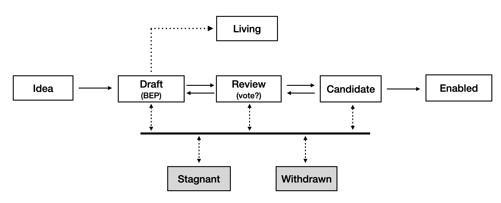

# BNB Application Proposals (BAPs)

## What is a BAP?

BNB Application Proposals (BAPs) are community-authored design documents that specify application-level standards, conventions, and best practices for the BNB Chain ecosystem. BAPs aim to improve interoperability and user experience across dApps, wallets, services, and tooling.

- Scope includes: token and NFT standards, wallet interaction flows, RPC/ABI conventions, indexer/query schemas, cross-dApp messaging, off-chain service interfaces, and other app-layer norms.
- BAPs are distinct from BEPs (BNB Evolution Proposals), which target protocol/consensus or node-level changes.

## BAP Workflow

BAP workflow follows the process described in [BEP-1](https://github.com/bnb-chain/BEPs/blob/master/BEPs/BEP1.md#4--bep-workflow).

The **Review** stage is central to BAPs and requires feedback from the community, especially from relevant ecosystem partners. Feedback can be provided in this repository or on the [BNB Chain Forum](https://forum.bnbchain.org/). PR status is maintained by the BAP editors, primarily the maintainers of this GitHub repository.

## BAP Format
The BAP format follows the [BEP format](https://github.com/bnb-chain/BEPs/blob/master/BEPs/BEP1.md#5--bep-format). Providing reference implementations is strongly recommended to clarify interface definitions.

### Numbering and File Naming

- Provisional PRs may use `BAP-xxxx.md`; a concrete number is assigned upon Acceptance.
- Place the file at `BAPs/BAP-<number>.md` with a clear, descriptive title.
