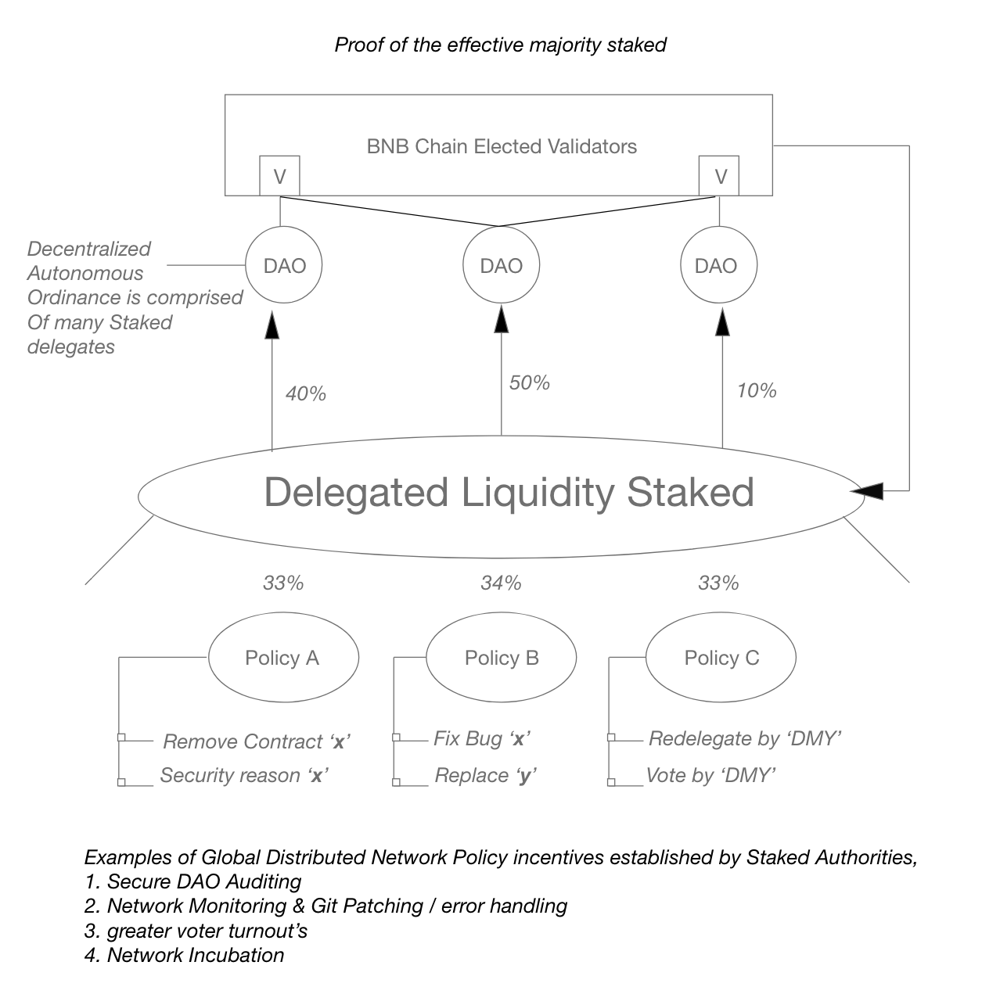

<pre>
  BEP: POEMS
  Title: Proof of the Effective Majority Staked
  Status: Pre-Draft
  Type: Standards
  Created: 2023-04-03
</pre>

# BEP-POEMS: Introducing Decentralized Autonomous Ordanances governed by 'Proof of the Effective Majority Staked'

- [BEP-POEMS: Introducing Decentralized Autonomous Ordanances governed by 'Proof of the Effective Majority Staked'](#bep-poems-introducing-decentralized-autonomous-ordanances-governed-by-proof-of-the-effective-majority-staked)
  - [1.  Summary](#1--summary)
  - [2.  Abstract](#2--abstract)
  - [3.  Motivation](#3--motivation)
    - [3.1.1 Delegated Liquidity for the Effective Majority "DAO's"](#311-delegated-liquidity-for-the-effective-majority-daos)
    - [3.1.2 Promotes Bright Web building practices](#312-promotes-bright-web-building-practices)
  - [4.  Status](#4--status)
  - [5.  Specification](#5--specification)
    - [5.1 POEMS Benefits](#51-poems-benefits)
      - [5.2 POEMS Three Core Priciples](#52-poems-three-core-priciples)
    - [5.3 POEMS Inspiration](#53-poems-inspiration)
    - [6.0 License](#60-license)

## 1.  Summary
The POEMS proposal advocates for the redelegation of Beacon BNB staked funds to BSC and a transition to "Proof of Effective Majority Staked," which would enable DAOs to authorize contracts and merge networks under a super authority, incentivizing them by allowing them to append blocks for network spend approval, and leading to a new approach to network policies on the chain.

## 2.  Abstract
This passage proposes a new governance model for the Binance Beacon Chain (BNB) as it transitions from Proof of Authority Stake (POAS) to Proof of Effective Majority Staked (POEMS). The proposal includes the addition of delegated liquid stake for delegation, allowing DAOs to authorize contracts to sign blocks after a certain threshold of network participants agree to sign for solicited validation. The proposal promotes the adoption of Bright Web ideologies, which promotes a more sustainable and fair marketplace for new Ethereum communities to enter the BNB ecosystem. The proposal aims to stop validators from purging blocks during the network's state transition and allows for a network ruled by DAOs, rather than validators, which can lead to different approaches to the way we think about network policies on the chain. The proposal also includes three principles: Evolution, Regeneration, and Effective delegation. These principles aim to improve network transformation, benefit all network participants, and promote effective delegation respectively.

## 3.  Motivation
The BEP proposal is motivated by a difficult question: "How can you regulate something that is inherently unregulatable, without giving too much power to a central authority?" This question is particularly relevant in the context of blockchain networks, where decentralization and self-governance are key principles. The proposal suggests implementing a new governance mechanism that would allow decentralized autonomous organizations (DAOs) to have authorized veto power over blocks produced by malicious validators or contracts on the Binance Smart Chain. This approach would help to further decentralize the network and give more power to the community to regulate itself, without relying on a centralized authority.

### 3.1.1 Delegated Liquidity for the Effective Majority "DAO's"
The proposal also introduces a new liquidity mechanic called "effective delegated stake" to incentivize users to merge their stake with BSC. This would enable DAOs to have a say in which contracts generate spend on the network, and not just the authorized validator nodes securing the network. By doing so, it would prevent validators from maliciously signing blocks and allow the DAO to stop validators from purging the network during state transition.

### 3.1.2 Promotes Bright Web building practices
In addition, the proposal promotes the adoption of Bright Web ideologies and discourages the use of Dark Web IOT. This aligns with the Greenfield principles of promoting sustainability and environmental responsibility.

Overall, the proposal aims to promote a more decentralized network, where DAOs have a greater say in governance and all participants can sustain the network. By doing so, it would address the challenging question of regulating an unregulatable system without giving too much power to a central authority.

## 4.  Status
- This BEP is in Pre-Draft awaiting community feedback
- Would like to establish a BNB BEP distributed network policy that can incentivize ordinances to participate in authorized network policies offered by BNB Network Authorities (ie: elected validators)
## 5.  Specification

*Figure 1: POEMS General Concept*

### 5.1 POEMS Benefits
1. **Delegated Liquidity:** Beacon delegators will have a greater interest in redelegating their stake if there is shared liquidity to be earned on top of the interest they already earn for delegating to validators.

2. **Avoiding the Purge:** This approach eliminates the potential for a purge event, where untrustworthy validators in the long term future decide to authorize the destruction or complete detachment from staked BNB, i.e., the BNB Beacon Chain, zkBNB, Greenfield ect...

3. **Majority ruling:** This incentivizes the growth of DAO governance in conjunction with validator authority over approving blocks. By delegating governance to DAOs to approve contracts that include transactions in the block to be spent, this leads to a more trustworthy network and healthy participation among those who decide to delegate to the DAOs of their choice, similar to how clients delegate data to Greenfield. There’s a relationship with how network operations facilitate security among the majority of the ecosystem’s participants, making for a more effective protocol that can earn delegates more rewards for actively contributing to the chain for the public good.

4. **Sustainability:** It’s more rewarding long term for those who decide to create a DAO in order to delegate their stake to earn a greater interest for their investment (transaction fee + delegated liquid stake shares).

5. **Bright Net:** If DAOs have an incentive to earn an interest for their delegators by establishing trust for allowing certain contracts to approve spend on the chain, then they must govern the network to be more secure as well as transparent. This can make the BNB chain a "Greenfield" Smart Chain that actively pursues trustworthiness above all else.

6. **Greater Decentralization:** If DAOs have shared governance, they can eventually validate the network. If validators are seen to collude to attack the network, then the majority can vote to force the redelegation of stake to trustworthy validators.

7. **New mission and purpose:** If BNB wants to differentiate itself from "Binance," it needs to change the way funds are governed on-chain as well. If a supermajority is authorized by a few key players, the trust in the network will diminish. POEMS can help establish a new network policy that aligns with the future vision of the BNB’s opportunity to merge the network, benefiting both the delegators of the network and the supermajority authorities who generate yield for network activity. The pressure of authorizing any untrustworthy spending will be in the hands of the public, which will be an opportunity for BNB market makers to establish a new narrative for the BNB chain as a more fast and fair shared data economy. 

####  5.2 POEMS Three Core Priciples
1. **Evolution** - both supermajority and capital authority controls network transformation. 

2. **Regeneration** - there's greater/equal share in capital gains for all, and greater benefits for those who participate in securing the network as well as actively organizing the sustainability of the network.

3. **Effective delegation** - The way new tokens are delegated can mimic fundamental principles that reflect token distribution similar to Bitcoin, but now we can allow for a network to generate its own store of value, rather than a few key superpowers to facilitating the interpretation of a "store of value" (BNB). Delegation benefits the user, which promotes security and trust amongst participants who actively seek to transact more to establish truth which benefits the authority’s governing the network. It’s a win-win to be “effective” in a network, rather than being rich. 

### 5.3 POEMS Inspiration
* BNB Greenfield Whitepaper.
* Harmony Protocol’s  Effective Proof of Stake whitepaper.
* Proof of Authority Stake outlined by VeChain and Binance Beacon Chain.
* Delegated Proof of Stake,  adopted by Tezos and Cardano.
* NEAR protocol’s white paper that highlighted the rationale for  liquid delegated stake;  how governance is more fair if validation and community both reward each other for the fair transaction throughput / trustworthiness on chain.

### 6.0 License
The content is licensed under [CC0](https://creativecommons.org/publicdomain/zero/1.0/).
