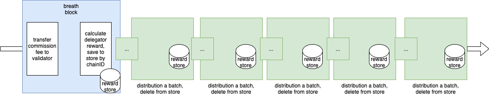

# BEP-128: Improve BNB Smart Chain Staking Reward Distribution

- [BEP-128: Improve BNB Smart Chain Staking Reward Distribution](#bep-128-improve-bnb-smart-chain-staking-reward-distribution)
  - [1. Summary](#1-summary)
  - [2. Abstract](#2-abstract)
  - [3. Status](#3-status)
  - [4. Motivation](#4-motivation)
  - [5. Specification](#5-specification)
    - [5.1 Overall Workflow](#51-overall-workflow)
    - [5.2 Distribution Batch Size](#52-distribution-batch-size)
    - [5.3 User Impact](#53-user-impact)
  - [6. License](#6-license)

## 1. Summary
This BEP describes a proposal to improve the BNB Smart Chain staking reward distribution mechanism on BNB Beacon Chain.

## 2. Abstract
Instead of distributing BNB Smart Chain staking rewards in a single block for each day, this proposal suggests distributing staking rewards in many consecutive blocks, to avoid heavy burden on any specific blocks.

## 3. Status
This BEP is a draft.

## 4. Motivation
Currently, the staking rewards of BNB Smart Chain are distributed in the first block of a day on BNB Beacon Chain (which is named breath block). With the increasing number of delegators (more than 50,000 nowadays), it will lead to a heavy load to breath block, and users' transactions/requests could be affected. Meanwhile, it could also be a bottleneck for further evaluation of BNB Beacon Chain. Thus, this proposal provides a solution to fix the issue and benefit the evaluation of BNB Beacon Chain in the long term.

## 5. Specification
### 5.1 Overall Workflow

The overall distribution processes work like this:
 - In breath block, validators' commission fee will be distributed, all delegators' rewards will be saved to a separate store.
 - Delegators' reward will be distributed in batches in the following blocks.

### 5.2 Distribution Batch Size

Distribution batch size controls how many delegators will receive reward in a single block. It should be evaluated and adjusted to make sure:
 - The reward distribution must finish within one days, which means the batch size should not be too small.
 - It should not be too big to bring heavy load on a single block.

At the same time, this batch size can also be governed.

### 5.3 User Impact

The impact to general users (i.e., delegators) is that their rewards will be delayed a bit after applying this proposal. However, the delay is relatively small and can be ignored compared to the whole delegation process. Taking the current delegation volume as an example, about 50,000 rewards are distributed, with batch size equals to 100, then at the worst case the delay is 3~4 minutes (500 blocks).

## 6. License
The content is licensed under [CC0](https://creativecommons.org/publicdomain/zero/1.0/).

