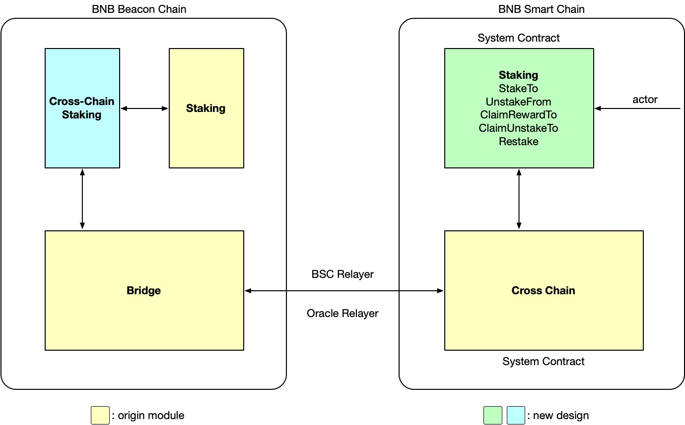
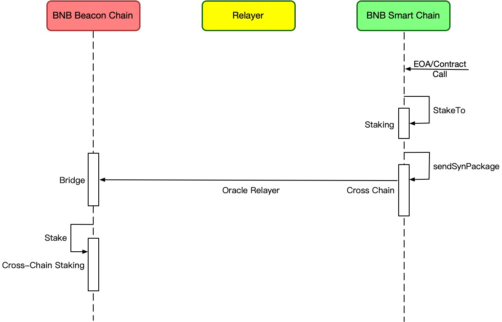
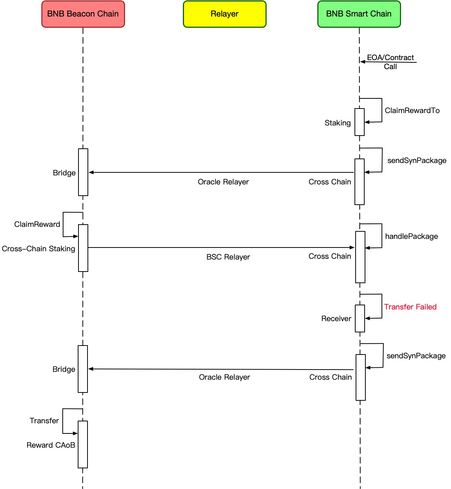

# BEP-153: Introduce Native Staking on BSC

- [BEP-153: Introduce Native Staking on BSC](https://github.com/bnb-chain/BEPs/pull/153)
  - [1. Summary](#1-summary)
  - [2. Abstract](#2-abstract)
  - [3. Status](#3-status)
  - [4. Motivation](#4motivation)
  - [5. Specification](#5-specification)
    - [5.1 Overview](#51-overview)
    - [5.2 Staking System Contract](#52-staking-system-contract)
      - [5.2.1 Cross-Chain Stake Event](#521-cross-chain-stake-event)
      - [5.2.2 Staking System Contract APIs](#522-staking-system-contract-apis)
    - [5.3 Cross-Chain Staking APP](#53-cross-chain-staking-app)
      - [5.3.1 Staking](#531-staking)
      - [5.3.2 Contract Address on BC(CAoB)](#532-contract-address-on-bccaob)
    - [5.4 Fees](#54-fees)
    - [5.5 Error Handle](#55-error-handle)

## 1. Summary

This BEP introduces a native staking protocol onto BNB Smart Chain. With this BEP, individual or institution delegators can stake BNB to specified validators and get staking rewards on the BSC side directly.

## 2. Abstract

This BEP introduces a new staking system contract on the BSC side, all staking-related operations on the BSC side should be initiated through this contract, and then applied across-chain to BNB Beacon Chain through the cross-chain communication mechanism. The cross-chain staking APP on the BNB Beacon Chain side reuses the previous staking mechanism to handle these staking-related operations. 

The goals of this BEP is:

- For decentralized applications (dApps), they can launch their own staking services on the BSC side base on this protocol;
- For individuals, they can either directly stake their BNB on BC, or stake on the BSC side through the staking services provided by institutions, or through the staking system contract directly .

## 3. Status

This BEP is a draft.

## 4.Motivation

Before this BEP, the BNB holders can only stake their assets on the BNB Beacon Chain side, which means that if their assets are on the BNB Smart Chain Side, they should cross-chain their assets to the BNB Beacon Chain first, which is not user-friendly enough.

With this BEP, the BNB holders can stake on the BSC side directly, and institutions can launch their staking service based on the protocol introduced by this BEP, which can enrich the BSC ecosystem.

## 5. Specification

### 5.1 Overview

There are mainly four components:

1. Staking System Contract: A newly designed system contract in charge of handling staking requests on BSC.
2. Cross-Chain Communication: Existing cross-chain infrastructures including cross chain contract, relayer and oracle module on BC.
3. Cross-Chain Staking APP: A newly designed app on BC in charge of handling cross-chain staking requests.
4. Staking Module on BC: Existing infrastructure in charge of BC’s staking delegation.

### 5.2 Staking System Contract

This is a new system contract deployed on BSC. It fulfills all the basic functionalities of staking service including staking, unstaking, claiming reward and restaking. It helps with receiving requests, encapsulating data and sending cross-chain packages. Specifically, the cross-chain package is normalized as a Cross-Chain Stake Event as below.

#### 5.2.1 Cross-Chain Stake Event

The Cross-chain stake event will be emitted once a cross stake tx happens on BSC. It is mainly composed of channel ID and payload data.

The payload data is a sequence of RLP encoded bytes of {eventType, params}.

- eventType: uint8, will determine the corresponding function that handles staking requests, and so determine how to decode the data. It includes belows.    

| Code  | 0x01  | 0x02    | 0x03        | 0x04         | 0x05    |
| ----- | ----- | ------- | ----------- | ------------ | ------- |
| Event | Stake | Unstake | ClaimReward | ClaimUnstake | Restake |

- params: different requests have different parameters including but not limited to staking amount, validator and so on.

#### 5.2.2 Staking System Contract APIs

- StakeTo(address validator, uint256 amount) payable

 The function of this method includes receiving BNB, emitting cross-chain events, cross-chain transferring the BNB and delegating to the validator. Here, the validator param represents the BC operator address of the choson validator. The following graph represents the workflow of staking on BSC:

- UnstakeFrom(address validator, uint256 amount) payable

 The function of this method is emitting a cross-chain event to undelegate the staked BNB on the validator of the msg.sender. The staked BNB on BC will be unlocked after 7 days and transferred to the unstake CAoB(see below). Here, the validator param represents the BC operator address of the choson validator.

- ClaimRewardTo(address receiver, uint256 _oracleRelayerFee) payable

The function of this method is sending the balance of the corresponding reward CAoB to the receiver. CAoB means Contract Address on BC. It’s a hash mapping of a BSC address(see 5.3.2). The following graph represents the workflow of claiming reward on BSC:

- ClaimUnstakeTo(address receiver, uint256 _oracleRelayerFee) payable

 Send the balance of the corresponding unstake CAoB to the receiver. 

- RestakeTo(address validator, uint256 amount) payable

Restake amount BNB from reward CAoB to the validator. Amount == 0 means all balance.

### 5.3 Cross-Chain Staking APP

This is a new cross-chain app on BC side. It will be called by the BC’s bridge once it receives cross-chain staking event packages. The main function of this app is to parse the data and do the staking related tasks.

#### 5.3.1 Staking

The native staking mechanism on the BC will stay almost the same as before. The only change is that the delegation will be tagged as native or not native(cross-chain). The Cross-Chain Staking app will decode the cross-chain package depending on the event type code and call corresponding functions.

#### 5.3.2 Contract Address on BC(CAoB)

The delegator’s address on the BC will be a map hash of its BSC address. So no one could control it except for the cross-chain app. The map rules are as follows:

- The delegate address, that is the **unstake CAoB**, is calculated by sha256("Staking Delegator Anchor") ^ BSC Address.
- The **reward CAoB** is calculated by sha256("Staking Reward Anchor") ^ BSC Address.

### 5.4 Fees

The fees charged for the relevant transactions are based on the following principles:

- For one-pass cross-chain communication(stake, unstake, restake), the gas shall be paid by the msg sender at once;
- For two-pass cross-chain communication(claimReward, claimUnstake), all the gas shall be paid by the tx’s msg sender too. If something wrong happened on BC, the tx on BSC will not be reverted and the user will get a message of the failed reason. The user’s funds will be returned the same way.
- For the failed tx, the fee will be charged from the system reward account.

### 5.5 Error Handle

Due to the involvement of the cross-chain process, the staking’s transactions are not atomic. For the safety of funds, error handles are specified here.

#### 1) Regular error

For regular errors like no reward to claim, there will be a failAckPackage returned by the BC. The staking system contract will emit an event that describes the failed reason.

#### 2) The validator does not exist

If the validator does not exist, the asset will be transferred back to the msg sender on BSC. If the msg sender’s account is not a payable address, then the asset will be lost forever.

#### 3) The receiver is not a payable contract or EOA

If transfer fails, the asset will be transferred back to the user’s unstake/reward CAoB on BC, and the user can claim it to another payable address later.

