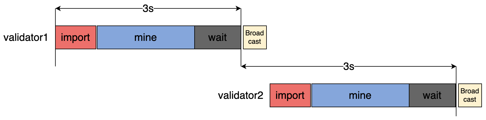
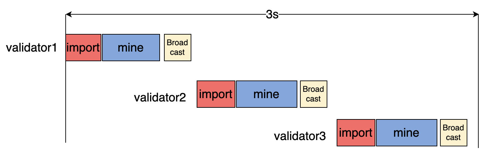
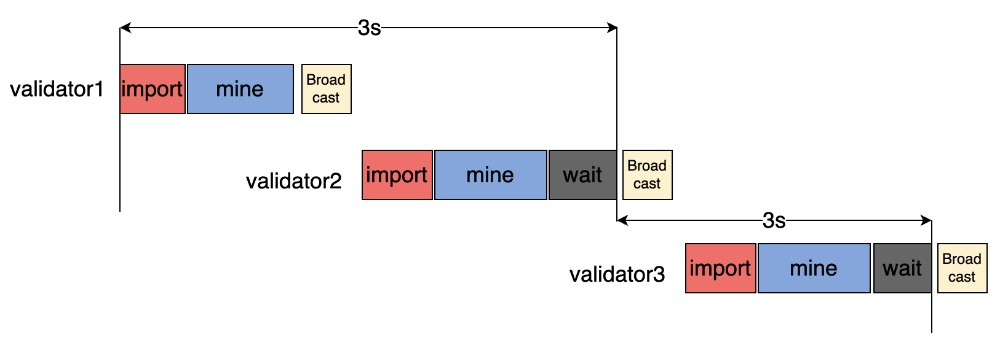
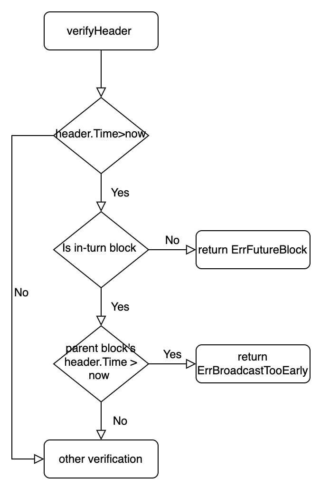

<pre>
	BEP: 188
	Title: Early Broadcast Mature block for in-turn validators
	Status: Draft
	Type: Standards
	Created: 2022-01-12
</pre>

# BEP-188: Early Broadcast Mature block for in-turn validators.

- [BEP-188: Early Broadcast Mature block for in-turn validators.](#bep-188-early-broadcast-mature-block-for-in-turn-validators)
  - [1. Summary](#1-summary)
  - [2. Motivation](#2-motivation)
  - [3. Specification](#3-specification)
    - [3.1 Broadcast strategy](#31-broadcast-strategy)
    - [3.2 consensus engine adaption](#32-consensus-engine-adaption)
  - [4. Backward Compatibility](#4-backward-compatibility)
  - [5. License](#5-license)
  
## 1. Summary 

This BEP introduces a new block broadcast strategy for validators to improve the network capacity and stability.  

## 2. Motivation

Currently, a mined block will not be broadcasted until the timestamp header.Time is reached, even though the mining process is finished. If an in-turn validator spends too much time in the importing phase, it may not have enough time to mine its own block. In extreme cases, it could generate an empty block or even miss its block. This could be a challenge to the stability of the blockchain.With this BEP, validators could begin to import a block earlier and have more time to mine a new block.

## 3. Specification

### 3.1 Broadcast strategy 

The current block production process is roughly shown in the figure below:

As we can see, even though a block was mined before header.Time, it will delay to be broadcasted after header.Time. Then the next in-turn validator starts importing and mining after it receives the block. Actually, a block mined by the in-turn validator can be broadcast as soon as the mining process is finished to let other validators start importing in advance.
But if we early broadcast without limit, the block production process may be like the figure below in case each validator finished mining very quickly because they ran out of gas.

In this case, more than one block was mined in one block production cycle, which will break the current rule.Let’s see how it works if we limit the block broadcast time to after its parent’s header.Time under the same condition. 

Block N finished mining in advance because it ran out of gas and then broadcast without delay.Block N+1 also finished in advance and before blockN.header.Time, but it must delay broadcast to be after blockN.header.Time. In this way, the block production speed won’t be too quick to break the rule.
In summary, when a block mined by an in-turn validator, if time is after its parent block’s header.Time, broadcast it without delay.time is before its parent block’s header, broadcast it when the parent block’s head.Time is reached.

### 3.2 consensus engine adaption 

The current consensus engine of the BNB chain does not accept future blocks, which means BSC nodes will reject the block if it is received earlier than its timestamp defined in header.Time. So we need to change the header’s verification logic in the consensus engine as well.
As the broadcast strategy changes, the logic of verifyHeader must be changed accordingly.The new logic should be like this shown in the figure below.

## 4. Backward Compatibility

In order to ensure the compatibility of the network, we should upgrade the changes with the strategy as follows:

* Upgrading consensus changes with a hard fork first.

* Then upgrading the broadcast strategy after the hard fork.
## 5. License 

The content is licensed under [CC0](https://creativecommons.org/publicdomain/zero/1.0/).