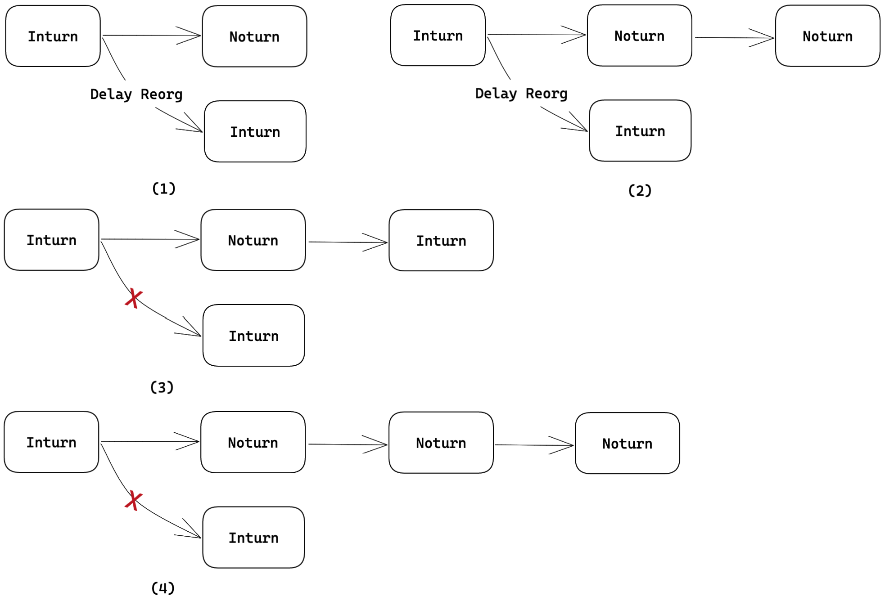
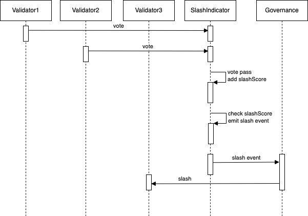

<pre>
  BEP: 191
  Title: Introduce a two-phase slash and new block difficulty to BSC
  Status: Draft
  Type: Standards
  Created: 2022-01-17
</pre>

# BEP-191: Introduce a two-phase slash and new block difficulty to BSC

- [BEP-191: Introduce a two-phase slash and new block difficulty to BSC](#bep-191-introduce-a-two-phase-slash-and-new-block-difficulty-to-bsc)
    * [1. Summary](#1-summary)
    * [2. Abstract](#2-abstract)
    * [3. Motivation](#3-motivation)
    * [4. Specification](#4-specification)
        + [4.1 Block Difficulty](#41-block-difficulty)
        + [4.2 New Punishment Rules](#42-new-punishment-rules)
        + [4.3 Delay Broadcast](#43-delay-broadcast)
        + [4.4 System Transaction](#44-system-transaction)
        + [4.5 Persistence](#45-persistence)
    * [5. Rational](#5-rational)
    * [6. Backward Compatibility](#6-backward-compatibility)
    * [7. License](#7-license)

## 1. Summary

This BEP introduces a two-phase slash mechanism and new block difficulty to improve  BSC's network stability.

## 2. Abstract

There are some malicious behaviors in the BSC, which will damage the interests of the entire network, or be harmful to the smooth operation of the network. Of course, there are currently some methods to punish malicious behaviors in certain scenarios, but they are far from enough. Some other malicious behaviors , still affect network stability and overall interests. This BEP introduces a new slash mechanism to slash malicious validator in more scenarios.

There are some slash scenarios:

1. The validator misses the `INTURN` block, which has been covered by the current BSC slash mechanism;
2. The validator proposes a duplicated block in the same block height with a different block hash, which has been covered by the current BC slashing mechanism;
3. The validator delay broadcast `INTURN` block too long, not covered;

In new slash mechanism, validators could propose a slash to the malicious validator, and when the majority of validators agree on it, it will be accumulated to `SlashScore`, then the malicious validator will be punished through the two-stage slash method. This BEP aims to introduce a new mechanism for some punishment scenarios that need to be solved urgently. This mechanism can also be used in other scenarios in future.

On the other hand, BEP-191 uses a new block difficulty to improve network stability in the case of unstable nodes or malicious delay broadcasts, and avoid frequent reorg.

This BEP will promote good competition among validators, and protect the security and smooth operation of the network.

## 3. Motivation

The current BSC network has imposed some slash penalties on validators who missing block proposal, double-sign block, but this is not enough. After observing the behavior of validators in the entire network, it is found that some validators have the behavior of delaying the broadcast of blocks, which seriously damages the stable operation of the network and even damages the interests of other validators. The possible situations are as follows:

1. Poorly operated validator clients may use poor machines or network providers;
2. Maliciously delay broadcasting blocks, in order to collect more transaction fees as rewards;

These behaviors have seriously affected the stability of the network, but they will not be punished now, because the validator's `INTURN` block in BSC's PoSA algorithm has a higher difficulty. Not in line with the interests of the current BSC's long-term operations:

1. Frequent network reorgs cannot guarantee a stable TPS;
2. Collect more transactions during the delayed broadcast period to obtain higher returns, resulting in uneven returns and harming the rights and interests of other validators;

The punishment proof submitted by the validator can be divided into provable evidence and unprovable evidence. For provable evidence, such as double-sign, missing block proposal, etc., the submitted slash to the chain can reach a consensus through evidence or on-chain data verification, and it can be punished immediately.

For unprovable evidence, such as delay broadcast, no one can generate a valid proof, so a new mechanism needs to be introduced. This BEP through a two-phase slash mechanism and new block difficulty to limit the validator to package transactions for a longer period of time, or to use a poor network and machine to run the validator node.

## 4. Specification

In BSC's PoSA algorithm, the set of selected validators generates blocks in certain sequence and broadcasts them to the network instantly, every full node will verify it and check if apply it into world state.

The blocks released in the order of block generation are called `INTURN` blocks, and the block difficulty is 2. In order to ensure liveness, if there is a validator failure, network delay, or a malicious block, other validators will re-generate a liveness block. This block is called `NOTURN` Block, block difficulty is 1, and at this time the validator of the supposed block will mark a slash. If the supposed validator has proposed in recent N/2 Blocks, the penalty will be ignored.

However, since the `INTURN` block is more high priority than the `NOTURN` block, the current chain will be reorg in some scenarios. First of all, you need to consider the reorg scenarios in the current BSC.



As shown in the figure above, Scenario 1 and Scenario 2 will reorg the current chain after the supposed validator delays releasing blocks.

However, when the current chain continues to generate blocks and accumulate higher difficulty, the delayed release of the `INTURN` block cannot reorg the current chain.

Of course, some collusion situations or corner cases will trigger reorg too, but the new scheme will record delayed or repeated block generation. The new slash mechanism will ensure the good operation of the network.

### 4.1 Block Difficulty

In BSC, `INTURN` blocks have a higher priority, and one `INTURN` block can reorg two `NOTURN` blocks, because under the same difficulty, the height of `INTURN` blocks is smaller.

The current difficulty of `INTURN` and `NOTURN`:

```bash
INTURN = 2, NOTURN = 1
```

When the weight of `NOTURN` could be slightly increased, this scenario could be improved. The new difficulty options are as follows:

```bash
INTURN = 3, NOTURN = 2
```

The impact of diff changes on reorg can be simulated through the library [diff-simulation](https://github.com/goerli/diff-simulation), and it can be observed that the new difficulty value has fewer reorg times.

### 4.2 New Punishment Rules

Before describing the specific slash scenario, it is necessary to define a new penalty rules. Due to relying on honest nodes to judge the validator malicious behavior through voting, in order to give validators the opportunity to appeal and avoid misjudgment in extreme scenarios, a two-stage slash mechanism is designed.

In the first stage, the voting malicious behavior from all validators is completed throught system transaction. The second stage is to confirm and apply punishment in off-chain governance. The new penalty rules are as follows:

1. The new punishment rules use a point system, 100 points are a basic slash count, each validator has a statistical state `SlashScore`, and each slash report is rated on a scale of 0-100;
2. Accumulated more `SlashScore` indicates that the validator has more potential malicious behaviors. When `SlashScore / 100 >= 50`, a `votingMisdemeanor` event will be triggered to inform the network that the validator needs to be considered for slashing;
3. When `SlashScore / 100 >= 150`, a `votingFelony` event will be triggered to inform the network that it is necessary to consider slashing and remove from network;
4. When updating BSC's ValidatorSet, a `VotingSlashScores` event will be triggered to record the slash scores of all current validators, then clean the slash data;
5. All voting events are collected by the off-chain governance module, which will apply punishment. If there is any misjudgment or appeal, it will be judged in off-chain;

In particular, off-chain governance is not within the scope of this BEP design. BEP-191 supervises and restricts the behavior of malicious validators through a two-stage mechanism. Specific off-chain governance decisions and execution can punish validator at any time based on on-chain data. Of course, we will continue to explore the possibility of instant punishment for voting slash.

### 4.3 Delay Broadcast

Delayed broadcast is the malicious behavior that this BEP focuses on solving. Consider using the validator proposing, all validator set voting mechanism to determine whether to slash the validator.

Delay Broadcast is for the `INTURN` block, and the supposed validator will be directly punished when majority validator agree on.

Specifically, the validator can judge that the current supposed validator has a delayed broadcast based on the block timestamp of the received `INTURN` block and the block arrival timestamp. Assuming that most of them are honest nodes.

1. Each validator needs to cache the block generation status of nearly 21 block heights, and the historical blocks with a height of more than 21 blocks will be eliminated;
2. When receiving an `INTURN` block with a height `H`, first verify whether the block timestamp meets expectations, and then calculate the `DelayTime`:

```bash
DelayTime = receiveTime - parentBlockTime - blockPeriod; 
//readjustment DelayTime
if DelayTime < initialBackOffTime: 
    DelayTime = 0 
if DelayTime > 2 * (blockPeriod + wiggleTime)
    DelayTime = 2 * (blockPeriod + wiggleTime)
ReportSlashScore = DelayTime * 100 / (blockPeriod + initialBackOffTime)
```

> The first `INTURN` block of height H is expected to be broadcast to the network at `parentBlockTime + blockPeriod + initialBackOffTime` time.
>
> The current blockPeriod is 3s, initialBackOffTime is 1s, and wiggleTime is 1s.
>
> Because of network delay, network jitter or burst traffic, there will be a some tolerance range. For example, it is still acceptable to broadcast within 1s. If the validator maliciously delays about 1s to package more transactions, there is no room for tolerance at this time , the validator is likely to be punished.
>
> Therefore, if the delay is less than `initialBackOffTime`, there is no need to vote for Slash. At the same time, assuming that BSC will generally not reorg more than 2 blocks, the maximum delay time is `2 * (blockPeriod + wiggleTime)`.
> 
> All times with millisecond precision.

3. If `ReportSlashScore > 0`, record that the current supposed validator needs to be punished at height H, and waitting to vote;
4. When it is the validator's turn to produce a block, collect all the delay broadcast records that need to be punished and submit `ReportSlashScore` to the `SlashIndicator` contract in batches:
   - Check if records between block `H1` and `H2`, `H1` is last producing block, `H2` is current block;
   - If the validator `V` has already taken effect at the height of delay broadcast slash or missing block slash, skip it;
   - If the slash is correct and the cumulative `voteCount > N*2/3`, that means majority found delays, then cumulative `SlashScore`:
    ```bash
   SlashScore += Median(ReportSlashScores)
   ```
    - Check if emit `votingMisdemeanor`, `votingFelony`;

If it is satisfied that the majority thinks that a certain validator has delayed broadcasting behavior, it is necessary to accumulate `SlashScore`. If the delay time is long enough to continue to produce blocks, the penalty for delayed broadcast is the same as the missing block, and less delay will accumulate fewer points, and it will not be punished in the end.

The following figure is the timing diagram of two nodes voting for validator3 in the case of three validators.



### 4.4 System Transaction

The BEP-191 uses validator's proposal block to add a system transaction to complete the validator malicious behavior voting. Current system transactions have the following characteristics:

1. Reserve enough gas limit;
2. gas price = 0；
3. Transaction construction and verification can be completed in the full node according to the protocol definition, that is to say, the system transaction is deterministic;
4. The sender of the transaction must be the block proposer;

In particular, the voing slash mechanism submits transaction through the local monitoring data, which will break the above condition 3. Therefore, a new system transaction needs to be added, which is called user-defined system transaction. The previous system transaction is called deterministic system transaction.

User-defined system transaction needs to meet the following characteristics:

1. Reserve enough gas limit;
2. gas price = 0；
4. The sender of the transaction must be the block proposer;
5. The transaction execution must be successful, and the contract needs to strictly verify the input parameters;
6. The order is after the deterministic system transaction;
7. Currently the transaction can only invoke voting slash method, with 0 value;

The user-defined system transaction will check the validity of the data on chain, and the on-chain contract on the chain will trigger `revert` for wrong data, such as too large input data, invalid parameters, repeated calls, etc.

More scenarios of user-defined system transactions in future could add the whitelist of calling contracts, or route invocation through specific entry contract.

### 4.5 Persistence

The purpose of this BEP is to complete the slash of validators by means of majority approval through mutual supervision among validators. Of course, there is a risk of data loss in memory, and nodes that join in the middle may not have enough evidence to participate in voting, but this BEP will not introduce a persistence mechanism to ensure that the behavior of malicious nodes will finally be punished through this mechanism, adding additional complexity Persistence is not necessary for now.

However, this BEP will record malicious behavior and on-chain transactions as logs, such as block headers, input parameters, etc. It is used for the optimization reference of the subsequent slash mechanism and the reference of off-chain penalty verification.

## 5. Rational

There are some other important things to consider:

1. Does the penalty record need to be persisted? At present, it is not necessary, and it is not a big problem to omit some evidence submission due to node maintenance or failure;
2. If there is a node rotation in epoch, the voting in progress may be invalidated. It is recommended that the number of nodes replaced each time should not exceed `N/3`;
3. Whether malicious voters need to provide proof, assuming that most of them are honest nodes, this is not necessary;
4. Missing block punishment and Delay Broadcast generally do not exist at the same time. Duplicated Block may exist at the same time as Missing block or Delay Broadcast, recording multiple punishments of a certain validator at a height;
5. Of course, the new punishment mechanism introduced by this BEP is also applicable to other slash scenarios, which can continuously enrich the supervision of validator set and network health management;

## 6. Backward Compatibility

This BEP needs a new hard fork, it needs to upgrade `SlashIndicator` system contract, and add monitoring validator malicious behaviors.

## 7. License

The content is licensed under [CC0](https://creativecommons.org/publicdomain/zero/1.0/).