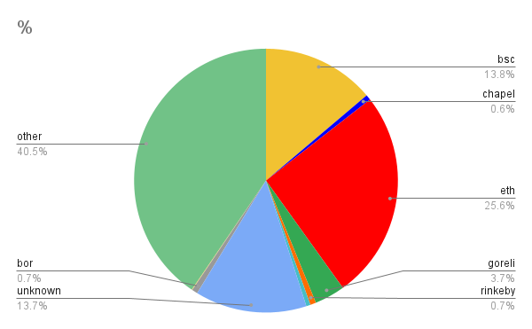

<pre>
  BEP: 194
  Title: Node Discovery ENR filtering
  Status: Draft
  Type: Standards
  Created: 2023-02-01
  Author: Matus Kysel
</pre>

# BEP 194: Node Discovery ENR filtering

- [BEP 194: Node Discovery ENR filtering](#bep-194-node-discovery-enr-filtering)
  - [1.  Summary](#1--summary)
  - [2.  Motivation](#2--motivation)
  - [3.  Specification](#3--specification)
  - [4.  Reference](#4--reference)
  - [5.  License](#5--license)


## 1.  Summary

This BEP introduces node discovery filtering based on ENR records on the BNB Smart Chain.

##  2.  Motivation

Current implementation of discovery protocol is chain agnostic and does not differentiate between different chains (ETH, BSC, ...). The discover protocol currently gossips peers from networks with different chain ids. This causes a pretty significant slowdown during peer discovery.


*Figure 1: Current node distribution on BSC mainnet*

From Figure 1 we can see, that new nodes have a 2x higher probability finding Ethereum nodes rather than BNB Smart Chain nodes.

## 3.  Specification

Node discovery protocol uses distributed hash tables (DHTs) that are exchanged between nodes via p2p. We will introduce a new filtering step that will filter out nodes before insertion to the table based on their ENR records.

```
// Record represents a node record. The zero value is an empty record.
type Record struct {
   seq       uint64 // sequence number
   signature []byte // the signature
   raw       []byte // RLP encoded record
   pairs     []pair // sorted list of all key/value pairs
}
```
*Code 1: Current ENR record structure layout*


ENR record consists of key-value pairs. One of these key-value pairs is the `eth` key which has a genesis hash value. Based on genesis hash we can filter out nodes that are running a different chain id.

```
func (eth *Ethereum) currentEthEntry() *ethEntry {
   return &ethEntry{ForkID: forkid.NewID(eth.blockchain.Config(), eth.blockchain.Genesis().Hash(),
       eth.blockchain.CurrentHeader().Number.Uint64())}
}
```
*Code 2: eth entry generation function*

We would introduce new flag for `boot-nodes` :

- `-network <bsc/chapel/rialto>` filters nodes by "eth" ENR entry


## 4.  Reference

ENR: <https://github.com/ethereum/devp2p/blob/master/enr.md>

Node Discovery Protocol:  <https://github.com/ethereum/devp2p/blob/master/discv4.md>

##  5.  License

All the content are licensed under [CC0](https://creativecommons.org/publicdomain/zero/1.0/).