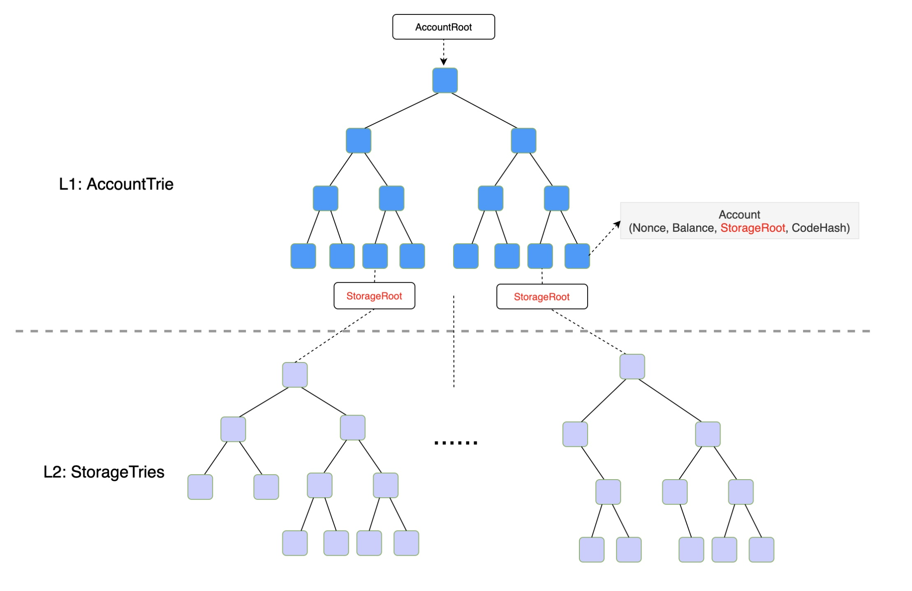
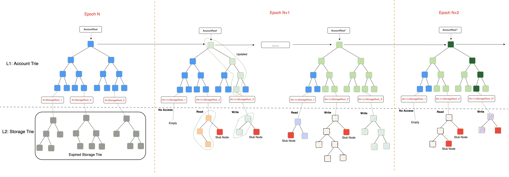
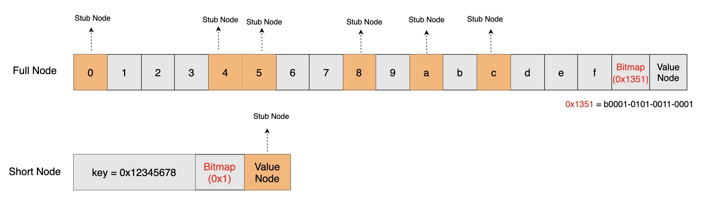

<pre>
  BEP: 205
  Title: Hybrid Mode State Expiry
  Status: Pre-Draft
  Type: Standards
  Created: 2023-02-24
  Discussions: https://forum.bnbchain.org/t/bep-idea-state-expiry-on-bnb-chain/646/3
</pre>

# BEP-205: Hybrid Mode State Expiry

- [BEP-205: Hybrid Mode State Expiry](#bep-205-hybrid-mode-state-expiry)
  - [1. Summary](#1-summary)
  - [2. Motivation](#2-motivation)
  - [3. Specification](#3-specification)
    - [3.1.Hierarchy View](#31hierarchy-view)
      - [a.MPT Tree Mode: Single](#ampt-tree-mode-single)
      - [b.MPT Tree Mode: Hybrid](#bmpt-tree-mode-hybrid)
      - [c.Expired Storage Trie](#cexpired-storage-trie)
    - [3.2.The Components](#32the-components)
      - [a.Data Availability](#adata-availability)
      - [b.New Transaction Type](#bnew-transaction-type)
      - [c.Epoch](#cepoch)
      - [d.Epoch Storage Trie](#depoch-storage-trie)
      - [e.Stub Node](#estub-node)
      - [f.Witness Protocol](#fwitness-protocol)
      - [g.State Revive](#gstate-revive)
    - [3.3.General Workflow](#33general-workflow)
      - [a.How To Expire](#ahow-to-expire)
      - [b.How To Access KV In New Epoch](#bhow-to-access-kv-in-new-epoch)
      - [c.How To Revive State](#chow-to-revive-state)
    - [3.3.Other Approaches To State Expiry](#33other-approaches-to-state-expiry)
      - [a.Single Tree](#asingle-tree)
      - [b.Two Epoch Trees](#btwo-epoch-trees)
      - [c.Summary](#csummary)
  - [4.Rationale](#4rationale)
    - [4.1.Why Keep The L1 Account Trie](#41why-keep-the-l1-account-trie)
    - [4.2.Reasonable Epoch Period](#42reasonable-epoch-period)
  - [5.Forward Compatibility](#5forward-compatibility)
    - [5.1.Account Abstraction](#51account-abstraction)
    - [5.2.L2 Rollup: Optimism \& ZK](#52l2-rollup-optimism--zk)
  - [6.Backward Compatibility](#6backward-compatibility)
    - [6.1.Transaction Execution](#61transaction-execution)
    - [6.2.User Experience](#62user-experience)
    - [6.3.RPC API](#63rpc-api)
  - [7.  License](#7--license)

## 1. Summary

This BEP proposes a short-term solution to address the problem of increasing world state storage on the BNB Smart Chain, by removing expired storage state.

## 2. Motivation

Storage presents a significant challenge for many blockchains, as new blocks are continually generated, and transactions within these blocks could invoke smart contracts that also add more states to the blockchain.
A large storage size can cause several side effects on the chain, such as higher hardware requirements, increased network resources required for downloading and performing p2p sync, and performance degradation due to MPT write amplification.

Due to the high volume of traffic, the storage size on BSC grows very rapidly. As of the end of 2022, a pruned BSC full node snapshot file is approximately 1.6TB in size, compared to approximately 1TB just one year ago.

The 1.6TB storage consists mainly of two parts:
- Block Data (~2/3), which includes the block header, block body, and receipt;
- World State (~1/3), which includes the account state and KeyValue(KV) state.

The Ethereum community proposed EIP-4444 to address the first part, which is to prune old block data. However, EIP-4444 does not address the second part, which is more challenging.

There have been many discussions on how to implement state expiry, with one proposed solution involving the removal of EOA accounts, extension of the address space, and the use of Verkle Trees to reduce the witness size. However, implementing such a solution would be a significant undertaking that could have a substantial impact on the ecosystem, and may not be feasible in the short term. As BSC continues to face high traffic volumes, it is essential to develop a short-term solution for state expiry that can be implemented quickly, while still retaining the ability to upgrade to a long-term solution once it becomes available.

## 3. Specification

### 3.1.Hierarchy View
#### a.MPT Tree Mode: Single
The current MPT tree on BSC is a single tree composed of two trie trees, namely the L1 AccountTrie and L2 StorageTrie. The L1 account trie tree stores the account state, which includes the Nonce, Balance, StorageRoot, and Codehash for both EOA and Contract accounts. Each contract account also has its own L2 storage trie tree, which stores its KV state that is updated by the corresponding smart contract. The world state is accessed through this single-layered MPT tree.

#### b.MPT Tree Mode: Hybrid
This proposal introduces the concept of an "epoch," which refers to a period of time with a unit of blocks. The details of the epoch will be explained further later on.
With the epoch concept in mind, this proposal suggests the introduction of a hybrid MPT tree mode, where the L1 account trie tree will remain unchanged, while the L2 storage trie tree will be regenerated at the start of each epoch. In other words, the hybrid MPT tree consists of a single account trie and an epoch-based storage trie, as illustrated in the following diagram.

#### c.Expired Storage Trie
The BSC full node will only need to keep the L2 storage trie for the current epoch and the previous epoch. The L2 storage trie for older epochs will not be accessible and can be pruned.

### 3.2.The Components

#### a.Data Availability
The expired state will be kept by the DA for witness service, allowing users to revive their expired state. The details of data availability will not be covered in this proposal but can be provided by third-party projects such as the BNB Green Field project.

#### b.New Transaction Type
A new transaction type will be added, which can contain the witness. The EVM will be upgraded to support this new transaction type, along with an appropriate gas metering policy.

#### c.Epoch 
The epoch period is a key parameter for this proposal, and by default, it could be set to 2/3 years for the BSC mainnet. Given a BlockInterval of 3 seconds, the EpochPeriod would be calculated as follows: EpochPeriod = 365 * (2/3) * 24 * 60 * 60 / 3 = 7,008,000.

#### d.Epoch Storage Trie
The access to the storage trie in Epoch 0 will remain unchanged, and can be directly referenced by its storage root. However, starting from Epoch 1, it will be referenced by EpochIndex_StorageRoot, meaning that at the beginning of a new epoch, the storage trie will be empty. The state access in the new epoch will be updated to the new storage trie.

#### e.Stub Node
The MPT trie node will be extended to support stub nodes, which could have a bitmap to indicate whether the target position is expired or not.

#### f.Witness Protocol
Witness protocol will define the format of the witness and it will be defined in another BEP.

#### g.State Revive
If the missed state is from the previous epoch, the state revive process will be automatic and will place the state in the current epoch. However, if the missed state is from an even earlier epoch, the user will need to provide a witness to revive it.

### 3.3.General Workflow
#### a.How To Expire
In contrast to the single tree mode, the hybrid MPT tree mode does not require metadata. The BSC node only needs to keep the storage trie for the latest two epochs, and the KV slots in older epochs will automatically expire. As previously mentioned, there is only one global L1 account trie, so EOA accounts will not expire; only the KV slots of the L2 storage trie will be subject to expiration.

#### b.How To Access KV In New Epoch
Here are the three cases for accessing the state in the proposed hybrid MPT tree mode:
- case 1: if the state has already been accessed in the current epoch, it can be returned or updated in the current epoch tree.
- case 2: if the state was last accessed in the previous epoch, it will be automatically moved to the new epoch before it can be accessed. Once it is moved, it can be accessed in the same way as in case 1.
- case 3: if the state is cold data and has not been accessed in the current or previous epoch tree, it is expired. Trying to access expired state will cause the transaction to revert. To access the expired state, the user needs to revive it first.

#### c.How To Revive State
A new transaction type will be added, which contains witnesses to revive the state.
The full storage trie can be revived through several transactions, and if the witness is too large, partial revival will be supported.
Anyone can restore the data as long as they are willing to pay.

### 3.3.Other Approaches To State Expiry
There are several different approaches to handle state expiry, which can be classified based on how the 2-layered trie trees are managed.

#### a.Single Tree
Metadata will be added to record when a node is visited and when it will expire. With the single tree mode, there is only one global world state, so there will be less state revive conflict and it will be easy to revive the state. However, the additional metadata would increase storage costs and greatly impact performance if every state access needs to be recorded on the chain.

#### b.Two Epoch Trees
This approach involves regenerating both the L1 account trie and L2 storage trie in each epoch, providing a comprehensive solution for state expiry. However, there are still two unsolved issues to address: account resurrection conflict and witness size. Additionally, this approach has a significant impact on the ecosystem and relies on other infrastructure, such as address extension and Verkle trees.
#### c.Summary
| Mode           | Single Tree                | Two Epoch Trees                                                            | Hybrid Trees                                   |
| -------------- | -------------------------- | -------------------------------------------------------------------------- | ---------------------------------------------- |
| L1 AccountTrie | One Global Tree            | New Tree For Each Epoch                                                    | One Global Tree                                |
| L2 StorageTrie | One Tree For Each Contract | New Tree For Each Epoch                                                    | New Tree For Each Epoch                        |
| Cons           | 1.addition metadata cost   | 1.great impact to ecosystem 2.many challenges to support state revive | 1.incomprehensive                              |
| Pros           | 1.no resurrection conflict | 1.no metadata  2.friendly to Verkle Tree 3.comprehensive         | 1.no metadata  2.no resurrection conflict |

In summary, the Hybrid Tree mode proposed in this document offers a more practical solution for state expiry. In the long term, it could transition to the ideal Two Epoch Tree mode once it becomes available.

## 4.Rationale
### 4.1.Why Keep The L1 Account Trie
There are several reasons to keep it:
- The size of the L1 account trie is relatively small, constituting only around 4% of the L2 storage trie on BSC as of the end of 2022.
- The L1 account trie contains crucial information about user accounts, such as their balance and nonce. If users were required to revive their accounts before accessing their assets, it would significantly impact their experience.
- By retaining the L1 account trie, the witness verification process can be much simpler.

### 4.2.Reasonable Epoch Period
The state will expire if it has not been accessed for at least 1 epoch or at most 2 epochs. On average, the expiry period is 1.5 epochs. If we set the epoch period to represent 2/3 of a year, then the average state expiry period would be one year, which seems like a reasonable value.

## 5.Forward Compatibility
### 5.1.Account Abstraction
Account abstraction implementation will be impacted, as these accounts could be stored in the L2 storage trie and could be expired.

### 5.2.L2 Rollup: Optimism & ZK
Rollups could be impacted if the rollup transactions try to access expired storage.

## 6.Backward Compatibility
### 6.1.Transaction Execution
The current transaction types will be supported, but if the transaction tries to access expired storage, then it could be reverted.

### 6.2.User Experience
There are several changes that could affect user experience. The behavior of many DApps may change, and users will have to pay to revive their expired storage. If the revival size is very large, the cost could be expensive.

### 6.3.RPC API
Some of the APIs could be impacted, such as: getProof, eth_getStorageAt...

## 7.  License
All the content are licensed under [CC0](https://creativecommons.org/publicdomain/zero/1.0/).
