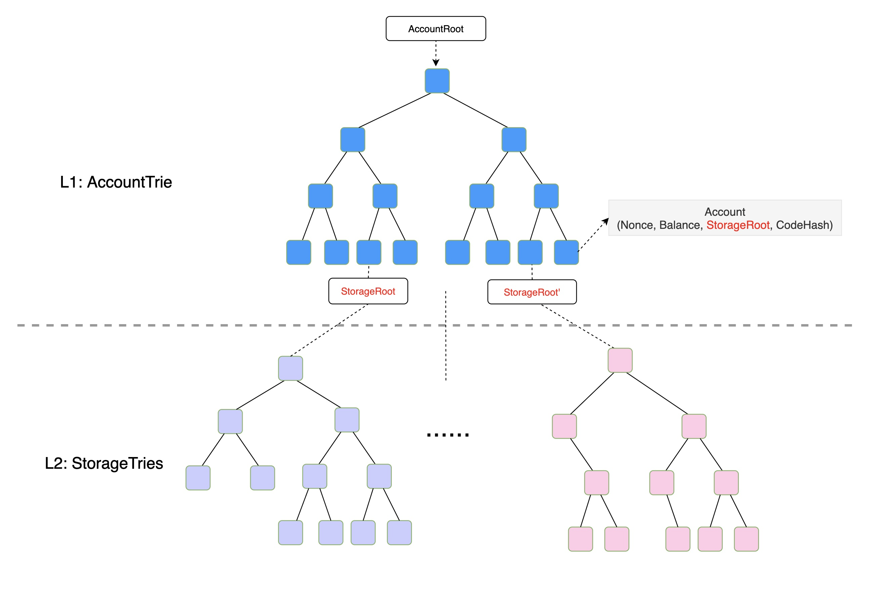
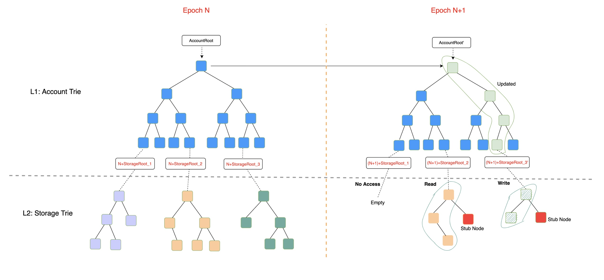
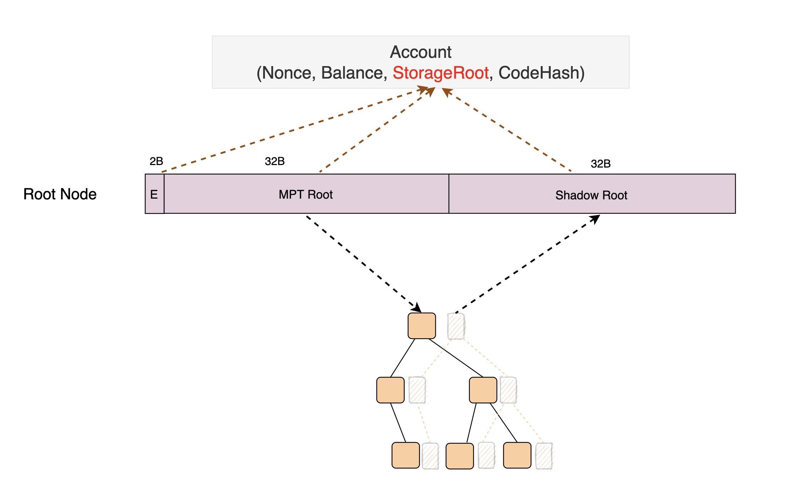
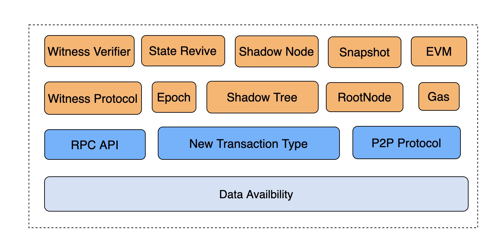
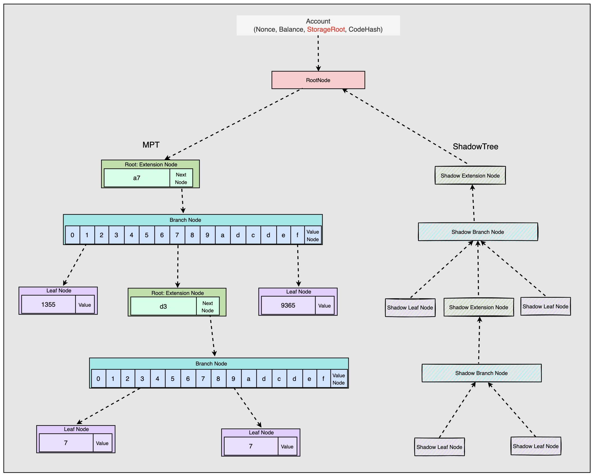
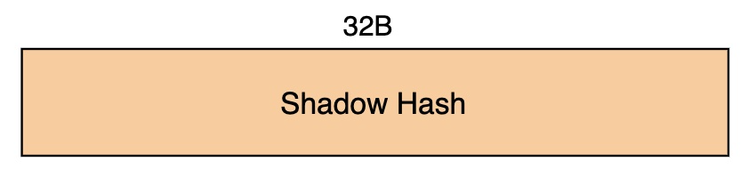
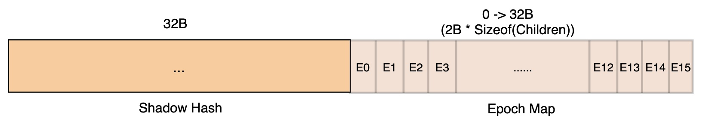
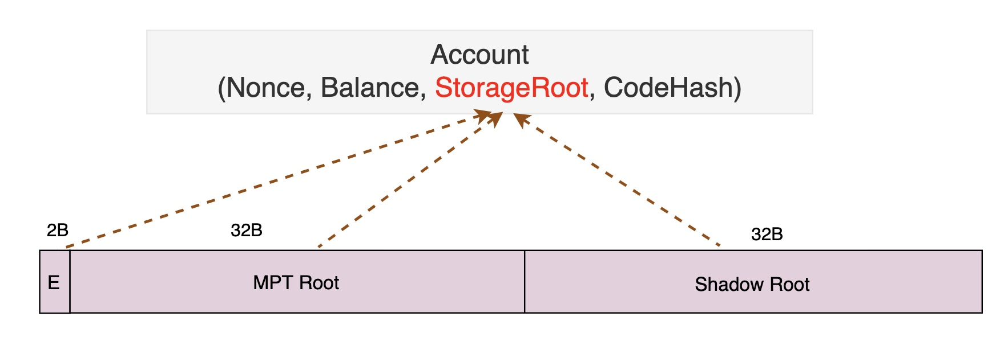

<pre>
  BEP: 206
  Title: Hybrid Mode State Expiry(v0.3)
  Status: Pre-Draft
  Type: Standards
  Created: 2023-02-24
  Discussions: https://forum.bnbchain.org/t/bep-idea-state-expiry-on-bnb-chain/646/5
</pre>

# BEP(v0.3): Hybrid Mode State Expiry
- [BEP(v0.3): Hybrid Mode State Expiry](#bepv03-hybrid-mode-state-expiry)
  - [1.Summary](#1summary)
  - [2.Motivation](#2motivation)
  - [3.Specification](#3specification)
    - [3.1.Hierarchy View](#31hierarchy-view)
      - [a.Current MPT Tree](#acurrent-mpt-tree)
      - [b.Hybrid MPT Tree](#bhybrid-mpt-tree)
    - [3.2.The Components](#32the-components)
      - [a.Data Availability](#adata-availability)
      - [b.New Transaction Type](#bnew-transaction-type)
      - [c.Epoch](#cepoch)
      - [d. ShadowTree \& ShadowNode](#d-shadowtree--shadownode)
        - [Shadow Leaf Node](#shadow-leaf-node)
        - [Shadow Extension Node](#shadow-extension-node)
        - [Shadow Branch Node](#shadow-branch-node)
      - [e.RootNode](#erootnode)
      - [f.Witness Protocol](#fwitness-protocol)
      - [g.State Revive](#gstate-revive)
    - [3.3.General Workflow](#33general-workflow)
      - [a.How To Expire](#ahow-to-expire)
      - [b.How To Access KV In New Epoch](#bhow-to-access-kv-in-new-epoch)
      - [c.How To Revive State](#chow-to-revive-state)
      - [d.Node Sync Mode: Light \& Full \& Snap](#dnode-sync-mode-light--full--snap)
  - [4.Rationale](#4rationale)
    - [4.1.Why Keep The L1 Account Trie](#41why-keep-the-l1-account-trie)
    - [4.2.Why Not Create A New L2 Storage Trie](#42why-not-create-a-new-l2-storage-trie)
    - [4.3.Reasonable Epoch Period](#43reasonable-epoch-period)
  - [5.Forward Compatibility](#5forward-compatibility)
    - [5.1.Account Abstraction](#51account-abstraction)
    - [5.2.L2 Rollup: Optimism \& ZK](#52l2-rollup-optimism--zk)
  - [6.Backward Compatibility](#6backward-compatibility)
    - [6.1.Transaction Execution](#61transaction-execution)
    - [6.2.User Experience](#62user-experience)
    - [6.3.Web3 API](#63web3-api)
    - [6.4.Snap Sync](#64snap-sync)
    - [6.5.Archive Node](#65archive-node)
    - [6.6.Light Client](#66light-client)
  - [7. License](#7-license)


## 1.Summary
This BEP proposes a practical solution to address the problem of increasing world state storage on the BNB Smart Chain, by removing expired storage state.

## 2.Motivation
Storage presents a significant challenge for many blockchains, as new blocks are continually generated, and transactions within these blocks could invoke smart contracts that also add more states to the blockchain.
A large storage size can cause several side effects on the chain, such as higher hardware requirements, increased network resources required for downloading and performing p2p sync, and performance degradation due to MPT write amplification.

Due to the high volume of traffic, the storage size on BSC grows very rapidly. As of the end of 2022, a pruned BSC full node snapshot file is approximately 1.6TB in size, compared to approximately 1TB just one year ago.
The 1.6TB storage consists mainly of two parts:
- Block Data (~2/3), which includes the block header, block body, and receipt;
- World State (~1/3), which includes the account state and Key/Value (KV) storage state.
The Ethereum community proposed [EIP-4444](https://eips.ethereum.org/EIPS/eip-4444) to address the first part, which is to prune old block data. However, EIP-4444 does not address the second part, which is more challenging.
There have been many discussions on how to implement state expiry, with one proposed solution involving the removal of EOA accounts, extension of the address space, and the use of Verkle Trees to reduce the witness size. However, implementing such a solution would be a significant undertaking that could have a substantial impact on the ecosystem, and may not be feasible in the short term. As BSC continues to face high traffic volumes, it is essential to develop a short-term solution for state expiry that can be implemented quickly, while still retaining the ability to upgrade to a long-term solution once it becomes available.


## 3.Specification
### 3.1.Hierarchy View
#### a.Current MPT Tree
The current MPT(Merkle Patricia Tries) tree on BSC is a single tree composed of two trie trees, namely the L1 AccountTrie and L2 StorageTrie. The L1 account trie tree stores the account state, which includes the Nonce, Balance, StorageRoot, and Codehash for both EOA and Contract accounts. Each contract account also has its own L2 storage trie tree, which stores its KeyValue (KV) state that is updated by the corresponding smart contract. The world state is accessed through this single-layered MPT tree.


#### b.Hybrid MPT Tree
This proposal introduces the concept of an "epoch," which refers to a period of time with a unit of blocks. The details of the epoch will be explained further later on.
With the epoch concept in mind, this proposal suggests the introduction of a hybrid MPT tree mode, where the L1 account trie tree will remain unchanged, while the L2 storage trie will have a new Shadow Tree which will keep the access record for the MPT tree. In other words, the hybrid MPT tree consists of a single account trie and an epoch-based storage trie, as illustrated in the following diagram.


The storage trie in Epoch 0 will stay unchanged, but since Epoch 1 the storage trie will have a new trie node type as its root: RootNode. It consists of 3 elements: EpochIndex, MPT Root and Shadow Root. 
EpochIndex: the latest epoch index in which the trie is accessed
MPT Root: same as the current MPT Root, it will pointer to the root trie node.
Shadow Root: the root hash of the shadow tree, which is used to record the access history of the storage trie


The RootNode and ShadowTree are very important in this proposal and the details will be revealed later.


### 3.2.The Components


#### a.Data Availability
The expired state will be kept by the DA for witness service, allowing users to revive their expired state. The details of data availability will not be covered in this proposal but can be provided by third-party projects such as the BNB Greenfield project.

#### b.New Transaction Type
A new transaction type will be added, which would contain the witness. The EVM will be upgraded to support this new transaction type, along with an appropriate gas metering policy.
There will be another BEP to explain the details.

#### c.Epoch 
The epoch period is a key parameter for this proposal, and by default, it could be set to 2/3 years for the BSC mainnet. Given a BlockInterval of 3 seconds, the EpochPeriod would be calculated as follows: EpochPeriod = 365 * (2/3) * 24 * 60 * 60 / 3 = 7,008,000.

#### d. ShadowTree & ShadowNode
Before introducing the new concepts of ShadowTree and ShadowNode, it is important to have a clear understanding of the layout of the [classical MPT](https://github.com/agiletechvn/go-ethereum-code-analysis/blob/master/trie-analysis.md#ethereum-mpt), which is depicted in the diagram below:


There are three types of nodes in the MPT tree: Branch Node, Extension Node and Leaf Node.
As the name suggests, ShadowTree is the shadow version of the MPT tree and is also comprised of three types of ShadowNode:
- ShadowBranchNode
- ShadowExtensionNode
- ShadowLeafNode
The Layout of the ShadowTree can be depicted as the following diagram:


Unlike the MPT tree, Shadow Tree is not a patricia tree, it can not be iterated by the Shadow Root. It is a shadow mapping to the MPT tree and can be accessed indirectly by the MPT tree.
The key to of the shadow node can be: ShadowKey =${TrieNodeHash}${suffix}, it is a combination of the corresponding trie node hash and a suffix. The client may need to keep the shadow node update record to support archive node or block rewind.

##### Shadow Leaf Node
The ShadowLeafNode is always nil, since it is the end of the path, no need to keep the metadata of its child.
```
type ShadowLeafNode struct {}
```

##### Shadow Extension Node
It has a single element: ShadowHash, which is calculated based on shadow information of its child.

```
type ShadowExtensionNode struct {
  ShadowHash *common.Hash
}

func (node *ExtensionNode) ShadowNode() ShadowExtensionNode {
  // to calculate the ShadowHash of a ShadowExtensionNode
  var shadowHash *common.Hash
  child := node.child
  if child.isLeafNode() {
    shadowHash = nil
  } else if child.isBranchNode() {
    branch := child.ShadowBranchNode
    shadowHash := Hash(branch.ShadowHash, branch.EpochMap)
  } else {
    // unreachable,
  }
  return ShadowExtensionNode{shadowHash}
}
```

##### Shadow Branch Node
For branch nodes, there would be 16 items corresponding to each of the sixteen possible nibble values ​​of the keys in which they are traversed. And the ShadowBranchNode would have two elements:
ShadowHash: a unique hash value of the following shadow nodes.
EpochMap: a metadata to keep the corresponding item’s last accessed epoch index.


```
type ShadowBranchNode struct {
    ShadowHash *common.Hash
    EpochMap     []uint16
}

func (node *BranchNode) ShadowNode() ShadowBranchNode {
  // Get the epoch infor of itself
  epochSelf := node.EpochIndex
  // Get the epoch infor of its children
  epochChild := node.EpochChild()

  // to calculate the ShadowHash of a ShadowBranchNode
  var shadowHash *common.Hash
  hashList := []common.Hash{}
  for i, child := range node.children {
    // skip expired node.
    if epochSelf >= epochChild[i] + 2 {
      continue
    }
    if child.isLeafNode() {
        continue
    }
    if child.isExtensionNode() {
        ext := child.ShadowExtensionNode
        hashList = append(hashList, ext.ShadowHash)
        continue
    }
    if child.isBranchNode() {
        br := child.ShadowBranchNode
        brHash := Hash(br.ShadowHash, br.EpochMap)
        hashList = append(hashList, brHash)
        continue
    }
    // unreachable
  }
  if len(hashList) == 0 {
    shadowHash = nil
  } else {
    shadowHash = Hash(hashList)
  }
  return ShadowBranchNode{shadowHash, epochChild}
}
```

Actually, only the ShadowBranchNode will be stored on disk to save IO space, ShadowExtensionNode and ShadowLeafNode will be kept in memory and generated on need.

#### e.RootNode

```
type RootNode struct {
    Epoch     uint16
    MptRoot   common.Hash
    ShadowRoot common.Hash
}

// to calculate the ShadowRoot
r := rootNode
mRoot := GetMptRootNode(r.MptRoot)
if mRoot.isBranchNode() {
  br:= mRoot.ShadowNode()
  r.ShadowRoot = Hash(br.ShadowHash, br.EpochMap)
} else if mRoot.isExtensionNode() {
  ext:= mRoot.ShadowNode()
  r.ShadowRoot = Hash(ext.ShadowHash)
} else if mRoot.isLeafNode() {
  r.ShadowRoot = Hash(nil)
}
// to calculate the StorageRoot
Account.StorageRoot = Hash(r.Epoch, r.MptRoot, r.ShadowRoot)
```
The storage tries of Epoch 0 do not have the RootNode, if the storage trie is accessed after Epoch 1 then a RootNode will be generated and its hash will be kept in Account.
And the RootNode will never expire.

#### f.Witness Protocol
Witness protocol will define the format of the witness and it will be defined in another BEP.

#### g.State Revive
If the missed state is from the previous epoch, the state revive process will be automatic and will place the state in the current epoch. However, if the missed state is from an even earlier epoch, the user will need to provide a witness to revive it.

### 3.3.General Workflow
#### a.How To Expire
Accounts will not expire, only the L2 storage trie will be subject to expiration, which is used to keep the state of KV slots.
The state expiry is trie node level, the latest epoch index that the trie node was accessed is recorded by its parent, which can be used to determine if the trie node is expired or not. Since we only keep the latest 2 epochs, older trie nodes will not be accessible.

These expired trie nodes can be pruned, but in order to keep the proof generation capability, it is better to only prune the shadow node that is >=2 epochs behind its parent.

#### b.How To Access KV In New Epoch
To access the KV, there would be a path in MPT tree, for each trie node in the path, it has to check its corresponding shadow node first, if it is expired then the transaction would be reverted immediately.

And there are three cases to access the state in the proposal :
If the state has already been accessed in the current epoch, it can be returned or updated in the current epoch tree.
If the state was last accessed in the previous epoch, the shadow node will be updated, so that it is refreshed.
If the state is cold data and has not been accessed in the current or previous epoch tree, it is expired. Trying to access expired state will cause the transaction to revert. To access the expired state, the user needs to revive it first.

#### c.How To Revive State
A new transaction type will be added, which contains witnesses to revive the state.
The full storage trie can be revived through several transactions, and if the witness is too large, partial revival will be supported.
Anyone can restore the data as long as they are willing to pay.

It is optional to revive the corresponding shadow node, if it is not provided or mismatched, then the elements in epoch map will all be reset to 0 and the ShadowHash will be nil.

#### d.Node Sync Mode: Light & Full & Snap
Light & Full sync mode will stay unchanged, but snap sync will need extra work in the world state heal phase. It will have to sync and heal the shadow tree as well.


## 4.Rationale
### 4.1.Why Keep The L1 Account Trie
There are several reasons to keep it:
The size of the L1 account trie is relatively small, constituting only around 4% of the L2 storage trie on BSC as of the end of 2022.
The L1 account trie contains crucial information about user accounts, such as their balance and nonce. If users were required to revive their accounts before accessing their assets, it would significantly impact their experience.
By retaining the L1 account trie, the witness verification process can be much simpler.

### 4.2.Why Not Create A New L2 Storage Trie
In this proposal, the trie skeleton will be kept in a new epoch. There are other approaches which will generate a new trie tree from scratch at the start of a new epoch. Although they provide a comprehensive solution for state expiry, there are still two unsolved issues to address: account resurrection conflict and witness size. Additionally, they would have a significant impact on the ecosystem and rely on other infrastructure, such as address extension and Verkle Tree.
By keeping the skeleton of the trie, it would be much easier to do witness verification and have less impact on the current ecosystem.

### 4.3.Reasonable Epoch Period
The state will expire if it has not been accessed for at least 1 epoch or at most 2 epochs. On average, the expiry period is 1.5 epochs. If we set the epoch period to represent 2/3 of a year, then the average state expiry period would be one year, which seems like a reasonable value.

## 5.Forward Compatibility
### 5.1.Account Abstraction
Account abstraction implementation will be impacted, as these accounts could be stored in the L2 storage trie and could be expired.

### 5.2.L2 Rollup: Optimism & ZK
Rollups could be impacted if the rollup transactions try to access expired storage.

## 6.Backward Compatibility
### 6.1.Transaction Execution
The current transaction types will be supported, but if the transaction tries to access or insert through expired nodes, then it could be reverted.

### 6.2.User Experience
There are several changes that could affect user experience. The behavior of many DApps may change and users will have to pay to revive their expired storage. If the revival size is very large, the cost could be expensive.

### 6.3.Web3 API
Some of the APIs could be impacted, such as: getProof, eth_getStorageAt...

### 6.4.Snap Sync
The snap sync mode will heal the world state after the initial block sync. The procedure of world state healing in snap sync mode will need to be updated.

### 6.5.Archive Node
More storage volume would be needed for the archive node, since more metadata will be generated in each epoch. The increased size could be remarkable, which would make the current archive node reluctant to keep the whole state of BSC mainnet. Archive service may have to be supported in other approaches.

### 6.6.Light Client
The implementation of the light client would be impacted, since the proof of the shadow tree would also be needed.

## 7. License
The content is licensed under [CC0](https://creativecommons.org/publicdomain/zero/1.0/).