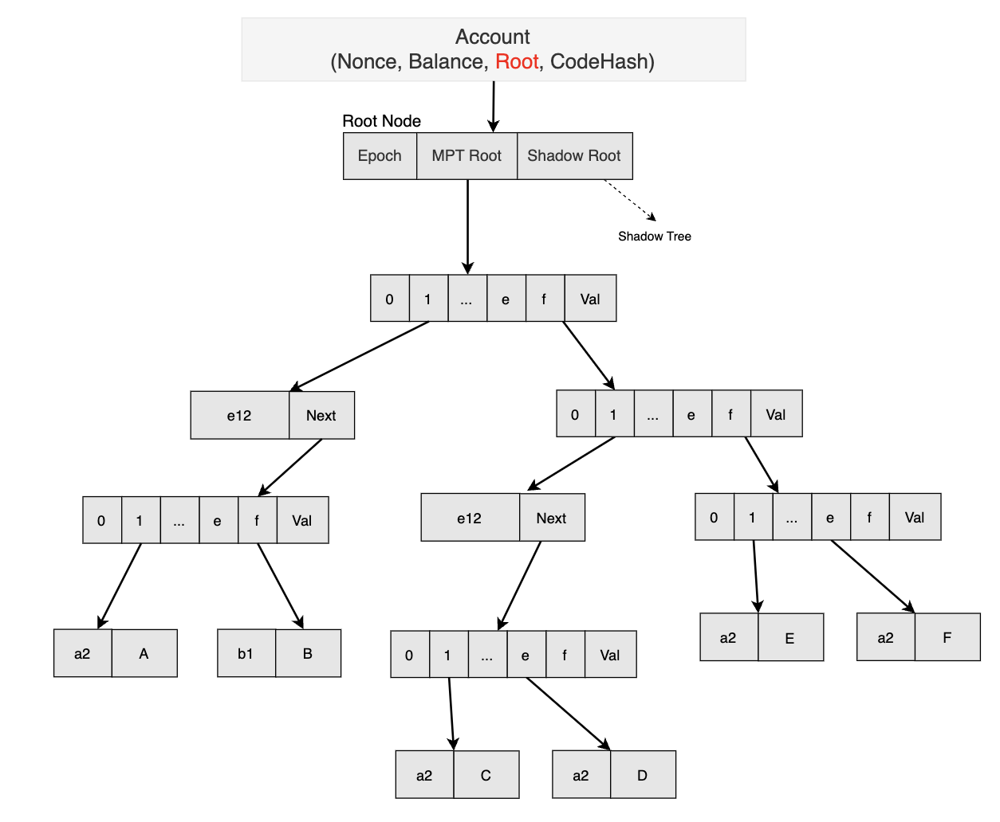
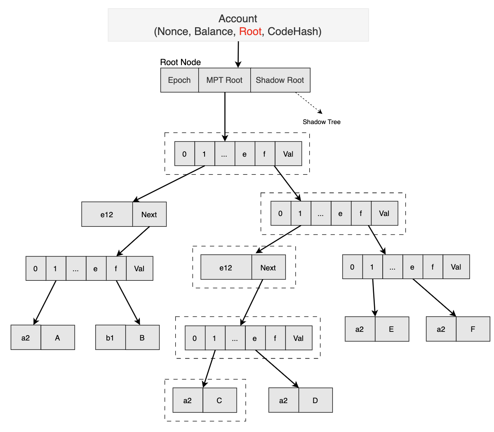
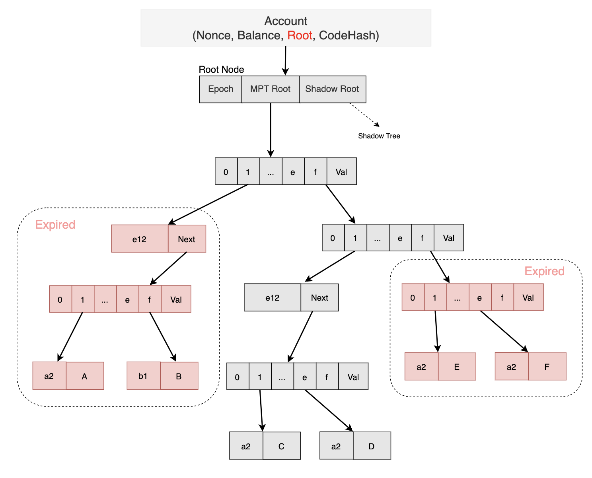
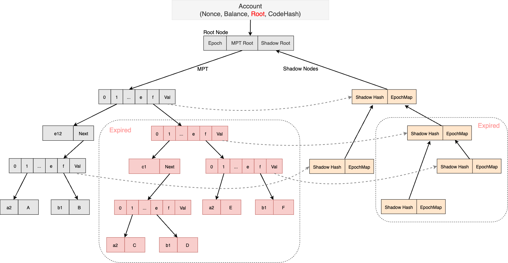
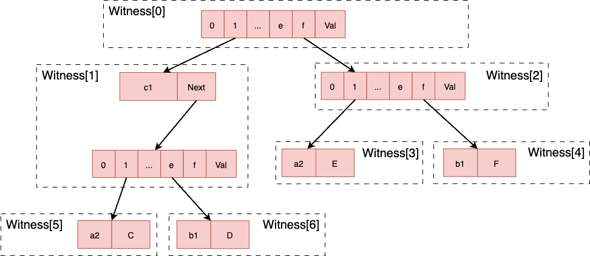

<pre>
    BEP: 215
    Title: Revive State Transaction with Witness
    Status: Pre-Draft
    Type: Standards
    Created: 2023-03-27
</pre>

# BEP-215: Revive State Transaction with Witness

- [BEP-215: Revive State Transaction with Witness](#bep-215-revive-state-transaction-with-witness)
    * [1. Summary](#1-summary)
    * [2. Motivation](#2-motivation)
    * [3. Specification](#3-specification)
        + [3.1 New Transaction type](#31-new-transaction-type)
        + [3.2 Witness format](#32-witness-format)
        + [3.3 Gas computation](#33-gas-computation)
        + [3.4 Partial Revival](#34-partial-revival)
        + [3.5 Witness Generation](#35-witness-generation)
        + [3.6 Revive State](#36-revive-state)
    * [4. Rationale](#4-rationale)
        + [4.1 Insert Conflict Detection](#41-insert-conflict-detection)
        + [4.2 Revive State Transaction Estimate](#42-revive-state-transaction-estimate)
        + [4.3 Data Availability](#43-data-availability)
        + [4.4 Witness Data Cost](#44-witness-data-cost)
    * [5. Forward Compatibility](#5-forward-compatibility)
        + [5.1 Verkle Tree](#51-verkle-tree)
    * [6. Backward Compatibility](#6-backward-compatibility)
        + [6.1 Other Transaction Types](#61-other-transaction-types)
        + [6.2 Hard Fork](#62-hard-fork)
    * [7. License](#7-license)

## 1. Summary

This BEP aims to introduce a state revival transaction type based on [BEP-206](https://github.com/bnb-chain/BEPs/pull/206). In BEP-206, all unaccessed states in the last two epochs will expire.

The new transaction type contains the necessary witness for state revival and partial newly inserted state conflict detection. This transaction is a supplement to the current transaction type, most interaction scenarios can still use the old transaction type.

## 2. Motivation

State inflation is a common problem with blockchain, especially current users who can permanently use blockchain storage for a one-time fee. The current BEP-206 will expire for more than two epochs of unaccessed states, greatly reducing the storage burden of BSC.  All states need to be kept available at a certain cost. Otherwise, only state revival can be used to access them.

Because account trie data does not expire, existing transaction types can satisfy account-related transactions, such as account transfers, contract creation, and access to the contract account's unexpired states. But accessing any expired node will result in transactions being reverted.

On the basis of BEP-206, this BEP continues to introduce a new transaction type and witness definition, which are used to revive state and prevent newly inserted state conflict, meanwhile transactions can be executed as usual.

## 3. Specification

### 3.1 New Transaction type

To support state revive, this BEP introduces a new transaction type, while the current transaction type can still be used in most scenarios, called `LegacyTx`, the new transaction type in order to maintain compatibility, begin with a single byte `REVIVE_STATE_TX_TYPE` in the RLP format, the complete transaction definition is as follows:

```go
type SignedReviveStateTx struct {
	message: ReviveStateTx
	signature: ECDSASignature
}
type ReviveStateTx struct {
	Nonce    	uint64          // nonce of sender account 
	GasPrice 	*big.Int        // wei per gas
	Gas      	uint64          // gas limit 
	To       	*common.Address // nil means contract creation 
	Value    	*big.Int        // wei amount 
	Data     	[]byte          // contract invocation input data 
	WitnessList	[]ReviveWitness  
}
```

The `ReviveStateTx` structure is similar to `LegacyTx`, with the `StateWitness` array added for batch state revival. `ReviveStateTx` will verify witness and revive state first, and continue to execute transfer, contract calls and other behaviors as normal transactions.

If the user only wants to revive the states of the contract, it is suggested to simply read the contract or guarantee that the transaction can not revert.

### 3.2 Witness format

In BEP-206, the witness scheme is Merkle proof. Specifically, only the witness of the MPT tree is needed for state revival.



The diagram above shows an example of an unexpired MPT structure.



Given an example of Merkle Proof for value A in the diagram above, the Merkle Proof generated would only contain the nodes wrapped in boxes.



Since a Merkle Proof does not require all nodes to be part of the proof elements in the MPT tree, we can revive selected nodes as shown in the diagram above.

The Merkle Proof witness may be provided in the following structure:

```go
type ReviveWitness struct {
	witnessType byte // only support Merkle Proof for now 
	address *common.Address // target account address 
	proofList []MPTProof // revive multiple slots (same address)
}

type MPTProof struct {
	key []byte // prefix key 
	proof [][]byte // list of RLP-encoded nodes
}
```

### 3.3 Gas computation

In the new transaction type, it introduces an additional field of `StateWitness`, this part will define the extra gas cost, whoever revives that state will have to pay for it. It consists of three parts:

1. `StateWitness` size cost, and the Gas consumption per byte is defined as `WITNESS_BYTE_COST`;
2. `StateWitness` verify cost, and the fixed Gas consumption of each branch is defined as `WITNESS_MPT_VERIFY_COST`;
3. Revive the state cost, same as a `sStore` opcode cost;

The calculation rules are as follows:

```go
func WitnessIntrinsicGas(wits []StateWitness) uint64 {
	totalGas := 0
	for i:=0; i<len(wits); i++ {
		// witness size cost 
		totalGas += len(wits[i].bytes()) * WITNESS_BYTE_COST 
		// witness verify cost 
		for j:=0; j<len(wits[i].mptProof); j++ {
			totalGas += len(wits[i].mptProof[j].proof) * WITNESS_MPT_VERIFY_COST
		}
	}
	return totalGas
}
```

As you can see, the cost of state revival is higher than that of a simple store, depending on the size of the Witness.

### 3.4 Partial Revival

According to the design of BEP-206, the shadow node will record the metadata of when the MPT node is accessed. This feature can be used for partial revival and saves gas in batch revival scenarios.

When a large number of states in Storage Trie has expired, the whole sub-tries will be pruned. 



This BEP allows the user to revive the state in batch mode. At this time, the trie nodes could be revived layer by layer to the storage MPT, thereby reducing the gas consumption of batch state revival.

The revived trie nodes rebuild the Shadow Nodes to indicate which child have been revived, or which are still expired.



### 3.5 Witness Generation

Typically, generating a witness (i.e. Merkle Proof) contains the complete path from the root to the leaf node. However, there may be a scenario where some nodes in the path have already been revived. This causes a witness conflict and induces unnecessary computation. Therefore, we can simply generate a partial witness to only revive the expired nodes.

First, we need to get the corresponding storage trie given the account address. Then, we would traverse from the root node to the parent node using the prefix key. The parent node represents the parent of the target revive subtree. From the parent node, we can generate a proof down to the leaf node.

```go
func (s *StateDB) GetStorageProof(address common.Address, parentKey []byte, slotKey []byte) ([][]byte, error) {
	var proof proofList
	trie := s.StorageTrie(a)
	if trie == nil {
		return proof, errors.New("storage trie for requested address does not exist")
	}
	err := trie.ProveStorage(parentKey, slotKey, &proof)
	return proof, err
}
```

### 3.6 Revive State

The user revives the state through the new transaction type, and the submitted witness is usually a Merkle Proof, which can prove the validity of the state. Since BEP-206 marks the expired state through an expired node, state revival only needs to provide the Merkle proof from the expired node as the root.

In order to avoid conflicts, the witness will be divided into the smallest proofs, and the partial revival feature is used to revive it sequentially. 

```go
func (s *StateDB) ReviveState(wit ReviveWitness) error {
	addr := wit.address
	proofList := wit.proofList
	for i:=0; i<len(proofList); i++ {
		if !verifyWitness(proofList[i]) {
			continue
		}
		// divide into the smallest proofs and revive all valid trie nodes 
		proofs := divideWitness(proofList[i])
		index := s.tries[addr].findFirstValidProof(proofs)
		if index < 0 {
			continue
		}
		s.tries[addr].revive(proofs[index:])
	}
	return nil
}
```

When the block is finalized, storage trie will commit all updates to the underlying storage DB.

## 4. Rationale

### 4.1 Insert Conflict Detection

In the BEP-206 scheme, all expired nodes will be pruned, and the common ancestors of expired nodes will also be pruned, which greatly alleviates the problem of state expansion, and leaves expired node and shadow node to mark the sub-trie expired, for state conflict avoidance and state revival.

When it is necessary to insert a new state through an expired node, even if the state has never been created and expired, it must be proved that the state does not conflict with the previous expired state.

At this time, the partial revival method can be perfectly used to support this insert operation. One thing to note is that if the newly inserted state does not through any expired node, it can be directly inserted without any proof.

### 4.2 Revive State Transaction Estimate

Just like the `eth_estimateGas` method, there needs to be an RPC API provided to the user, which can pre-execute and generate the witness required for the transaction and the gas limit required, which will greatly improve the ecological user experience.

### 4.3 Data Availability

There needs to be a state resurrection service to provide the generation of historical expired state witnesses, possibly by BSC’s DA layer, such as the BNB Green Field project.

### 4.4 Witness Data Cost

Witness data in new transaction types can create additional burdens:

1. The user needs to pay additional Gas according to the witness size when reviving the state. Is there a proof of higher efficiency to reduce Gas consumption;
2. Witness data storage will also occupy extra space. To ensure that TPS will inevitably increase the block gas limit, block historical data will also keep expanding;

These discussions beyond this BEP, and other BEPs will further reduce the cost of state resurrection.

## 5. Forward Compatibility

### 5.1 Verkle Tree

Verkle tree is another solution to replace the current MPT with less witness size, but it’s not ready for production, especially for the whole EVM-compatible ecosystem. When the verkle tree is available, this BEP is compatible to support it.

## 6. Backward Compatibility

### 6.1 Other Transaction Types

The new transaction type introduced by this BEP adds the `TransactionType` prefix in the encoded data to distinguish it from the old transaction type, so as to ensure that the old and new transactions can exist and be used normally at the same time.

`TransactionType` is a one-byte-sized data with a value range of `0x00-0x7f`, which can be reasonably allocated to more transaction types in the future to avoid conflicts.

### 6.2 Hard Fork

This BEP requires the introduction of a new hard fork, which takes effect after the epoch2 phase of BEP-206.

## 7. License

All the content is licensed under [CC0](https://creativecommons.org/publicdomain/zero/1.0/).