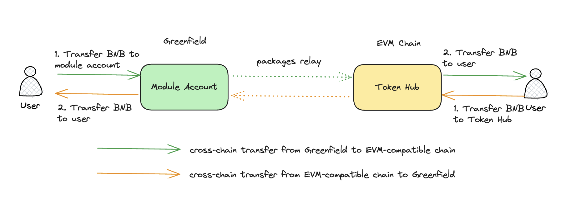

<pre>
	BEP: 293
	Title: Greenfield Link to opBNB
	Status: Draft
	Type: Standards
	Created: 2023-10-11
</pre>

# BEP-293: Greenfield Link to opBNB

- [BEP-293: Greenfield Link to opBNB](#bep-293-greenfield-link-to-opbnb)
    - [1. Summary](#1-summary)
    - [2. Motivation](#2-motivation)
    - [3. Specification](#3-specification)
        - [3.1 The tradeoff of opBNB's finality](#31-the-tradeoff-of-opbnbs-finality)
        - [3.2 Circulation model for BNB](#32-circulation-model-for-bnb)
        - [3.3 Greenfield Changes](#33-greenfield-changes)
          - [3.3.1 Add Destination Chain Id in Cross-chain Messages](#331-add-destination-chain-id-in-cross-chain-messages)
          - [3.3.2 Add Cross-chain Related Fees for opBNB](#332-add-cross-chain-related-fees-for-opbnb)
        - [3.4 opBNB Changes](#34-opbnb-changes)
          - [3.4.1 Precompile Contracts](#341-precompile-contracts)
    - [4. License](#6-license)

## 1. Summary

This BEP proposes to enable the cross-chain communication between Greenfield and opBNB.

Improving programmable capabilities on different platforms allows us to leverage the unique advantages of each platform. 
One example is to enable the Greenfield link to opBNB, which offers lower gas fees and faster cross-chain transactions.

## 2. Motivation

Greenfield's dependence on another EVM-compatible L1 chain for programming might lead to elevated cross-chain fees. 
When a user purchases a data asset on the BSC data marketplace, they need to pay a gas fee of 
$0.524(calculated at a price of 3 Gwei). The fees for the opBNB will be much lower, about one-tenth of the fees on the BSC. 
Furthermore, cross-chain communication is significantly faster on opBNB because it achieves one-block finality in most cases. 
In BSC, relayers must wait for two blocks (6 seconds) at least to achieve finality before relaying the cross-chain packages. 
With one-block finality, relayers only need to wait for one block (1 second) in opBNB.

By connecting Greenfield to opBNB, the dapp becomes more cost-effective and faster.

## 3. Specification

### 3.1 The tradeoff of opBNB's finality

OpBNB may take up to 5 minutes to transition from an unsafe block to a safe block. However, reaching a safe block 
does not guarantee finality. It still needs to wait for BSC on L1 to process multiple blocks before we can reasonably 
confirm that it is finalized on the DA layer. If Greenfield relayers wait for opBNB to fully finalize before handling 
cross-chain packages, it will result in a poor user experience.

In most cases, Optimism Layer2 doesn't revert, making it equivalent to one block finality. Some popular centralized 
exchanges accept deposits with confirmation of just one block for both OP and ARB. While it is possible to revert, 
these exchanges have a high level of confidence in the finality of one block.

To minimize the impact of block reverts and improve cross-chain communication speed, we can make some tradeoffs. 
Specifically, we won't enable BNB cross-chain transfers between opBNB and Greenfield, focusing solely on Greenfield 
resource management. Our protocol can prevent double-spending attacks in the event of a revert. So when an unsafe 
block emerges on opBNB, the relayer can start relaying cross-chain packages to Greenfield.

Given this tradeoff, we assume that the application layer(the dapps) can tolerate the inconsistency between greenfield 
and opBNB when there is a revert on opBNB. The inconsistency means the state of the application on Greenfield and 
opBNB can be different such like the ownership of one object and etc. In practice, the likelihood of such inconsistency 
is expected to be minimal. It only arises when a cross-chain transaction is replaced by another transaction with the same nonce.

### 3.2 Circulation model for BNB

Since we won't enable cross-chain BNB transfers between opBNB and Greenfield. It's crucial to ensure that 
opBNB's [TokenHub](https://docs.bnbchain.org/greenfield-docs/docs/guide/core-concept/gas-fees#circulation-model) has 
enough BNB to cover relayer fees at any time. The token hub is used to hold the BNB for cross-chain usage in 
EVM-compatible chains like BSC and opBNB. The cross-chain module account in Greenfield is used to custody the BNB 
for cross-chain functions.



In the BSC and Greenfield scenario, we can ensure this by initiating cross-chain transfer transactions from BSC 
to Greenfield. The cross-chain transfers replenish the BSC token hub's BNB balance, ensuring it can cover relayer 
fees for cross-chain transactions from Greenfield to BSC. However, in the case of opBNB, if the token hub's balance 
reaches zero, we won't have the means to cover relayer fees for cross-chain transactions originating from Greenfield 
to opBNB. Because we can not increase the balance of the opBNB token hub with the cross-chain transfers from opBNB 
to Greenfield which will transfer user's BNB to the token hub.

To address this, we must initially transfer some BNB to opBNB's TokenHub. These BNB should be considered permanently 
locked, as they won't be recoverable. These allocations can be deducted from the [Quarterly BNB Burn](https://www.bnbburn.info/).

Without the opBNB link, the circulating BNB on Greenfield is equal to the BNB amount in the BSC TokenHub 
which means every BNB can be cross-chain transferred to BSC. The relayer fees paid to the relayers for the 
cross-chain transactions from opBNB to Greenfield in Greenfield can slightly increase the circulating BNB in Greenfield. 
So with the link of Greenfield to opBNB, the total BNB circulating supply on Greenfield may slightly exceed the BNB 
amount held in the BSC token hub.

This means there won't be sufficient BNB for redemption in BSC through cross-chain transfers from Greenfield to BSC. 
Given the lack of direct BNB cross-chain transfers between opBNB and Greenfield, surplus circulating BNB can't be 
moved to opBNB. It's important to note that the surplus BNB in Greenfield should be minimal, not exceeding the 
initial deposit made to opBNB's TokenHub.

To resolve this, we can also deposit an equivalent amount of surplus BNB into the BSC token hub, which should be 
considered permanently locked. This allows the surplus BNB to be transferred to BSC without increasing the total 
circulating BNB across all chains.

### 3.3 Greenfield Changes

#### 3.3.1 Add Destination Chain Id in Cross-chain Messages

The cross-chain messages initiated by users should add the destination chain id to specify the target chain of the message.

A new field named `dest_chain_id` should be added to the below messages:

*   gov module
    1. `MsgUpdateCrossChainParams`


*   storage module:
    1. `MirrorObject`
    2. `MirrorBucket`
    3. `MirrorGroup`

    
For example, `MsgUpdateCrossChainParams` should be like

```plain
// MsgUpdateCrossChainParams for cross-chain gov
message MsgUpdateCrossChainParams {
  option (cosmos.msg.v1.signer) = "authority";
  option (amino.name)           = "cosmos-sdk/x/gov/v1/MsgUpdateCrossChainParams";

  // authority is the address that controls the module (defaults to x/gov unless overwritten).
  string authority = 1 [(cosmos_proto.scalar) = "cosmos.AddressString"];

  // for cross chain param change or contract upgrade
  CrossChainParamsChange params = 2 [(gogoproto.nullable) = false, (amino.dont_omitempty) = true];

  uint32 dest_chain_id = 3;
}
```

If the newly added field is the last field in the proto struct, it will not affect the marshaled binary so there is 
no need to add a new message type just to add a new field.

#### 3.3.2 Add Cross-chain Related Fees for opBNB

The cross-chain related fee between opBNB and greenfield should not be the same as the fee between greenfield and BSC, 
so another set of fees should be added.

Since the cross-chain transfer of BNB will not be enabled, only the related fees of the storage module should be added to `Params` :

```plain
// relayer fee for the mirror bucket tx to bsc
string opbnb_mirror_bucket_relayer_fee = 18;
// relayer fee for the ACK or FAIL_ACK package of the mirror bucket tx to opbnb
string opbnb_mirror_bucket_ack_relayer_fee = 19;
// relayer fee for the mirror object tx to bsc
string opbnb_mirror_object_relayer_fee = 20;
// Relayer fee for the ACK or FAIL_ACK package of the mirror object tx to opbnb
string opbnb_mirror_object_ack_relayer_fee = 21;
// relayer fee for the mirror object tx to opbnb
string opbnb_mirror_group_relayer_fee = 22;
// Relayer fee for the ACK or FAIL_ACK package of the mirror object tx to opbnb
string opbnb_mirror_group_ack_relayer_fee = 23;
```

### 3.4 opBNB Changes

#### 3.4.1 Precompile Contracts

The greenfield-related precompile contracts should be added to opBNB.

The below precompile contracts should be added:

```plain
common.BytesToAddress([]byte{102}): &blsSignatureVerify{}
common.BytesToAddress([]byte{103}): &cometBFTLightBlockValidate{}
```

The contract `blsSignatureVerify` is used to verify the aggregated BLS signatures from the relayers.

The contract `cometBFTLightBlockValidate` is used to validate the light blocks of cometBFT.

For more details about the two contracts, you can refer to [BEP 221](https://github.com/bnb-chain/BEPs/blob/master/BEPs/BEP221.md) and [BEP 126](https://github.com/bnb-chain/BEPs/blob/master/BEPs/BEP126.md)

## 4. License
The content is licensed under [CC0](https://creativecommons.org/publicdomain/zero/1.0/).