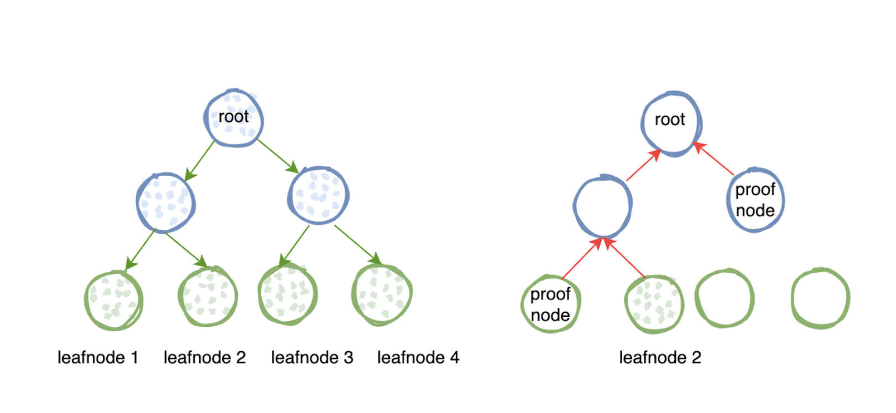
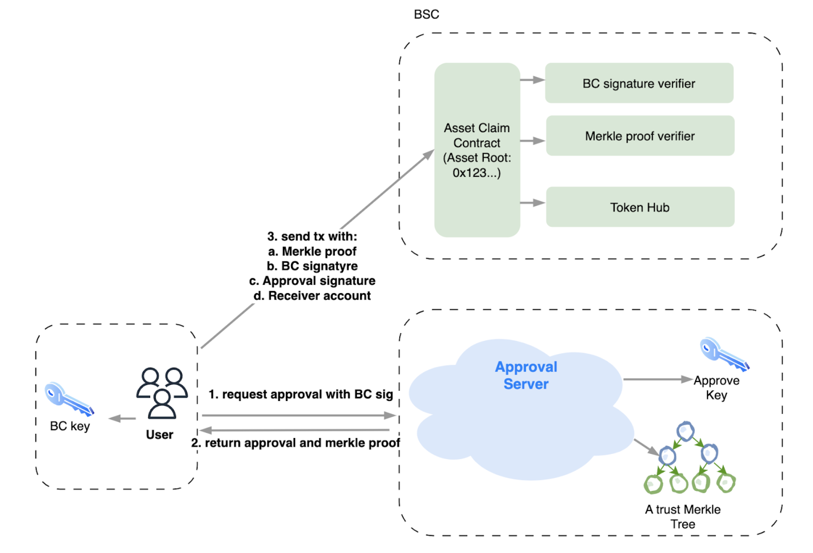

<pre>
  BEP: 299
  Title: Token Migration after BC Fusion
  Status: Draft
  Type: Standards
  Created: 2023-10-16
</pre>

# BEP-299: Token Migration after BC Fusion
- [BEP-299: BSC Native Governance Module](#bep-299-token-migration-after-bc-fusion)
- [1. Summary](#1-summary)
- [2. Abstract](#2-abstract)
- [3. Status](#3-status)
- [4. Motivation](#4-motivation)
- [5. Specification](#5-specification)
- [6. License](#6-license)

# 1. Summary

After the Beacon Chain fusion, certain digital assets remain on the Beacon Chain. This proposal presents a secure and trustless solution for users to recover their assets on the BSC once the BC stops running.

# 2. Abstract

Before the discontinuation of operations on the Beacon Chain, it is highly recommended that users promptly transfer their assets to other networks through cross-chain transactions. Once BC ceases operations, the community team will capture a snapshot of users' assets on BC, which will be publicly released and acknowledged by the community. Subsequently, a Merkle tree will be generated based on the users' balances in the snapshot. The root of this tree will be stored in the system contract of BNB Smart Chain (BSC).

Any user can prove their ownership of the original tokens on BC by providing a Merkle proof and their BC account's signature. Once the ownership and token information are verified, the system contract on BSC will unlock the corresponding amount of tokens from the token hub and allocate them to the user's account on BSC. Users can initiate token claims through a web app or command line interface (CLI).

# 3. Status

Draft.

# 4. Motivation

The Beacon Chain was originally created as a platform for issuing data assets. Currently, there are 7.6 million accounts on BC, along with 557 tokens that comply with the **BEP2** or **BEP8** standards. The digital assets of these users will not vanish with BC Fusion. BNB Chain is responsible for safeguarding the assets of these users, irrespective of their value. Users do not have a specific ETA to access these assets. However, BC Fusion is expected to happen within a reasonable timeframe. We plan to implement a solution that enables the timely execution of BC Fusion and secure access to users' digital assets afterwards.

# 5. Specification

## 5.1 Asset Back to Wallet

Digital assets on the BNB Beacon Chain may not always be stored in a user's wallet in specific situations. For example, when users participate in staking, their BNB is actually transferred to the system account of the staking module until they redeem it. Modules that can cause similar asset transfers include:

   - Staking module.
   - Timelock module.
   - Atomic swap module.
   - Governance module.

The mentioned modules allow users to contribute funds to a shared pool, making it difficult to distinguish an individual user's share. Hence, we need a solution to ensure users can retrieve their funds into their wallets.

Before BC (Blockchain) comes to a halt, the following logic will be executed:
1. Disable all transactions that would channel user funds into the liquidity pool.
2. During the endblock phase, the following transactions are automatically triggered to return user funds to their wallets, like unstake, timer unlock, and atomic swap unlock.

Assets in a user's wallet can be in three states: Free, Frozen, and Locked. When calculating the asset balance, we consider the quantities in all three states. So, even if a token is Locked or Frozen when the Beacon Chain halts, it can still be recovered on the BSC chain.

## 5.2 Asset Recover
### 5.2.1 Asset Tree

The user's asset is abstracted as a node, which includes the *account address, symbol, and amount*. We'll exclude assets from non-EOA accounts, including module system accounts and clearly dead addresses. All these nodes are sorted in lexicographical order based on their keys, and then used to construct a Merkle tree. This Merkle tree will be published in the form of a file on GitHub and Greenfield, allowing anyone to verify the accuracy of their assets based on this file. Community members can challenge the accuracy and integrity of this document, and if any errors are found, the core team will make corrections until there are no objections. 

The Merkle tree enables anyone to verify token ownership on the blockchain using a Merkle proof. It ensures that an account possesses a specific number of tokens represented by the symbol "symbol." 

**Note that only tokens that have been linked to BEP20 tokens on BSC will create a Node. Therefore, assets that have not been mirrored to BSC prior to the BC halting can not be restored.**

### 5.2.2 Asset Recovery App

This system consists of two main components:
  1. Approval server.  This is an off-chain API service operated by the BNB Chain Foundation. It enables users to retrieve assets by providing merkle proof and approval signature. Only with the approval signature can users recover assets from the BSC network.
  2. Asset Claim Contract. This contract is responsible for handling users' requests to claim assets. It verifies and records the requests to prevent duplicate claims.

The key process for users to claim assets in the BSC network is as follows:
  1. Users use the private key of the asset owner on BC to sign *{account address, symbol, amount, receiver}*, and request approval through the approval server.
  2. The approval server will fetch the node from a trust merkle tree, and 
    a. verify the account, symbol, amount are correct.
    b. the signature is signed by the token owner.
    c. the token is not claimed yet.
    *After that, the approval will generate the merkle proof for this request and sign for the request using its approval key.*
  3. The user will send a transaction to the *Asset Claim* contract with merkle proof, node info, BC signature, signature from the approver, receiver account.
  4. The *Asset Claim contract* will do following checks
    a. The asset of this node is never claimed.
    b. The approval signature comes from the approver.
    c. The BC signature comes from the owner of the token.
    d. The merkle proof is able to prove the node is a leaf node of the tree.
    *After all checks are passed, the *Asset Claim contract* will invoke the token hub contract to unlock the corresponding token to the receiver.*

### 5.2.3 Security Enhancement
Considering the highly flexible implementation approach of BEP20 tokens on theBSC, there may be unforeseen scenarios that the BEP overlooks. During the initial phase of the BEP, the Approval Server only allows for the tokens in a whitelist that can be claimed. 

For tokens that are not in the whitelist, users can submit requests on the forum. After the core developers review the security of the token, it can be added to the whitelist.

# 6. License

The content is licensed under [CC0](https://creativecommons.org/publicdomain/zero/1.0/).