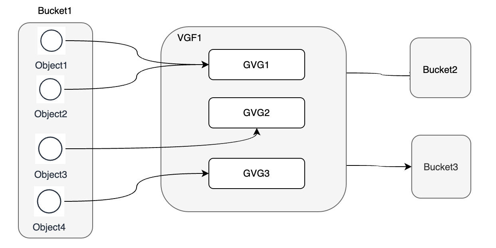
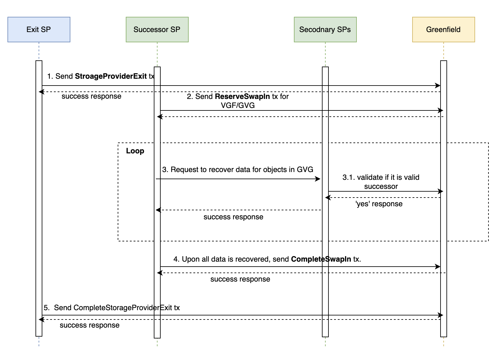

<pre>
  BEP: 335
  Title: Simplify Storage Provider Exit
  Status: Under progress
  Type: Standards
  Created: 2023-12-13
</pre>

# BEP-335: Simplify Storage Provider Exit

<!-- @import "[TOC]" {cmd="toc" depthFrom=1 depthTo=6 orderedList=false} -->

<!-- code_chunk_output -->

- [BEP-335: Simplify Storage Provider Exit](#bep-335-simplify-storage-provider-exit)
  - [1. Summary](#1-summary)
  - [2. Motivation](#2-motivation)
  - [3. Status](#3-status)
  - [4. Specification](#4-specification)
    - [4.1 Background](#41-background)
      - [4.1.1 Global Virtual Group](#411-global-virtual-group)
      - [4.1.2 Virtual Group Family](#412-virtual-group-family)
      - [4.1.3 Definition Of SP Exit](#413-definition-of-sp-exit)
      - [4.1.4 Categories Of SP Exit](#414-categories-of-sp-exit)
        - [4.1.4.1 Graceful Exit](#4141-graceful-exit)
        - [4.1.4.2 Forced Exit](#4142-forced-exit)
    - [4.2 The Current SP Graceful Exit Procedure](#42-the-current-SP-graceful-exit-procedure)
    - [4.3 The New SP Graceful Exit Procedure](#43-the-new-SP-graceful-exit-procedure)
      - [4.3.1 Data heal process](#431-data-heal-process)
    - [4.4 The SP Forced Exit Procedure](#44-the-SP-forced-exit-procedure)
    - [4.5 Concurrent SP Exit](#45-concurrent-SP-exit)
<!-- /code_chunk_output -->

## 1. Summary 
The proposed BEP introduces a new implementation of a graceful exit and forced exit mechanism for storage providers (SP) 
in the Greenfield network.

## 2. Motivation 
This proposal addresses the current issues with the fragile and low success rate of the SP exiting process in the Greenfield 
network. It aims to improve the process by implementing a new graceful exit and forced exit mechanism for storage providers. 
The current process requires the exiting SP to transfer all data stored to other successor SPs, making it difficult to track 
and troubleshoot any issues. The new implementation will decouple the reliance on the exiting SP, allowing other SPs to 
recover data from the remaining SPs that hold data copies. This will help overcome factors that lower the success rate or 
hinder the process, such as data loss, lack of transparency, concurrent SP exit restrictions, and conflicts between primary 
and secondary SPs.

## 4. Specification

### 4.1 Background

#### 4.1.1 Global Virtual Group(GVG)

In the Greenfield network, storage providers need to cooperate with each other through Global Virtual Groups (GVG). A GVG 
consists of one primary SP and six secondary storage providers, which is determined by the redundancy strategy.  Each object 
is associated with a virtual group, where the primary SP holds all segments of each object, while EC chunks of each object 
are stored in secondary SPs, so In the event that one or more segments of object is lost from the primary Storage Provider (SP), 
it is possible to recover them using any four out of the six SPs. Similarly, if any EC chunk of a specific segment held by 
a secondary SP is lost, the secondary SP can retrieve it from the primary SP or other secondary SPs.
For more detailed information, please refer to `Greenfield Doc` [Virtual Group](https://github.com/bnb-chain/greenfield/blob/master/docs/modules/virtual-group.md) and [Redundancy](https://github.com/bnb-chain/greenfield-storage-provider/blob/master/docs/modules/redundancy.md)

#### 4.1.2 Virtual Group family(VGF)

A Virtual Group Family (VGF) is a collection of virtual groups that share the same primary Storage Provider (SP). 
Each bucket is exclusively served by one VGF, and the objects within the bucket can only be served by Group Virtual 
Groups (GVGs) that belong to the respective VGF. It is important to note that a VGF has the capability to serve multiple 
buckets simultaneously.

#### 4.1.3 Definition of SP Exit

A Storage Provider (SP) needs to get suitable successors for both its primary SP role in serving VGF and its secondary SP 
role in serving GVG. The successor for the primary role should inherit all segments associated with the objects that the 
current SP serves through VGF. Additionally, the successor for the secondary role should receive segment-specific EC chunks 
for objects served through GVG. Summarized as:

- Get successor for primary SP role in VGF exit.
- Get successor for secondary SP role in GVG exit.

#### 4.1.4 Categories of SP Exit

There are two types of exit based on the behavior and choices of the Service Provider (SP): Graceful Exit and Forced Exit.

##### 4.1.4.1 Graceful Exit

A Storage Provider (SP) voluntarily exits by following the predefined standard procedures, including notifying Greenfield 
network the intention to exit, and during the graceful exit, ensures that user query requests can still be fulfilled before 
transitioning responsibility and data to other SPs. Once successor SPs have taken over all data in its GVG and VGF, the exit 
SP completes the exit process and retrieves all the staked BNB.

##### 4.1.4.2 Forced Exit

An uncooperative SP no longer wishes to provide service and refuses to go through the standard exit process. In such a case, 
Greenfield governance will force the SP to exit. The successor SP is allowed to recover all data in the GVG and GVG family. 
Once the recovery process and SP replacement within the GVG and GVG family are completed, the forced exit SP will be removed from the chain, 
and its staked BNB will not be refunded.

### 4.2 The Current SP Graceful Exit Procedure

The SP initiates a `StorageProviderExit` transaction to Greenfield, declaring its status as Graceful_Exiting, it then repeatedly 
calls SwapOut to remove itself from all GVGs. For those GVGs that it is the primary SP, the SwapOut would occur at family level. 
If the successor is already a secondary in any GVG within the VGF, the successor needs to SwapOut first from the GVG, as GVG is 
required to have all unique SPs. This means that before the exit SP can choose the successor SP to transfer data, the successor 
SP needs to find a successor and transfer data first. This brings the fragility and complexity to the SP exit process.

### 4.3 The New SP Graceful Exit Procedure

In the new implementation, the successor SP no longer needs to acquire data from the exit SP due to the redundancy strategy in place. This ensures that the successor primary SP can recover from secondary SPs in the GVG, while the successor secondary SP can recover from the primary SP in the GVG. This approach effectively addresses the issues of data loss and single point of failure associated with the exit SP.
However, it is worth noting that even though the exit SP may cooperate, transferring a significant amount of data to all successors can be challenging to predict or manage effectively.
The graph below illustrates the necessary operations that each component must complete when the SP needs to exit as the primary SP from a GVG.

1. The SP initiates a `StorageProviderExit` transaction to Greenfield, declares itself Graceful_Exiting status, After this, it will no longer serve any new bucket requests, and existing buckets will not receive new objects. Additionally, it will not serve as a secondary SP for any new objects. However, user query requests will still be accepted.
  Note: Once the graceful exit is started, it can not be canceled.
2. Other interested SPs who wish to take over VGF and GVG can send a `ReserveSwapIn` transaction to Greenfield. This reservation will expire in 7 days. During this period, the prospective successor SP will be allowed to acquire data from secondary SPs( If the exiting SP served as a secondary SP, the prospective successor SP will acquire data from the primary SP)
3. The prospective successor SP will continually request data recovery from these secondary SPs. The secondary SPs will verify the validity of the successor SP against Greenfield. Additionally, the successor SP will verify the received data against Greenfield to ensure its integrity.
4. Once the successor SP successfully acquires the data and verifies its integrity, it will send a `CompleteSwapIn` transaction to acknowledge the success. This will officially replace the exiting SP in the VGF/GVG.
5. Once the exiting SP no longer has any GVG bind, it can send out a `CompleteStorageProviderExit` transaction to signify its completion of the exit process.

### 4.3.1 Data heal process

As described in the current SP graceful exit procedure, one of the significant challenges is the SP conflict issue, let’s discuss it in more detail. Let's delve into this matter in more detail using an example.

Consider a GVG with SPs {SP1, SP2, SP3, SP4, SP5, SP6, SP7}, where SP1 is the primary SP.
If SP3 needs to become the successor, it must first be swapped out from the GVG by a successor, let's say SP8. The data transfer from SP3 to SP8 will take place before the transfer from SP1 to SP3. However, the new implementation allows the successor SP to take the primary SP role, even if it is currently a secondary SP in the GVG.  This means that a GVG can temporarily break the redundancy requirement, and data redundancy can be achieved through a healing process.

Returning to the case, with the new implementation, SP3 can initiate a `ReserveSwapIn` transaction directly and then complete a SwapIn transaction after recovering all data from the secondary SPs. The GVG will now become {SP3, SP2, SP3, SP4, SP5, SP6, SP7}. This GVG will be flagged for its broken redundancy, and any other unique SP can take necessary action to `ReserveSwapIn`. This action involves acquiring data from the primary SP and ultimately completing the SwapIn process. Such a GVG will not be used for serving new objects until redundancy is resolved.

Enabling data healing serves the purpose of facilitating the SP exit process. It is challenging to anticipate the number of GVGs that may encounter such conflicts. However, we can address them once the SP exit is finalized, ensuring a smooth transition and maintaining data integrity.

## 4.4 The SP forced exit procedure

The SP forced exit is similar to the graceful exit procedure with a few differences:
- The `StorageProviderExit` is initiated by the SP itself, while the `StorageProviderForcedExit` is executed through Greenfield governance. 
  Validators must come to an agreement that a specific SP is behaving maliciously and poses a threat to the Greenfield ecosystem. 
  Once a proposal is passed, the SP's status will be changed to force_exit. Successor SPs must follow the same procedures to take over the forced exit SP's VGF and GVG.

- During the exiting period, users may experience inability to access their data for a specific bucket until the successor SP completes the swap-in process 
  for the VGF associated with that bucket. As a consequence, the forced exit SP will face penalties and its staked BNB will be locked into the Payment module governance account, 
  this payment account is used to receive forced settlement fee, and pay for potential debt from late forced settlement.

## 4.5 Concurrent SP exit
The new implementation aims to ensure that only one concurrent SP exit is allowed, considering the interconnected nature of a GVG with multiple linked SPs. To address potential issues where a lengthy SP exit process could block other SPs. When a successor SP reserves the swapIn, an expiration time is set to ensure that the transfer is completed within a specific timeframe.

In cases where the successor SP is unable to complete the transfer within the allotted time, other SPs interested in becoming the successor can still proceed with the swapIn. It's important to note that the efficiency of successor SPs plays a significant role in determining the duration of the SP exit process.

## 5. License
The content is licensed under [CC0](https://creativecommons.org/publicdomain/zero/1.0/).