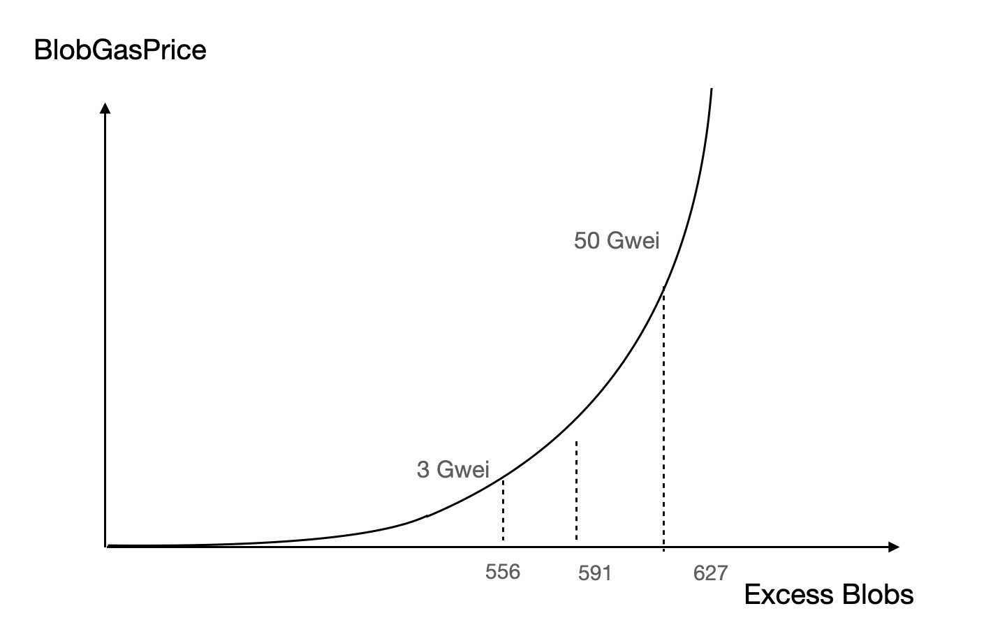
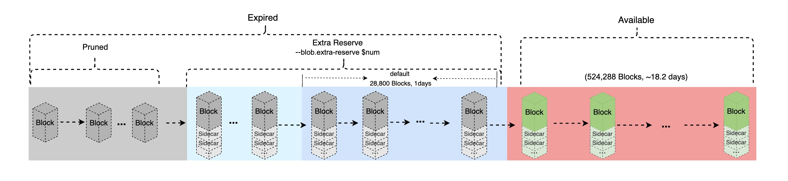

<pre>
  BEP: 336
  Title: Implement EIP-4844: Shard Blob Transactions
  Status: Draft
  Type: Standards
  Created: 2023-12-04
</pre>

# BEP-336: Implement EIP-4844: Shard Blob Transactions

- [BEP-336: Implement EIP-4844: Shard Blob Transactions](#bep-336-implement-eip-4844-shard-blob-transactions)
  - [1. Summary](#1-summary)
  - [2. Abstract](#2-abstract)
  - [3. Status](#3-status)
  - [4. Motivation](#4-motivation)
  - [5. Specification](#5-specification)
    - [5.1 Parameters](#51-parameters)
    - [5.2 Type aliases](#52-type-aliases)
    - [5.3 Cryptographic Helpers](#53-cryptographic-helpers)
    - [5.4 Helpers](#54-helpers)
    - [5.5 Blob transaction](#55-blob-transaction)
      - [Signature](#signature)
    - [5.6 Header extension](#56-header-extension)
    - [5.7 Gas accounting](#57-gas-accounting)
    - [5.8 Opcode to get versioned hashes](#58-opcode-to-get-versioned-hashes)
    - [5.9 Point evaluation precompile](#59-point-evaluation-precompile)
    - [5.10 Execution layer validation](#510-execution-layer-validation)
    - [5.11 Networking](#511-networking)
      - [TransactionPayload](#transactionpayload)
      - [BlockPayload and P2P Message](#blockpayload-and-p2p-message)
  - [6. Rationale](#6-rationale)
    - [6.1 Why Not Integrate The Sidecar Protocol On BSC](#61-why-not-integrate-the-sidecar-protocol-on-bsc)
  - [7. Backwards Compatibility](#7-backwards-compatibility)
  - [8. Security Considerations](#8-security-considerations)
  - [9. License](#9-license)

## 1. Summary

This BEP proposes introduction of blob-carrying transactions which may contain large amount of data.

## 2. Abstract

Introduce a new transaction format for “blob-carrying transactions” which contain a large amount of data that cannot be accessed by EVM execution, but whose commitment can be accessed. The format is intended to be fully compatible with the format that will be used in full sharding.

## 3. Status 

Work in progress.

## 4. Motivation 

Rollups are significantly reducing fees for many Ethereum users: Optimism and Arbitrum frequently provide fees that are ~3-8x lower than the Ethereum base layer itself, and ZK rollups, which have better data compression and can avoid including signatures, have fees ~40-100x lower than the base layer. In case of BSC, opBNB leverages block size of 100MB along with low gas fees making it suitable for widespread adoption across various digital fields such as gaming and DEXs.

However, these fees are too expensive for many users in Ethereum ecosystem. The long-term solution to the long-term inadequacy of rollups by themselves has always been data sharding, which would add ~16 MB per block of dedicated data space to the chain that rollups could use. However, data sharding will still take a considerable amount of time to finish implementing and deploying.

EIP-4844 provides a stop-gap solution until that point by implementing the transaction format that would be used in sharding, but not actually sharding those transactions. Instead, the data from this transaction format is simply part of the chain and is fully downloaded by all consensus nodes (but can be deleted after only a relatively short delay). Compared to full data sharding, EIP-4844 has a reduced cap on the number of these transactions that can be included, corresponding to a target of ~0.375 MB per block and a limit of ~0.75 MB in Ethereum.

BSC has same target to reduce the L2 rollup cost. This BEP will propose an idea on how to integrate EIP-4844 on BSC, so BSC rollups like opBNB can enjoy an even cheaper gas fee.

## 5. Specification
### 5.1 Parameters

| Constant | Value |
| - | - |
| `BLOB_TX_TYPE` | `Bytes1(0x03)` |
| `BYTES_PER_FIELD_ELEMENT` | `32` |
| `FIELD_ELEMENTS_PER_BLOB` | `4096` |
| `BLS_MODULUS` | `52435875175126190479447740508185965837690552500527637822603658699938581184513` |
| `VERSIONED_HASH_VERSION_KZG` | `Bytes1(0x01)` |
| `POINT_EVALUATION_PRECOMPILE_ADDRESS` | `Bytes20(0x0A)` |
| `POINT_EVALUATION_PRECOMPILE_GAS` | `50000` |
| `MAX_BLOB_GAS_PER_BLOCK` | `786432` |
| `TARGET_BLOB_GAS_PER_BLOCK` | `393216` |
| `MIN_BLOB_GASPRICE` | `1` |
| `BLOB_GASPRICE_UPDATE_FRACTION` | `3338477` |
| `GAS_PER_BLOB` | `2**17` |
| `HASH_OPCODE_BYTE` | `Bytes1(0x49)` |
| `HASH_OPCODE_GAS` | `3` |
| `MIN_BLOCKS_FOR_BLOB_REQUESTS` | `524288` |

### 5.2 Type aliases

| Type | Base type | Additional checks |
| - | - | - |
| `Blob` | `ByteVector[BYTES_PER_FIELD_ELEMENT * FIELD_ELEMENTS_PER_BLOB]` | |
| `VersionedHash` | `Bytes32` | |
| `KZGCommitment` | `Bytes48` | Perform IETF BLS signature "KeyValidate" check but do allow the identity point |
| `KZGProof` | `Bytes48` | Same as for `KZGCommitment` |

### 5.3 Cryptographic Helpers

Throughout this proposal we use cryptographic methods and classes defined in the corresponding [consensus 4844 specs](https://github.com/ethereum/consensus-specs/blob/86fb82b221474cc89387fa6436806507b3849d88/specs/deneb).

Specifically, we use the following methods from [`polynomial-commitments.md`](https://github.com/ethereum/consensus-specs/blob/86fb82b221474cc89387fa6436806507b3849d88/specs/deneb/polynomial-commitments.md):

- [`verify_kzg_proof()`](https://github.com/ethereum/consensus-specs/blob/86fb82b221474cc89387fa6436806507b3849d88/specs/deneb/polynomial-commitments.md#verify_kzg_proof)
- [`verify_blob_kzg_proof_batch()`](https://github.com/ethereum/consensus-specs/blob/86fb82b221474cc89387fa6436806507b3849d88/specs/deneb/polynomial-commitments.md#verify_blob_kzg_proof_batch)

### 5.4 Helpers

```python
def kzg_to_versioned_hash(commitment: KZGCommitment) -> VersionedHash:
    return VERSIONED_HASH_VERSION_KZG + sha256(commitment)[1:]
```

Approximates `factor * e ** (numerator / denominator)` using Taylor expansion:

```python
def fake_exponential(factor: int, numerator: int, denominator: int) -> int:
    i = 1
    output = 0
    numerator_accum = factor * denominator
    while numerator_accum > 0:
        output += numerator_accum
        numerator_accum = (numerator_accum * numerator) // (denominator * i)
        i += 1
    return output // denominator
```

### 5.5 Blob transaction

We introduce a new type of [EIP-2718](./eip-2718.md) transaction, "blob transaction", where the `TransactionType` is `BLOB_TX_TYPE` and the `TransactionPayload` is the RLP serialization of the following `TransactionPayloadBody`:

```
[chain_id, nonce, max_priority_fee_per_gas, max_fee_per_gas, gas_limit, to, value, data, access_list, max_fee_per_blob_gas, blob_versioned_hashes, y_parity, r, s]
```

The fields `chain_id`, `nonce`, `max_priority_fee_per_gas`, `max_fee_per_gas`, `gas_limit`, `value`, `data`, and `access_list` follow the same semantics as [EIP-1559](./eip-1559.md).

The field `to` deviates slightly from the semantics with the exception that it MUST NOT be `nil` and therefore must always represent a 20-byte address. This means that blob transactions cannot have the form of a create transaction.

The field `max_fee_per_blob_gas` is a `uint256` and the field `blob_versioned_hashes` represents a list of hash outputs from `kzg_to_versioned_hash`.

The [EIP-2718](./eip-2718.md) `ReceiptPayload` for this transaction is `rlp([status, cumulative_transaction_gas_used, logs_bloom, logs])`.

#### Signature

The signature values `y_parity`, `r`, and `s` are calculated by constructing a secp256k1 signature over the following digest:

`keccak256(BLOB_TX_TYPE || rlp([chain_id, nonce, max_priority_fee_per_gas, max_fee_per_gas, gas_limit, to, value, data, access_list, max_fee_per_blob_gas, blob_versioned_hashes]))`.

### 5.6 Header extension

The current header encoding is extended with two new 64-bit unsigned integer fields:

- `blob_gas_used` is the total amount of blob gas consumed by the transactions within the block.
- `excess_blob_gas` is a running total of blob gas consumed in excess of the target, prior to the block. Blocks with above-target blob gas consumption increase this value, blocks with below-target blob gas consumption decrease it (bounded at 0).

The resulting RLP encoding of the header is therefore:

```
rlp([
    parent_hash,
    0x1dcc4de8dec75d7aab85b567b6ccd41ad312451b948a7413f0a142fd40d49347, # ommers hash
    coinbase,
    state_root,
    txs_root,
    receipts_root,
    logs_bloom,
    0, # difficulty
    number,
    gas_limit,
    gas_used,
    timestamp,
    extradata,
    prev_randao,
    0x0000000000000000, # nonce
    base_fee_per_gas,
    withdrawals_root,
    blob_gas_used,
    excess_blob_gas,
])
```

The value of `excess_blob_gas` can be calculated using the parent header.

```python
def calc_excess_blob_gas(parent: Header) -> int:
    if parent.excess_blob_gas + parent.blob_gas_used < TARGET_BLOB_GAS_PER_BLOCK:
        return 0
    else:
        return parent.excess_blob_gas + parent.blob_gas_used - TARGET_BLOB_GAS_PER_BLOCK
```

For the first post-fork block, both `parent.blob_gas_used` and `parent.excess_blob_gas` are evaluated as `0`.

### 5.7 Gas accounting

We introduce blob gas as a new type of gas. It is independent of normal gas and follows its own targeting rule, similar to EIP-1559.
We use the `excess_blob_gas` header field to store persistent data needed to compute the blob gas price. For now, only blobs are priced in blob gas.


```python
def calc_data_fee(header: Header, tx: Transaction) -> int:
    return get_total_blob_gas(tx) * get_blob_gasprice(header)

def get_total_blob_gas(tx: Transaction) -> int:
    return GAS_PER_BLOB * len(tx.blob_versioned_hashes)

def get_blob_gasprice(header: Header) -> int:
    return fake_exponential(
        MIN_BLOB_GASPRICE,
        header.excess_blob_gas,
        BLOB_GASPRICE_UPDATE_FRACTION
    )
```

The block validity conditions are modified to include blob gas checks (see the [Execution layer validation](#execution-layer-validation) section below).

The actual `data_fee` as calculated via `calc_data_fee` is deducted from the sender balance before transaction execution and is not refunded in case of transaction failure. But unlike Ethereum, the `data_fee` will not be burnt on BSC, as BSC already has its own burn mechanism.

### 5.8 Opcode to get versioned hashes

We add an instruction `BLOBHASH` (with opcode `HASH_OPCODE_BYTE`) which reads `index` from the top of the stack
as big-endian `uint256`, and replaces it on the stack with `tx.blob_versioned_hashes[index]`
if `index < len(tx.blob_versioned_hashes)`, and otherwise with a zeroed `bytes32` value.
The opcode has a gas cost of `HASH_OPCODE_GAS`.

### 5.9 Point evaluation precompile

Add a precompile at `POINT_EVALUATION_PRECOMPILE_ADDRESS` that verifies a KZG proof which claims that a blob
(represented by a commitment) evaluates to a given value at a given point.

The precompile costs `POINT_EVALUATION_PRECOMPILE_GAS` and executes the following logic:

```python
def point_evaluation_precompile(input: Bytes) -> Bytes:
    """
    Verify p(z) = y given commitment that corresponds to the polynomial p(x) and a KZG proof.
    Also verify that the provided commitment matches the provided versioned_hash.
    """
    # The data is encoded as follows: versioned_hash | z | y | commitment | proof | with z and y being padded 32 byte big endian values
    assert len(input) == 192
    versioned_hash = input[:32]
    z = input[32:64]
    y = input[64:96]
    commitment = input[96:144]
    proof = input[144:192]

    # Verify commitment matches versioned_hash
    assert kzg_to_versioned_hash(commitment) == versioned_hash

    # Verify KZG proof with z and y in big endian format
    assert verify_kzg_proof(commitment, z, y, proof)

    # Return FIELD_ELEMENTS_PER_BLOB and BLS_MODULUS as padded 32 byte big endian values
    return Bytes(U256(FIELD_ELEMENTS_PER_BLOB).to_be_bytes32() + U256(BLS_MODULUS).to_be_bytes32())
```

The precompile MUST reject non-canonical field elements (i.e. provided field elements MUST be strictly less than `BLS_MODULUS`).

### 5.10 Execution layer validation

As there is no consensus layer on BSC, the execution layer will be tasked with persistence and propagation of the blobs for data availability. Blobs will be kept for at least for `MIN_BLOCKS_FOR_BLOB_REQUESTS` blocks, which is ~18.2 days on BSC, same as Ethereum.


And on the execution layer, the block validity conditions are extended as follows:
```python
def validate_block(block: Block) -> None:
    ...

    # check that the excess blob gas was updated correctly
    assert block.header.excess_blob_gas == calc_excess_blob_gas(block.parent.header)

    blob_gas_used = 0

    for tx in block.transactions:
        ...

        # modify the check for sufficient balance
        max_total_fee = tx.gas * tx.max_fee_per_gas
        if get_tx_type(tx) == BLOB_TX_TYPE:
            max_total_fee += get_total_blob_gas(tx) * tx.max_fee_per_blob_gas
        assert signer(tx).balance >= max_total_fee

        ...

        # add validity logic specific to blob txs
        if get_tx_type(tx) == BLOB_TX_TYPE:
            # there must be at least one blob
            assert len(tx.blob_versioned_hashes) > 0

            # all versioned blob hashes must start with VERSIONED_HASH_VERSION_KZG
            for h in tx.blob_versioned_hashes:
                assert h[0] == VERSIONED_HASH_VERSION_KZG

            # ensure that the user was willing to at least pay the current blob gasprice
            assert tx.max_fee_per_blob_gas >= get_blob_gasprice(block.header)

            # keep track of total blob gas spent in the block
            blob_gas_used += get_total_blob_gas(tx)

    # ensure the total blob gas spent is at most equal to the limit
    assert blob_gas_used <= MAX_BLOB_GAS_PER_BLOCK

    # ensure blob_gas_used matches header
    assert block.header.blob_gas_used == blob_gas_used

```

### 5.11 Networking

#### TransactionPayload

Blob transactions have two network representations. During transaction gossip responses (`PooledTransactions`), the EIP-2718 `TransactionPayload` of the blob transaction is wrapped to become:

```
rlp([tx_payload_body, blobs, commitments, proofs])
```

Each of these elements are defined as follows:

- `tx_payload_body` - is the `TransactionPayloadBody` of standard EIP-2718 [blob transaction](#blob-transaction)
- `blobs` - list of `Blob` items
- `commitments` - list of `KZGCommitment` of the corresponding `blobs`
- `proofs` - list of `KZGProof` of the corresponding `blobs` and `commitments`

The node MUST validate `tx_payload_body` and verify the wrapped data against it. To do so, ensure that:

- There are an equal number of `tx_payload_body.blob_versioned_hashes`, `blobs`, `commitments`, and `proofs`.
- The KZG `commitments` hash to the versioned hashes, i.e. `kzg_to_versioned_hash(commitments[i]) == tx_payload_body.blob_versioned_hashes[i]`
- The KZG `commitments` match the corresponding `blobs` and `proofs`. (Note: this can be optimized using `verify_blob_kzg_proof_batch`, with a proof for a
  random evaluation at a point derived from the commitment and blob data for each blob)

For body retrieval responses (`BlockBodies`), the standard EIP-2718 blob transaction `TransactionPayload` is used.

Nodes MUST NOT automatically broadcast blob transactions to their peers.
Instead, those transactions are only announced using `NewPooledTransactionHashes` messages, and can then be manually requested via `GetPooledTransactions`.

#### BlockPayload and P2P Message

Unlike Ethereum, block & blobs are broadcasted as a unit for BSC. But from network message perspective, it can be one single message(approach 1) or several interactive messages(approach 2):

**Approach 1**: Broadcast block and blobs in a single message, the broadcast message will be rlp encoded as:
```
rlp([block_body, sidecars])
```
Each of these elements are defined as follows:
- `block_body`: it is the standard block body definition.
- `sidecars`: a array of sidecar, each sidecar contains `blobs`, `commitments`, `proofs` of a blob transaction.

**Approach 2**: Broadcast block and blobs separately to reduce the network traffic, e.g. broadcast the block first, but if the receiver does not have the corresponding sidecars, it needs to request the missing sidecars through a query message.

## 6. Rationale

BSC shares the same rational of [Ethereum EIP-4844](https://eips.ethereum.org/EIPS/eip-4844), but with several extra points.

### 6.1 Why Not Integrate The Sidecar Protocol On BSC

For Ethereum, Blob sync is implemented on the consensus layer with a module called: sidecar. Unlike Ethereum, BSC does not have the consensus layer, it could be quite complicated to implement it on BSC, as it will involve mechanisms like: backfilling, sidecar sync protocol, sidecar persistent… So it would be better to implement it in a simpler way, just sync blobs with blocks directly. It would be much more reliable for blob availability, since we make it mandatory that blocks and blobs are propagated as a unit; When there is a block, its unexpired blobs must exist as well.
Sidecar is also designed to support the future Danksharding DAS, it could be a challenge for BSC to support Danksharding in the future. But as Danksharding would not be delivered in near future, BSC still have plenty of time to support it.

## 7. Backwards Compatibility

This part will be same as [Ethereum EIP-4844](https://eips.ethereum.org/EIPS/eip-4844).

## 8. Security Considerations

This BEP increases the bandwidth requirements per block by a maximum of ~0.75 MB. This is ~9% larger than the theoretical maximum size of a block today (140M gas / 16 gas per calldata byte = ~8.345M bytes), and so it will not greatly increase worst-case bandwidth.
Basically, BSC has a good network bandwidth, it may not be a big issue to support the extra 0.75 MB.

## 9. License
The content is licensed under [CC0](https://creativecommons.org/publicdomain/zero/1.0/).