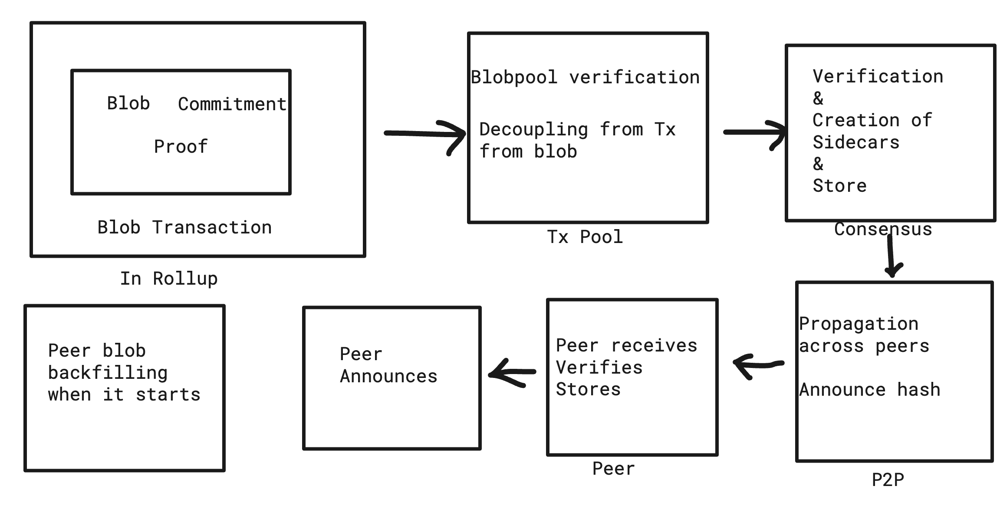

<pre>
  BEP: 336
  Title: ProtoDankSharding
  Status: Draft
  Type: Standards
  Created: 2023-12-04
</pre>

# BEP-336: ProtoDankSharding

## 1. Summary

This BEP proposes introduction of blob-carrying transactions which may contain large amount of data.

## 2. Abstract 

Introduce a new transaction format for “blob-carrying transactions” which contain a large amount of data that cannot be accessed by EVM execution, but whose commitment can be accessed. The format is intended to be fully compatible with the format that will be used in full sharding.

## 3. Status 

Work in progress. 
A PoC has been created in this branch: https://github.com/bnb-chain/bsc/tree/4844 

## 4. Motivation 

Rollups such as OpBnB offer scaling solutions of BSC. But their ability might be limited sometimes due to higher transaction fees and cost of storage in the blockchain.

This BEP provides a solution by introducing blob-transaction which carry blobs that can be arbitrary data (e.g. from a rollup) and they act as temporary storage. Therefore they cost less and have the potential to make it cheaper for rollups to interact with BSC.

## 5. Ethereum Specification 

Details of Ethereum specification can be found [here](https://eips.ethereum.org/EIPS/eip-4844). 
The specification from execution layer will be same in case of BSC. The specifications from consensus layer will differ as BSC doesn't have execution-consensus separation & these will be covered in subsequent sections.

Some key specifications that will be same as Ethereum include:

- Blob data  stored separately from blocks as "sidecars"
- Polynomial Commitment Scheme & Verification Logic
- Addition of a blob transaction to Blob pool & corresponding checks
- Transaction pooling, verification and propagation to support blob transactions and sidecars

## 6. Life of a Blob Transaction

### Blob pool
Once a blob transaction is sent, it ends up in the blob pool which is a separate pool only for blob transactions.

### Verification / Filtering
The blob transaction undergoes initial verification just like in case of a normal transaction.
There's however an extra verification step in `validateBlobSidecar()`. This should verify proofs of the blobs using `VerifyBlobProof()`. 
Once the verification is passed the transaction is stored in the blobpool storage.

### Consensus process: Generation & Storage of Sidecars
During consensus process, the sidecars consisting of blobs are made separately than a block. A block may have multiple sidecars. The payload of execution will include sidecars and the rest will remain the same.

### Propagation of Sidecars among peers
After sidecar passes all the consensus layer checks, it gets propagated across the peers of the node. 
Each peer does its own sanity check on the sidecar it receives.

### Fetching of Sidecars when a node starts
When a node starts it needs to do the sidecar backfilling by requesting them from peers.

## 7. Changes Specifc to BSC

As there is on separation of execution-consensus layers in BSC, the engine api related changes from Ethereum aren't required here. The other changes are summarized below:

# 7.1 Verification

The verification will occur in parlia consensus layer. The blobs are stored separately as sidecars instead of being part of the block. Parlia consensus engine is responsible for persisting these sidecars.

# 7.2 Sidecar Propagation / P2P network

The propagation of sidecars will be done the same way it is done for blocks. 
There will be a `NewMinedSidecarEvent` in `worker.go` which will be subscribed by the handler. The handler will then broadcast the sidecar (`BroadcastSidecar()`) similar to how it is done for blocks.

This will be in the initial implementation which might then be modified to having a broadcasting mechanism at a smaller frequency or request-only broadcast depending on how the network performs.

The networking will follow eth68 version.

The corresponding message for a sidecar that gets received by a peer will be of the form, `NewSidecarMsg = 0x0c` (`eth/protocols/eth/handler.go`)

# 7.3 Sidecar Fetching/Downloading

In line with the current fetcher of BSC which is used for blocks, a new fetcher will be created which will be specifically for fetching blobs/sidecars. Same way for Downloader. A decision needs to be made regarding frequency of fetching as high frequency might be costly for the network.

The fetcher will listen to announcements of new sidecars. Then it imports the sidecars assuming there is no timeout. `handleSidecarBroadcast()` is invoked from a peer which acts as an entrypoint of a new propagated sidecar to the node.

## 8. License
The content is licensed under [CC0](https://creativecommons.org/publicdomain/zero/1.0/).