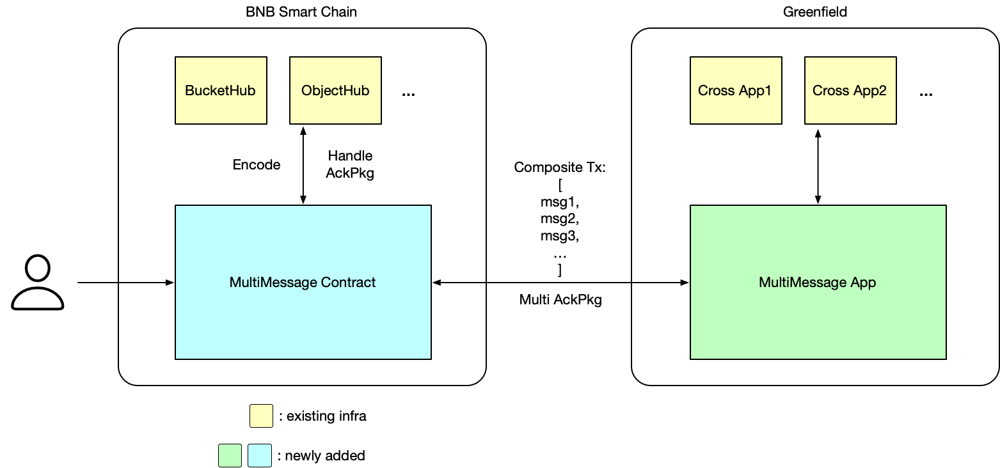

<pre>
  BEP: 363
  Title: Improve Greenfield cross-chain programming capability
  Status: Draft
  Type: Standards
  Created: 2024-03-15
</pre>

# BEP-363: Improve Greenfield cross-chain programming capability

- [BEP-363: Improve Greenfield cross-chain programming capability](#bep-363-improve-greenfield-cross-chain-programming-capability)
  - [1. Summary](#1-summary)
  - [2. Motivation](#2-motivation)
  - [3. Status](#3-status)
  - [4. Specification](#4-specification)
    - [4.1 MultiMessage](#41-multimessage)
      - [4.1.1 Framework](#411-framework)
      - [4.1.2 API](#412-api)
      - [4.1.3 Inputs Encode](#413-inputs-encode)
      - [4.1.4 Error Handling](#414-error-handling)
      - [4.1.5 Relayer Fee](#415-relayer-fee)
      - [4.1.6 Execution Order](#416-execution-order)
    - [4.2 GreenfieldExecutor](#42-greenfieldexecutor)
      - [4.2.1 API](#421-api)
      - [4.2.2 Error Handling](#422-error-handling)
      - [4.2.3 Execution Order](#423-execution-order)
      - [4.2.4 Pros and Cons](#424-pros-and-cons)
  - [5. License](#5-license)

## 1. Summary

This BEP introduces enhanced cross-chain programming through a multi-message channel and a general Greenfield executor channel. It allows triggering Greenfield operations on BSC/opBNB without users having to switch between networks.

## 2. Motivation

Greenfield was initially designed with integrated cross-chain capabilities for BSC and opBNB. This allows users on the BSC/opBNB side to interact with Greenfield's features like buckets, objects, groups, permissions, and more through smart contracts. However, these different operations are currently carried out independently through separate cross-chain channels, lacking atomicity. For instance, if a user wants to sell a bucket on the BSC/opBNB side, the common procedure involves:

1. Calling the createBucket method in the BucketHub contract to create a new bucket.
2. Calling the createGroup method in the GroupHub contract to create a new group.
3. Calling the createPolicy method in the PermissionHub contract to grant members of this group access to the contents of the bucket. 
4. If users wish to purchase access to this bucket, they can be added as members of the group through GroupHub.

Among the operations mentioned, some may succeed while others may fail, which makes error handling challenging.

Besides that, dApps developed on Greenfield, such as a data marketplace, require users to switch back and forth between BSC/opBNB and Greenfield. This back-and-forth can lead to a suboptimal user experience, as users may find it challenging to determine the correct network for initiating operations.

Since the introduction of [BEP-364: Primary Storage Provider acts as the upload agent for object creation and update on Greenfield](https://github.com/bnb-chain/BEPs/pull/364), users no longer need to switch to Greenfield to send transactions for object creation. However, Greenfield's cross-chain capabilities with BSC and opBNB are currently limited, restricting users from completing all operations on Greenfield via BSC/opBNB. Therefore, through this BEP, we aim to enhance Greenfield's cross-chain programming capabilities with BSC and opBNB, enabling users to seamlessly access and manipulate resources on Greenfield directly from the BSC/opBNB network.


## 3. Status

This BEP is in progress.

## 4. Specification

In this BEP, we introduce a new MultiMessage contract, which incorporates a composite cross-chain channel. Users can aggregate different cross-chain operations by initiating cross-chain requests through the MultiMessage contract. These cross-chain requests will either all succeed or all fail, ensuring the atomicity to safeguard user actions.

Additionally, we introduce a new GreenfieldExecutor contract, enabling users to initiate most of transactions on the Greenfield side that is feasible from the BSC/opBNB network.

### 4.1 MultiMessage

MultiMessage contract is designed for sending cross-chain messages that require composition. It is important to note that the MultiMessage contract is limited to supporting existing cross-chain operations such as BucketHub, ObjectHub, GroupHub, PermissionHub, and TokenHub. It enhances these functionalities by providing aggregation capabilities to support the atomicity of composite operations. 

#### 4.1.1 Framework

There will be a new channel, MULTI_MESSAGE_CHANNEL_ID(0x08), a new system contract on the BSC side, and a new cross-app on the Greenfield side for this new message type. We will reuse the existing infra as much as possible. The whole framework will be like this:



The MultiMessage contract facilitates the creation of composite transactions by leveraging existing middle-layer contracts. Upon receiving packages from the MultiMessage channel, the new MultiMessage app endeavors to decode and break down the composite package into individual syn packages, distributing them to the appropriate cross apps. Subsequently, the MultiMessage app consolidates all executed results and transmits the ack package. If any of these operations fail, the entire transaction will be reverted and returned, ensuring the atomicity of the transaction. The MultiMessage contract decodes the ack package and processes it using the existing contracts again.

#### 4.1.2 API

It offers the following API:

```solidity
function sendMessages(address[] calldata _targets, bytes[] calldata _data, uint256[] calldata _values) external payable returns (bool);
```

- `_targets`: Represents contract addresses to be called. They should be the cross-chain middle layer contracts like BucketHub, ObjectHub, GroupHub, and PermissionHub.

- `_data`: Describes the calldata to be passed to the target contract. It should be `abi.encodeCall(TARGET_CONTRACT.FUNCTION_NAME, [PARAMETERS])`.

- `_values`: Indicates the `msg.value` parameter for calling the target contract. 

The length of these arrays should be the same. The group of 3 values at each index(_targets[i], _data[i], _value[i]) represents an operation.

#### 4.1.3 Inputs Encode

The `_data` field is crucial for defining transaction content. To help generate this, BucketHub, ObjectHub, GroupHub, PermissionHub, and TokenHub will add encoding interfaces respectively. The interfaces will be like:

```solidity
// Encode CreateBucket without callback
function encodeCreateBucket(
  address sender,
  CreateBucketSynPackage memory synPkg
) public payable returns (uint8, bytes memory, uint256, uint256, address);

// Encode CreateBucket with callback
function encodeCreateBucket(
  address sender,
  CreateBucketSynPackage memory synPkg,
  uint256 callbackGasLimit,
  ExtraData memory extraData
) public payable returns (uint8, bytes memory, uint256, uint256, address);
```

These methods assist users in creating payloads for specific operations. For example, to send a MultiMessage transaction that includes creating a bucket and a group, and then binding the group to the bucket, the actor could do it by:

```solidity
address sender;

// 1. get the `_data` for creating bucket
CreateBucketSynPackage memory createBPkg;
bytes memory createBData = abi.encodeCall(IBucketHub.encodeCreateBucket, (sender, createBPkg));

// 2. get the `_data` for creating group
CreateGroupSynPackage memory createGPkg;
bytes memory createGData = abi.encodeCall(IGroupHub.encodeCreateGroup, (sender, createGPkg));

// 3. get the `_data` for binding
bytes memory bindMsg;
bytes memory createPData = abi.encodeCall(IPermissionHub.encodeCreatePolicy, (sender, bindMsg));

// 4. assemble all the params and call the contract
address[] memory targets = new address[](3);
bytes[] memory data = new bytes[](3);
uint256[] memory values = new uint256[](3);
targets[0] = BUCKET_HUB_ADDRESS;
targets[1] = GROUP_HUB_ADDRESS;
target[2] = PERMISSION_HUB_ADDRESS;
datas[0] = createBData;
datas[1] = createGData;
datas[2] = createPData;
(uint256 relayFee, uint256 minAckRelayFee) = ICrossChain(CROSS_CHAIN).getRelayFees();
uint256 totalFee = relayFee + minAckRelayFee;
for (uint i;i < 3;++i) {
  values[i] = totalFee;
}

IMultiMessage(MULTI_MESSAGE_ADDRESS).sendMessages(targets, data, values);
```

#### 4.1.4 Error Handling

Actors can specify different extra data for different operations by the encoding methods. The MultiMessage contract will execute the ack package of each operation one by one. For a dApp, there's no difference in the error handling process between sending 5 transactions at once by MultiMessage and sending 5 transactions separately.

#### 4.1.5 Relayer Fee

Actors can specify different relayer fees for different operations by the `_values`. The sum of `_values` should be equal to the `msg.value`.

#### 4.1.6 Execution Order

The transactions will be executed in the order specified in the input array. So please ensure that the order of elements is reasonable. For example, creating a bucket and a group must precede binding them.

### 4.2 GreenfieldExecutor

The GreenfieldExecutor contract acts as a wrapper, enabling users to execute transactions on the BSC/opBNB side that is possible on the Greenfield side. For instance, if a user needs to purchase read quota for a bucket, a capability not currently supported by any cross-chain operations, they would typically have to send a MsgUpdateBucketInfo message on the Greenfield network to make the purchase. To streamline this process and eliminate the need for users to switch to the Greenfield network, they can utilize GreenfieldExecutor to execute such transactions, allowing them to perform most of Greenfield operations on the BSC/opBNB network.

#### 4.2.1 Support Msgs

For safety reasons, GreenfieldExecutor will only support a subset of Greenfield messages. The supported messages are:
- MsgCreatePaymentAccount
- MsgDeposit
- MsgDisableRefund
- MsgUpdateParams
- MsgWithdraw
- MsgMigrateBucket
- MsgCancelMigrateBucket
- MsgCompleteMigrateBucket
- MsgRejectMigrateBucket
- MsgUpdateBucketInfo
- MsgToggleSPAsDelegatedAgent
- MsgDiscontinueBucket
- MsgSetBucketFlowRateLimit
- MsgCopyObject
- MsgDiscontinueObject
- MsgUpdateObjectInfo
- MsgLeaveGroup
- MsgUpdateGroupExtra
- MsgSetTag
- MsgCancelUpdateObjectContent

#### 4.2.2 API

GreenfieldExecutor provides the following interface:

```solidity
function execute(uint8[] calldata _msgTypes, bytes[] calldata _msgBytes) external payable returns (bool);
```

- `_msgTypes`: Represents the msgs type. we will provide a list for the supported Greenfield messages and theirs corresponding index. The length of this array should be the same as the `_data` array.
- `__msgBytes`: Represents the collection of Greenfield messages' bytes to be executed. Multiple messages can be executed simultaneously, but this operation does not guarantee atomicity. Additionally, there is no notification sent back to the initiating side on BSC/opBNB regarding the success or failure of the execution. We will provide a tool to help get the encoded bytes.

#### 4.2.3 Error Handling

This message type will not have an ack package or callback to handle. Regardless of whether the transaction executes successfully, actors on the BSC side will not receive feedback. Therefore, for existing cross-chain message types, we still recommend using proprietary contracts to send transactions rather than using GreenfieldExecutor.

#### 4.2.4 Execution Order

The transactions will be executed in the order specified in the `_data` array.

#### 4.2.5 Pros and Cons

- Pros：
  1. The cross-chain functionality has been further enhanced, improving user-friendliness. Users can now bypass the hassle of switching networks.

- Cons:
  1. Due to design complexities, error handling is not implemented, resulting in users being unable to receive feedback on transaction results.
  2. Initiating transactions on Greenfield via GreenfieldExecutor incurs additional cross-chain fees, making it more costly than initiating transactions directly on the Greenfield network. 

## 5. License

The content is licensed under [CC0](https://creativecommons.org/publicdomain/zero/1.0/).
