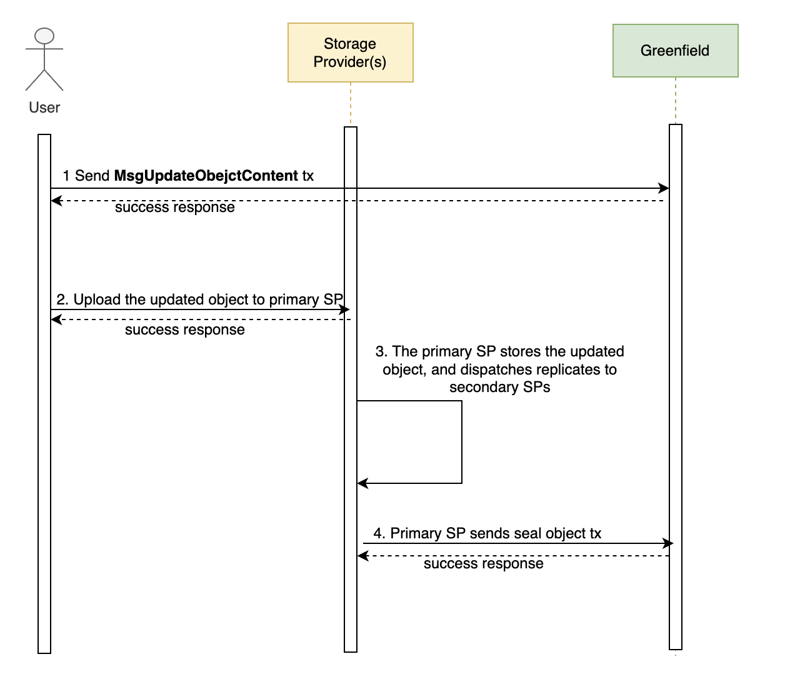

<pre>
  BEP: 366
  Title: Greenfield Atomic Object Update
  Status: Under progress
  Type: Standards
  Created: 2024-01-18
</pre>

# BEP-366: Greenfield Atomic Object Update

<!-- @import "[TOC]" {cmd="toc" depthFrom=1 depthTo=6 orderedList=false} -->

<!-- code_chunk_output -->

- [BEP-366: Greenfield Atomic Object Update](#bep-greenfield-atomic-object-update)
  - [1. Summary](#1-summary)
  - [2. Motivation](#2-motivation)
  - [3. Status](#3-status)
  - [4. Specification](#4-specification)
    - [4.1 Requirements](#41-requirements)
    - [4.2 Implementation](#42-implementation)
    - [4.2.1 Change To Current Model](#421-change-to-current-model)
    - [4.2.2 New Model And Message](#422-new-model-and-message)
    - [4.3 Workflow](#43-workflow)
    - [4.4 Fees & User Charges](#44-fees-&-user-charges)
<!-- /code_chunk_output -->

## 1. Summary
This proposal seeks to enhance the efficiency and reliability of object modifications in the Greenfield network by introducing 
atomic object updates. This update will improve the management of objects in Greenfield by ensuring atomicity, and consistency.

## 2. Motivation
Currently, users face the inconvenience of having to delete and recreate objects in Greenfield in order to replace their content.
This process results in the updated object being assigned a new ID, causing associated policies to be lost since they are based on object ID.
This restriction also applies to [Resource Mirror](https://docs.bnbchain.org/bnb-greenfield/core-concept/cross-chain/mirror/).
Consequently, users are required to re-enforce policies and re-trigger mirroring on the updated object if they had previously done so. 
The proposed solution aims to address these issues and offer a more efficient and seamless object update process.

## 3. Status
This BEP is under progress

## 4. Specification

### 4.1 Requirements
- Atomicity: Atomicity refers to the ability to ensure that updates to an object either all succeed or all fail, guaranteeing that the object is not partially updated.
- Consistency: Ensures that an object remains in a valid and predictable state after a successful update. Object metadata on the Greenfield Blockchain and the data stored on the Storage Provider will be maintained to ensure users can retrieve correct object data at any state of the updating process.

### 4.2 Implementation

#### 4.2.1. Change To Current Model
- ObjectInfo:
  ObjectInfo is used for object metadata stored in Greenfield. Below fields are added.
  - `updating`: Indicate whether an object is being updated. It means the user has initiated an update request, and the SP has not committed the change to Greenfield yet.
  - `updated_at`: The timestamp that the user initiated to update the object. The storage price is determined by it, and a new store fee needs to be calculated.
  - `version`: The current version of the object. It can be used to locate the correct version of object data in SP.

#### 4.2.1. New Model And Message
- `ShadowObjectInfo`: It is introduced to store user updated object metadata, the life cycle for a shadowObjectInfo is 
  started when users trigger the update request on Greenfield, once SP has the updated object data stored and confirm 
  on Greenfield, it will be removed.
  - `operator`: The account who initiates update object request, can be the owner or any account that has been granted permission to update object content.
  - `id`: The id of the object, it is the same as the id in ObjectInfo.
  - `payload_size`: The updated object size.
  - `checksums`: The updated checksums of pieces stored in storage providers.
  - `updated_at`: The timestamp that user initiated to update object request.
  - `version`: The expected next version of the object.
- `MsgUpdateObjectContent`: A new message for users' update object content transaction. The new object's payload_size,
  checksums along with approval from primary SP's approval need to be specifcied.
  - `operator`: The account who initiates update object request, can be the owner or any account that has been granted permission to update object content.
  - `bucket_name`: The bucket name which object belongs to.
  - `object_name`: The object name.
  - `payload_size`:The updated object size.
  - `content_type`: The timestamp that user initiated to update object request.
  - `expect_checksums`: The updated checksums of pieces stored in storage providers.

## 4.3 Workflow

The steps to update an object are illustrated below. To users, it is similar when compared to the current create-upload object process.

1. Users send the transaction to Greenfield with the message `MsgUpdateObjectContent`. This stores the updated object metadata via shadowObjectInfo and flags the object as 
   updating without changing the objectInfo on-chain.

2. Users upload the updated object to the primary SP. The SP will validate if the object can be updated and authenticate 
   the user's account permission.

3. The SP should keep the original and updated object data simultaneously. Version in ObjectInfo or ShadowObjectInfo is 
   also used to identify the object data persistence to ensure there is no conflict. Users should be able to `GET` 
   the original object data at this moment as the version field has not changed.

4. The primary SP sends the sealing object transaction to the Greenfield blockchain, changes to objectInfo will take effect according 
   to meta stored in shadowObjectInfo with version increment. Users will be able to GET the updated object data.
   In the case where SP fails to seal the object after retries, it would send tx RejectSealobject to Greenfield to reject 
   the users request. The metadata ShadowObjectInfo will be removed from chain, updated object data will be removed from SP.

## 4.4 Fees & User Charges
The current policy regarding user charges is as follows: When users create and upload an object, a minimum of 6 months 
storage fee is reserved on Greenfield. This fee is then paid to the Storage Providers' accounts through stream payment. 
If objects are stored for more than 6 months, the storage fee will be calculated based on the actual time.
This rule applies to updating objects as well. When users update an object, Greenfield will deduct the payment for the 
original object from users’s account and reserve at least 6 months of storage fee for the updated object, taking into 
account the new object size. It's important for users to be aware that each time an object is updated, there will be 
associated costs.

## 5. License

The content is licensed under [CC0](https://creativecommons.org/publicdomain/zero/1.0/).
