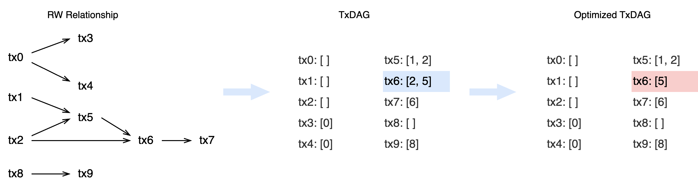

<pre>
  BEP: 396
  Title: Accelerate Block Execution by TxDAG
  Status: Draft
  Type: Standards
  Created: 2024-06-17
</pre>

# BEP-396: Accelerate Block Execution by TxDAG

## 1. Summary

More and more blockchains are aware of the importance of parallel execution for performance improvement. Common parallel processors will optimistically execute transactions in parallel. When conflicts are found, they can only be re-executed to obtain the correct results, which wastes a lot of computing resources. And the worst case may cause performance degradation even worse than sequential execution.

This BEP introduces a transaction dependency graph, `TxDAG`, which provides accurate dependencies in the form of a directed acyclic graph (DAG) for parallelization instead of optimistically estimated dependencies when executing blocks, will greatly improve the efficiency of parallel execution by eliminating the re-execution caused by TX conflict.

## 2. Abstract

This BEP introduces the transaction dependency graph, `TxDAG`, which is used to accelerate the validation of blockchain blocks. This structure has strict format requirements to ensure the correctness of dependencies and is compatible with multiple-chain execution processors.

## 3. Status

Draft

## 4. Motivation

As the scale of transactions and state data grows, performance improvement is the key to providing a good user experience for blockchain. One of the current main optimization directions is to use an optimistic transaction parallel processor, which optimistically assumes that transactions have no dependencies and executes them in parallel, then continues to retry execution after verification fails until all transactions are verified.

However, these additional retries waste a lot of computing resources. The read-write set generated by transaction execution can easily build a dependency graph between transactions, called `TxDAG`. This data can be used in the validating block phase to accelerate block execution and further improve the overall performance of the blockchain.

## 5. Specification

In BSC, the block interval is 3s, that is, the more transactions are executed within 3s, the better the chain performance and the greater the throughput.

The two parts that take the most time in the 3s are the validating block and the mining block. Validators often validate the correctness of the current block and continue to mine the next block based on the latest state.

To improve the performance of block execution, transactions need to be executed in parallel as much as possible to make full use of computing and IO resources. Imagine that if the dependencies of transactions are known, then the parallel execution path can be directly determined, but the dependencies need to be obtained by the read-write set after the transaction pre-execution (static analysis is not within the scope of this BEP).

So two different TX execution strategies can be identified:


In the mining phase, TXs of blocks are executed in parallel or serial to generate `TxDAG`. In the validating phase, `TxDAG` is used to further improve the parallel execution efficiency.

### 5.1 Tx Dependency

Assume that the execution of each transaction is atomic, and the input and output of the execution generate a state read-write set. In concurrent processing, read-only access to the resources is safe, but write operations require exclusive resources.

At the same time, all transactions in the blockchain have a preset order, and transactions with lower TxIndex have higher execution priority.

Therefore, the dependency constraint goes to, if transaction Txi writes `StateA` first, then transaction Txj reads `StateA` and j>i is satisfied. That is to say, Txj depends on Txi, Txj must be executed after Txi.

If a transaction reads and writes the same value at a memory location, the location can be considered read-only.

### 5.2 TxDAG Structure

The structure of `TxDAG` is defined as follows.

```go
type TxDep struct {
	// It describes the Relation with below txs 
	// 0: this tx depends on below txs 
	// 1: this transaction does not depend on below txs, all other previous txs depend on
	Relation  uint8
	TxIndexes []int
}

type TxDAG struct {
	// The TxDAG type, and more types will continue to be expanded in the future 
	// 0: delay the distribution of GasFee, it will ignore all gas fee distribution when tx execute
	// 1: timely distribution of transaction fees, it will keep partial serial execution when tx cannot delay the distribution
	Type uint8
	// Tx Dependency List, the list index is equal to TxIndex
	TxDeps []TxDep
}
```

There is also a potential `TxDAG` "compression algorithm" to further optimize the size. For the DAG describing the dependencies, some are redundant because it only needs to ensure that the final execution path is consistent.



Specific rules: If Txj depends on Txi, j>i, then Txj can ignore the same dependencies as Txi, and the execution path of Txj after the update remains the same as before.

This can keep the size of `TxDAG` as small as possible and avoid generating too large `TxDAG` and wasting network bandwidth.

### 5.3 TxDAG Validation

Since there is a preset order of transactions in the block, Txi can't depend on Txj (i<j) in DAG, and it is also impossible for circular dependencies to occur. 

The verification rules are as follows:

1. TxIndexes must be smaller than the current TxIndex;
2. TxIndexes cannot be repeated;
3. TxIndexes must be sorted in ascending order;
4. TxIndex in `TxDAG` cannot exceed the maximum TxIndex of the block;
5. Verify whether the dependency optimization rules are followed and delete redundant dependencies;

### 5.4 Block Extension

This BEP stores `TxDAG` data in the `BlockBody`, and its Hash in the Extra field of the `Header`. To ensure the correctness of the DAG, if the validator finds an incorrect DAG, it should reject the block.

This is a diagram of the Extra field structure changes in the `Header`:


The specific `BlockBody` structure is defined as follows:

```go
type Body struct {
	Transactions []*Transaction
	Uncles       []*Header
	Withdrawals  []*Withdrawal `rlp:"optional"`
	TxDAG        *TxDAG        `rlp:"optional"`
}
```

### 5.5 TxDAG Generation

The generation of `TxDAG` requires analysis of the transaction read-write set. You can set a read-write tracker in the EVM's `StateDB`. When reading the state from the DB, it is recorded in the read set. When creating or updating the state, it is recorded in the write set. When reverting the modification, the write set also needs to be reverted.

Finally, the read-write dependency of the transaction is traversed to generate `TxDAG`.

### 5.6 Validating Block

The easiest way to speed up validating blocks through `TxDAG` is to integrate with parallel processors. Usually, parallel processors only optimistically execute transactions in parallel. If `TxDAG` is input, the parallel processor can execute the entire block in the best parallel path. The parallel processor can easily find bad DAG.

At the same time, `TxDAG` can be applied in state prefetcher scenarios, and the state can be loaded in advance through simple parallel prefetchers to improve the cache hit rate of the processor.


It is worth mentioning that TxDAG provides dependencies. The processor can flexibly schedule transaction execution according to the characteristics of TxDAG, and can give priority to scheduling paths with more dependencies and longer execution time.

If the DAG generated locally by the validator does not match the block, this block should be rejected.

## 6. Rationale

### 6.1 Block Extension

Since ths size of `TxDAG` will increase with the number of transactions, if there are thousands of transactions in the block, the average `TxDAG` size will be 6KB~10KB.

So this BEP prefers to add `TxDAG` to the `BlockBody`, and add `TxDAGHash` in the Extra field of 'Header` to provide verification and Block's Hash calculation.

### 6.2 GasFee Distribution

In the generation of `TxDAG`, there is a special state modification, GasFee distribution. In BSC, the GasFee of each transaction will be pre-saved in `SystemAddress` and then distributed by the consensus engine.

When collecting read-write sets, the write operation to SystemAddress will be ignored first, and the GasFee calculation needs to be delayed, which ensures the parallelism of the transaction.

When there is a read-write SystemAddress in the transaction, the `TxDAG` will indicate it needs to calculate GasFee in time, which may cause some transactions to be unable to be executed in parallel, or even all transactions can only be executed serially.

### 6.3 System Transaction

In BSC, `Parlia` will add system transactions to distribute rewards, slash validators, etc. after assembling ordinary transactions.

From the perspective of consensus, this part of the transaction can only be executed last, so this part of the transaction is not included in the read-write set and will be saved in the `TxDAG` as all dependencies on all previous Txs.

## 7. Backwards Compatibility

### 7.1 Block Processor

`TxDAG` can be used for Parallel Processor or Serial Processor, but both require DAG verification.

For clients with only a Serial Processor, `TxDAG` can be passed to State Prefetcher to improve cache hit rate and performance.

### 7.2 Hard Fork

This BEP modifies the `Header` structure and introduces `TxDAG` verification rules, which require the implementation of a Hard Fork.

## 8. Security Considerations

### 8.1 Malicious DAG

Malicious DAG can be divided into two categories, Wrong DAG and Bad DAG.

Wrong DAG may include wrong TxIndex, violate preset order, or even have circular dependencies, which can be quickly identified through verification and the block will be rejected.

Bad DAG is more subtle and may provide wrong dependencies, resulting in reduced parallelism or even conflicting DAGs. This type of DAG needs to be identified by the block processor, and if found, the block should be rejected.

### 8.2 Parallel Processor

When the parallel processor uses `TxDAG` for execution, it is still necessary to check whether there are conflicts between transactions to avoid network failures caused by Bad DAG.

## 9. License

The content is licensed under [CC0](https://creativecommons.org/publicdomain/zero/1.0/).