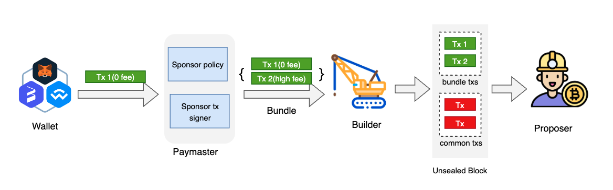
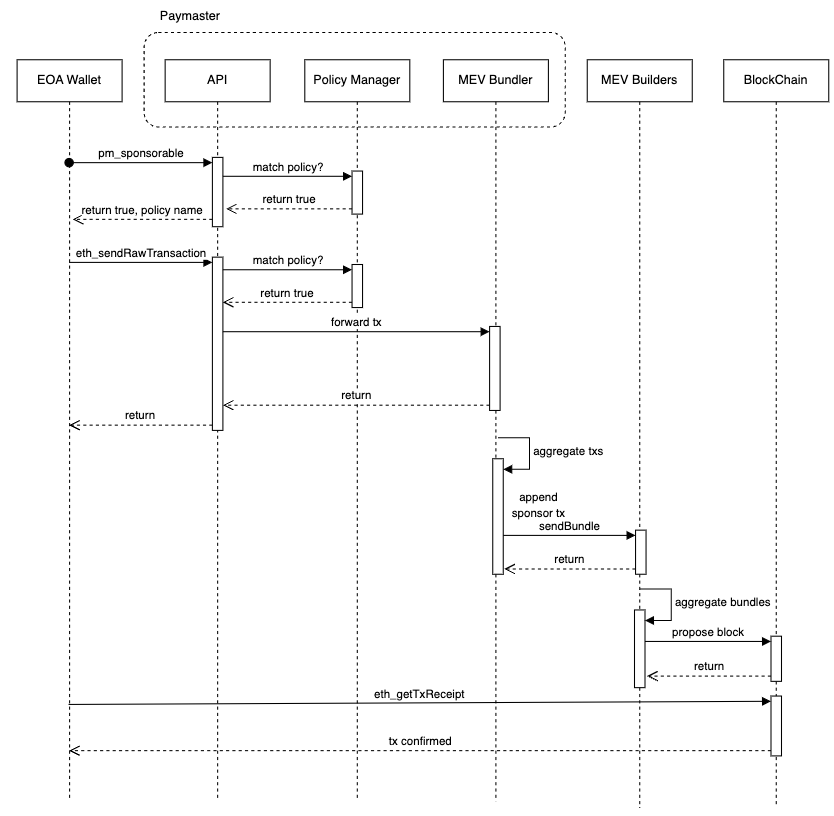

<pre>
  BEP: 414
  Title: Paymaster API Spec for EOA Wallets
  Status: Draft
  Type: Standards
  Created: 2024-07-23
</pre>

# BEP-414: Paymaster API Spec for EOA Wallets

## 1. Summary

Unlike the paymaster defined in EIP-4337, this proposal introduces a paymaster solution specifically tailored for EOA (Externally Owned Account) wallets, along with standardized paymaster APIs. With minimal modifications, wallets can integrate paymasters that implement these API standards, enabling users to send transactions with zero gas fees.

## 2. Abstract

Under [BEP322](https://github.com/bnb-chain/BEPs/blob/master/BEPs/BEP322.md)'s Proposer-Builder Separation (PBS) architecture, the validator no longer verifies individual transaction gas prices within a block. The private transactions are grouped into bundles and submitted to the builder, who prioritizes based on the aggregate gas price of each bundle. Within a single bundle, gas prices can vary—some transactions may have zero fees while others have higher fees. This flexibility enables features such as sponsored gas fees or gasless transactions. Leveraging this feature, the paymaster, after verifying the user transaction's sponsorship rules, appends a high gas price sponsor transaction to the user's transaction. These are then bundled together and submitted to the MEV builder for inclusion in the blockchain. BEP322 ensures strong atomicity for bundles, guaranteeing that both the user's transaction and the paymaster's sponsor transaction within the bundle are either included in the blockchain together or not at all.

To integrate with multiple paymasters, existing wallets need to implement minor modifications to their current transaction sending process. These modifications primarily involve adding API calls to paymaster interfaces. This BEP standardizes the paymaster API specifications and details the step-by-step integration process for wallet developers.

## 3. Status

Draft.

## 4. Motivation

There is growing interest in sponsoring transactions for users who lack BNB for gas fees. Currently, EIP-4337 is the most widely applied solution, but it's designed for smart contract wallets. Most users still rely on EOA wallets, and EIP-7702 may potentially provide a unified Account Abstraction framework for both contract and EOA wallets in the future. Therefore, before EIP-7702's implementation, it's necessary to offer a lightweight gasless solution for EOA wallets.

## 5. Specification

### 5.1 Definitions

**Bundle**: An ordered array of transactions that execute atomically, ensuring all transactions in the bundle are processed together or not at all.

**Builder**: A new stakeholder in the MEV supply chain responsible for constructing blocks. Builders package transaction bundles, individual transactions from the public txpool, and private transaction order flow into proposed blocks.

**Proposer**: A validator who selects the most profitable block from multiple builders' proposals for inclusion in the blockchain.

**Paymaster**: An infrastructure component that enables transaction sponsorship, allowing self or third parties to cover gas fees.

**Sponsor Policy**: A set of rules defined by the gas sponsor to determine which transactions qualify for sponsorship. This may include criteria such as whitelisted transaction senders or specific transaction types.

### 5.2 Workflow



Any wallet can submit a zero gas price transaction to the paymaster. The paymaster then verifies the transaction's eligibility against existing sponsor policies. If approved, it appends a high-gas-price sponsor transaction to the user's original transaction, forming a bundle. This bundle is then dispatched to multiple MEV builders for potential inclusion in a block. Leveraging the atomicity of bundles, both the user's original transaction and the sponsor's transaction are either included in the blockchain together or not at all.

### 5.3 Wallet Interaction



For the Wallet Implementation:

- **Transaction Assembly**: The wallet queries the `pm_isSponsorable` API to determine transaction sponsorship eligibility.
- **Gas Price Setting**: If sponsorship is available, the wallet sets the gas price to zero and informs the user that the transaction is sponsored by the “policy name” returned by the `pm_isSponsorable` API.
- **Transaction Submission**: The wallet submits the transaction to the Paymaster using the `eth_sendRawTransaction` API.

No further modifications to the existing process are necessary. It may take 3-9 seconds for the tx to be verified on the chain on the BSC network and 1-3 seconds on the opBNB network.

### 5.4 Paymaster API Spec

Paymaster needs to implement a JSON-RPC API called `pm_isSponsorable`, so that it can return sponsor and policy information to wallets. Paymaster also needs to implement `eth_sendRawTransaction` JSON-RPC API. The detailed API Specs are defined as below:

#### `pm_isSponsorable`

**Request Parameters**

- `jsonrpc`: The JSON-RPC protocol version ("2.0").
- `id`: A unique identifier for the request (1 in this example).
- `method`: The method name to be invoked ("pm_isSponsorable").
- `params`: An array containing a single object with the following fields:
   - `to`: The recipient address of the transaction.
   - `from`: The sender address of the transaction.
   - `value`: The value of the transaction in hexadecimal.
   - `data`: Additional data for the transaction in hexadecimal.
   - `gas`: The gas limit of the transaction in hexadecimal.

**Example:**

```json
{
  "jsonrpc": "2.0",
  "id": 1,
  "method": "pm_isSponsorable",
  "params": [
    {
      "to": "0x...", // an address
      "from": "0x...", // an address
      "value": "0xa1",
      "data": "0x",
      "gas" : "0xa1"
    }
  ]
}
```

**Response Fields**

- `jsonrpc`: The JSON-RPC protocol version ("2.0").
- `id`: The unique identifier for the request (1 in this example).
- `result`: Return error if no sponsor is found for the given tx or return an object containing the sponsorship details:
  - (Required) `sponsorable`: A boolean indicating whether the transaction is sponsorable (true or false).
  - (Optional) `sponsorName`: The name of the sponsor.
  - (Optional) `sponsorIcon`: The icon of the sponsor.
  - (Optional) `sponsorWebsite`: The website of the sponsor.


**Example:**

Success Match Response:
```json
{
  "jsonrpc": "2.0",
  "id": 1,
  "result": {
    "sponsorable": true,
    "sponsorName": "MockWeb3VC Ltd.",
    "sponsorIcon": "https://www.mockweb3vc.io/favicon.ico",
    "sponsorWebsite": "https://www.mockweb3vc.io/"
  }
}
```
Failed Match Response:

```json
{
    "jsonrpc": "2.0",
    "id": 1,
    "result": {
      "sponsorable": false
    }
}
```

#### `eth_sendrawtransaction`
The `eth_sendrawtransaction` API implemented by the Paymaster should follow this [Ethereum API Spec](https://ethereum.org/en/developers/docs/apis/json-rpc/#eth_sendrawtransaction). The client can create a new message call transaction or a contract creation for signed transactions via `eth_sendrawtransaction` API.

**Request Parameters**
The `params` should contain the signed transaction data.

**Example:**
```json
{
   "jsonrpc": "2.0",
   "id": 1,
   "method": "eth_sendRawTransaction",
   "params": [
 "0x02f86a6102850df8475800850df84758000a94cd9c02358c223a3e788c0b9d94b98d434c7aa0f18080c080a0bcb0e8ffa344e4b855c6e13ee9e4e5d22cff6ad8bd1145a93b93c5d332100c2ca03765236eba5fbb357e35014fd19ba4b3c6b87f3793bd14dddf7913fc8dcc88bf"
   ]
}
```

**Response Fields**
DATA, 32 Bytes - the transaction hash.

**Example:**
```json
{
  "id":1,
  "jsonrpc": "2.0",
  "result": "0xe670ec64341771606e55d6b4ca35a1a6b75ee3d5145a99d05921026d1527331"
}
```

### 5.5 Sponsor Policy && Fee Charge
Paymasters have complete autonomy in defining sponsor policies, which can be implemented either on-chain or off-chain:

- **On-chain policy example**: Verifying if the transaction sender holds a specific NFT token.
- **Off-chain policy example**: Defined by sponsors within the paymaster platform, such as maintaining whitelists for transaction senders or specific interacting contracts.

Paymasters also enjoy flexibility in their fee collection methods. Charges can be directly deducted from the sponsor's credit card, or sponsors can pre-deposit cryptocurrency to the paymaster platform, from which the balance is then charged.

## 6 License
The content is licensed under CC0.
