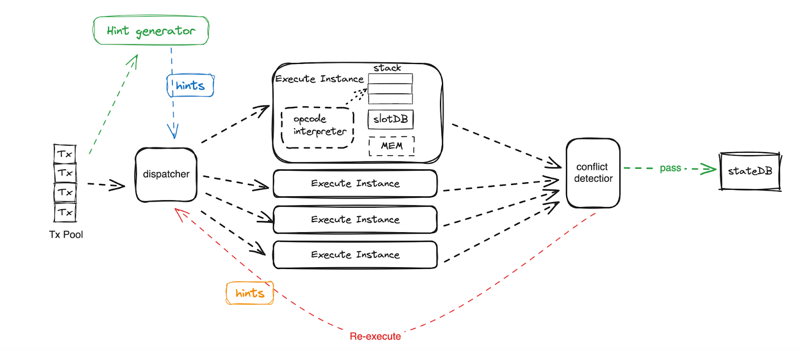

<pre>
  BEP: 425
  Title: Hint based Parallel Transaction Execution
  Status: Draft
  Type: Standards
  Created: 2024-08-21
</pre>

# BEP-425: Hint based Parallel Transaction Execution

## 1. Summary

This BEP productionizes the [BEP-130-Parallel Transaction Execution](https://github.com/bnb-chain/BEPs/pull/130) implementation and introduces the parallel hint component to enhance the performance by reducing or eliminating the overhead of re-execution caused by txs dependencies .
Moreover, besides BSC, this BEP is also targeting at landing the whole hint-based parallel execution solution in opBNB.

## 2. Abstract

This BEP has several goals:
- Productize the parallel transaction execution, make it accepted to the BSC and opBNB community
- Introduce hint based mechanism to reduce and eliminate the re-execution caused by transactions dependencies.

## 3. Status

Draft

## 4. Motivation

The [BEP-130-Parallel Transaction Execution](https://github.com/bnb-chain/BEPs/pull/130) introduced an advanced and comprehensive design of Parallel tx execution, which is expected to improve the transaction execution performance by fulling utilizing the multi-core computation resources.

The reference implementations [v1.0](https://github.com/node-real/bsc/pull/12) and [v2.0](https://github.com/node-real/bsc/pull/39) have been developed in 2022, and performance improvements have been observed. However, the implementation was not productized and was not merged into the BSC upstream code repo.

On the other hand, the BSC and opBNB’s requirements of execution performance have become more and more intense. And parallel execution has become one of the hottest topics in the EVM performance discussion all over the world. So it is indispensable for the BNB Chain ecosystem to not have it.

Another important feature required for parallel execution is to eliminate the performance degradation introduced by the dependencies of transactions. The re-execution overhead is the one of the most severe issues that cause the limitation of performance improvement (and even drop) due to the measurement of [BEP-130 v1.0 implementation](https://github.com/node-real/bsc/pull/12).

## 5. Design Principle

For parallel transaction execution, the design is almost the same with BEP-130.

### Compatible

The parallel execution must produce the same result as the current sequential execution. And to make it compatible and robust, a fallback mechanism can be introduced to switch back to sequential execution when there is abnormal parallel execution.

### Modularized

The implementation should be kept within the execution layer, it should not change the data structure or interface of other modules.

This BEP will do more modularity at code level. to make sure that the parallel execution implementation is decoupled with sequential execution implementation as much as possible.

The introduction of the hint component should be decoupled with the other components of EVM, and provide options for users to enable/disable it.

### No HardFork required

The hint-based solution should have minimal impact on the existing implementations of EVM, and should pursue no hard fork to reduce the impact of users.

### Configurable

The node could configure its parallel execution parameters based on its hardware resources, since different hardware could have different best practice parameters.

The parameters that can be configured could be: enable/disable, concurrent number.

The parameters of the hint component can be configured to be: enable/disable, hint file type, etc.

### Eliminate the conflict as a goal

As re-execution of the conflict transactions can degrade the performance and provide huge complexity of the implementation, the elimination of the conflict and re-run is the primary goal of this BEP.

Nevertheless, this BEP does not target the removal of all components for handling conflicts, as it can be used as a fallback mechanism to guarantee correctness. Although in the long term, other BEPs can be created to achieve the removal and simplify the implementation.

### Keep It Simple And Smart

Both the design of the Hint component and the parallel execution engine should be simple and clear.

The implementation can be complicated but should be clear, self-explained and modularized as much as possible

## 6. Specification

### Overview

The goal of this BEP is to productize the parallel transaction execution and introduce the hint mechanism.

#### One Data Type will be introduced in the system
-	Hint 

The Hint is a kind of data that contains the information of transactions which will be generated by HintGenerator and used as input to block execution engines. It provides the guide for the EVM to execute transactions of the block with best performance.

The format of the hint data is not limited, and it depends on how HintGenerator and EVM explain the hint data. e.g BEP-396 will be the first implementation of the hint system that uses TxDAG as the hint data.

#### Two major components will be introduced and affected in block execution:
- HintGenerator

It is the component to generate the execution hint. There is no limitation of the HintGenerator as long as its output is meaningful for guide the EVM transaction execution.

- HintBasedDispatcher 

The dispatcher, which is the component for scheduling the transactions to parallel executors, will be modified to get the hint information and use that information to dispatch transactions to different parallel executors. This could help improve the parallelization by reducing or eliminating the rerun caused by transaction conflicts.

### 6.1 Hint and Hint generator

Several methods are considered to be candidate of HintGenerator:

- Profiling based solution:

The HintGenerator is a modified EVM that simulates the execution of the transactions and collects the profiling information, then the profiled data will be processed and converted into a data format that is the Hint data.  Then the standard EVM would execute the transactions with the hint data.
 
- Dependence analysis solution:

Rather than use a dedicated resource to do profiling, this method depends on the block builder (miner or sequencer) to generate the hint at the same time of block building, and then the other nodes in the network could use the hint for parallel execution.

The [BEP-396](https://github.com/bnb-chain/BEPs/pull/396) is a detailed design and implementation of this method, with TxDAG data as the hint.  

- Static Analyzer

This method will analyze the TXs statically, and build up the hint message from the analysis. Then the nodes in the network would use the static analysis result as hint data.

The 3 kinds of solution both have their own pros and cons, e.g. the Dependence analysis solution is easy to be implemented but may not be easy to benefit miners. The Static analyze solution can benefit both the miner and block synchronizer but is complicated to be implemented.

### 6.2 Dispatcher

The original dispatcher designed in BEP-130-Parallel Transaction Execution is a static dispatch that conducts simple analysis of transactions and dispatch tx based on from and to. So if two Tx from different accounts call the same contract which causes the contract’s global state to change, the conflict may exist and the dispatcher can not find it ahead of execution time.

The dispatcher in the BEP would accept the hint data as input, and use the hint information to dispatch the transactions for execution. As the hint data would have the conflict / dependency information, the dispatcher could recognize the conflict and arrange txs that have dependencies to run in one thread/routine, the conflict and re-execution can be eliminated.

### 6.3 Conflict Detection

Although the hint based solution is expected to eliminate the conflict of parallel execution, this BEP suggest to have the conflict detection component to play the following role:

- As the arbitrator of the quality of the hint info

The quality of the hint information is the key to guarantee the performance of parallel execution, and if there is incorrect or low quality hint, the performance

- As the fallback solution to guarantee the correctness of parallel execution

The hint information can be optional for different design and implementation of hint solutions, so the parallel EVM should not assume no conflict happened, and hence conflict detection must exist to guarantee the correction of execution.

### 6.4 Transaction Redo

Similar to conflict detection, even the goal of this BEP is to eliminate the re-execution caused by conflict, it must exist to play the role as a fallback solution to guarantee the parallel execution.

### 6.5 Block Mining and Sync

The ultimate goal of this BEP is to benefit all nodes in the network, both block miner and block synchronizer.

However, considering the complexity of implementation, we believe a method that takes progressive approach is more reasonable. So this BEP is expected to have a solution that first benefits the block sync node in the network and then extended to the block miner in the network.

More specifically, BEP-396 proposed a detailed design and implementation that uses TxDAG generated by block miner as hint data and helps benefit the parallel block sync nodes.

## 7. Security Considerations

### 7.1 Malicious Hint message

The hint message is the key to guarantee the performance of parallel execution, so malicious hint messages or low quality of hint messages should be banned or slashed in the system.

On the other hand, the quality of the hint information is designed to have no impact on the correctness of the behavior of block build and synchronization, as the parallel execution engine is designed to have a fallback mechanism to guarantee the functionality of EVM regardless of the existence of hint information.

### 7.2 Parallel Processor

The parallel processor is designed to have equality security level with serial processor, which means it should have no impact of current security guarantee of EVM. And the risk introduced by parallel processor should be as low as possible.

## 8. License

The content is licensed under [CC0](https://creativecommons.org/publicdomain/zero/1.0/).