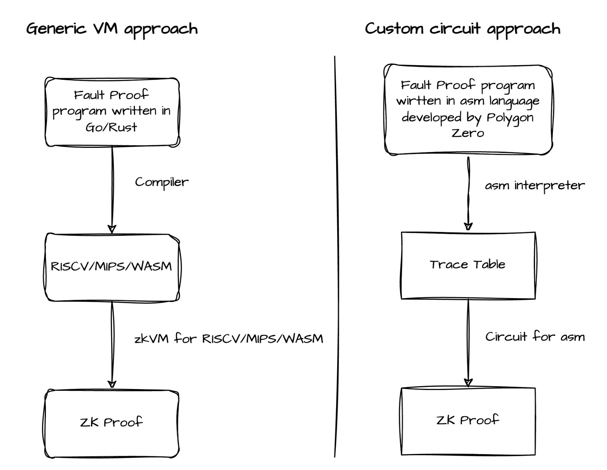
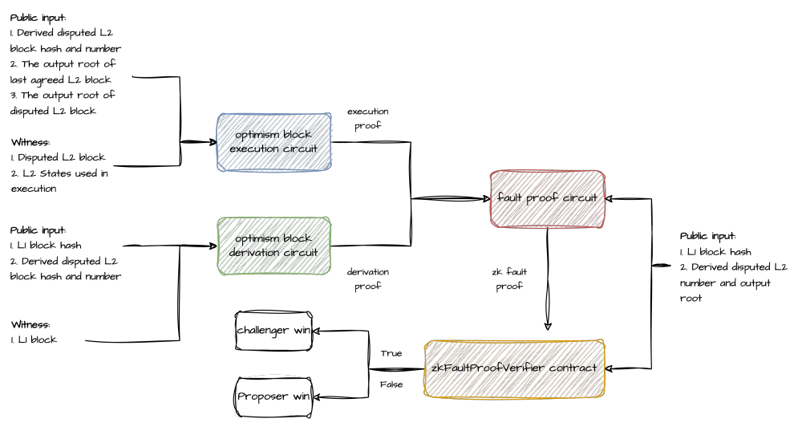
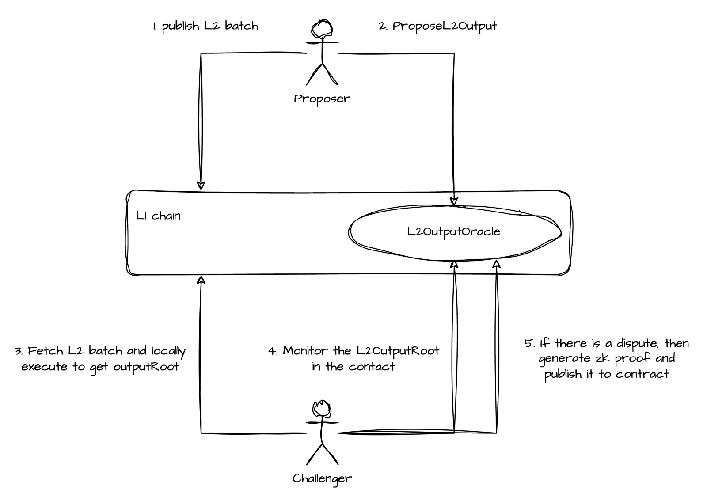

<pre>
  BEP: 431
  Title: ZK Fault Proof System for opBNB
  Status: Draft
  Type: Standards
  Created: 2024-09-05
</pre>

# BEP-431: ZK Fault Proof System for opBNB

## 1. Summary

This proposal introduces a Zero Knowledge (ZK) fault proof system for opBNB, utilizing a custom circuit approach based on Polygon Zero's type1 zkEVM. The system aims to enhance the security and efficiency of the opBNB network by reducing the challenge period and simplifying the dispute resolution process.

## 2. Abstract

The current fault proof system for Optimism-based chains like opBNB involves a complex, time-consuming, and potentially expensive process. This proposal outlines a ZK-based approach that significantly improves upon the existing system. By using custom circuits for block execution and derivation, along with a specialized fault proof circuit, this system can reduce the challenge period from several days to approximately 12 hours while also minimizing gas costs and mitigating censorship risks.

## 3. Status

Draft

## 4. Motivation

The current fault proof system for Optimism-based chains has several disadvantages:

1. High gas costs due to multiple on-chain transactions.
2. Vulnerability to censorship attacks during congested periods.
3. Long challenge periods, negatively impacting user experience.

A ZK-based fault proof system addresses these issues by requiring only a single on-chain transaction, reducing susceptibility to censorship, and allowing for a significantly shorter challenge period.

Additionally, implementing a ZK fault proof system is a crucial step towards achieving Stage 2 rollup status, as defined by [L2Beat's framework for evaluating rollup maturity](https://medium.com/l2beat/introducing-stages-a-framework-to-evaluate-rollups-maturity-d290bb22befe).

## 5. Specification

### 5.1 Background

In the last year, Optimism initiated a Foundation Mission Request to develop the Op Stack Zero Knowledge Proof (ZKP) for verifying the correctness of its fault proof program. This initiative aims to reduce the challenge period for Optimism from several days to approximately 12 hours and avoid complicated interactive challenge procedures.

Two main approaches have been considered:

1. **Generic VM Approach**: This involves compiling the fault proof program (written in Go or Rust) into a generic instruction set such as RISCV, WASM, or MIPS. These compiled instructions are then verified for correctness using zkVMs like zkRISCV, zkWASM, or zkMIPS.

2. **Custom Circuit Approach**: This involves developing a custom circuit specifically for the fault proof program, which is expected to offer better performance compared to the generalized VM method.

Our proposal aligns with the custom circuit approach, inspired by Polygon Zero's announcement of a highly performant type1 zkEVM.

### 5.2 Current Fault Proof Overview

The existing Optimism fault proof system consists of two main components:

#### 5.2.1 Offchain Fault Proof Program

1. Derive the disputed block from the anchor L1 block hash.
2. Execute the disputed block based on the agreed L2 state root and compare the execution result with the claimed output root.

#### 5.2.2 Onchain Fault Dispute Game

1. The attacker and defender take turns initiating on-chain actions based on the claims submitted on-chain by their opponents until they agree on the disputed L2 block.
2. They repeat the challenge process until they agree on the disputed instruction of the off-chain fault proof program, which uses the disputed L2 block as the input.
3. Finally, they invoke the on-chain MIPS contract to execute the disputed instruction, which determines the winner.

#### 5.2.3 Disadvantages of the Current System

1. High gas costs due to multiple on-chain transactions from both attacker and defender.
2. Vulnerability to censorship attacks during network congestion, necessitating long challenge periods for each player to act.
3. Extended challenge periods (up to 7 days) to mitigate censorship risks, negatively impacting user experience.

### 5.3 Architecture of ZK Fault Proof

The ZK Fault Proof system for opBNB consists of the following key components:

1. **Optimism Block Execution Circuit**: Processes L2 blocks according to the Optimism state transition protocol and generates an execution proof to verify the correctness of the L2 block.

2. **Optimism Block Derivation Circuit**: Encodes the Optimism block derivation logic from an L1 block hash and produces a derivation proof to verify the correctness of the derived L2 block.

3. **Fault Proof Circuit**: Encodes the ZKP verification logic to validate both the execution proof and derivation proof, and includes the consistency check logic between the public inputs of the circuits.

4. **zkFaultProofVerifier Contract**: This contract resides on the L1 chain and is used to verify the correctness of the ZK fault proof, determining which party wins.

### 5.4 System Workflow

1. The challenger monitors the L2 output root proposed on-chain by the proposer.
2. Upon finding an invalid output root, the challenger generates a ZK fault proof for the disputed L1 block.
3. The challenger submits the proof to the zkFaultProofVerifier contract.
4. If verification passes, the challenger wins the dispute.

### 5.5 Detailed Process

1. **L1 Block Processing**: Extract data from L1 blocks.
2. **Block Derivation**: Derive L2 blocks from L1 data.
3. **L2 Block Execution**: Process transactions and state changes.
4. **Proof Generation**: Create ZK proofs for derivation and execution.
5. **Fault Proof Circuit**: Combine proofs into a comprehensive fault proof.
6. **On-chain Verification**: Verify the proof using the zkFaultProofVerifier contract.

### 5.6 Circuit Design

#### 5.6.1 Block Execution Circuit

- Transaction Processing: Executes individual transactions within the block.
- State Updates: Manages changes to the L2 state resulting from transaction execution.
- Gas Accounting: Tracks gas usage for each transaction and the block as a whole.
- Receipt Generation: Creates transaction receipts containing execution results.

#### 5.6.2 Block Derivation Circuit

- L1 Data Parsing: Extracts relevant information from L1 blocks.
- L2 Block Construction: Assembles L2 blocks based on the parsed L1 data.
- Sequencing Rules Implementation: Implements the rules for ordering transactions within L2 blocks.

#### 5.6.3 Fault Proof Circuit

- Proof Verification: Checks the validity of both execution and derivation proofs.
- Consistency Checks: Ensures that the inputs and outputs of the execution and derivation circuits are consistent.
- Final Proof Generation: Produces a single, comprehensive proof of the entire L2 block processing.

### 5.7 On-chain Verifier Contract

The zkFaultProofVerifier contract:

1. Verifies ZK proofs submitted by challengers.
2. Determines the outcome of challenges.
3. Updates the L2 state on L1 if a challenge is successful.

### 5.8 Challenger Implementation

The challenger:

1. Monitors L2 output roots proposed on L1.
2. Detects inconsistencies between proposed and calculated L2 states.
3. Generates ZK fault proofs for detected inconsistencies.
4. Submits challenges to the on-chain verifier contract.

### 5.9 Performance Optimizations

1. Parallel Proof Generation: Implement techniques to generate proofs for multiple transactions or blocks in parallel.
2. Incremental Proving: Develop methods to update proofs incrementally as new transactions are processed.
3. Proof Aggregation: Explore techniques to combine multiple proofs into a single, more compact proof.

### 5.10 Security Measures

1. Formal Verification of circuits and contracts.
2. Third-party audits of the entire system, including circuits, contracts, and off-chain components.
3. Phased implementation, starting with a limited scope and gradually expanding responsibilities.

### 5.11 Towards Stage 2 Rollup

The implementation of the ZK Fault Proof System is a significant step towards achieving Stage 2 rollup status for opBNB. Let's review the [stages](https://medium.com/l2beat/introducing-stages-a-framework-to-evaluate-rollups-maturity-d290bb22befe) as defined by L2Beat and assess opBNB's current status and path forward.

#### L2Beat Rollup Stages

- Stage 0 - Full Training Wheels
  - The project calls itself a rollup.
  - L2 state roots are posted on L1.
  - The project provides Data Availability (DA) on L1.
  - Software capable of reconstructing the rollup's state source is available.
- Stage 1 - Limited Training Wheels
  - The project uses a proper proof system.
  - There are at least 5 external actors that can submit a fraud proof.
  - Users can exit without the operator's coordination.
  - Users have at least 7 days to exit in case of unwanted upgrades (Security Council and governance excluded).
  - The Security Council is properly set up.
- Stage 2 - No Training Wheels
  - The fraud proof system is permissionless.
  - Users have at least 30 days to exit in case of unwanted upgrades.
  - The Security Council is restricted to act only due to errors detected on chain.

#### Current Status of opBNB

opBNB is currently at **Stage 0**, with the following characteristics:
- Operated by a centralized sequencer.
- Uses an optimistic rollup model with a 7-day challenge period.
- Has a Security Council(admin, whitelisted challengers) with significant powers over the network.
- Source-available software for state reconstruction from L1 data.

#### What opBNB Needs for Stage 1 and Stage 2

1. Stage 1
    - 1.a The project uses a proper proof system.
    - 1.b There are at least 5 external actors that can submit a fraud proof.
    - 1.c Users have at least 7 days to exit in case of unwanted upgrades (Security Council and governance excluded).
2. Stage 2
    - 2.a The fraud proof system is permissionless.
    - 2.b Users have at least 30 days to exit in case of unwanted upgrades.
    - 2.c The Security Council is restricted to act only due to errors detected on chain.

#### How ZK Fault Proof System Helps and associated actions

- As a fraud proof mechanism, the ZK Fault Proof System enables any participant to submit proofs and contest invalid state transitions. We plan to gradually extend the ability to submit fraud proofs to external parties following the system's implementation. This process will begin with whitelisted community members and eventually open up to all users, addressing points 1.a, 1.b, and 2.a mentioned earlier.
- The ZK Fault Proof System's implementation will include a pre-submitted op-geth image on L1, representing opBNB's execution logic. We propose introducing a time-delay mechanism for image upgrades (e.g., 7 or 30 days). This approach allows users who disagree with a new version to withdraw their deposits before the upgrade takes effect, satisfying requirements 1.c and 2.b.
- These modifications will allow us to significantly reduce the operator's administrative powers and limit the Security Council's authority to addressing on-chain errors only. This change fulfills requirement 2.c.

By implementing the ZK Fault Proof System and executing these additional actions, opBNB will make substantial progress towards achieving Stage 2 rollup status. This advancement will significantly enhance the network's security, decentralization, and overall user experience. The process involves a gradual transition through Stage 1, systematically removing the "training wheels" to ultimately reach the fully decentralized and secure Stage 2 status.

## 6. Rationale

The custom circuit approach offers superior performance compared to generic VM solutions, providing:

1. Faster proof generation: 5-6 times faster than generic VM approaches.
2. Lower computational costs: Generates 10 times fewer ZK cycles for the same batch.
3. Improved scalability: More efficient proof generation allows for handling larger transaction volumes.
4. Reduced challenge period: From 7 days to approximately 12 hours.
5. Minimized gas costs: Requires only a single on-chain transaction for dispute resolution.

## 7. Backwards Compatibility

This proposal requires updates to the opBNB node software and deployment of new verification contracts. Existing transactions and smart contracts are unaffected.

## 8. Security Considerations

1. Thorough auditing and testing of custom circuits and verification contracts.
2. Special attention to the correctness of block execution, derivation, and fault proof circuits.
3. Implementation of additional security measures to meet Stage 2 rollup requirements, including:
   - Extended exit windows for users (e.g., 30-day exit period).
   - Limitations on Security Council powers.
   - Fully permissionless validation system.

## 9. License

The content is licensed under [CC0](https://creativecommons.org/publicdomain/zero/1.0/).
