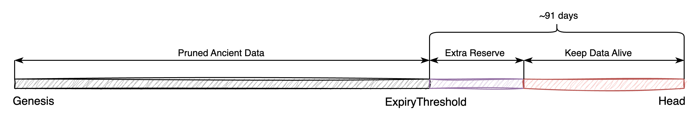
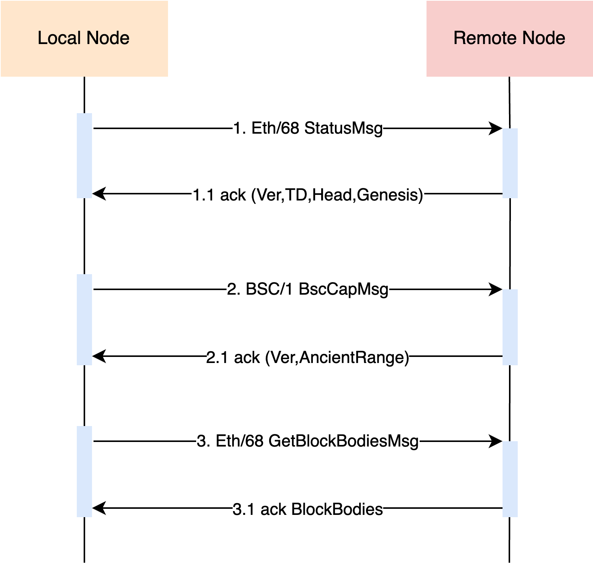

<pre>
  BEP: 453
  Title: Optional Ancient Block Pruning Mechanism
  Status: Draft
  Type: Standards
  Created: 2024-11-01
  Author:  galaio (@galaio), zzzckck (@zzzckck)
  Description: The node could prune ancient blocks older than 90 days and search required ancient data from the network.
  Discussions: 
</pre>

# BEP-453: Optional Ancient Block Pruning Mechanism

## 1. Summary

This BEP tries to solve the burden of redundant and infinitely growing ancient blocks on the entire network. It proposes an optional pruning mechanism for ancient blocks so that most nodes only need to maintain a bounded storage size for it.

## 2. Status

Draft

## 3. Motivation

The ancient blocks are useless for executing the latest blocks. The table below shows the data growth from December 2022 to December 2023:

| Time          | Chain Data Size | Ancient Data Size |
|---------------|-----------------|-------------------|
| December 2022 | 1.73TB          | 1.07TB            |
| December 2023 | 2.45TB          | 1.52TB            |

The ancient blocks of Dec-2023 account for 61% of all chain data and increased by 42.6% compared to Dec-2022 in the [BNB Smart Chain Annual Storage Report 2024](https://www.bnbchain.org/en/blog/bnb-smart-chain-annual-storage-report-2024).

This BEP introduces a hardcoded minimum retention bounded ancient range while satisfying most scenarios of ancient block requirements and reducing storage costs.

Meanwhile, the ancient blocks can be maintained by some archive node or Greenfield, users rely on other decentralized protocols or centralized organizations to fetch ancient blocks.

## 4. Specification

This BEP is an optional ancient block pruning mechanism that aims to reduce node operating costs. It does not affect any consensus rules and may affect the behavior of P2P Protocol and RPC Protocol. By default, the node keeps all ancient blocks.

| Parameter                 | Value   | Description                                                                                                                                            |
|---------------------------|---------|--------------------------------------------------------------------------------------------------------------------------------------------------------|
| ReserveAncientBlocks      | 2592000 | The hardcode defines the minimum range of ancient blocks to retain, and ancient blocks exceeding this threshold will be pruned, around 90 days in BSC. |
| ExtraReserveAncientBlocks | 28800   | An additional reserved nums is added to avoid problems at the prune boundary. When set to -1, it means permanent reservation.                          |



### 4.1 Prune

By default, the node will keep all ancient blocks. If pruning is enabled, only the data within the range of ReserveAncientBlocks+ExtraReserveAncientBlocks will be retained. The deleted data includes:
1. Block Headers;
2. Block Bodies;
3. Transaction Receipts;
4. Transaction indexes;
5. Other Ancient related Metadata, including hashes, difficulties, etc.;

The client recommends using the online pruning method. From the last storage report, it can save 57.3% of storage space for the node. There is no need to worry about the pruned data, which will continue to be maintained by the decentralized community and various centralized organizations.

The client should also support restoring ancient blocks from node snapshot.

### 4.2 P2P Protocol

For nodes that enable ancient block pruning, messages involving pruned data need to return empty data.

This BEP modifies the subprotocol BSC/1 and the HandShake message’s extra field to exchange the range of ancient blocks when connecting to a remote peer.

Specific message modifications:

```go
const (
   DefaultExtraType byte = iota
   ReserveAncientBlocksExtraType
)

// The number of range for ancient blocks that the node promises to retain, ChainHead is updated through the Eth protocol
type ReserveAncientBlocksExtra struct {
   ReserveBlocks int64 // -1 means reserve all ancient blocks
}

// BscCapPacket is the network packet for bsc capability message.
type BscCapPacket struct {
   ProtocolVersion uint
   Extra           rlp.RawValue // for extension
}
```

The Extra field needs to be encoded by RLP as below:

```plain
ExtraTypeByte ++ RLP(ExtraData)
```

After the msg exchanges, nodes can request the correct node with the corresponding ancient blocks as needed.



### 4.3 RPC Protocol

For nodes that enable the ancient block pruning, the RPC interface involving the pruned data needs to return empty data.

Also, a new interface should be added to provide the ancient block range supported by this node.

```go
type AncientBlockRange struct {
   ReserveBlocks     int64 // -1 means reserve all ancient blocks
   ChainHeadHeight   uint64
   ChainHeadHash     common.Hash
}
type ChainReader interface {
   ...
   ReserveAncientBlockRange(ctx context.Context) (*AncientBlockRange, error)
}
type Client interface {
   ethereum.BlockNumberReader
   ethereum.ChainReader
   ...
}
```

### 4.4 Chain Sync

The general workflow of node syncing is as below:

1. Find peers from P2P network;
2. Exchange ETH/68 StatusMsg from a found peer, and verify;
3. Exchange BSC/1 BscCapMsg from a found peer, and verify;
4. If the remote’s chain is behind or missing ancient blocks, go back to 1;
5. Start snap/full sync with the peer;

If the node is behind by less than 90 days, node can easily download blocks from the P2P network to complete the synchronization. If the node syncs from Genesis or falls behind for more than 90 days, it may need to find a peer with the required ancient blocks from the network.

## 5. Rationale

### 5.1 Parameters

For the parameters of ReserveAncientBlocks, referring to the blob DA time of the current BSC, the blob is guaranteed to be active in the entire network for ~18 days, the ancient block will keep longer, 90 days, and the size will be kept at ~110GB.

### 5.2 User experience

This BEP has a certain impact on scenarios that rely on ancient blocks for more than 90 days.

At the same time, various solutions provided by decentralized communities and centralized organizations can meet most needs:
1. When querying any ancient blocks, just query from the RPC provider;
2. When syncing a full ancient blocks node, try to sync from a full ancient blocks peer, GreenField data node, even the RPC provider;
3. When setting up a full ancient blocks node, just download the node snapshot from [bsc-snapshot](https://github.com/bnb-chain/bsc-snapshots);

## 6. Forward Compatibility

### 6.1 Portal Network

A Portal network is a hot topic to solve the storage pressure, once it is ready, it is possible that a portal network can keep the pruned ancient blocks too.

## 7. Backward Compatibility

### 7.1 Archive Node

If you run an archive node, you can just keep all the ancient blocks, with no impact on its business.

## 8. License

The content is licensed under [CC0](https://creativecommons.org/publicdomain/zero/1.0/).