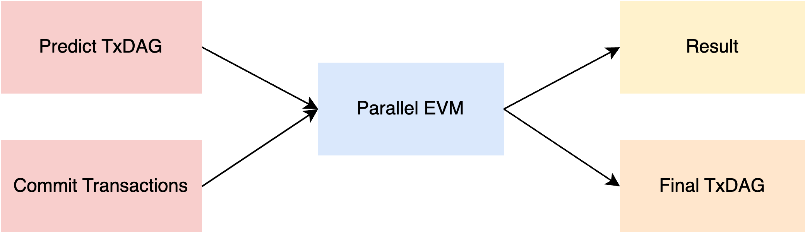

<pre>
  BEP: 456
  Title: Predict TxDAG in Mining Phase
  Status: Draft
  Type: Standards
  Created: 2024-11-15
  Author: galaio (@galaio)
  Description: A method to predict TxDAG for PEVM to accelerate block execution in Mining Phase.
  Discussions: https://forum.bnbchain.org/t/bep-456-predict-txdag-in-mining-phase/3070
</pre>

# BEP-456: Predict TxDAG in Mining Phase

## 1. Summary

As an important means of current blockchain performance, parallel execution has attracted more and more teams to study the parallel EVM execution engine. BSC can analyze the 100% accurate transaction dependency graph, namely TxDAG, of the proposal block in BEP-396.

The BEP-396 accelerates the verification block phase of the consensus process. To leverage the potential of TxDAG in the mining phase, this BEP aims to design the TxDAG generation in the mining phase, using a variety of TxDAG prediction mechanisms, and finally generating the Predict TxDAG in the mining phase, improving the execution performance of the PEVM in the mining phase.

## 2. Status

Draft

## 3. Motivation

As the current mainstream blockchain performance optimization mechanism, parallel EVM is a research direction. Currently, PEVM usually optimistically believes there are rare conflicts between transactions, so it "blindly" executes the Txs in parallel optimistically, and re-runs in case of conflict to avoid generating erroneous results.

However, Optimistic parallel execution and conflict re-execution are the bottlenecks of PEVM performance optimization based on our evaluations. BEP-396 greatly accelerates the performance of PEVM in the validating phase by generating a directed acyclic dependency graph of transactions, namely TxDAG, for the proposed block.

To improve the performance of PEVM in the mining phase, it is necessary to provide a corresponding TxDAG to accelerate the performance of the proposal block. This BEP solves this problem by introducing multiple predicting TxDAG mechanisms.

## 4. Specification

This BEP predicts the transaction read-write set and TxDAG by analyzing transaction features and pre-execution. This TxDAG can improve the parallelism of PEVM and thus improve execution performance. Compared with the original PEVM optimistic parallel execution mechanism, predict TxDAG can pre-analyze conflicts, avoid wasting CPU resources, and improve parallel execution efficiency. In conjunction with BEP-396, it can improve the execution performance of blockchain in the mining and validation stages.

The key to predicting TxDAG is how to improve the accuracy of prediction. Continuous optimization can achieve good performance in most transaction scenarios.

### 4.1 Tx Dependency

Assume that the execution of each transaction is atomic, and the input and output of the execution generate a state read-write set. In concurrent processing, read-only access to the resources is safe, but write operations require exclusive resources.

At the same time, all transactions in the blockchain have a preset order, and transactions with lower TxIndex have higher execution priority.

Therefore, the dependency constraint goes to, if transaction Txi writes StateA first, then transaction Txj reads StateA and j>i is satisfied. That is to say, Txj depends on Txi, Txj must be executed after Txi.

If a transaction reads and writes the same value at a memory location, the location can be considered read-only.

### 4.2 TxDAG Structure

Refer to the TxDAG structure definition of BEP-396.

### 4.3 Tx Pattern Analysis

For transactions in the BSC network, as some of them have obvious characteristics, simple transaction feature analysis can be used to obtain read-write sets, and even achieve extremely high accuracy.

For any transaction, the read-write set must be involved in the change of nonce and balance corresponding to from and to. At the same time, the basic tx pattern analysis has the following categories:

1. Native Transfer Tx, transfer BNB from one account to another, no additional read-write set;
2. ERC20/ERC721 Transfer Tx, transfer ERC20/ERC721 Token from one account to another, additional analysis of the storage slot corresponding to the parameter in calldata;
3. Tx with AccessList, additional analysis of transaction AccessList as a read set;
4. Tx with Witness, in statelessness or state expiry scenarios, the specific read-write set can be analyzed through witness;

The specific workflow is as follows:

1. Extract from RawTx, get metadata from the original Tx, such as From, To, Nonce, Calldata, AccessList, etc.;
2. Transform from metadata, obtain transaction access accounts and their status clues;
3. Generate R/W set, generate read-write sets according to actual categories;
   - For Native Transfer Tx, generate read-write sets of corresponding Nonce and Balance states according to From and To; 
   - For ERC20/ERC721 Tx, use a specific mapping function to generate account slots as read-write sets according to the calldata parameters; 
   - For AccessList/Witness Tx, the result of the analysis is the access read-write set;

The above read-write set analysis has high accuracy and can be used as the basis for PEVM scheduling, but there is a situation where read-write sets are missed.

### 4.4 Arbitrary Static Analysis

Compared with simply analyzing based on transaction features, static analysis of any contract requires more complex techniques, using contract code or decompiled code as input to perform lexical analysis and syntax analysis, control flow analysis, data flow analysis, etc. Dynamic inference can also be combined with symbolic execution to predict the read-write sets that a transaction may access.

Since the technology is too complex, the specific implementation is beyond the scope of this BEP, but there are many excellent open source projects, such as [manticore](https://github.com/trailofbits/manticore), [slither](https://github.com/crytic/slither), etc.

Due to the complexity and dynamism of smart contract execution, the prediction results of static analysis are not always completely accurate, and there are errors and omissions in read-write sets.

### 4.5 Pre-executing in TxPool

In the blockchain, TxPool caches a large number of transactions to be uploaded. In addition to static analysis, you can also try to pre-execute transactions based on the current state to obtain the read-write set of future access to the transaction. This process is completely asynchronous and has a limited impact on mining performance.

Due to changes in transaction order and chain status, this prediction method still has incorrect read-write sets and omissions. Since PendingStateDB and EVM are required for transaction pre-execution, this method consumes the most resources and has the worst performance.

By the way, txpool may have a limited asynchronous processing time. The transaction initiator or gateway can be designed to perform complex transaction analysis and attach transaction read-write set or witness.

### 4.6 TxDAG Generation

Based on static analysis or pre-execution, the read-write set generated by the transaction can be predicted. However, TxDAG cannot be generated directly at this moment because of the unfinalized tx order. When the miner triggers Commit Transactions, the transaction and order of the proposal block are determined, and the Predict TxDAG of the block can be asynchronously generated based on the read-write set.

When it comes to a specific implementation, selecting the predicting TxDAG method based on the actual scenario is necessary to achieve the best performance.

Predict TxDAG is a directed acyclic dependency graph of transactions obtained based on static analysis or pre-execution. There may be errors or missing read/write sets that cause dependencies to be ignored or generate redundant dependencies.

### 4.7 Executing Block

Based on the above method, the Predict TxDAG generated can be passed into PEVM as metadata to accelerate the execution of blocks.

Compared with the optimistic parallel execution mechanism, the Predict TxDAG contains conflict relationships. PEVM can better schedule transaction execution and improve parallelism.

## 5. Rationale

### 5.1 GasFee Distribution

To ensure the parallelism of transactions, and be consistent with BEP-396, the GasFee calculation needs to be delayed. For GasFee Receivers, they will not be collected as part of the read-write set.

Similarly, for PEVM, it is also necessary to ignore the GasFee distribution to GasFee Receivers until all transactions are completed and GasFee is settled uniformly.

In particular, if there is a state read and write of GasFee Receivers in the transaction, it may cause some transactions to be unable to be executed in parallel, or even all transactions can only be executed serially.

### 5.2 System Transaction

There are some special System Transactions or Deposit Transactions in BSC or opBNB that need to be handled specially. These transactions often have dedicated logic to meet the consensus rules and generally have block headers or tails. So this part of the transaction is not included in the read-write set and will be saved in the TxDAG with a special flag.

### 5.3 Parallel EVM Engine

Since Predict TxDAG may have missed transaction dependencies, it is necessary to implement a general PEVM that can identify potential conflicts and avoid erroneous results.

## 6. Backwards Compatibility

TxDAG only provides metadata for PEVM accelerated execution and does not affect the execution results of the proposal block. No compatibility issues have been found so far.

## 7. License

The content is licensed under [CC0](https://creativecommons.org/publicdomain/zero/1.0/).