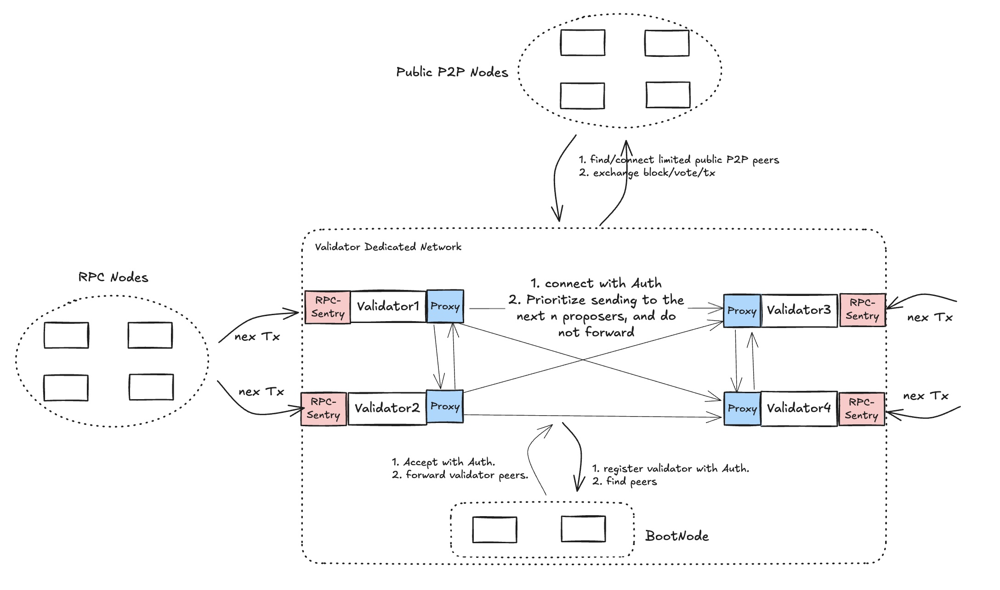

<pre>
  BEP: 525
  Title: Validator Dedicated Network
  Status: Draft
  Type: Standards
  Created: 2025-02-19
  Discussions(optional): https://forum.bnbchain.org/t/idea-faster-p2p-network-for-validators/3282
</pre>

# BEP-525: Validator Dedicated Network
- [BEP-525: Validator Dedicated Network](#bep-525-validator-dedicated-network)
  * [1. Summary](#1-summary)
  * [2. Motivation](#2-motivation)
  * [3. Specification](#3-specification)
    + [3.1.Validator Dedicated Network(VDN)](#31validator-dedicated-networkvdn)
    + [3.2.Directional Transactions Broadcast](#32directional-transactions-broadcast)
    + [3.3.Messages](#33messages)
      - [Handshake v1](#handshake-v1)
      - [ContactInfo v1](#contactinfo-v1)
      - [Block v1](#block-v1)
      - [RequestBlockByRange v1](#requestblockbyrange-v1)
      - [Vote v1](#vote-v1)
      - [Transactions v1](#transactions-v1)
  * [4. Backwards Compatibility](#4-backwards-compatibility)
  * [5. License](#5-license)

## 1. Summary
Add a network layer, which accept validator or validator authorized node to join in to improve the network efficiency and reduce network latency between validators.

## 2. Motivation
Low latency is one of the key user experience and if BSC wanna to support shorter block interval, network latency between validators could be crucial to support sub-second block interval. Current P2P gossip based network is good at broadcasting blocks/transactions to the whole network, but it is not efficient enough, i.e. it would take lots network bandwidth and also cost non-negligible latency. Validators are the key player to sustain the network, so one validator dedicated network layer could help to address the two issues.

## 3. Specification
### 3.1.Validator Dedicated Network(VDN)
The general network layout is described in the bellow diagram, basically validators would be able to be connected directly, so the latency can be reduced. 

There would be some new roles in VDN:
- VDN-BootNode: It helps validators discover each other and establish connections, and only validators registered with the staking contract are allowed to connect.
- Validator: joins the network through the VDN-BootNode, discover and connect with other validators in the VDN, and exchange messages.
- Validator-Sentry(optional): it acts as the bridge between public network and validator. Transactions can be sent to this sentry node through RPC call or based current P2P protocol, then it will forward transactions to the corresponding validator nodes. It will also broadcast blocks produced by validators to public network. It is optional, validator can receive RPC call or P2P messages directly from public network, but the validator would have security risks. Validator can setup 1 or more sentry nodes, which could make it more robust. And validators can also share sentry nodes to save some resource cost.
- Validator-Proxy(optional): in case validator don’t wanna expose itself to public network, it could authorise one or more proxy nodes to connect to the VDN.



### 3.2.Directional Transactions Broadcast
It is another key aspect of VDN, transactions that are broadcasted in VDN would no long gossip based, on the opposite, they will only be broadcasted to nextN validators which have the right to propose next block.

In order to receive transactions from SentryProxy or RPC Provider, the sender needs to implement a batch send transaction. This can be done by using JSON-RPC batch request implementation with `eth_sendRawTransaction`. The receiver only receives transactions in batches and must not package the incoming transactions as a bundler.

### 3.3.Messages

It is recommended to use the QUIC protocol to send messages and broadcast messages based on the pubsub mechanism. All messages are `RLP encoded`.

#### Handshake v1
Protocol ID: `/bsc/vdn/v1/handshake`

Request & Response Content:

```
(
  chainID: uint64
  forkID: [4]byte
  genesis_hash: Hash
  node_version: string
  extend: []byte
  pub_key: PublicKey
  sign: Signature
)
```

`chainID`, `forkID`, `genesis_hash` should be valid value, and `extend` is empty now which is reserved for future usage. Only validators registered with the staking contract are allowed to connect.

Once the validator connects to any node, it will initiate a handshake. If the verification fails, it will disconnect.

After the connection is successful, it will periodically send handshakes. Once it finds that the validator is no longer active, it will disconnect.

#### ContactInfo v1
Protocol ID: `/bsc/vdn/v1/contact_info`

Request Content:

```
(
  peer_id: string
  pub_key: PublicKey
  listen_p2p_addrs: []Address // validator can connect it by the addresses.
  listen_tx_addrs: []Address // RPC provider or Sentry Proxy can batch send txs by the urls.
  cache: []Concact // max 8 cache node's contact
  create_time: Time
)
```

Response Content:

```
(
  code: StatusCode
)
```

After the validator joins the network, it will periodically send its contact info and also the cached contact info to the network.

Once it connects to most nodes, it will reduce the sending frequency.

#### Block v1
Protocol ID: `/bsc/vdn/v1/block`

Request Content:

```
(
  block: Block
  create_time: Time
)
```

Response Content:

```
(
  code: StatusCode
)
```

After the inturn validator packs a block, it will immediately send the block to the next N inturn validators.

> N refers to the number of validators that produce blocks in the current epoch.

#### RequestBlockByRange v1
Protocol ID: `/bsc/vdn/v1/req/block_by_range`

Request Content:

```
(
  start_height: uint64
  count: uint64
)
```

Response Content:

```
(
  code: StatusCode
  blocks: []Block
)
```

When the validator receives the future block, it requests the missing block from the source node.

#### Vote v1
Protocol ID: `/bsc/vdn/v1/vote`

Request Content:

```
(
  vote: Vote
  create_time: Time
)
```

Response Content:

```
(
  code: StatusCode
)
```

When the validator successfully verifies the block, it sends FF vote to the next N inturn validators.

#### Transactions v1
Protocol ID: `/bsc/vdn/v1/transactions`

Request Content:

```
(
  txs: []Transaction // not exceed 10MB in total msg size
)
```

Response Content:

```
(
  code: StatusCode
)
```

When the validator receives the block, it sends the current pending txs to the next inturn validator.

## 4. Backwards Compatibility
TBD

## 5. License
The content is licensed under [CC0](https://creativecommons.org/publicdomain/zero/1.0/).
