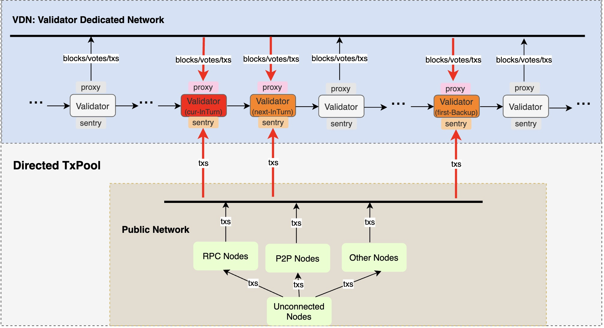

<pre>
  BEP: 525
  Title: Validator Dedicated Network And Directed TxPool
  Status: Draft
  Type: Standards
  Created: 2025-02-19
  Discussions(optional): https://forum.bnbchain.org/t/idea-faster-p2p-network-for-validators/3282
</pre>

# BEP-525: Validator Dedicated Network And Directed TxPool
- [BEP-525: Validator Dedicated Network And Directed TxPool](#bep-525-validator-dedicated-network-and-directed-txpool)
  - [1. Summary](#1-summary)
  - [2. Motivation](#2-motivation)
  - [3. Specification](#3-specification)
    - [3.1.Validator Dedicated Network(VDN)](#31validator-dedicated-networkvdn)
    - [3.2.Directed TxPool](#32directed-txpool)
    - [3.3.Messages](#33messages)
      - [a.Handshake v1](#ahandshake-v1)
      - [b.ContactInfo v1](#bcontactinfo-v1)
      - [c.Block v1](#cblock-v1)
      - [d.RequestBlockByRange v1](#drequestblockbyrange-v1)
      - [e.Vote v1](#evote-v1)
      - [f.Transactions v1](#ftransactions-v1)
  - [4.Rational](#4rational)
  - [5. Backwards Compatibility](#5-backwards-compatibility)
    - [5.1 Validator Operator](#51-validator-operator)
    - [5.2.RPC Providers And Other Full Nodes Operators](#52rpc-providers-and-other-full-nodes-operators)
    - [5.3 MEV](#53-mev)
  - [6. License](#6-license)

## 1. Summary
This is a new network topology that only accepts validators or nodes authorized by validators. Transactions in this network will be forwarded directly to a few validators who are most likely to produce the next block.

## 2. Motivation
- For low network latency between validators: as BSC targets to short its block interval to sub-second, it is quite crucial to reduce the network latency between validators. Current P2P gossip based network is good at broadcasting blocks/transactions to the whole network, but it is not efficient enough, i.e. it would take lots of network bandwidth and also cost non-negligible latency.
- For MEV protection: validators are the key role in the network, it is reasonable that validators have the highest priority to get the transactions. Directed txpool means transactions would be forwarded to a small subset of validators that are most likely to produce the next block. It could avoid exposing users transactions directly to public txpool, so users would less likely to face malicious MEV attacks.
- For low transaction latency: transaction latency is one of the key user experiences. Directed TxPool can provide a straight-forward path to deliver transactions to validators, whcih could be much faster comparing to the current gossip based public p2p network.
## 3. Specification
### 3.1.Validator Dedicated Network(VDN)
The general network topology can be described by the following diagram:


Basically validators would be able to find and connect with each other to reduce the network latency.

Here is the description of these roles in VDN:
- **VDN-BootNode**: It helps validators discover each other and establish connections, and only validators registered with the staking contract are allowed to connect.
- **Validator**: joins the network through the VDN-BootNode, discover and connect with other validators in the VDN, and exchange messages.
- **Validator-Sentry**(optional): it acts as a bridge between the public network and a validator. Transactions can be sent to this sentry node through RPC calls or through the current P2P protocol, then it will forward transactions to the corresponding validator nodes. It will also broadcast blocks produced by validators to public network. This sentry node is optional, validator can have none, one or even more than one sentry nodes. If validator does not have the sentry node, it will receive RPC call or P2P messages directly from public network, exposing the validator to public network directly could have some security risks. Validator can setup 1 or more sentry nodes, which could make it more robust. The sentry node is quite flexible, validators can even share sentry nodes with other validators to share the network security and also save maintenance effort.
- **Validator-Proxy**(optional): in case validator doesn’t want to expose itself to VDN directly, it could authorise one or more proxy nodes to connect to the VDN. It mainly helps on transmitting messages like blocks/votes/transactions between validators in VDN.

### 3.2.Directed TxPool
It is another key aspect of VDN, transactions that are broadcasted in VDN would no long be gossip based, on the opposite, they will only be broadcasted to next {N} validators which have the highest priority to propose the next block. The value of {N} is configurable, by default {N} could be three, which means one in-turn validator, one next-in-turn validator and first backup validator which has the highest priority to produce the block in case the in-turn validator failed to generate it in time.



### 3.3.Messages
There would be a new protocol to define the messages that are broadcasted within VDN. These messages would be transmitted with QUIC protocol and will be based on the pubsub mechanism. All messages are `RLP encoded`.

#### a.Handshake v1
Protocol ID: `/bsc/vdn/v1/handshake`

Request & Response Content:

```
(
  chainID: uint64
  forkID: [4]byte
  genesis_hash: Hash
  node_version: string
  extend: []byte
  pub_key: PublicKey
  sign: Signature
)
```

`chainID`, `forkID`, `genesis_hash` should be valid value, and `extend` is empty now which is reserved for future usage. Only validators registered with the staking contract are allowed to connect.

Once the validator connects to any node, it will initiate a handshake. If the verification fails, it will disconnect.

After the connection is successful, it will periodically send handshakes. Once it finds that the validator is no longer active, it will disconnect.

#### b.ContactInfo v1
Protocol ID: `/bsc/vdn/v1/contact_info`

Request Content:

```
(
  peer_id: string
  pub_key: PublicKey
  listen_p2p_addrs: []Address // validator can connect it by the addresses.
  cache: []Concact // max 8 cache node's contact
  create_time: Time
)
```

Response Content:

```
(
  code: StatusCode
)
```

After the validator joins the network, it will periodically send its contact info and also the cached contact info to the network.

Once it connects to most nodes, it will reduce the sending frequency.

#### c.Block v1
Protocol ID: `/bsc/vdn/v1/block`

Request Content:

```
(
  block: Block
  create_time: Time
)
```

Response Content:

```
(
  code: StatusCode
)
```

After the inturn validator packs a block, it will immediately send the block to the next N inturn validators.

> N refers to the number of validators that produce blocks in the current epoch.

#### d.RequestBlockByRange v1
Protocol ID: `/bsc/vdn/v1/req/block_by_range`

Request Content:

```
(
  start_height: uint64
  count: uint64
)
```

Response Content:

```
(
  code: StatusCode
  blocks: []Block
)
```

When the validator receives the future block, it requests the missing block from the source node.

#### e.Vote v1
Protocol ID: `/bsc/vdn/v1/vote`

Request Content:

```
(
  vote: Vote
  create_time: Time
)
```

Response Content:

```
(
  code: StatusCode
)
```

When the validator successfully verifies the block, it sends FF vote to the next N inturn validators.

#### f.Transactions v1
Protocol ID: `/bsc/vdn/v1/transactions`

Request Content:

```
(
  txs: []Transaction // not exceed 10MB in total msg size
)
```

Response Content:

```
(
  code: StatusCode
)
```

When the validator receives the block, it sends the current pending txs to the next inturn validator.

## 4.Rational
TBD

## 5. Backwards Compatibility
### 5.1 Validator Operator
Operators would need to change their node's network configuration to integrate VDN. They would need fully understand the new topology and may setup the validator-sentry and validator-proxy node respectively. They may also need to monitor their network quality to provide good network quality.

### 5.2.RPC Providers And Other Full Nodes Operators
Depends on the strategy of the RPC providers and other full nodes, they may connect to validator-sentry nodes directly, so it would have lower latency and user's transaction would be protected as these transaction would not be leaked to public txpool. But they can also choose to not connect to validator-sentry nodes directly and forward transactions to validators through a different route path. The public network composed by these full nodes will mainly help on block syncing, while transaction will not be gossiped in this public network.

### 5.3 MEV
This BEP would have great impact to MEV ecosystem, as the public txpool would be gradually replaced by validator directed txpool, which means transactions would be forwarded to validators directly.
- MEV searchers would have to get the transactions from validators, which would be more difficult.
- MEV builders can still act as a bridge between searchers and validators, but the impact to searchers would impact builders indirectly.

## 6. License
The content is licensed under [CC0](https://creativecommons.org/publicdomain/zero/1.0/).
