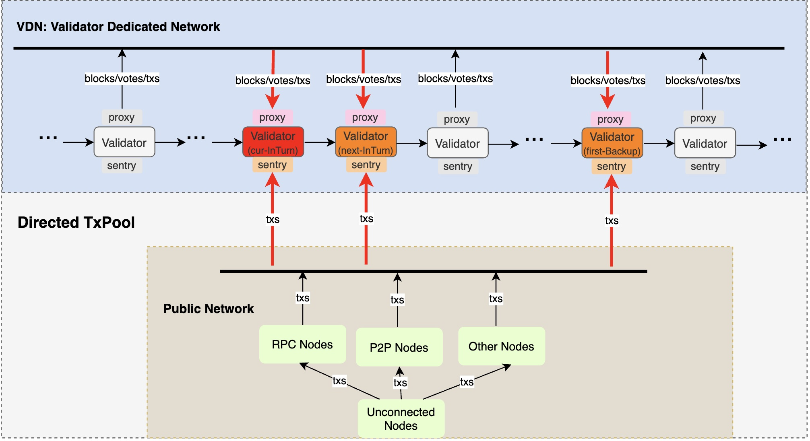

<pre>
  BEP: 536
  Title: Directed TxPool
  Status: Draft
  Type: Standards
  Created: 2025-02-19
  Discussions(optional): https://forum.bnbchain.org/t/idea-faster-p2p-network-for-validators/3282
</pre>

# BEP-536: Directed TxPool
- [BEP-536: Directed TxPool](#bep-536-directed-txpool)
  - [1. Summary](#1-summary)
  - [2. Motivation](#2-motivation)
  - [3. Specification](#3-specification)
    - [3.1.Directed TxPool](#31directed-txpool)
  - [4.Rational](#4rational)
  - [5. Backwards Compatibility](#5-backwards-compatibility)
    - [5.1 MEV and PBS](#51-mev-and-pbs)
  - [6. License](#6-license)

## 1. Summary
Transactions will be forwarded directly to a few validators who are most likely to produce the next block.

## 2. Motivation
- For MEV protection: validators are the key role in the network, it is reasonable that validators have the highest priority to get the transactions. Directed txpool means transactions would be forwarded to a small subset of validators that are most likely to produce the next block. It could avoid exposing users transactions directly to public txpool, so users would less likely to face malicious MEV attacks.
## 3. Specification

### 3.1.Directed TxPool
It is another key aspect of VDN, transactions that are broadcasted in VDN would no long be gossip based, on the opposite, they will only be broadcasted to next {N} validators which have the highest priority to propose the next block. The value of {N} is configurable, by default {N} could be three, which means one in-turn validator, one next-in-turn validator and first backup validator which has the highest priority to produce the block in case the in-turn validator failed to generate it in time.

## 4.Rational
TBD

## 5. Backwards Compatibility

### 5.1 MEV and PBS
This BEP would have great impact to the Proposer-Builder-Separation(PBS) mechanism and MEV(Maximum-Extractable-Value) ecosystem.

As the public txpool would be gradually replaced by directed txpool, which means transactions would be forwarded to validators directly, consequently:
- MEV searchers would have to get the transactions from validators, which would be more difficult.
- MEV builders can still act as a bridge between searchers and validators, but the impact to searchers would impact builders indirectly.

The PBS architecture was introduced in [BEP-322: Builder API Specification for BNB Smart Chain](https://github.com/bnb-chain/BEPs/blob/master/BEPs/BEP322.md), which tries to make MEV more transparent and fully competed. But due to the MEV impact by this BEP, current PBS mechanism would be weaken as well. PBS is useful, as none malicious MEV activities are good for the chain ecosystem, community will try to find a solution to sustain or upgrade the PBS mechanism, so builders will be less impacted.

## 6. License
The content is licensed under [CC0](https://creativecommons.org/publicdomain/zero/1.0/).
