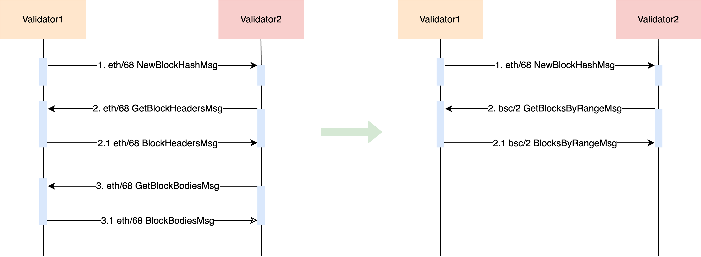

<pre>
  BEP: 564
  Title: bsc/2 - New Block Fetching Messages
  Status: Enabled
  Type: Standards
  Created: 2025-04-16
  Description: To accelerate block fetching for shorter block interval.
</pre>

# BEP-564: bsc/2 - New Block Fetching Messages
- [BEP-564: bsc/2 - New Block Fetching Messages](#bep-564-bsc2---new-block-fetching-messages)
  * [1. Summary](#1-summary)
  * [2. Status](#2-status)
  * [3. Motivation](#3-motivation)
  * [4. Specification](#4-specification)
    + [4.1 Block Fetching Message](#41-block-fetching-message)
  * [5. Rationale](#5-rationale)
    + [5.1 Why new block fetching messages](#51-why-new-block-fetching-messages)
  * [6. Forward Compatibility](#6-forward-compatibility)
    + [6.1 eth/69 protocol](#61-eth69-protocol)
  * [7. Backward Compatibility](#7-backward-compatibility)
    + [7.1 eth/68 protocol](#71-eth68-protocol)
  * [8. License](#8-license)

## 1. Summary

This BEP introduces new block fetching messages to speed up the import of newly generated blocks, prevent nodes from lagging at subsecond block intervals, and especially improve validator consensus efficiency.

## 2. Status

Draft

## 3. Motivation

With the future activation of BEP-520 and BEP-524, BSC will achieve a subsecond block interval, which has higher requirements for faster block fetching.

However, the eth/68 protocol is very inefficient when processing NewBlockHash messages, and it requires multiple queries before a new block can be imported.

This BEP introduces a New Block Fetching Message, which greatly reduces the number of queries, supports fast fetching of newly generated blocks, avoids validators and full nodes from lagging behind in the subsecond block interval, and especially improves the validator consensus efficiency, which can produce the next block or send vote faster.

## 4. Specification

### 4.1 Block Fetching Message

Current block querying is inefficient, requiring multiple requests for both block headers and block bodies. This BEP will add the following messages to reduce the delay in obtaining blocks.

```go
const (
	GetBlocksByRangeMsg = 0x02 // it can request (Head-n, Head] range blocks from remote peer
	BlocksByRangeMsg    = 0x03 // the replied blocks from remote peer
)

type GetBlocksByRangePacket struct {
	RequestId   uint64
	StartBlockHeight uint64 // The start block height expected to be obtained from
	StartBlockHash common.Hash // The start block hash expected to be obtained from
	Count       uint64 // Get the number of blocks from the start
}

type BlocksByRangePacket struct {
	RequestId uint64
	Blocks    []*types.Block
}
```

The peer can request a range of blocks, specifying the starting block using either StartBlockHeight or StartBlockHash. If StartBlockHash is not equal to the empty hash (0x0000000000000000000000000000000000000000000000000000000000000000), the starting block will be determined by StartBlockHash. Otherwise, it will default to StartBlockHeight.

When specifying a StartBlockHeight or StartBlockHash and a Count, the blocks will be returned in reverse order, starting from the given block and going backward.

This method is used to synchronize the latest small range of blocks quickly. Historical block synchronization still uses the eth/68 protocol.



## 5. Rationale

### 5.1 Why new block fetching messages

The eth/68 protocol fetches the block header and body from the remote separately and assembles them locally. These messages are also applicable to full sync and snap sync processes, and it can save bandwidth when fetching the fork or bad blocks.

However, multiple queries will multiply the latency between nodes. After subsecond block interval, fetching the block quickly is the key. New block fetching messages simplify the process of fetching blocks and support requesting a range of blocks with only one round trip.

## 6. Forward Compatibility

### 6.1 eth/69 protocol

The bsc/2 is completely independent of the ETH series of protocols, so future upgrades to eth/69 are fully compatible.

## 7. Backward Compatibility

### 7.1 eth/68 protocol

There should be no impact on eth/68. When obtaining the block announced by NewBlockHash, bsc/2 can work simultaneously with eth/68. Due to the low efficiency of eth/68 fetch, bsc/2 will fetch the block first. After the client marks the current block as known, eth/68 will no longer continue to request.

## 8. License

The content is licensed under [CC0](https://creativecommons.org/publicdomain/zero/1.0/).
