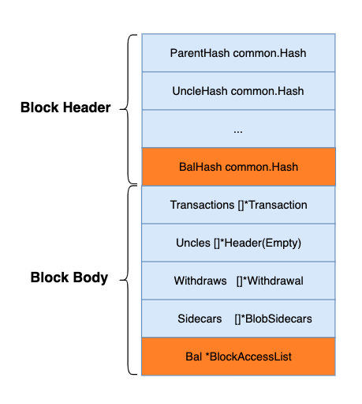

<pre>
  BEP: 592
  Title: Implement Block Access List
  Status: Draft
  Type: Standards
  Created: 2025-06-30
  Description: To accelerate block execution performance with block access list.
</pre>

# BEP-592: Implement Block Access List
- [1. Summary](#1-summary)
- [2. Status](#2-status)
- [3. Motivation](#3-motivation)
- [4. Specification](#4-specification)
  - [4.1 Data Structure](#41-data-structure)
  - [4.2 BAL Generation](#42-bal-generation)
  - [4.3 BAL Propagation](#43-bal-propagation)
  - [4.4 BAL Storage](#44-bal-storage)
  - [4.5 BAL Execution](#45-bal-execution)
- [5. Rationale](#5-rationale)
  - [5.1 Why not include the slot value in BAL?](#51-why-not-include-the-slot-value-in-bal)
  - [5.2 Why not define a new block header element for BAL?](#52-why-not-define-a-new-block-header-element-for-bal)
  - [5.3 Any incentive/slash for a validator to generate BAL?](#53-any-incentiveslash-for-a-validator-to-generate-bal)
- [6. Forward Compatibility](#6-forward-compatibility)
- [7. Backward Compatibility](#7-backward-compatibility)
- [8. License](#8-license)

## 1. Summary

This BEP aims to improve performance by implementing BAL(Block-Access-List), which will include some meta data in blocks to help accelerate block execution.

## 2. Status

Draft

## 3. Motivation

To further increase BSC's performance by providing the access list during the mining phase. With shorter block internal and increasing throughput, faster block importing could be very useful, especially to:
MEV builders as they can simulate new bids earlier.
BSC fast finality: vote can be cast earlier.
Validators: there would be more time to mine the first consecutive block.
Other nodes: better performance to catch up to the latest block easier.

## 4. Specification

### 4.1 Data Structure
The data structure of the block header and body will stay unchanged. The BAL content will be propagated along with the block as an optional part.

Here is the data structure of BlockAccessList:
```go
// AccountAccessList is a list of accounts and their storage keys that are accessed in a block.
type AccountAccessList struct {
    Address     common.Address
    StorageKeys []common.Hash
}

// BlockAccessList is a list of accounts and their storage keys that are accessed in a block.
type BlockAccessList struct {
    Version  uint64               // Version of the access list format
    Accounts []AccountAccessList
}
```
The version element will be used for future protocol upgrades, it will be starting from version zero.

### 4.2 BAL Generation
During the mining phase, validators could create the BAL structure at the beginning and update it after finalising each transaction.

There would be size limitations on BAL, the BAL doesn't need to include 100% of the block's access list, the size limitation could be around 1MB.

### 4.3 BAL Propagation
It will be propagated along the block, but only within the EVN(Enhanced Validator Network) to avoid too much P2P traffic on the public network.
The BAL will not be included when the block is propagated to a non-EVN node.

### 4.4 BAL Storage
BAL is mainly to speed up the block import, it is optional and as it has considerable size, no need to persist all the historical BAL data. Similar to blob data, we can only keep the BAL for the recent ~18.2 days

### 4.5 BAL Execution
At the first, BAL can be simply used to load the storage into cache, no verification is needed.

## 5. Rationale

### 5.1.Why not include the slot value in BAL?
Mainly to keep BAL small, let's assume a block with 200 Txs, each accessed 50 storage slots, that would be around 10K slots in total, that would be 320KB to keep the slot key.
And in order to make sure the storage value is correct the MPT proof would be needed, which would further increase the size of BAL.

### 5.2.Why not define a new block header element for BAL?

It could be considered in the future, but at the first stage, we would prefer to keep it simple to avoid some compatibility issues.

### 5.3.Any incentive/slash for a validator to generate BAL?
At the first stage, there is no incentive or slash mechanism, it depends on the validator's willingness to provide the BAL. Validators may not have the motivation to maliciously construct the BAL, even so the impact is supposed to be limited as the BAL is mainly used for state preload and size of BAL is limited.

## 6. Forward Compatibility
NA

## 7. Backward Compatibility
NA

## 8. License

The content is licensed under [CC0](https://creativecommons.org/publicdomain/zero/1.0/).
