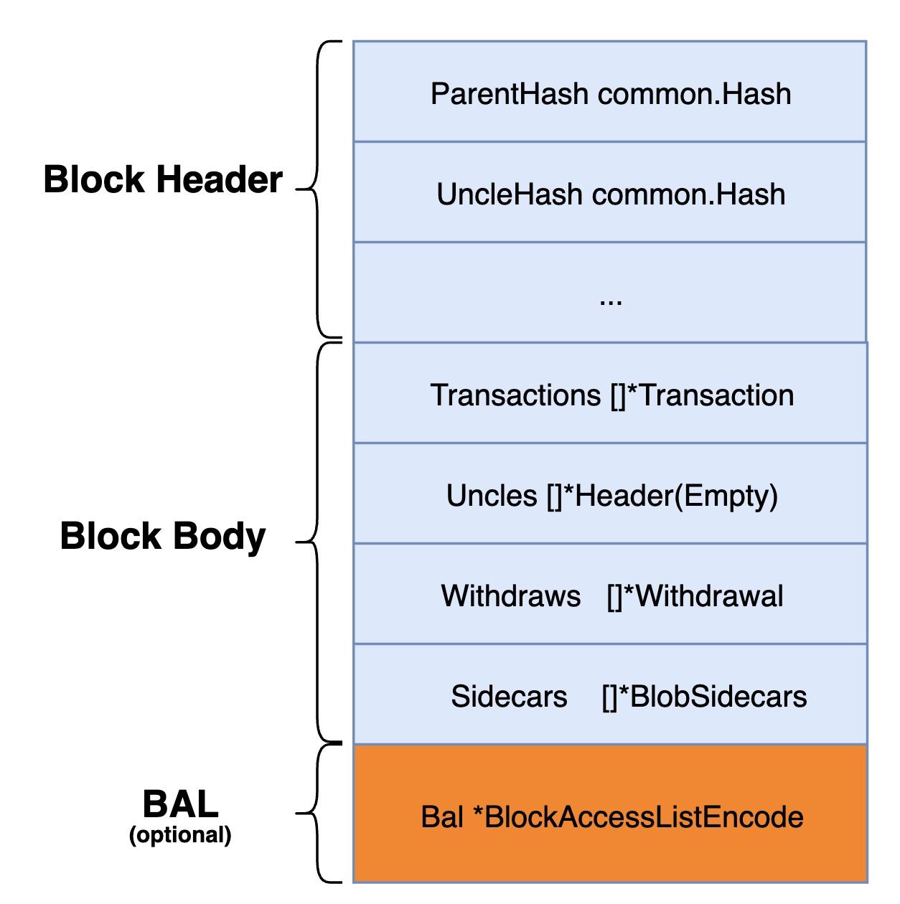

<pre>
  BEP: 592
  Title: Non-Consensus Based Block-Level Access List
  Status: Draft
  Type: Standards
  Created: 2025-06-30
  Description: Generate block access list and propagate it along with block to accelerate block execution.
</pre>

# BEP-592: Non-Consensus Based Block-Level Access List

## Table of Contents
- [BEP-592: Non-Consensus Based Block-Level Access List](#bep-592-non-consensus-based-block-level-access-list)
  - [Table of Contents](#table-of-contents)
  - [1. Summary](#1-summary)
  - [2. Status](#2-status)
  - [3. Motivation](#3-motivation)
  - [4. Specification](#4-specification)
    - [4.1 Parameters](#41-parameters)
    - [4.2 Data Structure](#42-data-structure)
    - [4.3 BAL Generation](#43-bal-generation)
    - [4.4 BAL Propagation](#44-bal-propagation)
    - [4.5 BAL Storage](#45-bal-storage)
    - [4.6 BAL Execution](#46-bal-execution)
  - [5. Rationale](#5-rationale)
    - [5.1 Why not include the slot value in BAL?](#51-why-not-include-the-slot-value-in-bal)
    - [5.2 Why not define a new block header element for BAL?](#52-why-not-define-a-new-block-header-element-for-bal)
    - [5.3 Any incentive/slash for a validator to generate BAL?](#53-any-incentiveslash-for-a-validator-to-generate-bal)
  - [6. Forward Compatibility](#6-forward-compatibility)
  - [7. Backward Compatibility](#7-backward-compatibility)
  - [8. License](#8-license)

## 1. Summary

This BEP proposes the implementation of a Block-Level Access List (BAL) to enhance block execution performance. The BAL includes metadata within blocks to accelerate block processing by preloading storage data into cache concurrently, thereby improving overall network throughput and reducing block import latency.

## 2. Status

Draft

## 3. Motivation

The primary objective is to enhance BSC's performance by providing access lists during the mining phase. With shorter block intervals and increasing throughput demands, faster block importing becomes crucial for several key stakeholders:

- **MEV Builders**: Can simulate new bids earlier, improving their competitive advantage and reducing latency in bid processing
- **Fast Finality**: Validators can cast votes earlier, improving finality stability
- **Validators**: Gain additional time to mine blocks espcially the first consecutive block, improving block production efficiency
- **Full Nodes**: Experience improved performance when catching up to the latest block, reducing synchronization time

## 4. Specification

### 4.1 Parameters

The following constants define the operational parameters for BAL:

| Constant | Value | Description |
|----------|-------|-------------|
| `MAX_BAL_BYTES` | `1048576` | Maximum size of BAL data in bytes (1MB) |
| `MIN_SECONDS_FOR_BAL` | `1572480` | Minimum retention period for BAL data in seconds (~18.2 days) |

### 4.2 Data Structure

To maintain backward and forward compatibility, the block header and body data structures remain unchanged. The BAL content is attached to the end of the block as an optional component.



The BAL data structure is defined as follows:

```go
// StorageAccessItem is a single storage key that is accessed in a block.
type StorageAccessItem struct {
	TxIndex uint64 // index of the first transaction in the block that accessed the storage
	Dirty   bool   // true if the storage was modified in the block, false if it was read only
	Key     common.Hash
}

// AccountAccessList is a list of accounts and their storage keys that are accessed in a block.
type AccountAccessList struct {
	TxIndex      uint64 // index of the first transaction in the block that accessed the account
	Address      common.Address
	StorageItems []StorageAccessItem
}

// BlockAccessList is a list of accounts and their storage keys that are accessed in a block.
type BlockAccessList struct {
	Version  uint64 // Version of the access list format
	Accounts []AccountAccessList
}
```

The version field enables future protocol upgrades, starting from version zero. The final content is RLP encoded, following BSC's current encoding schema (though SSZ encoding may be considered for future implementations).

### 4.3 BAL Generation

Validators are responsible for generating BAL content during block creation. As validators execute transactions sequentially to create a block, they have complete knowledge of the accounts and storage slots that the block will access. Validators maintain these access lists, encode them, and attach the result to the end of the block.

Size limitations apply to BAL to maintain network efficiency. The BAL does not need to include 100% of the block's access list; however, the size cannot exceed `MAX_BAL_BYTES`.

### 4.4 BAL Propagation

BAL data propagates as part of the block but exclusively within the Enhanced Validator Network (EVN) to minimize P2P traffic on the public network. This selective propagation ensures that only authorized nodes receive BAL data while maintaining network efficiency.

### 4.5 BAL Storage

BAL primarily serves to accelerate block import operations. As an optional component with considerable size, nodes are not required to persist all historical BAL data. Following the same retention policy as blob data, nodes can retain BAL data for `MIN_SECONDS_FOR_BAL` seconds.

### 4.6 BAL Execution

Since BAL version zero is non-consensus based, verification of BAL validity is not required. Upon receiving BAL data, nodes can parse the BAL data structure and concurrently load accounts and storage slots into cache to accelerate block execution without compromising security or consensus integrity.

## 5. Rationale

### 5.1 Why not include the slot value in BAL?

The decision to exclude slot values primarily aims to maintain BAL size efficiency. Consider a block with 200 transactions, each accessing 50 storage slots: this would result in approximately 10,000 slots total, requiring 320KB for slot keys alone. Additionally, including storage values would necessitate Merkle Patricia Trie (MPT) proofs for verification, further increasing BAL size significantly and negating the performance benefits.

### 5.2 Why not define a new block header element for BAL?

While this approach could be considered for future implementations, the initial stage prioritizes simplicity to avoid compatibility issues. The current design maintains backward compatibility while providing the performance benefits of BAL.


### 5.3 Any incentive/slash for a validator to generate BAL?

At the initial stage, no incentive or slash mechanism exists. BAL generation depends entirely on validator willingness to provide this service. Validators are unlikely to have motivation to maliciously construct BAL data, and even if they did, the impact would be limited since BAL is primarily used for state preloading and has size limitations.

## 6. Forward Compatibility

The BAL implementation is designed with forward compatibility in mind. The version field in the BlockAccessList structure allows for future protocol upgrades without breaking existing implementations. Future versions may introduce new features, encoding schemes, or structural changes while maintaining compatibility with version zero.

## 7. Backward Compatibility

The current BAL implementation maintains full backward compatibility. Since BAL data is attached as an optional component and does not modify existing block structures, nodes that do not support BAL can continue to operate normally without any impact on consensus or block validation.

## 8. License

The content is licensed under [CC0](https://creativecommons.org/publicdomain/zero/1.0/).

