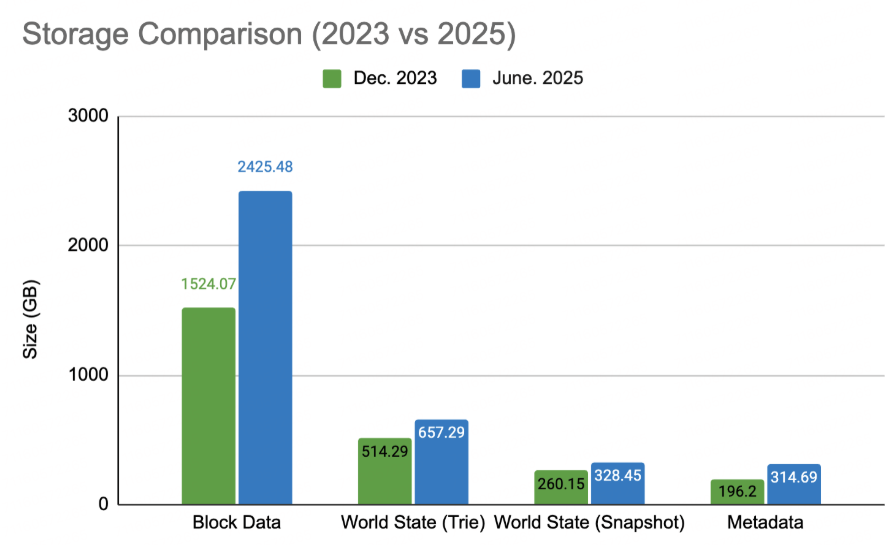
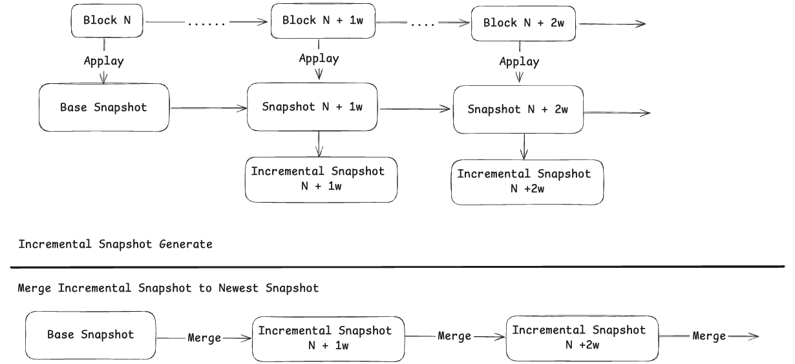

<pre>
  BEP: 593
  Title: Incremental Snapshot
  Status: Draft
  Type: Standards
  Created: 2025-07-02
  Description: To make easier for users to start and run BSC nodes.
</pre>

# BEP-593: Incremental Snapshot

- [BEP-593: Incremental Snapshot](#bep-593-incremental-snapshot)
- [1. Summary](#1-summary)
- [2. Status](#2-status)
- [3. Motivation](#3-motivation)
- [4. Specification](#4-specification)
  - [4.1 Incremental Snapshot Schema](#41-incremental-snapshot-schema)
  - [4.2 Incremental Snapshot Generation](#42-incremental-snapshot-generation)
  - [4.3 Incremental Snapshot Merge](#43-incremental-snapshot-merge)
- [5. Rational](#5-rational)
  - [5.1 Incremental Snapshot Size](#51-incremental-snapshot-size)
  - [5.2 Safety](#52-safety)
- [6. Backward Compatibility](#6-backward-compatibility)
- [7. License](#7-license)

# 1. Summary

This BEP proposes an incremental snapshot mechanism to make it easier for users to start and run BSC nodes with reduced data requirements. By implementing this feature, users will be able to bootstrap their nodes more efficiently while maintaining the necessary functionality for participating in the BSC network.

Incremental snapshots store incremental block and state data, allowing users to quickly approach the latest block by merging incremental snapshots on top of a [monthly snapshot](https://github.com/bnb-chain/bsc-snapshots?tab=readme-ov-file#mainnetmonthly-update). Compared to the newest prune-ancient snapshot, whose size is greater than 1.0 TB, the monthly incremental snapshot is about 120GB, so users can download some incremental snapshots and merge them can start BSC nodes quickly.

# 2. Status

Draft

# 3. Motivation

The snapshot of BSC is released monthly, and it usually takes users about 13 hours to download, decompress the snapshot(3 hours), and catch up to the newest block(10 hours).

  

Comparing the full snapshot from June 2025 (total size of 3.72TB) with the one from December 2023 (total size of 2.49TB) reveals that the snapshot has grown significantly, reaching an increase of 49.35%. This will result in longer download and decompression times for users, as well as higher demands on machine disk space and bandwidth usage.  This becomes a barrier for users who want to participate in the BSC network.

To address these challenges, this BEP proposes the incremental snapshot solution. This approach will allow users to more easily catch up with the latest BSC data by downloading smaller, incremental updates rather than a single large snapshot. This will improve the user experience and make it more accessible for new participants to join the BSC network.

# 4. Specification

  

Execute blocks based on a base snapshot, with a separate backup of the incremental data for each block. Periodically aggregate these incremental data(e.g., fixed at 1000 blocks).

## 4.1 Incremental Snapshot Schema

This section describes which data needs to be recorded during block execution for Incremental Snapshot aggregation. The data can be divided into two categories: Block data and State data.

- Block data mainly includes: BlockHeader, BlockHash, BlockBody, TxReceipt, Difficulty, and BlobSidecar.
- State data includes: StateHistory, which is used for PBSS rollback, and StateTrieNodes, which are used to generate the latest state data during Merge Incremental Snapshot.

After the Maxwell hard fork, there will be approximately 3,456,000 blocks in one month, with an average size of about 100KB. The total size is roughly 345.6GB. The state trie nodes updated by each block amount to about 2MB, with a total size of approximately 6.92TB. Due to the large volume of data, the download speed for users will be slow.

Therefore, the following adjustments have been made:

- Block data only needs to store the most recent several tens of thousands of blocks, similar to pruning ancient snapshots, less than 10GB.
- State data can be aggregated, keeping the size around 100GB.

## 4.2 Incremental Snapshot Generation

During startup, add the `--incr.enable` flag. The system will asynchronously generate incremental snapshots in a separate directory, and when the data volume reaches a certain threshold, it will automatically switch to a new directory. Generally, regular users do not need to run nodes with the `-- incr.enable` flag. The official nodes are configured with the `--incr.enable` flag and periodically upload incremental snapshots to remote storage for download by users.

Additional incremental snapshot generation flags:

- `--incr.datadir` is used to set data directory for storing generated incremental snapshot data.
- `--incr.block-interval` can be used to set how many blocks interval are stored into one incremental snapshot. Default value is `100_000`.
- `--incr.state-buffer` is used to set the incr state memory buffer to aggregate MPT trie nodes. The larger the setting, the smaller the incr snapshot size, it also needs large memory. The default value is `6GB`.
- `--incr.kept-blocks` is used to set how many blocks are kept in incr snapshot. At least and default value is `1024` blocks.

## 4.3 Incremental Snapshot Merge

Add the `--incr.use-remote` flag, and also set the remote incremental snapshot URL using the `--incr.remote-url` flag with `--incr.datadir` to store the downloaded incremental snapshots. After startup, the system will automatically download the required incremental snapshots and perform merging. The incremental snapshots are downloaded sequentially, and the download and merge processes run in a pipeline manner, which significantly improves efficiency.

During the merge, both block data and state data are written into PebbleDB, and necessary metadata such as `HeadHeader`, `HeadBlock`, etc., are updated to ensure continuity from the latest merged block. Once all incremental snapshots are merged, the client switches to full mode to continue block synchronization from P2P.

# 5. Rational

## 5.1 Incremental Snapshot Size

Prune ancient snapshots to only keep the most recent 360,000 blocks of block data. Keeping the last 10,000 blocks of incremental snapshots is sufficient, around 1GB.

State data can be aggregated. According to testing, 10GB of space can accommodate the state data for 300,000 blocks, after the hard fork on Maxwell. The total size of the state data can be reduced to ～120GB per month.

An incremental snapshot is generated once a week. Each incremental snapshot contains the latest 10,000 blocks of block data, approximately 1 GB, and the corresponding state data, with the state data size being approximately 30GB per month (around 120GB per month). Total size approximately 31GB.

For example, an incremental snapshot representing the block range from 50,000,000 to 50,806,400(one week) would only retain the latest 10,000 blocks of data, covering from 50,796,400 to 50,806,400, ～1GB. The state data must fully include all the change data within the 50,000,000 to 50,806,400 range, but it will be aggregated into several files, each around 10GB in size. It will generate three 10GB state data files. An incremental snapshot is about 31 GB, and it is expected to have 4 incremental snapshots per month, total size of about 124 GB.

Currently, the size of pruned ancient snapshots is around 1TB. Users' local data is less than one year behind the latest block, so using the “--syncmode snap.increment” mode is worthwhile.

## 5.2 Safety

Incremental snapshots allow the local data to quickly jump to a relatively recent state before starting synchronization, thereby reducing the distance to the latest block and improving synchronization speed. The reason why merging incremental snapshots is faster than P2P is mainly because it bypasses the execution and validation phases, essentially only involving the commit phase.

Incremental snapshots essentially allow the user's local data to quickly chang to a recent pruned ancient snapshot through a centralized method. Its security is equivalent to downloading pruned ancient snapshots.

# 6. Backward Compatibility

This BEP maintains full backward compatibility with existing BSC node implementations. Users have the flexibility to choose between two approaches:

1. Traditional full snapshot: Users can continue to use the complete snapshot as before, which contains all historical data.
2. Incremental snapshot: Users can opt to use the new incremental snapshot mechanism, which provides smaller, more manageable updates.

The implementation ensures that both methods are fully supported, allowing users to select the approach that best suits their needs and resources. This dual-support system ensures a smooth transition for existing users while providing new options for those who prefer the incremental approach.

# 7. License

All the content are licensed under [CC0](https://creativecommons.org/publicdomain/zero/1.0/).
