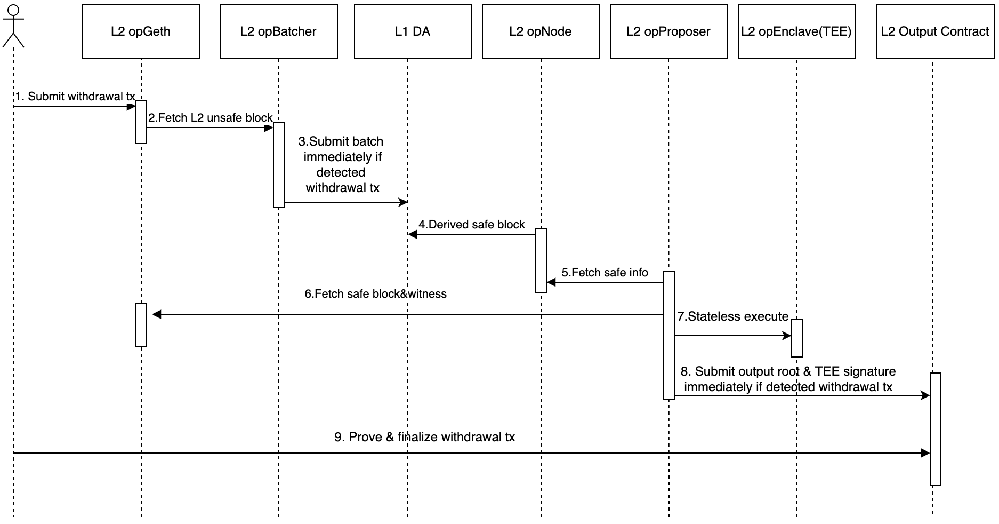

<pre>
  BEP: 594
  Title: L2 Fast Withdrawal by TEE
  Status: Draft
  Type: Standards
  Created: 2025-07-10
  Description: Reduce the L2 withdrawal finalization time from 7 days to seconds-level.
</pre>

# BEP-594: L2 Fast Withdrawal by TEE
- [BEP-594: L2 Fast Withdrawal by TEE](#bep-594-l2-fast-withdrawal-by-tee)
    * [1. Summary](#1-summary)
    * [2. Status](#2-status)
    * [3. Motivation](#3-motivation)
    * [4. Specification](#4-specification)
        + [4.1 Fast withdrawal workflow](#41-fast-withdrawal-workflow)
        + [4.2 Architecture changes](#42-architecture-changes)
        + [4.3 Contract Interface changes](#43-contract-interface-changes)
    * [5. Rational](#5-rational)
        + [5.1 Why choose the TEE solution](#51-why-choose-the-tee-solution)
        + [5.2 Security](#52-security)
    * [6. Backward Compatibility](#6-backward-compatibility)
    * [7. License](#7-license)

## 1. Summary

This BEP proposes a solution by TEE to reduce the L2 withdrawal finalization time from 7 days to seconds-level.

## 2. Status

Draft

## 3. Motivation

Asset withdrawals from opBNB to BSC, implemented via an optimistic rollup approach, typically rely on a challenge period (often 7 days) to verify state transitions, resulting in significant delays that cause a poor user experience. 

Referencing the [Base Fast Withdrawal solution](https://blog.base.dev/scaling-with-base-appchains), opBNB proposes an approach leveraging AWS Nitro TEE technology, which reduces the L2 withdrawal finalization time on L1 from several days to just seconds. In the future, our solution will be able to integrate with other standard TEE solutions, providing users with more choices.

## 4. Specification

### 4.1 Fast withdrawal workflow

The following diagram shows the fast withdrawal workflow from a user’s perspective.

<p align="center">
  
</p>

User submits an initial withdrawal tx to L2 in step1, and submits a prove & finalize withdrawal tx to L1 in step9. This workflow takes about 30 seconds in total, of which step 4 takes up most of the time. To reduce the time consumption of the whole workflow, the following was included:
* When the op-batcher detects a withdrawal transaction on the L2 unsafe block, it will immediately upload the L2 batches to L1 in step3, rather than waiting until the L2 block data is full. 
* When the op-proposer detects a withdrawal transaction on the L2 safe block, it will immediately aggregate, rather than waiting for a certain number of proposals to aggregate, and then send the transaction to update the L2OutputOracle contract.

### 4.2 Architecture changes

The following diagram illustrates the overall architecture, primarily explaining the changes made to the architecture and highlighting the location of the newly added op-enclave module within the opBNB system.

<p align="center">
  
</p>

* op-enclave: It runs the stateless clients in AWS Nitro TEE, passing all the information required for the OP Stack to execute a given block.

* op-proposer: It interfaces with the TEE running the op-enclave. It maintains an up-to-date proven state and, upon detecting a withdrawal, ensures the proof includes that block before submitting the proposal to L1. op-proposer only proposes safe blocks (post-batch submission), and if no withdrawals occur, it submits a proof every 30 minutes to keep the state current.

* op-batcher: It posts transaction batches for deriving the L2 state. The batcher is modified such that if a block contains a withdrawal event, the batcher immediately treats the current channel as full and submits the batch to L2. This prioritizes withdrawal transactions for rapid processing. The batcher will also submit a batch every 15 seconds if no withdrawals are seen.

### 4.3 Contract Interface changes

The op-proposer produces a verifiable proposal for each block by TEE stateless execution(op-enclave). It aggregates periodically to merge these verifiable proposals to reduce submission frequency and gas fees, and then submits the result to the L2OutputOracle contract for withdrawal proofs. 

The structure of the Proposal is as follows:
```go
type Proposal struct {
	OutputRoot    common.Hash
	Signature     hexutil.Bytes
	L1OriginHash  common.Hash
	L2BlockNumber *hexutil.Big
}
```

The Signature is generated by signing the Proposal with an ECDSA private key that belongs to TEE. During initialization, TEE registers the ECDSA public key to the L1 L2OutputOracle contract. Before updating the Proposal to L1, the L2OutputOracle contract verifies that the signature originates from a registered op-enclave’s ECDSA.PrivateKey.

## 5. Rational

### 5.1 Why choose the TEE solution

In the opstack rollup, L2 state crosses the chain to L1. There are two finalized solutions:

* Optimistic Rollups: These rely on a challenge period (often 7 days) to validate state transitions, delaying withdrawals. 
* ZK Rollups: ZK rollups offer the promise of fast finality and withdrawals without a challenge period. However, generating ZK validity proofs for the EVM is computationally intensive and expensive.

While Zero-Knowledge (ZK) solutions are ideal for their minimal trust assumptions, the significant computational cost and complexity of generating proofs make them economically unviable for many applications.

This BEP therefore proposes a solution using Trusted Execution Environments (TEEs) as a more cost-effective compromise. This TEE-based approach delivers the necessary performance at a fraction of the cost, in exchange for introducing a hardware-based trust assumption.

### 5.2 Security

The following table illustrates the trust assumptions of different solutions.

| |Optimistic | TEE  | ZK|
|--------|--------|--------|--------|
|Trust assumptions  |Fraud proving |The TEE provider and proposer |Cryptographic proofs, minimal trust|

The TEE solution adds a new trust relationship with the TEE provider. However, to successfully attack the system, one needs to control both the proposer and the TEE provider, which is very difficult at present. However, TEE is indeed an important part of the cross-chain, and its stability affects the behavior of our system. It has not yet been practiced on a large scale in the blockchain industry.

## 6. Backward Compatibility

This BEP maintains full backward compatibility with existing opBNB Stack L2s implementations. It is optional, and even possible to roll back to previous versions.

Moreover, the TEE architecture code is completely non-intrusive to the opBNB repo. Leveraging opBNB's modular plugin design, the new architecture's code(op-enclave repo) is entirely independent of the opBNB repo. By implementing new plugins, it enables customized special functionalities without affecting the existing code or features of the previous architecture.

Existing opBNB Stack L2s do not need to worry about the side effects brought by TEE.

## 7. License
All the content are licensed under [CC0](https://creativecommons.org/publicdomain/zero/1.0/).