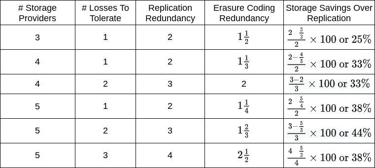
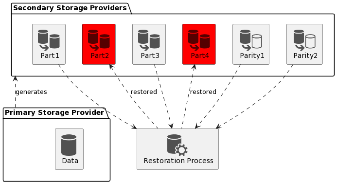
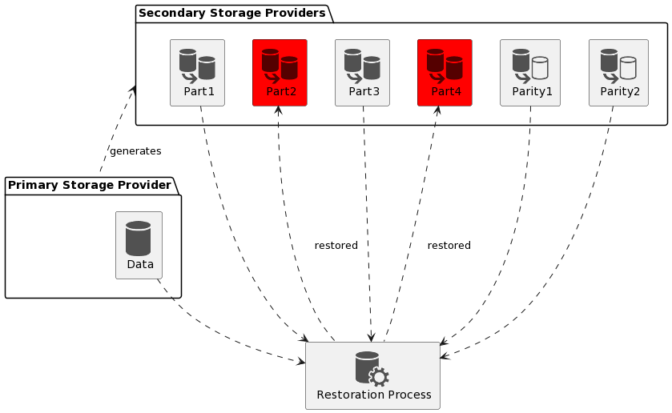
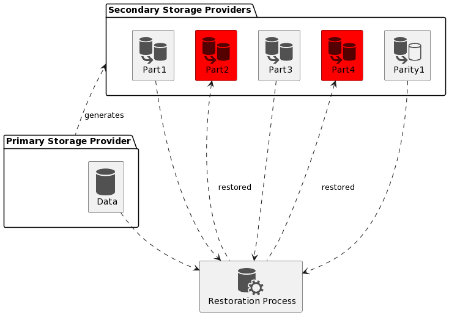

<pre>
  BEP: 256
  Title: BNB Greenfield Erasure Encoding Configuration Adjustment
  Status: Draft
  Type: Standards
  Created: 2023-09-04
</pre>

# BEP-256: BNB Greenfield Erasure Encoding Configuration Adjustment

- [BEP-256: BNB Greenfield Erasure Encoding Configuration Adjustment](#bep-256-bnb-greenfield-erasure-encoding-configuration-adjustment)
    - [1. Summary](#1-summary)
    - [2. Motivation](#2-motivation)
      - [2.1 Overview](#21-overview)
      - [2.2 Expected Outcomes](#22-expected-outcomes)
        - [2.2.1. Reduced Storage Costs for Users](#221-reduced-storage-costs-for-users)
        - [2.2.2. Maintained Data Reliability](#222-maintained-data-reliability) 
    - [3. Specification](#3-specification)
        - [3.1 Restoration Algorithm](#31-restoration-algorithm)
        - [3.2 EC Configuration Adjustment](#32-ec-configuration-adjustment)
        - [3.3 Halt on Restoration Error](#33-halt-on-restoration-error)
    - [4. License](#4-license)

## 1. Summary

This proposal suggests a two-fold approach to improve the BNB Greenfield system. By enhancing the restoration algorithm to incorporate the primary storage provider's copy and adjusting the EC configuration from 4+2 to 4+1, the replication factor can be aligned with the desired level of 3. This transition will lead to reduced storage costs for users while maintaining the system's reliability. The implementation of this proposal stands to benefit both storage providers and users, making the BNB Greenfield system more cost-efficient and dependable.

## 2. Motivation

### 2.1 Overview

In the BNB Greenfield system, the current configuration of Erasure Coding (EC) replication is set to 4+2, which effectively results in a 3-factor replication scheme, as per reference table below.

*Credit: Vishesh Khemani*

However, it has been observed that in storing EC parts, only secondary storage providers participate, leaving the primary storage provider copy out of the replication scheme, as depicted below:

Although a copy of the primary storage provider can be utilized for reliability restoration, the system's potential replication factor remains at 4, even though the desired replication factor is 3. This results in an inherent overhead, affecting costs for both storage providers and users.

### 2.2 Expected Outcomes

The proposed transition will lead to several positive outcomes:

#### 2.2.1. Reduced Storage Costs for Users
By reducing the replication factor from 4 to 3, the number of stored chunks will decrease from 6 to 5. This reduction, when coupled with the current configuration of secondary storage provider price ratios, which is set at 12%, will result in a reduction of the overall price for users by approximately 7%. This reduction in costs will be advantageous for both end-users and businesses utilizing the BNB Greenfield system.

#### 2.2.2 Maintained Data Reliability
Despite the reduction in the replication factor, the proposed changes will not compromise the reliability of the system. The utilization of the primary storage provider's copy in the restoration algorithm ensures that data integrity and restoration capabilities are preserved.

## 3. Specification

### 3.1 Restoration Algorithm

The first step involves enhancing the restoration algorithm to incorporate the copy of the primary storage provider. By doing so, the replication factor of the system will effectively increase to 4. This means that in the event of data loss, the primary storage provider's copy will also be utilized, further enhancing the system's reliability, as depicted below:

### 3.2 EC Configuration Adjustment

To align with the desired replication factor of 3 and to reduce the inherent overhead in the system, the EC configuration can be adjusted from the current 4+2 to 4+1. This means that for every 4 data chunks, only 1 parity chunk will be generated. This adjustment will effectively reduce the replication factor from 4 to the desired 3 while maintaining the desired level of data reliability.

### 3.3 Halt on Restoration Error

If a restoration error occurs, the system will not be able to reproduce the lost data blocks and new data will not be accepted, impacting any new and existing users to upload any data. This drastic action is necessary to protect the chain and its users, so
core developers and community members should investigate the issue as soon as possible. Storage providers
should contact the core developers or be prepared to resume the network.

To bring the system back online, a hard fork is needed. In the fork, the restoration error must be addressed
correctly; for example, if exploitation exists, related accounts should be blacklisted or corrected. Once the system
is resumed, downstream services can be brought back up as well.

## License

The content is licensed under the [CC0](https://creativecommons.org/publicdomain/zero/1.0/) license.
