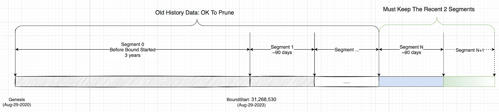

<pre>
  BEP: 283
  Title: Segmented History Block Data Maintenance
  Status: Draft
  Type: Standards
  Created: 2023-09-07
</pre>

# BEP-283: Segmented History Block Maintenance

- [BEP-283: Segmented History Block Maintenance]((https://github.com/bnb-chain/BEPs/pull/283))
    - [1. Summary](#1-summary)
    - [2. Motivation](#2-motivation)
    - [3. Specification](#3-specification)
        - [3.1 Asset Reconciliation](#31-asset-reconciliation)
        - [3.2 Halt on Reconciliation Error](#32-halt-on-reconciliation-error)
    - [4. License](#4-license)

## 1. Summary
This BEP proposes a practical solution to address the issue of increasing history data storage on the BSC(BNB Smart Chain) for full nodes, so they only need to maintain a limited range of blocks. With the introduction of a new synchronization protocol and storage protocol, nodes can synchronize from a specific checkpoint and skip historical blocks. This eliminates the mandatory requirement to keep historical blocks.
## 2. Motivation

The history block data includes block header, body and receipt, they are useless to execute the latest blocks. A recent storage profile on Jul-02-2023 shows that the size of history block has reached ~1288 GB, which makes it a big burden to run a BSC full node. As BSC keeps generating new blocks, the history block data also keeps growing.
Actually the history block data can be maintained by some archive node or by a DA layer, a full node does not need to keep a full copy of the history block. But simply deleting the history block data is also not acceptable, it will make the P2P network in chaos and hard to sync.
We need to make a rule so that full nodes only need to keep a recent period of blocks, like several months, it would be better to keep the bounded history block data size within 200GB. It could reduce both node’s storage pressure and the network traffic cost.


## 3. Specification
|        Parameter       |   Value      |        Description        |
| ----------------- | ----------- | ------------------------  |
|       BoundStartBlock       |   31,268,530    | The starting block height of the first segment, block 31,268,530 was produced on Aug-29-2023, 3 years after the BSC genesis block.        |
|    HistorySegmentLength   |   2,592,000    | assume 1 block for every 3 second, 2,592,000 blocks will be produced in 90 days. |

### 3.1 General Workflow


The history block data will be divided into several segments, the 1st segment is segment_0, which is from genesis to BoundStartBlock-1, then following segments will have the same length: HistorySegmentLength.
```
HistorySegment_0 = [0, BoundStartBlock)
HistorySegment_1 = [BoundStartBlock, BoundStartBlock+HistorySegmentLength)
...
HistorySegment_N = [BoundStartBlock+(N-1)*HistorySegmentLength, BoundStartBlock+N*HistorySegmentLength)
```
The BSC node only needs to maintain the latest 2 segments, in case of block reorg, the current segment number is calculated based on the “finalized” block.
```
ImmutabilityThreshold = 90000

func GetFinalizedBlock() {
  blockByAttestation := GetFinalizedByAttestation()
  blockByThreshold := GetCurrentBlockNumber() - ImmutabilityThreshold
  return max(blockByAttestation, blockByThreshold)
}

func GetCurrentSegmentIndex(blockNum int) {
  if blockNum < BoundStartBlock {
    return 0
  }
  boundBlocks = blockNum - BoundStartBlock
  return (boundBlocks/HistorySegmentLength) + 1
}

finalizedBlock = GetFinalizedBlock()
segIndex = GetCurrentSegmentIndex(finalizedBlock)
if  segIndex > = 2 {
  // the segments before (segIndex - 2) can be pruned
}

```

### 3.2 Prune

The offline block prune would need to be boundary aligned and leave the most recent 2 segments. The most recent segment is determined by the finalized block, since FastFinality is to be enabled, we can take use of the feature to determine the finalized block and then get the current segment index.

#### 3.2.1 Prune details
Since we introduced segment definition, the historical block data will be organized on a segment-by-segment basis within the file directory, making it easy to prune the block data by deleting the corresponding file folder.
```
if segIndex > 2 {
  // delete the file folder of segIndex0 to segIndex - 2
  // os.RemoveAll(segIndex0..segIndex-2)
}

```
### 3.3 Node Sync
 It would be difficult to sync from genesis, since most nodes may choose to not preserve these old blocks, but it is still possible as long as some nodes still keep the whole history data.
There could have 2 approaches to do sync after this proposal
directly download a snapshot of a recent state, from a snapshot service provider or DA layer like GreenField
Segment based snap sync: user can take the boundary blockhash as the new `GenesisHash` and start from it directly. 

### 3.4 Data Availability
Some of the nodes like archive nodes would keep maintaining the whole history data.
And meanwhile, could take use of a DA layer, like greenfield to make sure the whole block data is available.

## 4. Rationale
### 4.1 BoundStartBlock & HistorySegmentLength
As the current history block data is already very large, we prefer to enable this proposal faster, so
BoundStartBlock is still more than 1 month ahead, it could be an acceptable date.
HistorySegmentLength, we did a profile, for the past 6 months(Jan-2023 to July 2023), ~1.2GB history data was generated per day on average. But it is somehow low traffic during this period. Traffic volume could be 3 times if the bull market starts, that is ~3.6GB per day. To keep the historical data size within 500GB in the bull market and 200GB in the bear market, 90 days could be a reasonable value.

### 4.2 Why Segment The History Data
No Big fundamental differences to the EIP-4444 proposal
Pros: aligned
easier to determine the current living blocks?
easier to provide the snapshot download service?

## 5. Forward Compatibility
### 5.1 Portal Network
Portal network is a hot topic to solve the storage pressure, once it is ready, it is possible that portal network can replace this proposal if it has a more applicable solution.

## 6. Backward Compatibility
### 6.1 Archive Node
If you run an archive node, you can just keep all the history block data, no impact to its business.
### 6.2 RPC API
If users query history block data that have been pruned, could return a new error code to show it is expired and removed.

## License
The content is licensed under the [CC0](https://creativecommons.org/publicdomain/zero/1.0/) license.
