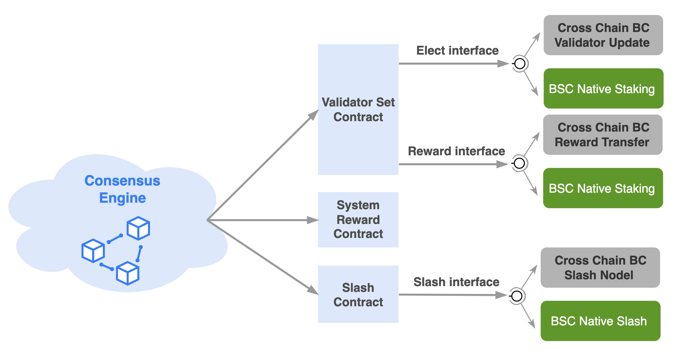
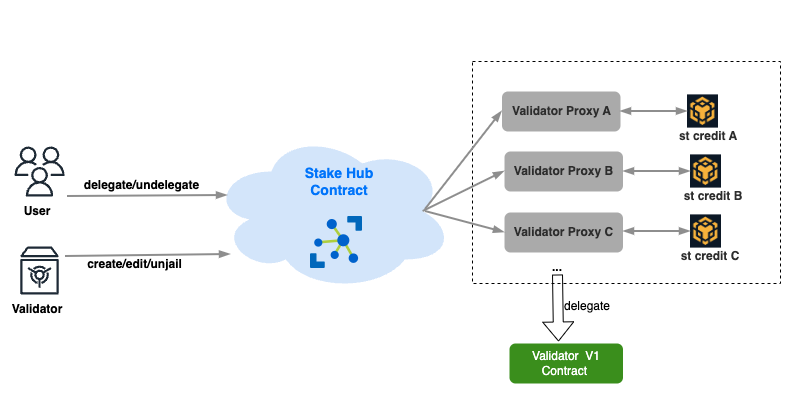
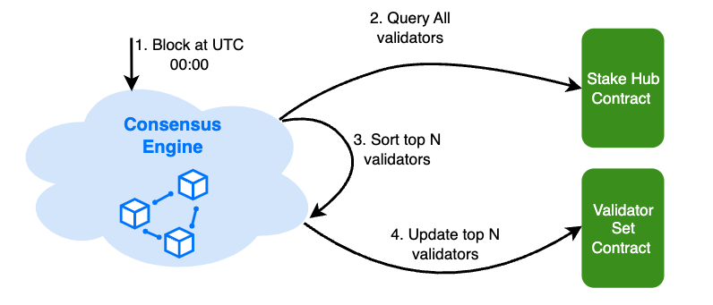

<pre>
  BEP: 294
  Title: BSC Native Staking after BC Fusion
  Status: Draft
  Type: Standards
  Created: 2023-10-13
</pre>

# BEP-294 BSC Native Staking after BC Fusion

- [BEP-294: BSC native staking after BC Fusion](#bep-294-bsc-native-staking-after-bc-fusion)
    - [1. Summary](#1-summary)
    - [2. Abstract](#2-abstract)
    - [3. Status](#3-status)
    - [4. Motivation](#4-motivation)
    - [5. Specification](#5-specification)
        - [5.1 High Level Framework](#51-high-level-framework)
        - [5.2 Staking Hub and Validator](#52-staking-hub-and-validator)
            - [5.2.1 Stake Hub](#521-stake-hub)
                - [5.2.1.1 Create Validator](#5211-create-validator)
                - [5.2.1.2 Distribute Reward](#5212-distribute-reward)
                - [5.2.1.3 Update Eligible Validators](#5213-update-eligible-validators)
                - [5.2.1.4 Edit Validator](#5214-edit-validator)
            - [5.2.2 Validator and Staking Credit](#522-validator-and-staking-credit)
                - [5.2.2.1 Delegate](#5221-delegate)
                - [5.2.2.2 Undelegate](#5222-undelegate)
                - [5.2.2.3 Redelegate](#5223-redelegate)
                - [5.2.2.4 Slash](#5224-slash)
        - [5.3 Breath Block](#53-breath-block)
        - [5.4 Other Function](#54-other-function)
            - [5.4.1 Double Sign Slash](#541-double-sign-slash)
            - [5.4.2 Fast Finality Vote Violation Slash](#542-fast-finality-vote-violation-slash)
    - [6. License](#6-license)

# 1. Summary

Native Staking module is incorporating staking logic into the BNB Smart Chain(BSC) and moving this responsibility off the BNB Beacon Chain. The proposal allows BNB holders to stake BNB to the specified validators and get staking rewards on the BSC side directly.  After staking, delegators will receive staking credit tokens as a tangible proof of their stake. Staking credit is a token that represents staked BNB on BSC, combining the value of initial deposit + staking rewards. Staking credit is minted upon delegation and burned when undelegated.

# 2. Abstract

Native Staking provides various improvements over the existing mechanism:

- Users are able to participate in staking on the BSC without the requirement of using BNB in BEP2 format. This eliminates the need for conversion and offers users a smoother and more seamless staking experience.

- Staking credit, as the proof of BNB staked to a specified validator, cannot be transferred. Different validators issue different staking credits. We encourage different application protocols to wrap multi kinds of staking credit into a  transferable stBNB or wstBNB which can be seamlessly integrated into DeFi platforms, offering various liquidity options to enhance financial flexibility.

- In contrast to [BEP153](https://github.com/bnb-chain/BEPs/blob/master/BEPs/BEP153.md), the latest native staking mechanism brings enhanced user-friendliness and reduced transaction fees. This is accomplished by eliminating the necessity for cross-chain communication at the fundamental level. BEP153 will be disabled before the execution of this BEP.

- Due to the transition of the underlying implementation from Cosmos to smart contracts, the rewards for staking are no longer automatically distributed to users' wallets on a periodic basis. Instead, they are distributed to the wallet when users undelegate their BNBs.

Due to the fact that the staking module does not work independently, it often interacts with the consensus engine and the slash module, the impact on these modules is also mentioned in the proposal.

# 3. Status

Draft.

# 4. Motivation

In order to keep the Simplicity and reuse the good foundation of BNB Beacon Chain(BC), the staking logic of BSC is implemented on BC:

1. The staking token is BNB, as it is a native token on both blockchains.
2. The staking, i.e. token bond and delegation actions happens on the Beacon Chain.
3. The BSC validator set is determined by its staking and delegation logic, via a staking module built on BC for BSC, and propagated every day UTC 00:00 from BC to BSC via Cross-Chain communication.
4. The reward distribution happens on Beacon Chain around every day UTC 00:00.

A significant milestone in BC Fusion is transferring functionalities dependent on the Beacon Chain to BSC, thereby empowering BSC with independent running capabilities. In order to achieve a seamless transition, both BSC native staking and BC staking will coexist for a period of time. Afterwards, the cross-chain communication between BSC and BC will be stopped, only the BSC native staking module will work. 

# 5. Specification

## 5.1 High Level Framework

In order to achieve a seamless upgrade, both the BSC native staking and BC Cross Chain Staking mechanisms will coexist for a period of time. This will continue until a sufficient amount of voting power (¾+) is migrated to the BSC network. Once this threshold is reached, BC staking will be closed, allowing native staking to operate independently.

The robustness of the system contracts in BSC has undergone battle testing over time.. To reduce the risks of intrusive modifications caused by native staking, we have implemented three levels of abstraction in our current solution, which enables us to easily add implementations to specific interfaces:

1. **Consensus Engine**.    
   a. The consensus engine periodically retrieves updates on the validator set from the system contract and utilizes these validator sets to validate the legitimacy of blocks and achieve fast finality.        
   b. After the production of a block, the consensus engine distributes block rewards to validators and the system reward contract.  
   c. The consensus engine will penalize the corresponding validator when they go offline.

2. **Middle Layer Contract**.   
   a. **Validator Set Contract.**  The contract periodically elects a validator set. This can be done by BC sending a cross-chain package to update the validator set to the contract, or by actively retrieving validator set information from the BSC native staking module. The contract also serves as a vault for temporarily storing validator rewards. Periodically, these rewards are sent back to the BC or transferred to the BSC native staking module.  
   b. **System Reward Contract.** This contract acts as a vault to collect part of transaction fees. The funds are used for various public purposes, like distributing fast finality rewards.  
   c. **Slash Contract.** This contract is used to keep track of the number of times a validator becomes unavailable and triggers penalties once a certain threshold is reached. Additionally, this contract also handles other types of slash events, such as double signing and malicious voting in fast finality. 

3. **Underlying Interface**  
   The current staking functionality in BSC is delegated to the Beacon Chain, which in turn affects BSC through cross chain interfaces. These interfaces can be summarized as follows:  
   a. **Elect Interface.** Validatorset update is propagated every day UTC 00:00 from BC to BSC via Cross-Chain communication.  
   b. **Reward Interface.**  The Validatorset contract transfers the rewards collected on a specific day from BSC to BC through cross-chain communication. Afterwards, the rewards are distributed among delegators based on their respective shares.   
   c. **Slash Interface.** The Slash contract sends the slash cross-chain packet to BC, triggering the actual jail logic on BC.

The **Consensus Engine** and **Middle Layer Contract** will remain unchanged in terms of structure and logic. However, we need to add an implementation for BSC Native Staking to the **Underlying Interface**. The specific implementation invoked will depend on the type of validator created. 

## 5.2 Staking Hub and Validator

The Native Staking module consists of three components:

- **Stake Hub**: This contract serves as the entry point for managing validators and delegations, while also implementing the logic for slashing specific validators.

- **Validator Implementation Contract:** This contract implements the logic for users to stake, unstake to a specific validator. It is also the actual implementation of the staking credit contract.

- **Validator Proxy:** To optimize gas consumption during the creation of validators and facilitate the simultaneous upgrade of all validator contracts, a proxy-based upgradable contract approach is adopted for deploying validator contracts. This allows for efficient deployment and future upgrades of the validators.

### 5.2.1 Stake Hub

Stake Hub defines the structure of a Validator. A validator has following fields:

- **operatorAddress**. The basic information of a validator can be updated by sending a transaction using this account. When a validator exits, the staked deposit can be retrieved using this account.

- **consensusAddress**. Validator Nodes utilize this account to sign blocks, and other nodes in the network verify the signature to ensure that the block is proposed by a legitimate validator. 

- **voteAddress**. Validator Nodes use this account to participate in fast finality voting.

- **contractAt.** Each validator has its own contract where staked BNB is temporarily held. 

- **description.** The Validator can have essential information such as a moniker and website.

- **commission.** Validators receive a portion of the transaction fees as a commission from the block rewards.

#### 5.2.1.1 Create Validator

The **operatorAddress** can send a transaction to create a validator，certain conditions must be met:

- **operatorAddress** must stake an amount equal to or greater than **minSelfDelegationBNB** on its own validator.

- The transaction should provide proof of possession of the vote key.

Afterward, a brand-new validator contract will be created, and the corresponding staking credit will be minted. 

#### 5.2.1.2 Distribute Reward

Every day, a portion of the rewards collected will be directly sent to the operator account of the validator, while the remaining portion will be sent to the corresponding validator contract.

#### 5.2.1.3 Update Eligible Validators

The top N validators with the most staked BNB will become the active validator set. This ensures a robust and secure network by prioritizing validators who have demonstrated a significant commitment of BNB tokens. Implementing gas-efficient sorting in smart contracts presents significant challenges.

At the first block after UTC 00:00, the consensus engine query the full list of validators through the stake hub contract and retrieve the top N validators using fast sorting. This sorting process takes place within the consensus engine, ensuring high efficiency and not being restricted by the block's gas limit. Then, the consensus engine updates the validator set contract by sending a system transaction that includes the information of the top N validators.

#### 5.2.1.4 Edit Validator

The Operator can update a validator's information by sending transactions. The fields that can be updated include: **Consensus Address, Description, Vote Address, and Commission Rate**. Apart from the Description, all other information can only be updated once within a day. Updating the Vote Address requires providing additional proof of vote key possession.

### 5.2.2 Validator and Staking Credit

Each validator has its own validator contract that manages staking credit and facilitates the exchange between credit and BNB. The token name of a staking credit is "Stake{{validator moniker}}Credit", and the symbol is "st{{validator moniker}}".

#### 5.2.2.1 Delegate

In this contract, an important field to consider is the **totalPooledBNB**, which represents the quantity of BNB held by this contract. **totalPooledBNB** gets two sources of income: One source comes from BNB staked by users, while the other originates from rewards earned by validators for producing blocks. If users stake **bnbAmount**, the amount of credit mint to them is:   **stCreditAmount = bnbAmount * totalSupply() / totalPooledBNB**.

#### 5.2.2.2 Undelegate

If users decide to unstake their **stCreditAmount**, they will be able to reclaim the equivalent amount of BNB, which will be exactly: **(stCreditAmount * totalPooledBNB) / totalSupply()**.

To maintain network security and prevent potential compromises caused by incidents resulting in a large number of users unstaking, users must wait for 7 days after initiating a request before they can retrieve their BNB tokens.

#### 5.2.2.3 Redelegate

Unlike undelegating, redelegate enables users to unstake their BNB and stake to another validator promptly.

To discourage potential abuse of this feature, redelegate necessitates a fee payment in BNB, proportionate to the delegated amount. This fee contributes to the rewards of the destination validator's staking pool, with no commission allocated to the validator.

#### 5.2.2.4 Slash

When a slash occurs, the contract will burn a specific amount of staking credit owned by the stake hub. The corresponding value of BNB will be transferred to the system reward contract.

If there is not enough staking credit to be slashed, the validator will be frozen. It won't be elected again until the remaining fine is paid.

## 5.3 Breath Block

The first block after UTC 00:00 is called the Breath Block. The consensus engine activates specific logic by transmitting system transactions at breath block:

- If a validator is in a maintenance state, it will be forcefully exited from that state.

- The block rewards held from the previous day will be sent to the respective validator contract. 

- The validator offline counter in the Slash contract will be reset.

- Update top N validator set.

## 5.4 Other Function

### 5.4.1 Double Sign Slash

The double sign slash feature implemented on the Beacon chain needs to be migrated to the BSC contracts. In BSC, a pre-compile contract will be introduced to implement double sign detection logic, which remains consistent with the current implementation. The precompiled contract returns the height of the malicious block headers and the corresponding signer. The contract will slash the validator linked to the signer.

### 5.4.2 Fast Finality Vote Violation Slash

Currently, the validation of malicious voting occurs within the BSC contract. However, it does not check for the existence of the validator, but instead sends the cross-chain slash package to the Beacon Chain, which then identifies the validator and carries out the punishment. The Afterward, BSC contract carries out punitive actions using the information it has about all validators.

# 6. License

The content is licensed under [CC0](https://creativecommons.org/publicdomain/zero/1.0/).
