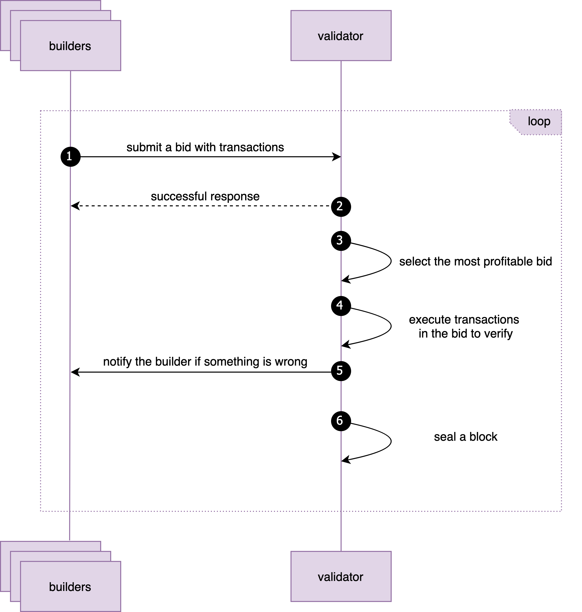
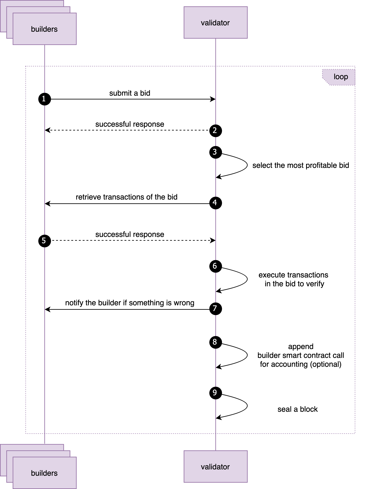
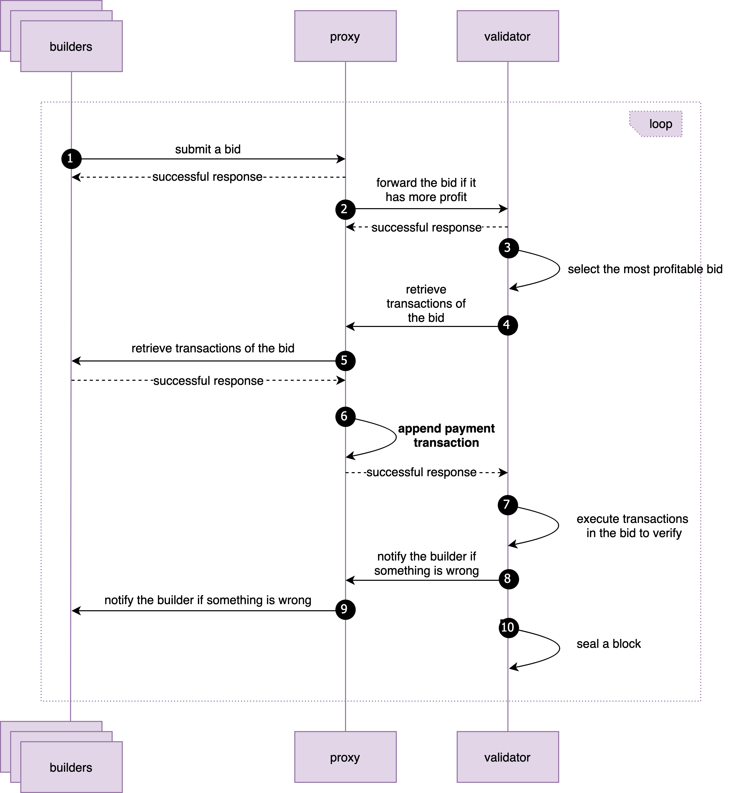
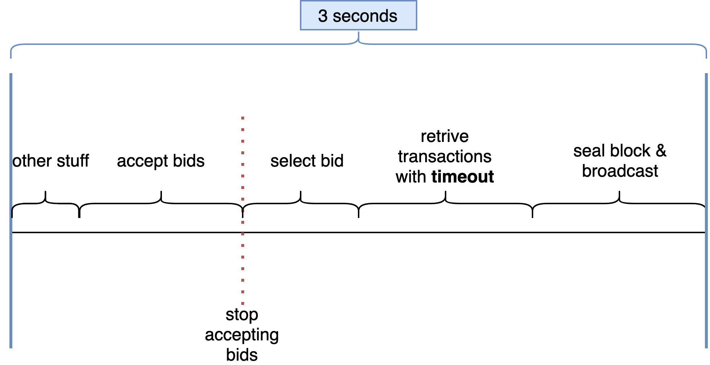
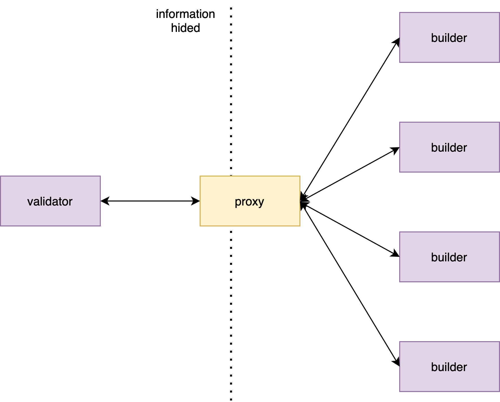

<pre>
	BEP: 322
	Title: Builder API Specification for BNB Smart Chain
	Status: Draft
	Type: Standards
	Created: 2023-11-15
</pre>

# BEP-322: Builder API Specification for BNB Smart Chain

- [BEP-322: Builder API Specification for BNB Smart Chain](#bep-322-builder-api-specification-for-bnb-smart-chain)
    - [1. Summary](#1-summary)
    - [2. Motivation](#2-motivation)
    - [3. Specification](#3-specification)
        - [3.1 BSC Trust Model](#31-bsc-trust-model)
        - [3.2 Workflow](#32-workflow)
        - [3.3 Payment & Economic Considerations](#33-payment--economic-considerations)
        - [3.4 APIs](#34-apis)
    - [4. Further Discussion](#4-further-discussion)
        - [4.1 Builder Registration](#41-builder-registration)
        - [4.2 Proxy for Validator](#42-proxy-for-validator)
    - [5. References](#5-references)
    - [6. License](#6-license)

## 1. Summary

In Ethereum, a [builder](https://github.com/ethereum/builder-specs) orders transactions from users/searchers and submits
them to consensus
layer clients for proposing new blocks. This BEP introduces a builder
api specification for running builders on BNB Smart Chain. This
specification mainly defines the communication workflow and the
application interfaces between builders and validators, as well as the
economic considerations for real adoptions.

## 2. Motivation

The [Ethereum Builder API
Specification](https://github.com/ethereum/builder-specs) has been supported by almost all the mainstream
Ethereum consensus clients. Nowadays, the inclusion rate of blocks from builders
is [about 90%](https://dune.com/ChainsightAnalytics/mev-after-ethereum-merge) (based on the statistics of October 2023).
However, on BNB Smart Chain, there is no such specification yet. By
introducing such a specification, it will resolve some problems as well
as bring new benefits for the ecosystem.

- **Improve stability**. Current validators are using different customized implementations for MEV with
  different levels of quality, which brings instability to the network. With a specification, it will provide guidelines
  and standards to follow, minimizing the instability issues.

- **Improve economy**. The current situation is different mev provider has different architecture and APIs,
  one validator finds it's hardly to integrate with multiple MEV providers simultaneously, also due to
  the lack of support on BSC clients. So we put forward this specification to try to boost mining and delegating economy,
  validators can easily get more extractable value from integrating with more MEV providers, delegators can earn more
  rewards from validators.

- **Improve transparency**. This specification would try to bring transparency into bsc mev market, expose profit 
  distribution among stakeholders(validators, delegator, builders) to public.

## 3. Specification

### 3.1 BSC Trust Model

Before we move on to the design of Builder Specification, let's have an
analysis of the BSC trust model and compare it to Ethereum. It will
lead to different designs for these two networks.

- Validators are more trustworthy in BNB Smart Chain. In BSC, the
  validators should delegate a lot of BNB (more than 10 thousand in
  general) and maintain a high reputation. Misbehaviour will lead to
  reputation damage and un-delegations. Currently, there are about
  40 validators (more validators are coming) with 20M BNB staked, including active and inactive
  ones. In Ethereum, the barrier to becoming a validator is very
  low (i.e., 32 ETH), and there are more than [800 thousand Ethereum
  validators](https://www.nasdaq.com/articles/the-most-pressing-issue-on-ethereum-is-validator-size-growth).
  It means that a validator can be anyone, and it can enter or quit
  easily. That's quite different from BSC.

- Meanwhile, the relay role in Ethereum Builder API is supposed to be
  trusted by both builders and validators. In BSC, the necessity of
  introducing another trusted role is not that much. In this
  specification, we don't utilize relay; however, it is still
  workable to add relay between builders and validators.

### 3.2 Workflow

#### 3.2.1 Overall Workflow

Builders and validators collaborate to propose blocks during each production interval. Two interaction options exist 
between them: one-round and two-round. In one-round, builders include transactions with their bids, allowing validators 
to immediately seal a block without additional transaction requests. Conversely, in two-round, builders send bids 
without transactions initially. If selected, validators retrieve transactions through another RPC call before sealing 
the block. The two-round process is considered more time-consuming compared to the one-round interaction. 

*One-round is the default option for trusted relationship,*
*It's highly suggest to adopt two-round interaction for builders who* 
*1. not trust validator;* 
*2. don't care too much about latency or adopt chance.* 

**One-round(recommended and default)** interaction:

1) Builder submits bids with transactions to the current or multiple registered proposers.
2) Builder gets the idea if the bid is or not successfully received from proposers' responses.
3) Proposer picks the max valuable bid from all received bids.
4) Proposer executes the full transactions and verifies the gas.
5) If the bid in invalid, the proposer will use local bid to do sealing, and then notify specified builder using issue
   api (see later more details). or step-6.
6) if the bid is valid, the proposer will seal the block, and then notifies specified builder asynchronously with 
   own signature as a receipt. (optional for notification here if proxy is used)

**One-round with proxy(optional)** interaction:

omit here, only difference is that proxy could append transfer transaction to pay builder fee, as seems as 
**Two-round with proxy(optional)** below.

**Two-round(optional)** interaction:

1) Builder submits bids with transactions to the current or multiple registered proposers.
2) Builder gets the idea if the bid is or not successfully received from proposers' responses.
3) Proposer picks the max valuable bid from all received bids. 
4) Proposer asks the builder for full transactions if its bid is chosen, it also gives the builder its signature
   as a receipt. 
5) The builder should return the full transactions.
6) Proposer executes the full transactions and verify the gas value.
7) if the bid is invalid, the proposer would use local mining result to do sealing, and then notify specified builder
   using issue api (see later more details). or step-8.
8) if the bid is valid, the proposer would seal the block.

tips: If there is no profitable bid compared to local or the transactions do not return in time, proposer can still 
seal a block using local transactions.

**Two-round with proxy(optional)** interaction:

Validator can run a proxy in front of it. The proxy will has its own wallet, which should be different from consensus
wallet, and append a transfer transaction to send builder fee. The proxy can also filter bids and only forward the more
profitable ones to a validator.

Here, we would like to highlight some main differences between Ethereum
Builder Specification here for the readers who are familiar with it.

- In Ethereum, a block header is passed from a builder to a validator
  for sign, and then a block can be broadcast to the network
  without revealing the transactions to a validator. In BSC, to
  generate a valid block header, transactions in the block should be
  executed as well as several system contract calls (e.g., transfer
  coinbase, deposit to the validator set contract), it is not possible for a
  builder to do these. Meanwhile, as mentioned in the previous
  section, the trust model in BSC is different to Ethereum; it is
  workable for builders to send transactions to validators after
  receiving the receipt signature. In case a builder finds a
  validator stealing transactions, it can 1) not submit bids to evil
  validators anymore, 2) reveal evidence to the public channels (e.g., chatting groups, github, blogs) for
  social influence.

- In Ethereum, the fee settlement between builders and validators is
  conducted using coinbase reward (for reward to builders) and token
  transfer (for fee to validators). In BSC, the coinbase reward will
  be transferred to the system contract for later distribution to
  all delegators. A different way is proposed in this proposal; a
  validator can run a proxy to append transfer transaction for payment.
  It will be further discussed in the later section.

#### 3.2.2 Edge Cases

For the two-way and multiple round communication between builders and
validators, there could be some special cases.

- If the validator cannot receive full transactions before timeout,
  the validator should 1) notify the builder using issue api (see
  later more details), 2) refuse the builder's bids for a while or
  even forever.

- If a validator finds the transactions from a builder is invalid,
  the validator should 1) notify the builder using api calls, 2)
  refuse the builder's bids for a while or even forever.

- If a builder finds that its transactions are stolen by a
  validator, the builder should 1) refuse to send bids to the validator, 2)
  disclose the steal to public channels for social influences if necessary.

#### 3.2.3 Implementation Considerations

Firstly, on BSC, the blocking time is only 3 seconds, which means a
validator must set a cut-off time to stop receiving new bids, and a
timeout to retrieve transactions from the winning builder.
Meanwhile, to reduce latency, the one round interaction (i.e., builders send bids and transactions together) 
is suggested to be the default option for proposing blocks.

Secondly, a validator can choose to run a node with or without support for builder.
The implementation should support a validator to turn on/off the feature
based on its choice.

Thirdly, as mentioned earlier, a proxy can be used for payment by appending transfer transactions.
Meanwhile, for a validator it needs to interact with many builders at the same time.
A proxy can also be implemented to protect validators, e.g., hiding validator’s real
IP information, protecting against DDoS, and others.

### 3.3 Payment & Economic Considerations

On BNB Smart Chain, the coinbase reward must be distributed to the block
proposer (i.e., a validator) and transferred to a system contract.
Without changing the consensus rule, these following approaches can be
taken for payment.

For payment from users to builders, off-chain or on-chain solutions can
be considered.

- Users can subscribe to builders' service. For example, users can
  pay builder service every month based on different levels of
  prices.

- Users can insert a transfer transaction into his/her bundles to pay
  the builder.

For the payment between builders and validators:

- A validator can run a proxy and append transfer transactions to pay builders.
  If a validator does not append the transfer transaction, a builder can still
  use the receipt (with validator’s signature) to ask for settlement using other approaches.

- A validator and a builder can negotiate other off-chain on-chain approaches which are out of scope of the
  specification.

Furthermore, let's also discuss what will happen if a builder or a
validator misbehaves.

- If a builder wins a bid and does not return full transactions to a
  validator, the validator can easily detect this and stop service
  for the builder. Eventually, the builder will get no income from
  block production, consequently users will also leave the builder.

- If a validator steals transactions from a builder when there is
  potential value. The victim builder can detect this and stop
  sending bids to the validator, and also can post evidence (i.e.,
  the signature from a validator) about the misbehavior. The
  validator will lose the income from the builder and even more
  builders.

### 3.4 APIs

Following APIs are introduced on Builder and BSC client sides, to
implement the aforementioned workflows. The full specification of these
APIs is defined in [a repo with swagger and smart
contracts](https://github.com/bnb-chain/builder-specs).

#### 3.4.1 Builder APIs

The following APIs should be implemented on Builder.

##### 3.4.1.1 Retrieve Transactions

This api is used by the validator to ask for full transactions once a
builder's bid is chosen. The request body will be treated as a receipt
for payment settlement.

<table>
<tr>
<td>Path</td> 
<td>/bsc/v1/builder/txs</td>
</tr>

<tr>
<td>Http Method</td> 
<td>POST</td>
</tr>

<tr>
<td>Request Body</td> 
<td>
<pre lang="json">
<code>
{
  "message": {
    "block": "height of the block",
    "parent_hash": "the hash of parent block",
    "timestamp": "timestamp",
    "gas_value": "gas value for this block",
    "builder_fee_value": "the fee that builder would like to give",
    "builder_address": "builder address",
    "consensus_address": "validator consensus address",
  },
  "signature": "signature of the message",
  "return_transactions": "the builder should transactions back or not"
}
</code>
</pre>
</td>
</tr>

<tr>
<td>Success Response</td> 
<td>
<pre lang="json">
<code>
{
  "message": {
    "timestamp": "timestamp",
    "bid":{
      "block": "height of the block",
      "parent_hash": "the hash of parent block",
      "builder_address": "builder address",
      "gas_value": "gas value for this block",
      "builder_fee_value": "the fee that builder would like to give"
    },
    "transactions": [
      {},
      {},
      {}
    ]
  },
  "signature": "signature of the message"
}
</code>
</pre>
</td>
</tr>

<tr>
<td>Error Response</td> 
<td>
<pre lang="json">
<code>
{
  "code": 400,  //example here, there are others
  "message": "response message"
}
</code>
</pre>
</td>
</tr>
</table>

##### 3.4.1.2 Notify Issues

This api is used to report issues to a builder. For example, if a
validator finds that a builder's transactions are invalid or the txs
api is timeout-ed, a validator can notify the builder.

<table>
<tr>
<td>Path</td> 
<td>/bsc/v1/builder/issue</td>
</tr>

<tr>
<td>Http Method</td> 
<td>POST</td>
</tr>

<tr>
<td>Request Body</td> 
<td>
<pre lang="json">
<code>
{
    "message": {
      "issue_code": "code the predefined issues",
      "timestamp": "timestamp", 
      "consensus_address": "validator consensus address"
    },
    "signature": "signature of the message"
  }
</code>
</pre>
</td>
</tr>

<tr>
<td>Success Response</td> 
<td>
HTTP status code is 200
</td>
</tr>

<tr>
<td>Error Response</td> 
<td>
<pre lang="json">
<code>
{
  "code": 400,  //example here, there are others
  "message": "response message"
}
</code>
</pre>
</td>
</tr>
</table>

#### 3.4.2 Validator APIs

The following APIs should be implemented on the validator side or BSC clients.

##### 3.4.2.1 Bid Block

This api is used by the builder to submit its bid for the current block
production. In general, a proposer will use the `gas_fee` and
`builder_fee_value` (`profit = gas_fee * validator_commission_rate - builder_fee_value`) to
find the most profitable bid.

<table>
<tr>
<td>Path</td> 
<td>/bsc/v1/builder/bid</td>
</tr>

<tr>
<td>Http Method</td> 
<td>POST</td>
</tr>

<tr>
<td>Request Body</td> 
<td>
<pre lang="json">
<code>
{
  "message": {
      "block": "height of the block",
      "parent_hash": "the hash of parent block",
      "timestamp": "timestamp", 
      "builder_address": "builder address",
      "gas_limit": "gas limit",
      "gas_value": "gas value for this block",
      "builder_fee_value": "the fee that builder would like to get",
      "transactions": [ //optional
          {},
          {},
          {}
        ]
  },
  "signature": "signature of the message",
}
</code>
</pre>
</td>
</tr>

<tr>
<td>Success Response</td> 
<td>
HTTP status code is 200
</td>
</tr>

<tr>
<td>Error Response</td> 
<td>
<pre lang="json">
<code>
{
  "code": 400,  //example here, there are others
  "message": "response message"
}
</code>
</pre>
</td>
</tr>
</table>

## 4. Further Discussion

### 4.1 Builder Registration

The process for builders to register to validators is not defined in this specification.
However, a promising solution is highlighted and suggested—using a smart contract for builder registration.

In BSC, one smart contract can be implemented to provide the following functionalities:

- a validator can register its information (e.g., consensus address, proxy url) for participation.

- a builder can deposit some amount of BNB for participation.

- a builder can register to validators by providing its information (e.g., builder address).

With this kind of smart contract, builders and validators can discover each other easily.
It also provides transparency for all related stakeholders.
An [example](#5-references) is presented to demonstrate such a smart contract.

### 4.2 Proxy for Validator

As mentioned earlier, a proxy can be used for validators to provide several functionalities,
including payment to builders, filtering bids, protection of DDoS, and so on.
Therefore, it is highly suggested for validators to run such a layer in real adoption.

## 5. References

* [BSC Builder Specs](https://github.com/bnb-chain/builder-specs)
* [Example Smart Contracts](https://github.com/bnb-chain/builder-specs/examples)

## 6. License

The content is licensed under
[CC0](https://creativecommons.org/publicdomain/zero/1.0/).
