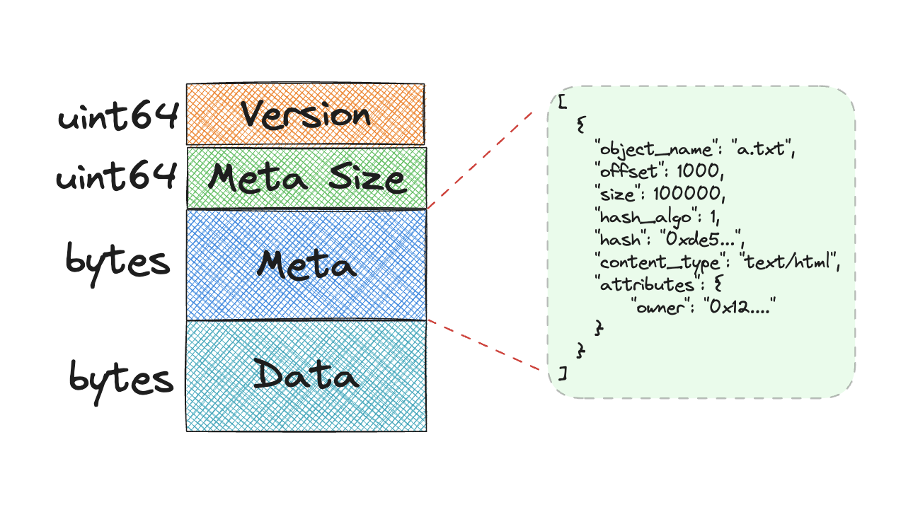
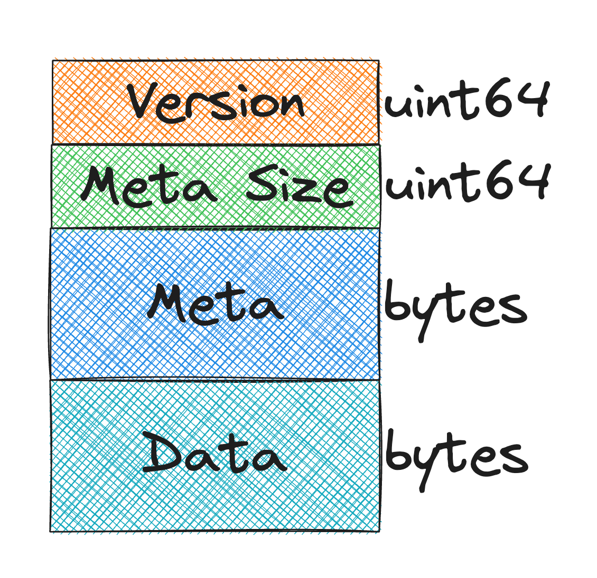

<pre>
  BEP: 323
  Title: Bundle Format for Greenfield
  Status: Draft
  Type: Standards
  Created: 2023-11-16
</pre>


# BEP-323: Bundle Format for Greenfield

- [BEP-323: Bundle Format for Greenfield](#bep-323-bundle-format-for-greenfield)
    - [1. Summary](#1-summary)
    - [2. Motivation](#2-motivation)
    - [3. Specification](#3-specification)
        - [3.1 Bundle Format](#31-bundle-format)
          - [3.1.1 Encoding](#311-encoding)
    - [4. License](#4-license)

## 1. Summary

This BEP proposes a solution for better on-chain storage efficiency and user experience in Greenfield by introducing 
a method to bundle small files together before uploading. The new system will reduce storage space and costs caused 
by small files while increasing the capacity of the entire network.

## 2. Motivation

Storing small files in Greenfield is inefficient. The metadata stored on the blockchain can be larger than the files, 
leading to higher costs for users. Greenfield Blockchain has a capacity limit to process files simultaneously.

To tackle this problem, we aim to design a bundle format specifically for Greenfield. This is because a specialized 
format will allow developers to build something that fits exactly with what Greenfield and its users need, without 
any unnecessary features. By introducing a bundle format, Greenfield can provide a better service to the users and 
make sure that Greenfield stays efficient and easy to use as it grows.

## 3. Specification

### 3.1 Bundle Format

The bundle format specifies the structure and organization of the bundle that users create when packing files. 
This format is designed to pack flat files; hierarchical directory structures, or folders, are not supported.

When dealing with a folder, users can simplify its structure by turning it into a series of individual files. 
As part of this process, it renames each file to include the folder path. For example, a file originally named 
`file.txt` inside the nested folders `dirA` and `dirB` would be renamed to `dirA/dirB/file.txt`. 
This approach allows us to maintain the organization of the folder while conforming to the requirement for flat files in the bundle.

There are still constraints for the bundle format. The file names of the files in the bundle should be unique so that 
they can be indexed by the file name.

The bundle format is structured into several key components as follows:

*   Version: This indicates the version number of the bundle protocol being used.
*   Meta Size: This specifies the size of the bundle's metadata, allowing the construction of the bundle structure without the need to read the entire bundle.
*   Metadata: This section contains information about the files within the bundle. It facilitates the ability to access files randomly, which means you can jump directly to any file within the bundle without going through all the files.
*   Data: This portion represents the actual content and is comprised of all the files in bytes.



The Meta structure is designed to include essential attributes for each file, outlined as follows:

*   Object Name: This is the name of the file within the bundle.
*   Offset: This attribute marks the starting point of the file's data within the bundle.
*   Size: This details the total length, in bytes, of the file.
*   Hash Algo: This specifies the algorithm used for the file's hash calculation.
*   Hash: This is the cryptographic hash result of the file's content. It serves as a tool for verifying the file's integrity.
*   Content Type: This denotes the MIME type of the file, describing the file's nature and format.
*   Tags: This is a map that holds various additional properties of the file like `owner` .

#### 3.1.1 Encoding



The bundle's encoding format is structured as follows:

*   Version: Serialized as an unsigned 64-bit integer, occupying 8 bytes.
*   Meta Size: Also an unsigned 64-bit integer, represented using 8 bytes, indicating the size of the metadata section.
*   Metadata: Encoded in bytes, this section utilizes Protocol Buffers (protobuf) for serialization.
*   Data: This consists of the actual file contents, represented as a sequence of bytes.

The Meta structure will be serialized with protobuf:

```java
enum HashAlgo {
  Sha256 = 0;
}

message Meta {
  repeated FileMeta meta = 1;
}

message FileMeta {
  string object_name = 1;
  uint64 offset = 2;
  uint64 size = 3;
  HashAlgo status = 4;
  bytes hash = 5;
  string content_type = 6;
  map<string, string> tags = 7;
}
```

## 4. License

The content is licensed under [CC0](https://creativecommons.org/publicdomain/zero/1.0/).