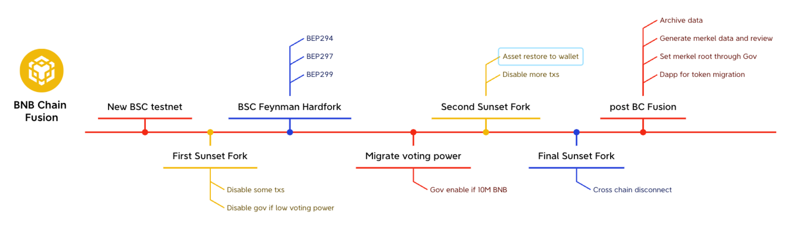

<pre>
  BEP: 333
  Title: BNB Chain Fusion
  Status: Draft
  Type: Standards
  Created: 2023-11-29
</pre>

# BEP-333: BNB Chain Fusion

[BEP-333: BNB Chain Fusion](#bep-333-bnb-chain-fusion)
  - [1. Summary](#1-summary)
  - [2. Abstract](#2-abstract)
  - [3. Status](#3-status)
  - [4. Motivation](#4-motivation)
  - [5. Specification](#5-specification)
      - [5.1 Introduction](#51-introduction)
      - [5.2 Multiple Phases](#52-multiple-phases)
  - [6. License](#6-license)

## 1. Summary

This BEP proposes to securely and smoothly transit the BNB Beacon Chain
and BNB Smart Chain (BSC) from a dual-chain structure into a single chain
structure and decommission the Beacon Chain.

## 2. Abstract

BNB Chain Fusion (BC Fusion) is a major achievement for BNB Chain. It
helps overcome legacy services and technical debt, enabling faster
iteration and development. BC Fusion includes three sub-BEPs:

- [BEP-294: BSC Native Staking](https://github.com/bnb-chain/BEPs/pull/294)

- [BEP-297: BSC Native Governance](https://github.com/bnb-chain/BEPs/pull/297)

- [BEP-299: Token Migration after BC Fusion](https://github.com/bnb-chain/BEPs/pull/299)

This BEP primarily proposes strategic planning and coordination for
organizing these BEPs. The goal is to facilitate the secure and seamless
implementation of BC Fusion.

## 3. Status

This BEP is a draft.

## 4. Motivation

BNB Beacon Chain is a blockchain developed by the BNB Chain community
that implements a vision of a decentralized exchange (DEX) for digital
assets. Besides this, Beacon Chain and BSC is a dual-chain structure:
Beacon Chain helps to enhance the security of BSC as a staking and
governance layer. With the rise of various other forms of Dex,
order-book based decentralized exchange was decommissioned in
[BEP151](https://github.com/bnb-chain/BEPs/blob/master/BEPs/BEP151.md).
With the quick evolution of BSC, the Beacon Chain has become a burden.
The cross-chain bridge that connects the two chains slows down the
development iteration and always exposes BNB to a certain level of
security vulnerabilities. It\'s time to take a step further and migrate
the functionality of Beacon Chain to BSC, allowing Beacon Chain to
retire.

## 5. Specification

### 5.1 Introduction

The Beacon Chain currently possesses several key functionalities:

1. Cryptocurrency management platform. The Beacon Chain mainnet
   currently supports a hundred kinds of [BEP2](https://explorer.bnbchain.org/assets/bep2)
   and [BEP8](https://explorer.bnbchain.org/assets/bep8)
   tokens. These tokens have value and can be circulated on the
   Beacon Chain or transferred across different chains using
   protocols such as [BEP3](https://github.com/bnb-chain/BEPs/blob/master/BEPs/BEP3.md).

2. The staking layer of BSC. The BSC utilizes the POSA consensus
   algorithm. It delegates staking election and reward distribution
   functions to the Beacon Chain. This design choice was based on the
   fact that the Beacon Chain is built on the cosmos-sdk
   architecture, which already includes a well-developed staking
   module that can be reused.

3. The governance layer of BSC. For similar reasons, the governance
   functionality of BSC is delegated to the Beacon Chain as well. The
   governance vote and tally happen on Beacon Chain, and the
   execution plan is delivered to the BSC through cross chain
   communication protocol.

Therefore, we have three separate BEPs that discuss how to migrate these
functionalities or valuable assets to BSC.

1. [BEP-299](https://github.com/bnb-chain/BEPs/pull/299):
   This BEP presents a secure and trustless way for users to recover
   their assets on the BSC once the Beacon chain stops running.

2. [BEP-294](https://github.com/bnb-chain/BEPs/pull/294):
   This BEP allows BNB holders to stake BNB to the specified
   validators and get staking rewards on the BSC side directly. To
   ensure network security, the migration of Staking voting power is
   designed to be seamless. This means that both the Beacon Chain and
   BSC\'s staking modules will coexist and function simultaneously
   during the migration process.

3. [BEP297](https://github.com/bnb-chain/BEPs/pull/297):
   This BEP allows community members to submit proposals directly on
   the BSC network. The governance module is fully compatible with
   [Tally](https://www.tally.xyz/).

### 5.2 Multiple Phases

To accomplish BC Fusion, there will be several preparation and
post-action steps involved, connecting these BEPs together. Thus, BC
Fusion is divided into multiple stages:

#### 5.2.1 First Sunset Fork

Due to the requirement of returning cryptocurrency to the user\'s wallet
in order to migrate funds to BSC through
[BEP-299](https://github.com/bnb-chain/BEPs/pull/299). The
Beacon Chain will disable specific types of transactions to encourage
users to keep their funds in their own wallets. The following types of
Beacon chain transactions will be disabled: **TimeLockMsg**,
**TimeRelockMsg**, **FreezeMsg**, **IssueMsg**, **MintMsg**,
**IssueMiniMsg**, **HTLTMsg**, **DepositHTLTMsg**.

During the migration process, Beacon Chain prohibits the creation and
editing of validators to prevent conflicts with validators created on
BSC side. New delegations will also be prohibited. 
The following types of Beacon chain transactions will be
disabled: **MsgCreateValidatorOpen**, **MsgCreateSideChainValidator**,
**MsgCreateSideChainValidatorWithVoteAddr**,
**MsgEditSideChainValidatorWithVoteAddr**, **MsgSideChainDelegate**,
**MsgSideChainReDelegate**.

To ensure that the voting power migration process is not maliciously
manipulated, the Governance module will be automatically disabled when
the voting power is below 5M BNB.

The above-mentioned features will be enabled in Beacon Chain
**FirstSunsetFork**.

#### 5.2.2 BSC Feynman Hardfork

[BEP-294](https://github.com/bnb-chain/BEPs/pull/294),
[BEP-297](https://github.com/bnb-chain/BEPs/pull/297) and
[BEP-299](https://github.com/bnb-chain/BEPs/pull/299) will
be deployed in the BSC **Feynman** hard fork.

1. [BEP-294](https://github.com/bnb-chain/BEPs/pull/294)
   will take effect immediately. Validators created on BSC will
   receive triple voting power when staking an equal amount of BNB.
   This encourages the transfer of voting power from the Beacon Chain
   to BSC.

2. The [BEP-297](https://github.com/bnb-chain/BEPs/pull/297)
   governance functionality will not be activated immediately after
   the hardfork. It will only be automatically enabled once more than
   10 million BNB are migrated to BSC.

3. The smart contract of [BEP-299](https://github.com/bnb-chain/BEPs/pull/299)
   is not available as the merkel root in the smart contract is still
   empty at this time. Only after the Beacon Chain comes to a
   complete halt, the Token Migration feature will be initiated by
   setting the Merkle root for balance dump through governance.

4. Cross-chain re-delegation, which allows users to un-delegate their stakes
   from Beacon Chain and then delegate them on BSC in one Beacon Chain transaction, 
   will be enabled after governance opening the related cross-chain channel.

An important wallet will be introduced in this hardfork:
**AssetProtector.** **AssetProtector** is a multi-signature wallet
controlled by the core dev team at the beginning. It can:

- Pause and unpause the staking, governance and token migration
  contract in emergency situations.

- Forbidden a specific account to perform any operations in the
  staking contract.

#### 5.2.3 Second Sunset Fork

After transferring more than two-thirds of the voting power to BSC, the
Beacon Chain must restrict additional transaction types and
automatically execute specific logic to ensure the return of funds to
users\' wallets. The following transactions will be disabled:
**MsgSideChainSubmitProposal**.

All TimeLock and AtomicSwap will automatically be refunded to the
user\'s wallet. All the BSC delegation will be undelegated
automatically, if the delegation comes through
[BEP153](https://github.com/bnb-chain/BEPs/blob/master/BEPs/BEP153.md),
the funds will be sent back to the BSC network.

#### 5.2.4 Final Sunset Fork

Before executing Final Sunset, users still have the opportunity to
transfer funds across chains. However, after Final Sunset, cross-chain
communication between the Beacon Chain and BSC will be completely
stopped.

After Sunset Fork, the validators in the Beacon Chain community will
gradually shut down, and the entire chain will no longer accept new
transactions or propose new blocks.

Some of the funds will be permanently locked:

1. The total amount of staking funds for validators on the Beacon Chain
   itself is approximately 110k BNB.

2. On the Beacon Chain, the BEP2/BEP8 tokens that are not mirrored or
   bound to BSC.

3. The [BEP153](https://github.com/bnb-chain/BEPs/blob/master/BEPs/BEP153.md)
   staking reward that is less than 0.1BNB or staked value which is
   less than 0.01BNB will be locked forever.

**All these funds are not recoverable after the Final Sunset Fork.**

#### 5.2.5 Post BC Fusion

- The core dev team will dump the ledger of Beacon Chain and generate
  a merkle tree. The data will be publicly reviewed for about 1
  month.

- A governance proposal will be submitted to set the merkel root and
  approver account of the token migration contract.

- A dapp will be provided for token migration from Beacon Chain to
  BSC.

- All the blockchain data of Beacon Chain will be uploaded to
  Greenfield, Filecoin and Arweave for archive.

## 6. License

The content is licensed under [CC0](https://creativecommons.org/publicdomain/zero/1.0/).
